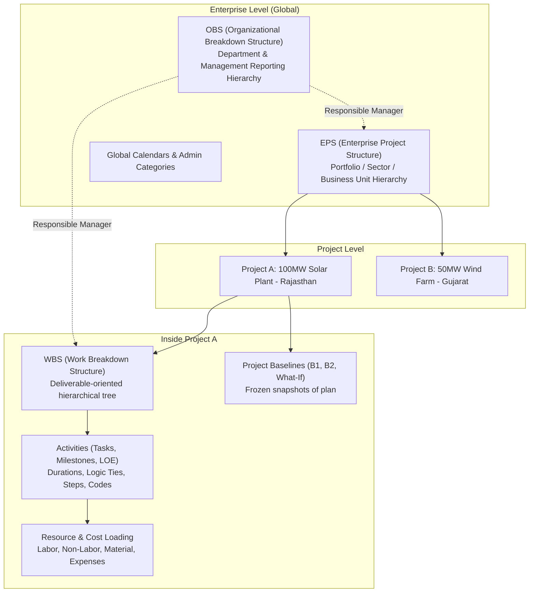
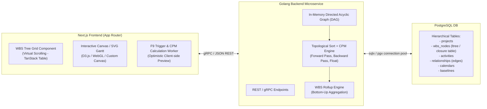

# Topic 1.1: What is Primavera P6? The Industry Standard for Mega-Projects

---

## 1. Executive Summary & Core Philosophy

**Oracle Primavera P6** is an enterprise-grade project portfolio management (PPM) and scheduling system designed specifically for heavy, complex, capital-intensive engineering and construction projects. 

If tools like **Jira, Trello, or Asana** are designed for *flow-based task execution* (software sprints, ticket boards), and **Microsoft Excel** is a *static reporting medium*, **Primavera P6 is a mathematical calculation engine for time, precedence, resources, and cost**.

### The Golden Axiom of Primavera P6

> **"You do not store scheduled dates in P6; you store logic, constraints, durations, and calendars. The scheduling engine calculates the dates."**

In simple project tools, users manually pick a Start Date and an End Date for every task. If an excavation task slips by 12 days on a 5,000-activity solar plant project, a user in Excel or basic tools must manually edit hundreds of downstream dates—an error-prone, impossible task.

In Primavera P6:
1. You set a single anchor: **Project Data Date / Planned Start Date**.
2. You define the work packages (**WBS**) and activities.
3. You assign durations, work calendars (e.g., 6-day work weeks, concrete curing calendars), and precedence logic (Finish-to-Start, Start-to-Start, Lags).
4. The system runs the **Critical Path Method (CPM)** forward pass and backward pass algorithms to compute early dates, late dates, floats, and the critical path automatically.
5. When any single activity is delayed in the field, the entire schedule cascades downstream dynamically.

---

## 2. Concepts & Theory

### 2.1 The Evolution: From P3 to P6 EPPM

To understand why P6 is structured the way it is, you must understand its history:

```
[1983: Primavera Systems founded]
       │
       ▼
[Primavera Project Planner (P3)] ── DOS/Windows 16-bit. Flat file database (Btrieve).
       │                           Strict 10-character Activity IDs, CPM engine.
       ▼
[SureTrak Project Manager] ─────── Scaled-down version for small contractors.
       │
       ▼
[P3e / Primavera Enterprise] ──── Transition to Client-Server SQL (Oracle, MS SQL Server).
       │                           Introduced EPS (Enterprise Project Structure).
       ▼
[2008: Oracle acquires Primavera]
       │
       ▼
[P6 Professional & P6 EPPM] ───── Split into two distinct architectures:
                                   • P6 Professional (Fat desktop client, C++/.NET)
                                   • P6 EPPM (Web application, Java/WebLogic, REST/SOAP APIs)
```

Today, the software exists primarily in two flavors:
* **P6 Professional (P6 Pro):** High-speed desktop fat client used by planners, schedulers, and project controls engineers. It connects directly to an Oracle, SQL Server, or SQLite database. Planners strongly prefer P6 Pro because keyboard shortcuts, massive data grids (50,000 rows), and instant calculations are near instantaneous.
* **P6 EPPM (Enterprise Project Portfolio Management):** A browser-based web portal designed for executives, resource managers, and portfolio directors to view dashboards, approve timesheets, and manage cross-project resources without installing native desktop software.

---

### 2.2 Date-Driven vs. Logic-Driven Scheduling

Understanding the contrast between date-driven tools and logic-driven engines is critical for anyone planning to architect a scheduling application:

```
┌─────────────────────────────────────────────────────────────────────────────┐
│                       DATE-DRIVEN SYSTEM (e.g., Excel, Asana)               │
├─────────────────────────────────────────────────────────────────────────────┤
│ User inputs: Task A [Start: Jan 01, End: Jan 10]                            │
│ User inputs: Task B [Start: Jan 11, End: Jan 20]                            │
│                                                                             │
│ Reality: Task A slips to Jan 22.                                            │
│ Result:  Task B still shows Jan 11! Schedule is now physically impossible.  │
│ Fix:     Manual editing of dozens or hundreds of downstream dates.          │
└─────────────────────────────────────────────────────────────────────────────┘

                                      vs.

┌─────────────────────────────────────────────────────────────────────────────┐
│                    LOGIC-DRIVEN ENGINE (Primavera P6)                       │
├─────────────────────────────────────────────────────────────────────────────┤
│ User inputs: Project Start = Jan 01                                         │
│ User inputs: Task A [Duration: 10d]                                         │
│ User inputs: Task B [Duration: 10d, Predecessor: Task A (FS)]               │
│                                                                             │
│ Engine computes: Task A (Jan 01 - Jan 10), Task B (Jan 11 - Jan 20)        │
│                                                                             │
│ Reality: Task A actual finish marked as Jan 22.                             │
│ Engine runs CPM: Task B Start instantly recalculates to Jan 23.             │
│ Result: Schedule integrity maintained with zero manual date overrides.     │
└─────────────────────────────────────────────────────────────────────────────┘
```

---

### 2.3 Why Traditional Tools Fail on Mega-Projects

Why can't an EPC company building a $200M solar plant just use Jira, Asana, Monday.com, or Microsoft Excel?

| Failure Vector | Lightweight Tools (Jira / Asana / Trello) | Spreadsheets (Excel) | Primavera P6 |
| :--- | :--- | :--- | :--- |
| **Scale & Volume** | Chokes or becomes unusable above 500–1,000 tasks. | Formula errors, accidental overwrites, no concurrency on 20,000 rows. | Handles 100,000+ activities per project across multiple sub-networks effortlessly. |
| **CPM Scheduling Engine** | Non-existent; dates are arbitrary metadata tags. | Requires fragile VBA scripts; no native forward/backward pass. | Full mathematical CPM engine with Total Float, Free Float, and early/late dates. |
| **Calendar Modeling** | Basic 5-day week or 24/7. Cannot model curing or weather. | Must be hard-coded into date formulas with complex lookups. | Unlimited nested calendars (e.g., 7-day earthwork, 6-day civil, 28-day curing, regional holidays). |
| **Contractual Baseline Auditing** | None. Tasks are modified in place, erasing historical promises. | Version control is manual (`Schedule_v1_final_rev2.xlsx`). | Stores multiple immutable frozen baselines with variance tracking per field. |
| **Earned Value Management (EVM)** | Cannot compute Cost Performance Index (CPI) or Schedule Performance Index (SPI). | Fragile formulas; cannot dynamically tie cost curves to CPM dates. | Native ANSI/EIA-748 standard EVM (Planned Value, Earned Value, Actual Cost). |
| **Legal Claim Defense** | Unusable in court for liquidated damages or extension of time (EOT). | Subject to tampering claims; inadmissible for forensic delay analysis. | Industry standard in arbitration, delay claims, and FIDIC disputes. |

---

### 2.4 P6 Enterprise Architecture

P6 is not an isolated desktop tool; it operates on a hierarchical enterprise model:



#### Key Components:
1. **EPS (Enterprise Project Structure):** The root folder tree of all company projects (e.g., *Energy Division → Renewables → Solar Utility Scale*).
2. **OBS (Organizational Breakdown Structure):** The people and management hierarchy. Each EPS node and WBS node is assigned a **Responsible Manager** from the OBS for security and access control.
3. **WBS (Work Breakdown Structure):** The deliverable hierarchy inside a specific project (e.g., *Phase 1 → Civil Works → Inverter Foundations*).
4. **Activities:** The actual units of work under the lowest WBS nodes.

---

### 2.5 Deep Comparative Matrix: P6 vs. Competitors

To build a modern scheduling system, you must understand where existing market tools excel and where they fall short:

```
┌─────────────────────────────────────────────────────────────────────────────┐
│                           SCHEDULING SOFTWARE LANDSCAPE                     │
│                                                                             │
│   High                                                                      │
│    ▲                                  [Primavera P6]                        │
│    │                                     (Deep CPM, 100k tasks,             │
│    │                                      Enterprise, Clunky UI)            │
│  C │                                                                        │
│  O │                               [Asta Powerproject]                      │
│  M │                                  (Strong 4D BIM,                       │
│  P │                                   UK/Europe construction)              │
│  L │                                                                        │
│  E │             [Microsoft Project]                                        │
│  X │                (Mid-market, single projects,                           │
│  I │                 fragile baselines, easy UI)                            │
│  T │                                                                        │
│  Y │  [Asana / Jira / Linear]                                               │
│    │     (Ticket flow, Agile,                                               │
│    │      no CPM scheduling engine)                                         │
│    └──────────────────────────────────────────────────────────────────────► │
│       Low                        CAPACITY / SCALE                      High │
└─────────────────────────────────────────────────────────────────────────────┘
```

| Dimension | Oracle Primavera P6 | Microsoft Project (Desktop/Server) | Asta Powerproject | Modern SaaS (Monday/ClickUp) |
| :--- | :--- | :--- | :--- | :--- |
| **Core Audience** | Heavy civil, EPC, Oil & Gas, Defense, Mining | IT, Marketing, Mid-scale construction | Commercial construction, UK/European builders | Software, Marketing, HR, Operations |
| **Max Activities** | 100,000+ without performance loss | Degrades significantly above 3,000–5,000 tasks | 50,000+ activities | Degrades above 500–1,000 tasks per board |
| **Multiple Activities per Row**| No (Strict 1 row = 1 activity) | No (1 row = 1 task) | **Yes** (Signature feature: multiple tasks on one bar line) | No |
| **Multi-User Real-time DB** | Database-native (Oracle/PostgreSQL/SQL Server) | File-based `.mpp` or Project Online/Server | Enterprise client-server or standalone `.pp` | Cloud-native multi-tenant |
| **Baselines Supported** | Unlimited; up to 4 baselines compared side-by-side | Up to 11 baselines; fragile to date corruptions | Unlimited baselines with visual drag comparison | 0 to 1 rudimentary baseline |
| **Cost & Licensing** | Very expensive ($3,000+ per user license + Oracle DB fees) | Moderate ($30–$55/user/month for Project Plan 3/5) | Expensive per-seat dongle/concurrent license | Low ($10–$25/user/month) |
| **User Experience (UX)** | Outdated Windows 98/2000 style; complex dialogs | Windows Office Ribbon style; familiar | CAD-like interface; high learning curve | Sleek, modern, reactive, intuitive |

---

## 3. Internal Mechanics & Data Flow

When architecting a P6-like engine in **Golang** with a **Next.js** frontend, you need to understand how P6 represents and processes schedule data under the hood.

### 3.1 The Three Fundamental Data Layers

P6 strictly separates structural hierarchy, schedule logic, and historical measurement into three distinct planes:

```
┌─────────────────────────────────────────────────────────────────────────┐
│ PLANE 1: STRUCTURAL / WORK PACKAGES (The WBS Tree)                      │
│ - Pure summary containers                                               │
│ - NO assignees, NO fixed dates, NO direct relationships                 │
│ - Dates and percentages are purely derived via mathematical rollup      │
├─────────────────────────────────────────────────────────────────────────┤
│ PLANE 2: EXECUTION & PRECEDENCE (The Activity Network DAG)              │
│ - Directed Acyclic Graph (DAG) of activities                            │
│ - Holds durations, calendar IDs, and relationship edges (FS, SS, FF, SF)│
│ - Processed by the Topological Sort + CPM Forward/Backward passes       │
├─────────────────────────────────────────────────────────────────────────┤
│ PLANE 3: PROGRESS & VARIANCE (The Measurement Baseline)                 │
│ - Immutable snapshot of Plane 1 & 2 taken at contract award             │
│ - Enables delta computation: Slippage = Live_Finish - Baseline_Finish   │
└─────────────────────────────────────────────────────────────────────────┘
```

### 3.2 Time Representation: Calendar Masks and Hours vs. Days

A common architectural trap for developers building scheduling software is treating a duration of "5 days" as `5 * 24 * time.Hour`. 

In P6:
1. **Work occurs strictly within calendar shift hours.**
   * If a calendar defines an 8-hour workday (08:00 to 17:00 with 1 hour lunch), a 3-day duration equals **24 work hours**.
   * If an activity finishes on Friday at 17:00, and the calendar specifies Saturday and Sunday as non-working days, a Finish-to-Start successor does not start until **Monday at 08:00**.
2. **Calendar Masks:** Calendars are essentially bitmasks or continuous intervals of available work seconds.
3. **Data Date (Status Date):** The virtual boundary line separating the past from the future.
   * Everything to the left of the Data Date has **Actual Dates** (`actual_start_date`, `actual_finish_date`).
   * Everything to the right of the Data Date has **Planned/Forecasted Dates** calculated by CPM.

```
PAST (Actuals Recorded)                  FUTURE (CPM Forecasted)
◄───────────────────────────────┼──────────────────────────────►
                                ▲
                            DATA DATE
                       (e.g., Oct 15, 2026)
```

---

## 4. Real-World Case Study: The 100MW Solar IPP Project

Throughout this curriculum, we will use our running real-world project:

### Project Profile: "Surya 100MW Grid-Connected Solar IPP"
* **Location:** Thar Desert, Rajasthan, India
* **Total Contract Value:** $68,000,000 USD
* **Timeline:** 14 Months (Notice to Proceed: Jan 01 → Commercial Operation Date: Feb 28 next year)
* **Contract Model:** Turnkey EPC (FIDIC Silver Book)
* **Total Scope:** ~2,800 activities across 5 major phases:
  1. *Pre-Construction & Permitting* (Land acquisition, evacuation approvals, CEIG clearance)
  2. *Detailed Engineering & Procurement* (PV modules, string inverters, transformers, tracker structures)
  3. *Civil & Structural Construction* (Grading, piling 45,000 posts, MMS mounting, roads)
  4. *Electrical Works* (Module mounting, DC string cabling, SCADA, 33/220kV pooling substation)
  5. *Testing, Grid Synchronization & Commissioning*

```
                                  STAKEHOLDER MAP
                                  
                            ┌────────────────────────┐
                            │    Power Off-taker     │
                            │  (Govt / State Grid)   │
                            └───────────┬────────────┘
                                        │ Power Purchase Agreement (PPA)
                            ┌───────────▼────────────┐
                            │    Project Developer   │
                            │      (Solar IPP)       │
                            └───────────┬────────────┘
                                        │ EPC Contract (FIDIC)
                            ┌───────────▼────────────┐
                            │     EPC Contractor     │
                            │ (You are building P6   │
                            │  software for them!)   │
                            └─────┬────────────┬─────┘
               Civil Subcontract  │            │  Electrical Subcontract
        ┌─────────────────────────▼──┐      ┌──▼─────────────────────────┐
        │  Civil & Piling Subcontract│      │  High Voltage Subcontract  │
        │  (Piling rigs, roads)      │      │  (Substation, Grid tie-in) │
        └────────────────────────────┘      └────────────────────────────┘
```

### Why the Project Director Mandates P6 from Day 1:
1. **PPA Liquidated Damages:** Every single day of delay in grid synchronization past the scheduled COD triggers a contractual penalty of **$25,000 per day** payable to the power grid off-taker.
2. **Critical Chain of Interdependencies:** PV Modules cannot be mounted until tracker tables are torqued; tracker tables cannot be torqued until concrete piles cure for 7 days; piles cannot be driven until geotechnical pull-out tests pass.
3. **Lender Engineers & Audits:** International banking syndicates financing the project disburse milestone funds (e.g., $10M on completion of inverter stations) only after receiving an authenticated, variance-audited P6 native export (`.XER` file).

---

## 5. Industry Edge Cases, Limitations & Anti-Patterns

When building your P6-like tool or acting as a project controls specialist, you must recognize these common failures in how P6 is used in industry:

### 5.1 Hard Constraint Abuse ("Date Hijacking")
* **The Bad Practice:** A planner wants Task C to happen on March 15. Instead of modeling the real predecessor dependencies, they apply a **Mandatory Start (Must Start On)** constraint of March 15.
* **Why It Breaks the Engine:** Hard constraints override the CPM forward and backward pass math. If predecessor Task B is delayed by 3 weeks, Task C will still show March 15 on the Gantt chart, creating impossible logic and negative float anomalies.
* **P6 Standard Rule:** Schedules should be logic-driven. Constraints should be applied only to contractual milestones or external supplier delivery dates.

### 5.2 Open Ends (Dangling / Orphan Activities)
* An activity that has **no predecessor** (other than the project start milestone) or **no successor** (other than the project finish milestone).
* **Consequence:** If an activity has no successor, it can slip by 6 months without pushing anything downstream. Its Total Float becomes artificially massive, hiding delays from management.
* **Industry Standard (DCMA 14-Point Assessment):** More than 5% open ends in a schedule will cause immediate rejection of the schedule by government and enterprise auditors.

### 5.3 Static Gantt Mentality ("Drawing Software")
* Treating P6 like Microsoft Visio or AutoCAD—arranging bars on a screen so that they "look pretty" for executive presentations, while turning off CPM recalculation (`F9`).
* When real delays occur, the schedule cannot be used for forecasting because the underlying mathematical network is broken.

---

## 6. System Architecture Blueprint: Building a P6 Clone

To bridge domain knowledge into engineering specifications for our upcoming Golang backend and Next.js frontend:



---

## 7. Key Takeaways & Summary

1. **P6 is a calculation engine, not a drawing tool.** It computes dates based on durations, calendars, and dependency links.
2. **The golden rule of enterprise scheduling:** Never hardcode dates when you can model causal logic.
3. **The WBS is a deliverable hierarchy** (folders), while **Activities are the work units** (files).
4. **Mega-projects require strict mathematical scheduling** because delays carry enormous financial and legal penalties (Liquidated Damages).
5. **A modern software alternative** must implement true CPM topological calculation, nested calendar intervals, and multi-baseline variance auditing to be viable for the EPC industry.
