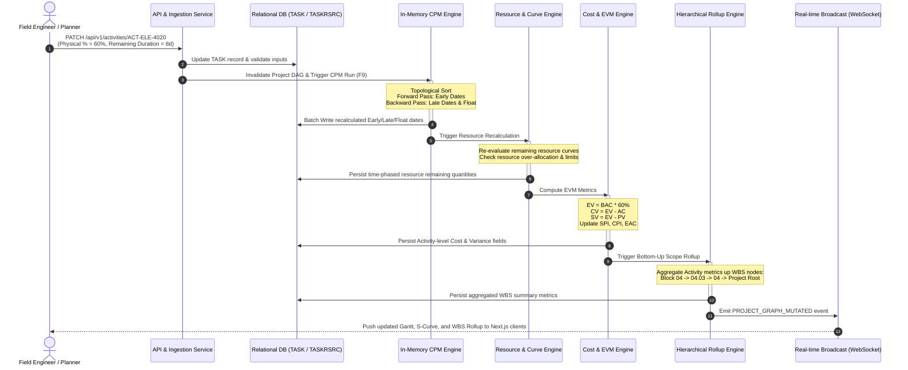

# Topic 1.2: Primavera P6 Architecture & Functional Modules

---

## 1. Executive Summary & Enterprise Architectural Overview

**Oracle Primavera P6 Enterprise Project Portfolio Management (EPPM)** is not an isolated desktop utility or a simple project management board. It is an industrial-strength, multi-tier enterprise software suite engineered to model, compute, and govern the lifecycle of massive, capital-intensive engineering and construction portfolios.

While consumer-grade task trackers (e.g., Jira, Asana, Monday.com) treat tasks as standalone records with loose tags and state flags, Primavera P6 models projects as a **cohesive, mathematically bound cybernetic system**. In P6, time, physical scope, human labor, plant machinery, bulk materials, financial budgets, and contract baselines are interconnected through strict relational rules, calendar matrices, and graph algorithms.

```
┌──────────────────────────────────────────────────────────────────────────────────┐
│                           PRIMAVERA P6 ENTERPRISE SUITE                          │
├──────────────────────────────────────────────────────────────────────────────────┤
│                                                                                  │
│   EPS & PORTFOLIO ───► WBS HIERARCHY ───► ACTIVITY DAG ───► RESOURCE/COST ENGINE │
│   (Enterprise Scope)   (Scope Packages)   (CPM Math)        (Labor, Plant, EVM)  │
│           │                   │                 │                   │            │
│           └───────────────────┴────────┬────────┴───────────────────┘            │
│                                        ▼                                         │
│                       CORE RELATIONAL DATABASE TIER                              │
│                   (Oracle DB / MS SQL Server / SQLite)                           │
│                   160+ Tables: PROJECT, TASK, RSRC, etc.                         │
│                                        │                                         │
│             ┌──────────────────────────┴──────────────────────────┐              │
│             ▼                                                     ▼              │
│   DESKTOP FAT CLIENT                                 APPLICATION SERVER          │
│   P6 Professional (Win32)                            WebLogic / REST / XML APIs  │
│   • Direct SQL / Compressed API                      • P6 EPPM Web Portal        │
│   • Sub-10ms UI grid rendering                       • P6 Team Member Mobile     │
│   • High-frequency planner workflows                 • Background Job Engine     │
│                                                                                  │
└──────────────────────────────────────────────────────────────────────────────────┘
```

### The Architectural Problem P6 Solves

In a **100MW Solar IPP (Independent Power Producer) Project in Rajasthan, India**, an EPC contractor coordinates:
* **Over 6,500 distinct activities** spanning land contouring, pile driving, module mounting structures (MMS), inverter duty transformers (IDT), 33kV internal pooling lines, a 220kV switchyard, and a 14km transmission line to the state grid substation.
* **$75M+ USD in capital expenditure**, financed under strict banking covenants with monthly drawdown limits tied to physical milestones.
* **450+ craft laborers, 12 piling rigs, 3 cranes, and hundreds of thousands of individual components** (240,000 bifacial solar PV modules, 22 central inverters, 4,200 metric tons of galvanized steel).
* **Multiple contractual stakeholders**: The project developer (Solar IPP), the EPC turnkey contractor, civil sub-contractors, electrical testing agencies, and the state electrical inspectorate (CEIG).

A tool managing this operation must satisfy three architectural requirements that standard web frameworks fail to deliver out of the box:
1. **Mathematical Determinism:** Changing the duration or progress of an earthworks activity must instantly propagate through a Directed Acyclic Graph (DAG) across hundreds of dependent activities without manual recalculation.
2. **Multi-Plane Data Consistency:** Physical progress, consumed labor hours, installed linear meters of cable, earned financial value, and forecasted completion dates must reconcile continuously across both the Work Breakdown Structure (WBS) and the organizational hierarchy (OBS).
3. **High-Throughput Concurrency:** Dozens of field engineers, procurement managers, and planners must report progress simultaneously without locking entire project networks or corrupting graph invariants.

---

## 2. The 7 Core Functional Modules of Primavera P6

Primavera P6 is partitioned into seven interconnected functional modules. To design a modern, distributed clone in Golang and Next.js, you must understand both the user-facing functional purpose and the internal data mechanics of each module.

```
┌──────────────────────────────────────────────────────────────────────────────────┐
│                       THE 7 CORE FUNCTIONAL MODULES OF P6                        │
├──────────────────────────────────────────────────────────────────────────────────┤
│                                                                                  │
│   1. Projects & EPS Module           ─── Global hierarchy & portfolio rules      │
│   2. Activities & Network Scheduling ─── CPM graph, durations, dependencies      │
│   3. Resource & Role Management      ─── Labor, Plant, Materials, Leveling       │
│   4. Cost & Earned Value Management  ─── Budgets, Expenses, EVM metrics          │
│   5. WBS & Document Tracking         ─── 100% scope tree & design deliverables   │
│   6. Thresholds, Issues & Risks      ─── Automated monitors, alerts, risk scores │
│   7. Enterprise Reporting/Analytics  ─── S-Curves, histograms, tabular runs      │
│                                                                                  │
└──────────────────────────────────────────────────────────────────────────────────┘
```

---

### Module 1: Projects & Enterprise Project Structure (EPS)

#### Purpose & Functional Scope
The **Enterprise Project Structure (EPS)** is the top-level hierarchical backbone of P6. It allows an enterprise to organize all active, planned, and archived projects into an arbitrary multi-level tree representing business divisions, geographic territories, or technology sectors.

```
Enterprise Root
  ├── Utility-Scale Renewable Energy (BU-REN)
  │     ├── Wind Assets (WND)
  │     └── Solar Assets (SLR)
  │           ├── Gujarat Sector (GUJ)
  │           └── Rajasthan Sector (RAJ)
  │                 ├── 100MW Bikaner Solar IPP (PRJ-RAJ-100) ◄── [Our Project]
  │                 └── 300MW Jodhpur Solar IPP (PRJ-RAJ-300)
  └── Thermal Power Generation (BU-THM)
```

#### Key Capabilities & Project Settings
* **Portfolio Aggregation:** Management can open an entire EPS node (e.g., `Solar Assets`) to view rolled-up budgets, resource demands, and macro-schedules across 15 distinct solar projects simultaneously.
* **Project Status Flags:**
  * `Planned`: Scope definition phase; does not reserve corporate labor capacity.
  * `Active`: Live execution; updates flow to corporate resource utilization charts.
  * `What-If`: Cloned sandbox for simulating major schedule revisions or claims without altering live baselines.
  * `Inactive` / `Archived`: Read-only historical data.
* **Global Defaults & Governing Parameters:**
  * **Default Calendar:** Dictates working hours, weekend patterns, and statutory holidays (e.g., Indian National Holidays + Rajasthan local holidays).
  * **Default Duration Type:** Governs how duration, units, and rates interact when assignments change (`Fixed Duration & Units`, `Fixed Units/Time`, etc.).
  * **Percent Complete Type:** Controls whether progress is measured by physical quantity installed, duration elapsed, or labor hours consumed.
* **Security & Access Control (OBS Mapping):** Every node in the EPS tree is mapped to a node in the **Organizational Breakdown Structure (OBS)**. A site civil engineer can be granted write access strictly to civil work packages within `PRJ-RAJ-100`, while remaining completely blocked from commercial cost accounts or wind projects.

---

### Module 2: Activities & Network Scheduling Module

#### Purpose & Functional Scope
The **Activities Module** is the core calculation engine of P6. An activity is the fundamental atomic unit of work in a project schedule. This module models precedence relationships, computes the Critical Path Method (CPM), calculates floats, and displays schedule data across Gantt charts and PERT (Activity-on-Node) networks.

```
                    ┌────────────────────────────┐
                    │       Activity Node        │
                    ├────────────────────────────┤
                    │ Early Start  │ Early Finish│
                    ├──────────────┼─────────────┤
                    │    Total     │    Free     │
                    │    Float     │    Float    │
                    ├──────────────┼─────────────┤
                    │  Late Start  │ Late Finish │
                    └────────────────────────────┘
```

#### Core Capabilities & Execution Rules
* **The 6 Activity Types:**
  1. **Task Dependent:** Duration and dates are calculated strictly based on the activity's assigned calendar, regardless of the individual calendars of assigned resources. (Standard construction work).
  2. **Resource Dependent:** Duration and dates are calculated based on the assigned resource's working calendar. If a specialized crane operator works only Tuesdays and Thursdays, the activity schedules work only on those days.
  3. **Level of Effort (LOE):** Summary or administrative tasks whose duration is dynamically driven by the span of other activities. Example: *"Site Security & Field Office Management"* starts when site clearing begins and finishes when commercial operation (COD) is reached. LOE activities never possess float and cannot be on the critical path.
  4. **Start Milestone:** Zero-duration marker representing a key project event (e.g., *"Notice to Proceed (NTP) Received"*). It has an Early Start and Late Start, but no duration.
  5. **Finish Milestone:** Zero-duration marker representing completion (e.g., *"Grid Synchronization Achieved"*).
  6. **WBS Summary:** Dynamically summarizes all activities nested under a specific WBS branch.
* **Activity Steps:** Granular checklist items inside a single activity. In P6, steps can be assigned **relative weights**. For example, the activity *"Inverter Station 1 Installation"* can have four steps:
  * Step 1: Civil Plinth Inspection (Weight: 10%)
  * Step 2: Rigging & Setting Inverter Enclosure (Weight: 40%)
  * Step 3: DC Busbar Bolting & Torquing (Weight: 30%)
  * Step 4: Control Wiring Termination (Weight: 20%)
  Completing Step 1 and Step 2 automatically establishes that the physical progress of the activity is $50\%$.
* **Activity Codes:** Multi-tiered taxonomic tags (Global, EPS-level, Project-level). In our solar project, an activity is tagged with:
  * `Phase`: Engineering, Procurement, Construction, Commissioning.
  * `Subcontractor`: Sterling & Wilson, Larsen & Toubro, Local Earthworks Ltd.
  * `Area / Block`: Block 01 through Block 20.
  Activity codes allow planners to slice, group, and filter massive 10,000-activity schedules across arbitrary non-hierarchical dimensions.

---

### Module 3: Resource & Role Management Module

#### Purpose & Functional Scope
Mega-projects fail more frequently from resource bottlenecks (unavailability of specialized labor, late equipment delivery, supply chain shortfalls) than from flawed logic links. The **Resource Module** manages the capacity, allocation, assignment curves, and leveling of all project inputs.

```
                         RESOURCE TYPES IN P6
        ┌─────────────────────────┼─────────────────────────┐
        ▼                         ▼                         ▼
   LABOR (Labor)          NON-LABOR (Plant)         MATERIAL (Material)
 • Civil Engineers       • Piling Rigs             • PV Modules (Nos)
 • Electrical Fitters    • 50T Mobile Cranes       • Solar DC Cable (Meters)
 • Welders               • Excavators              • Structural Steel (MT)
 Units: Man-Hours        Units: Machine-Hours      Units: Physical Quantity
```

#### Core Capabilities & Mathematical Mechanics
* **Roles vs. Resources:**
  * **Role:** An abstract skill set or trade requirement with defined cost rates (e.g., `Solar Electrical Technician - Tier 2` at \$25/hr). During front-end planning, activities are assigned roles.
  * **Resource:** A named individual or specific equipment asset (e.g., `Anil Kumar - Tech ID 409` or `Crane #3`). During execution, named resources are staffed to satisfy role requirements.
* **Resource Limits & Multi-Tier Shifts:** Resource availability is defined over time. For instance, the piling contractor can provide 4 piling rigs in Month 1, scaling up to 12 rigs in Months 2–4, and tapering to 2 rigs in Month 5.
* **Resource Assignment Curves (Spread Profiles):** Work is rarely distributed evenly over an activity's duration. P6 provides non-linear distribution curves:
  * `Linear`: Uniform burn rate across the duration.
  * `Front-Loaded`: Heavy initial expenditure (e.g., site preparation, bulk material delivery).
  * `Back-Loaded`: Heavy final expenditure (e.g., testing, punch listing).
  * `Bell-Shaped (Gaussian)`: Mobilization $\rightarrow$ peak output $\rightarrow$ demobilization.
  * `Custom 21-Point Curves`: User-defined percentage spreads across 20 duration intervals (5% increments).
* **Resource Leveling Algorithm:** When demand for a resource exceeds its maximum availability limit in a time bucket (e.g., 16 piling rigs required on Day 45, but only 12 are available), the leveling engine resolves the conflict. It shifts non-critical activities forward in time using their available **Free Float** and **Total Float**. If float is exhausted, it forces project completion out, reporting the delay to management.

---

### Module 4: Cost & Earned Value Management (EVM) Module

#### Purpose & Functional Scope
P6 tracks project finances by bridging engineering progress with cost accounting. It calculates the performance indices mandated by the Project Management Institute (PMI) and ANSI/EIA-748 standards.

```
                           EARNED VALUE CURVES (S-CURVE)
    Cost ($)
        │                                             / Forecast (EAC)
        │                                      /─────/
        │                                /────/
        │                          /────/   ◄── Planned Value (PV / BCWS)
        │                    /────/    /
        │              /────/    /────/ ◄── Actual Cost (AC / ACWP)
        │        /────/    /────/
        │   /───/    /────/ ◄── Earned Value (EV / BCWP)
        │  /   /────/
        │ /───/
        └────────────────────────────────────────────► Time
                               ▲
                           DATA DATE
```

#### Cost Components
1. **Resource Costs:** Computed dynamically:
   $$\text{Cost} = \text{Assigned Quantity} \times \text{Resource Rate}$$
2. **Expenses:** Lump-sum or periodic non-resource costs attached directly to activities (e.g., *"Grid Interconnection Application Fee"*: \$50,000, or *"Geotechnical Core Drilling Laboratory Testing"*: \$15,000).
3. **Cost Accounts:** Hierarchical financial codes that map activity expenses directly to the enterprise General Ledger (GL) or SAP ERP WBS Elements.

#### Core EVM Formulation
* **Planned Value ($PV$ / $BCWS$):** Budgeted Cost of Work Scheduled.
  $$PV = \text{Budget at Completion (BAC)} \times \text{Planned \% Complete}$$
* **Earned Value ($EV$ / $BCWP$):** Budgeted Cost of Work Performed.
  $$EV = \text{Budget at Completion (BAC)} \times \text{Physical \% Complete}$$
* **Actual Cost ($AC$ / $ACWP$):** Actual Cost of Work Performed directly incurred.
* **Variances:**
  $$\text{Schedule Variance } (SV) = EV - PV$$
  $$\text{Cost Variance } (CV) = EV - AC$$
* **Performance Indices:**
  $$\text{Schedule Performance Index } (SPI) = \frac{EV}{PV}$$
  $$\text{Cost Performance Index } (CPI) = \frac{EV}{AC}$$
* **Forecasting at Completion:**
  $$\text{Estimate to Complete } (ETC) = \frac{BAC - EV}{CPI \times SPI}$$
  $$\text{Estimate at Completion } (EAC) = AC + ETC$$

---

### Module 5: Work Breakdown Structure (WBS) & Document Tracking

#### Purpose & Functional Scope
The **Work Breakdown Structure (WBS)** is a hierarchical, deliverable-oriented decomposition of the total project scope. It enforces the **100% Rule**: the child nodes under any WBS element must represent 100% of the scope of the parent element—no more, no less.

#### Deliverable Hierarchy for our 100MW Solar IPP Project:
```
100MW Solar IPP Project (PRJ-RAJ-100)
├── 01. Management & Approvals
│   ├── 01.01 Statutory & Land Clearances
│   └── 01.02 Power Purchase Agreement (PPA) Compliance
├── 02. Engineering & Design
│   ├── 02.01 Civil & Structural Engineering
│   └── 02.02 Electrical & SCADA Design
├── 03. Procurement & Supply Chain
│   ├── 03.01 Solar PV Modules (Bifacial 540Wp)
│   ├── 03.02 Inverter Duty Transformers (IDT)
│   └── 03.03 Single-Axis Trackers & Steel Piles
├── 04. Construction & Installation
│   ├── 04.01 Civil Works (Grading, Roads, Inverter Plinths)
│   ├── 04.02 Tracker Piling & Structure Assembly
│   ├── 04.03 PV Module Mounting & DC Cabling
│   └── 04.04 33kV Underground Collector Network
├── 05. High Voltage Grid Substation (220kV)
│   ├── 05.01 Power Transformers (100MVA)
│   └── 05.02 Switchyard Bay & Gantry Erection
└── 06. Testing, Commissioning & COD
    ├── 06.01 Pre-Commissioning Cold Tests
    └── 06.02 Grid Synchronization & Trial Run
```

#### Document Tracking & Work Products
P6 links engineering drawings, vendor manuals, and compliance certificates directly to activities and WBS nodes.
* Planners track document revision status (`Draft`, `Under Review`, `Approved for Construction - AFC`).
* Activities can be prevented from starting or progressing past defined thresholds until prerequisite AFC drawings are verified as approved.

---

### Module 6: Thresholds, Issues & Risk Management Module

#### Purpose & Functional Scope
On a project with 10,000 activities, project directors cannot review every line item daily. The **Thresholds and Issues Module** acts as an automated exception-monitoring system, while the **Risk Module** provides qualitative and quantitative risk scoring.

#### Core Mechanics
* **Threshold Monitoring:** The system continuously evaluates relational triggers against configured project parameters.
  * *Condition:* If `Total Float < 0 days` for any activity under WBS `05. High Voltage Grid Substation`.
  * *Condition:* If `Cost Variance (CV) < -$25,000` or `SPI < 0.85`.
* **Automated Issue Generation:** When a threshold violation is detected, P6 creates an **Issue Record**. The issue has an owner (e.g., Electrical Package Lead), a severity level, and a target resolution date.
* **Risk Register:** Tracks events that could impact the project (e.g., *"Monsoon Flash Flooding in Rajasthan Desert Washouts Piling Lines"*).
  * Evaluates **Probability** ($1-5$) $\times$ **Impact** ($1-5$) = **Risk Score**.
  * Maintains Pre-Mitigation and Post-Mitigation scores alongside planned response actions.

---

### Module 7: Enterprise Reporting & Analytics

#### Purpose & Functional Scope
The **Reporting Module** generates certified contractual artifacts, time-distributed cash flow curves, and executive dashboards.

#### Core Capabilities
* **Time-Distributed Reporting (Bucketing):** Slicing project data into temporal intervals (daily, weekly, monthly, quarterly). P6 computes remaining hours and costs across these buckets by evaluating non-linear resource curves.
* **Tabular & Batch Reports:** Automated generation of Daily Progress Reports (DPR), Weekly Schedule Variance Reports, and Look-Ahead schedules (e.g., 3-Week Rolling Schedules).
* **Enterprise BI Publisher & Star Schema Integration:** In P6 EPPM, an ETL pipeline runs nightly to denormalize the 160+ transactional tables into a dimensional **Star Schema** data warehouse (`P6 Analytics`), allowing executive cross-portfolio querying via tools like PowerBI, Tableau, or Oracle Analytics Cloud.

---

## 3. Technical Enterprise Architecture (Under the Hood)

To build a modern web-based P6 alternative, you must understand the classic client-server and multi-tier enterprise architecture of Oracle Primavera P6.

```
┌─────────────────────────────────────────────────────────────────────────────────┐
│                          P6 MULTI-TIER SYSTEM TOPOLOGY                          │
├─────────────────────────────────────────────────────────────────────────────────┤
│                                                                                 │
│   PRESENTATION TIER                                                             │
│   ┌─────────────────────┐   ┌─────────────────────┐   ┌─────────────────────┐   │
│   │   P6 Professional   │   │    P6 EPPM Web      │   │   P6 Team Member    │   │
│   │   (Win32 / C++)     │   │   (Browser/HTML5)   │   │   (Mobile / React)  │   │
│   └──────────┬──────────┘   └──────────┬──────────┘   └──────────┬──────────┘   │
│              │ (Native SQL / Wire)     │ (HTTP/REST)             │ (REST)       │
│              ▼                         ▼                         ▼              │
│   APPLICATION SERVER TIER                                                       │
│   ┌─────────────────────────────────────────────────────────────────────────┐   │
│   │                     Oracle WebLogic / Java EE                           │   │
│   │  • P6 REST APIs & SOAP Web Services                                     │   │
│   │  • P6 Integration API (Java RMI / In-Process)                            │   │
│   │  • Background Job Engine (BJE): Asynchronous CPM, Summaries, Baselines  │   │
│   └────────────────────────────────────┬────────────────────────────────────┘   │
│                                        │ (JDBC Connection Pool)                 │
│                                        ▼                                        │
│   DATABASE TIER                                                                 │
│   ┌─────────────────────────────────────────────────────────────────────────┐   │
│   │             Relational Database Engine (Oracle / MS SQL / SQLite)       │   │
│   │  PROJECT   PROJWBS   TASK   TASKPRED   RSRC   TASKRSRC   CALENDAR       │   │
│   └─────────────────────────────────────────────────────────────────────────┘   │
│                                                                                 │
└─────────────────────────────────────────────────────────────────────────────────┘
```

---

### 3.1 The Presentation Tier: Desktop vs. Web

A major lesson in enterprise software design lies in why project planners still prefer the desktop client (**P6 Professional**) over the web client (**P6 EPPM**):

| Evaluation Metric | P6 Professional (Fat Desktop Client) | P6 EPPM (Enterprise Web Client) | Modern Golang + Next.js Target |
| :--- | :--- | :--- | :--- |
| **Technology** | Win32 / C++ / .NET Desktop Application | Java EE / JSF / HTML5 Web Application | Next.js (React) + WebGL Canvas + Go Backend |
| **Rendering Model** | Direct native OS GDI/DirectX drawing | Browser DOM rendering (historically Java applets) | Virtualized DOM (TanStack Table) + HTML5 Canvas |
| **Data Latency** | Direct socket streaming to DB; cached locally | Multi-hop REST/JSON serialization overhead | High-throughput Protobuf / gRPC / WebSockets |
| **Grid Capacity** | 100,000 activities scrolled at 60 FPS | Stutters or paginates beyond 2,000 activities | 50,000 activities smoothly virtualized |
| **UX & Ergonomics** | Dense keyboard shortcuts (`F9`, `Ctrl+E`, `F5`) | Mouse-heavy, modal dialog forms | Hotkey-first keyboard navigation model |

* **P6 Team Member:** A lightweight interface (iOS, Android, and simplified web portal) designed for field superintendents. A foreman in the Rajasthan desert uses this interface to report: *"Installed 120 piles today on Block 04"*. This status enters an approval queue before updating the main project graph.

---

### 3.2 The Application Server Tier

The application server decouples presentation clients from raw database transactions and manages heavy computations:
1. **P6 Integration API:** A Java-based SDK providing object-oriented access to business rules, validation, and database operations.
2. **P6 Web Services & REST API:** HTTP endpoints for integrating external enterprise systems (e.g., SAP ERP sending actual purchase costs, or Bentley Synchro 4D pulling scheduling data).
3. **Background Job Engine (BJE):** Executes non-interactive, compute-heavy tasks asynchronously:
   * **Summarize Project:** Pre-calculating rollups across WBS branches and caching aggregated metrics.
   * **Baseline Creation:** Duplicating a 10,000-activity project structure into baseline tables without blocking active users.
   * **Global Change:** Batch rule execution across thousands of records (e.g., *"Increase remaining duration by 10% for all activities using Subcontractor X"*).
   * **Store Period Performance:** Freezing actual costs and earned value for the past fiscal month into historical financial reporting tables.

---

### 3.3 The Core Relational Database Tier: Schema Anatomy

P6 stores all enterprise data across approximately **160 relational tables**. The primary tables governing activities, dependencies, and resources include:

```
┌──────────────────┐          ┌──────────────────┐
│     PROJECT      │ 1      * │     PROJWBS      │
│  (proj_id, ...)  ├─────────►│  (wbs_id, ...)   │
└──────────────────┘          └────────┬─────────┘
                                       │ 1
                                       │
                                       │ *
                              ┌────────▼─────────┐
                              │       TASK       │
                              │  (task_id, ...)  │
                              └───────┬───┬──────┘
                                    1 │   │ 1
                         ┌────────────┘   └────────────┐
                         │ *                         │ *
                  ┌──────▼───────────┐        ┌──────▼───────────┐
                  │     TASKPRED     │        │     TASKRSRC     │
                  │ (pred_task_id,   │        │ (task_rsrc_id,   │
                  │  task_id, ...)   │        │  rsrc_id, ...)   │
                  └──────────────────┘        └────────┬─────────┘
                                                       │ *
                                                       │
                                                       │ 1
                                              ┌────────▼─────────┐
                                              │       RSRC       │
                                              │  (rsrc_id, ...)  │
                                              └──────────────────┘
```

#### The Essential 6 Tables in Primavera P6:

#### 1. `PROJECT`
Stores root project records, global status, and governing calculation rules.
* `proj_id` (PK, Integer): Unique project identifier.
* `proj_short_name` (VarChar): Human-readable code (e.g., `PRJ-RAJ-100`).
* `last_recalc_date` (DateTime): The exact Data Date used for the last CPM run.
* `clndr_id` (FK): Project default calendar.
* `def_cost_qty_type`: Default resource rate assignment mode.
* `status_code`: Active, Planned, What-If, Inactive.

#### 2. `PROJWBS`
Stores the Work Breakdown Structure tree.
* `wbs_id` (PK, Integer): Unique WBS node identifier.
* `proj_id` (FK): The project this WBS node belongs to.
* `parent_wbs_id` (FK, Nullable): Pointer to parent WBS node (self-referencing tree).
* `wbs_short_name` (VarChar): Outline code (e.g., `04.02`).
* `wbs_name` (VarChar): Deliverable name (e.g., `Tracker Piling & Assembly`).
* `ev_compute_type`: Earned value technique setting for this branch.

#### 3. `TASK`
The central activity table holding state, durations, calculated dates, and progress.
* `task_id` (PK, Integer): Unique internal activity ID.
* `proj_id` (FK) & `wbs_id` (FK): Owning project and WBS node.
* `task_code` (VarChar): Planner-visible ID (e.g., `ACT-CIV-1040`).
* `task_type`: Task Dependent, Resource Dependent, LOE, Milestone, etc.
* `status_code`: `TK_NotStart`, `TK_Active`, `TK_Complete`.
* `target_drtn_hr_cnt` (Float): Original budgeted duration in working hours.
* `remain_drtn_hr_cnt` (Float): Remaining duration in working hours.
* `act_start_date` / `act_end_date`: Recorded actual dates from the field.
* `early_start_date` / `early_end_date`: CPM Forward Pass outputs.
* `late_start_date` / `late_end_date`: CPM Backward Pass outputs.
* `total_float_hr_cnt` / `free_float_hr_cnt`: Calculated slack values.

#### 4. `TASKPRED`
Stores directed dependency edges between activities.
* `task_pred_id` (PK, Integer): Unique relationship record ID.
* `task_id` (FK): The successor activity.
* `pred_task_id` (FK): The predecessor activity.
* `pred_type` (VarChar): Precedence logic type:
  * `PR_FS`: Finish-to-Start
  * `PR_SS`: Start-to-Start
  * `PR_FF`: Finish-to-Finish
  * `PR_SF`: Start-to-Finish
* `lag_hr_cnt` (Float): Lead (-) or Lag (+) duration in working hours.

#### 5. `RSRC`
Stores corporate enterprise resources and abstract roles.
* `rsrc_id` (PK, Integer): Unique resource identifier.
* `rsrc_name` / `rsrc_short_name`: Resource designation.
* `rsrc_type`: `RT_Labor`, `RT_NonLabor`, `RT_Material`.
* `def_cost_per_qty` (Float): Standard hourly rate or unit cost.
* `unit_id` (FK): Unit of measure (e.g., Hours, Metric Tons, Linear Meters).

#### 6. `TASKRSRC`
Stores the junction records representing resource assignments to activities.
* `task_rsrc_id` (PK, Integer): Unique assignment ID.
* `task_id` (FK) & `rsrc_id` (FK): Activity and Resource pointers.
* `target_qty` (Float): Budgeted total units (e.g., 160 man-hours).
* `remain_qty` (Float): Forecasted remaining units required to complete.
* `act_reg_qty` (Float): Recorded actual units consumed to date.
* `target_cost` / `act_reg_cost`: Budgeted vs. incurred costs.
* `curve_id` (FK, Nullable): Assigned resource distribution curve profile.

---

## 4. Cross-Module Data Flow: The Pulse of an Update

When a project controls engineer or field superintendent updates progress on a single activity, that change cascades across every module in the system.

### Concrete Scenario:
On our 100MW Solar IPP Project:
* **Activity:** `ACT-ELE-4020: 33kV Pooling Cable Trenching & Laying (Block 04)`
* **Status:** Site team reports that progress advanced from $20\%$ to $60\%$, but rocky subsurface soil slowed excavation, requiring 3 additional days of remaining work.



---

## 5. Software Architecture Blueprint: Building a P6 Clone

To architect a modern, cloud-native project management system capable of matching Primavera P6's performance, we adopt a **modular architecture** using **Golang** for high-throughput computation and **Next.js** for an ergonomic, responsive user experience.

```
┌─────────────────────────────────────────────────────────────────────────────────┐
│                    GOLANG + NEXT.JS P6 CLONE SYSTEM BLUEPRINT                   │
├─────────────────────────────────────────────────────────────────────────────────┤
│                                                                                 │
│   FRONTEND: Next.js 15+ (App Router)                                            │
│   ┌─────────────────────────────────────────────────────────────────────────┐   │
│   │  • Virtualized Multi-Column Data Grid (TanStack Table Core)             │   │
│   │  • High-Performance Gantt / PERT Canvas (HTML5 Canvas / PixiJS)         │   │
│   │  • Client-Side CPM Web Worker (Optimistic schedule preview)             │   │
│   │  • SSE / WebSocket Subscriber (Live graph synchronization)              │   │
│   └────────────────────────────────────▲────────────────────────────────────┘   │
│                                        │ HTTPS / gRPC-Web / WebSockets          │
│                                        ▼                                        │
│   BACKEND: Golang Modular Services Engine                                       │
│   ┌─────────────────────────────────────────────────────────────────────────┐   │
│   │  PROJECT SERVICE      │  CPM SCHEDULING ENGINE   │  RESOURCE & EVM SVC  │   │
│   │  • EPS & WBS tree     │  • In-Memory DAG Cache   │  • 21-point curves   │   │
│   │  • Role-based access  │  • Kahn's Topo Sort      │  • EVM math engine   │   │
│   │  • Locking & muts     │  • Forward/Backward Pass │  • Leveling engine   │   │
│   └────────────────────────────────────┬────────────────────────────────────┘   │
│                                        │ pgx connection pool                    │
│                                        ▼                                        │
│   PERSISTENCE: PostgreSQL 16+                                                   │
│   ┌─────────────────────────────────────────────────────────────────────────┐   │
│   │  • Hierarchical WBS indexing via `ltree` extension                      │   │
│   │  • Relational schema: projects, wbs_nodes, activities, dependencies     │   │
│   │  • Event Outbox pattern for audit logging & baseline comparison         │   │
│   └─────────────────────────────────────────────────────────────────────────┘   │
│                                                                                 │
└─────────────────────────────────────────────────────────────────────────────────┘
```

---

### 5.1 Relational Database Schema DDL (PostgreSQL)

The following schema implements a production-grade relational foundation for projects, WBS hierarchies, calendars, activities, dependencies, and resources.

```sql
-- Enable ltree extension for high-performance hierarchical tree queries
CREATE EXTENSION IF NOT EXISTS "ltree";
CREATE EXTENSION IF NOT EXISTS "uuid-ossp";

-- 1. Calendars Table
CREATE TABLE calendars (
    id UUID PRIMARY KEY DEFAULT uuid_generate_v4(),
    name VARCHAR(100) NOT NULL,
    hours_per_day NUMERIC(4,2) DEFAULT 8.00,
    working_days_mask BIT(7) NOT NULL DEFAULT B'0111110', -- Mon-Fri working, Sat-Sun off
    holidays JSONB DEFAULT '[]'::jsonb, -- Array of ISO dates ['2026-01-26', '2026-08-15']
    created_at TIMESTAMPTZ NOT NULL DEFAULT NOW()
);

-- 2. Projects & EPS Table
CREATE TABLE projects (
    id UUID PRIMARY KEY DEFAULT uuid_generate_v4(),
    project_code VARCHAR(50) UNIQUE NOT NULL,
    name VARCHAR(255) NOT NULL,
    status VARCHAR(20) NOT NULL DEFAULT 'ACTIVE', -- PLANNED, ACTIVE, WHAT_IF, ARCHIVED
    data_date TIMESTAMPTZ NOT NULL,
    default_calendar_id UUID NOT NULL REFERENCES calendars(id),
    eps_path LTREE NOT NULL, -- e.g., 'BU_REN.SOLAR.RAJASTHAN'
    created_at TIMESTAMPTZ NOT NULL DEFAULT NOW(),
    updated_at TIMESTAMPTZ NOT NULL DEFAULT NOW()
);
CREATE INDEX idx_projects_eps ON projects USING GIST (eps_path);

-- 3. Work Breakdown Structure (WBS) Table
CREATE TABLE wbs_nodes (
    id UUID PRIMARY KEY DEFAULT uuid_generate_v4(),
    project_id UUID NOT NULL REFERENCES projects(id) ON DELETE CASCADE,
    parent_id UUID REFERENCES wbs_nodes(id) ON DELETE CASCADE,
    wbs_code VARCHAR(50) NOT NULL,
    name VARCHAR(255) NOT NULL,
    node_path LTREE NOT NULL, -- e.g., 'ROOT.ENG.CIVIL'
    ev_technique VARCHAR(30) DEFAULT 'PHYSICAL_PERCENT_COMPLETE',
    created_at TIMESTAMPTZ NOT NULL DEFAULT NOW(),
    CONSTRAINT uq_project_wbs_code UNIQUE (project_id, wbs_code)
);
CREATE INDEX idx_wbs_path ON wbs_nodes USING GIST (node_path);

-- 4. Activities Table
CREATE TABLE activities (
    id UUID PRIMARY KEY DEFAULT uuid_generate_v4(),
    project_id UUID NOT NULL REFERENCES projects(id) ON DELETE CASCADE,
    wbs_id UUID NOT NULL REFERENCES wbs_nodes(id) ON DELETE RESTRICT,
    activity_code VARCHAR(50) NOT NULL,
    name VARCHAR(255) NOT NULL,
    activity_type VARCHAR(30) NOT NULL DEFAULT 'TASK_DEPENDENT', 
    -- TASK_DEPENDENT, RESOURCE_DEPENDENT, LEVEL_OF_EFFORT, START_MILESTONE, FINISH_MILESTONE
    
    calendar_id UUID REFERENCES calendars(id),
    
    -- Durations (in working hours)
    planned_duration_hr NUMERIC(10,2) NOT NULL DEFAULT 0.0,
    remaining_duration_hr NUMERIC(10,2) NOT NULL DEFAULT 0.0,
    actual_duration_hr NUMERIC(10,2) NOT NULL DEFAULT 0.0,
    
    -- Progress Tracking
    percent_complete_type VARCHAR(20) NOT NULL DEFAULT 'PHYSICAL', -- PHYSICAL, DURATION, UNITS
    physical_percent_complete NUMERIC(5,2) NOT NULL DEFAULT 0.00,
    
    -- Dates (Computed by CPM Engine)
    planned_start TIMESTAMPTZ,
    planned_finish TIMESTAMPTZ,
    early_start TIMESTAMPTZ,
    early_finish TIMESTAMPTZ,
    late_start TIMESTAMPTZ,
    late_finish TIMESTAMPTZ,
    actual_start TIMESTAMPTZ,
    actual_finish TIMESTAMPTZ,
    
    -- Floats (Calculated by CPM Engine)
    free_float_hr NUMERIC(10,2) DEFAULT 0.0,
    total_float_hr NUMERIC(10,2) DEFAULT 0.0,
    is_critical BOOLEAN GENERATED ALWAYS AS (total_float_hr <= 0.0) STORED,
    
    created_at TIMESTAMPTZ NOT NULL DEFAULT NOW(),
    updated_at TIMESTAMPTZ NOT NULL DEFAULT NOW(),
    CONSTRAINT uq_project_activity_code UNIQUE (project_id, activity_code)
);
CREATE INDEX idx_activities_project_wbs ON activities (project_id, wbs_id);

-- 5. Activity Dependencies (Graph Edges)
CREATE TABLE activity_dependencies (
    id UUID PRIMARY KEY DEFAULT uuid_generate_v4(),
    project_id UUID NOT NULL REFERENCES projects(id) ON DELETE CASCADE,
    predecessor_id UUID NOT NULL REFERENCES activities(id) ON DELETE CASCADE,
    successor_id UUID NOT NULL REFERENCES activities(id) ON DELETE CASCADE,
    dependency_type VARCHAR(4) NOT NULL DEFAULT 'FS', -- FS, SS, FF, SF
    lag_hr NUMERIC(10,2) NOT NULL DEFAULT 0.0,
    created_at TIMESTAMPTZ NOT NULL DEFAULT NOW(),
    CONSTRAINT uq_dependency_edge UNIQUE (predecessor_id, successor_id),
    CONSTRAINT chk_no_self_dependency CHECK (predecessor_id <> successor_id)
);
CREATE INDEX idx_pred_succ ON activity_dependencies (predecessor_id, successor_id);

-- 6. Resources Table
CREATE TABLE resources (
    id UUID PRIMARY KEY DEFAULT uuid_generate_v4(),
    resource_code VARCHAR(50) UNIQUE NOT NULL,
    name VARCHAR(255) NOT NULL,
    resource_type VARCHAR(20) NOT NULL, -- LABOR, NON_LABOR, MATERIAL
    unit_of_measure VARCHAR(30) DEFAULT 'HOURS',
    standard_rate_per_unit NUMERIC(12,2) NOT NULL DEFAULT 0.00,
    max_units_per_day NUMERIC(8,2) NOT NULL DEFAULT 8.00,
    created_at TIMESTAMPTZ NOT NULL DEFAULT NOW()
);

-- 7. Resource Assignments Table
CREATE TABLE resource_assignments (
    id UUID PRIMARY KEY DEFAULT uuid_generate_v4(),
    activity_id UUID NOT NULL REFERENCES activities(id) ON DELETE CASCADE,
    resource_id UUID NOT NULL REFERENCES resources(id) ON DELETE RESTRICT,
    planned_qty NUMERIC(12,2) NOT NULL DEFAULT 0.0,
    actual_qty NUMERIC(12,2) NOT NULL DEFAULT 0.0,
    remaining_qty NUMERIC(12,2) NOT NULL DEFAULT 0.0,
    planned_cost NUMERIC(14,2) NOT NULL DEFAULT 0.00,
    actual_cost NUMERIC(14,2) NOT NULL DEFAULT 0.00,
    spread_curve VARCHAR(30) DEFAULT 'LINEAR', -- LINEAR, FRONT_LOADED, BACK_LOADED, BELL
    created_at TIMESTAMPTZ NOT NULL DEFAULT NOW()
);
CREATE INDEX idx_assignments_activity ON resource_assignments (activity_id);
```

---

### 5.2 High-Performance In-Memory DAG Engine (Golang)

In a 50,000-activity schedule, executing the Critical Path Method via raw SQL joins takes several seconds—an unacceptable delay for interactive planning. In our architecture, the **CPM Engine** maintains an optimized in-memory Directed Acyclic Graph (DAG) using flat array indices for cache locality.

```go
package cpm

import (
	"errors"
	"time"
)

// DependencyType defines the precedence logic
type DependencyType string

const (
	FinishToStart DependencyType = "FS"
	StartToStart  DependencyType = "SS"
	FinishToFinish DependencyType = "FF"
	StartToFinish DependencyType = "SF"
)

// Edge represents a precedence dependency between two activities
type Edge struct {
	PredecessorID string
	SuccessorID   string
	Type          DependencyType
	LagHours      float64
}

// ActivityNode holds schedule calculation parameters and computed states
type ActivityNode struct {
	ID             string
	DurationHours  float64
	CalendarID     string
	EarlyStart     time.Time
	EarlyFinish    time.Time
	LateStart      time.Time
	LateFinish     time.Time
	FreeFloat      float64
	TotalFloat     float64
	Predecessors   []Edge
	Successors     []Edge
	InDegree       int
}

// ScheduleGraph represents the project calculation network
type ScheduleGraph struct {
	DataDate time.Time
	Nodes    map[string]*ActivityNode
}

// NewScheduleGraph initializes an empty calculation graph
func NewScheduleGraph(dataDate time.Time) *ScheduleGraph {
	return &ScheduleGraph{
		DataDate: dataDate,
		Nodes:    make(map[string]*ActivityNode),
	}
}

// AddNode registers an activity in the network
func (g *ScheduleGraph) AddNode(node *ActivityNode) {
	g.Nodes[node.ID] = node
}

// AddEdge connects two activities with precedence logic
func (g *ScheduleGraph) AddEdge(edge Edge) error {
	pred, predExists := g.Nodes[edge.PredecessorID]
	succ, succExists := g.Nodes[edge.SuccessorID]

	if !predExists || !succExists {
		return errors.New("predecessor or successor node not found in graph")
	}

	pred.Successors = append(pred.Successors, edge)
	succ.Predecessors = append(succ.Predecessors, edge)
	succ.InDegree++
	return nil
}

// TopologicalSort performs Kahn's Algorithm to establish valid execution sequence
// Returns an ordered slice of nodes or an error if a circular loop exists.
func (g *ScheduleGraph) TopologicalSort() ([]*ActivityNode, error) {
	inDegreeMap := make(map[string]int)
	var zeroInDegreeQueue []*ActivityNode

	for id, node := range g.Nodes {
		inDegreeMap[id] = len(node.Predecessors)
		if inDegreeMap[id] == 0 {
			zeroInDegreeQueue = append(zeroInDegreeQueue, node)
		}
	}

	var orderedList []*ActivityNode

	for len(zeroInDegreeQueue) > 0 {
		curr := zeroInDegreeQueue[0]
		zeroInDegreeQueue = zeroInDegreeQueue[1:]
		orderedList = append(orderedList, curr)

		for _, edge := range curr.Successors {
			succID := edge.SuccessorID
			inDegreeMap[succID]--
			if inDegreeMap[succID] == 0 {
				zeroInDegreeQueue = append(zeroInDegreeQueue, g.Nodes[succID])
			}
		}
	}

	if len(orderedList) != len(g.Nodes) {
		return nil, errors.New("circular dependency detected in schedule network")
	}

	return orderedList, nil
}
```

---

## 6. Key Takeaways & Summary

1. **Primavera P6 is a cybernetic project control system**, not a static task tracker. It models time, scope, labor, equipment, and cost as a single interconnected mathematical structure.
2. **The 7 Functional Modules operate in lockstep:** EPS and WBS establish governance; Activities and CPM compute time; Resources and Costs track physical/financial burn; Thresholds alert on variances; and Analytics report status to executive stakeholders.
3. **The core schema revolves around six fundamental tables:** `PROJECT`, `PROJWBS`, `TASK`, `TASKPRED`, `RSRC`, and `TASKRSRC`.
4. **Desktop clients dominate professional planning** due to sub-10ms UI grid rendering, dense keyboard navigation, and the ability to view 50,000+ activities without pagination lag.
5. **Modern engineering clones require a layered architecture:** High-performance in-memory DAG computation in Golang, backed by PostgreSQL hierarchical indexes (`ltree`), paired with an optimistic, virtualized canvas frontend in Next.js.
