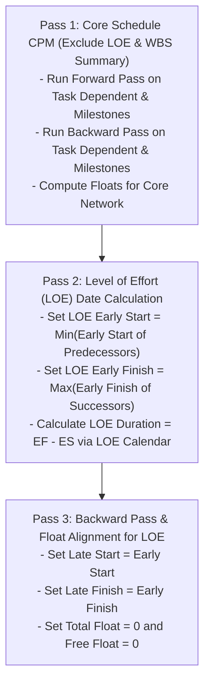

# Solutions: Topic 1.3 — Key Terminology Glossary

Comprehensive solutions and technical specifications for the exercises on Primavera P6 terminology, Critical Path Method (CPM) algorithms, calendar arithmetic, and database architecture.

---

## 🧠 Section A: Scheduling Logic, Floats & Path Analysis

### Solution 1: Total Float vs. Free Float Calculation & Field Implications

#### 1. Network Topology & Forward Pass (Early Dates)
* **Calendar:** Continuous 7-day, 8-hour workday.
* **Project Start:** Day 1 (08:00).
* **Formula for Early Finish:** $\text{EF} = \text{ES} + \text{Duration} - 1\text{ unit}$ (in discrete day notation, or $\text{EF} = \text{ES} + \text{Duration}$ using continuous timestamps).
  * Let us use continuous day offsets: Day 1 (08:00) + 5 days = Day 6 (08:00), which represents the end of Day 5.
* **Activity A (Cast Transformer Pad, OD: 5d):**
  * $\text{ES}_A = \text{Day 1}$
  * $\text{EF}_A = 1 + 5 = \text{Day 6 (end of Day 5)}$
* **Activity B (Mount 33kV Transformer, OD: 3d):**
  * Predecessor: Activity A with $\text{FS} + \text{Lag } 7\text{d}$.
  * $\text{ES}_B = \text{EF}_A + \text{Lag} = 6 + 7 = \text{Day 13}$
  * $\text{EF}_B = 13 + 3 = \text{Day 16 (end of Day 15)}$
* **Activity C (Install Cable Tray Supports, OD: 4d):**
  * Predecessor: Activity A with $\text{FS} + \text{Lag } 0\text{d}$.
  * $\text{ES}_C = \text{EF}_A + 0 = \text{Day 6}$
  * $\text{EF}_C = 6 + 4 = \text{Day 10 (end of Day 9)}$
* **Activity D (Land HV Cables on Terminals, OD: 2d):**
  * Predecessors: Activity B ($\text{EF}_B = 16$) and Activity C ($\text{EF}_C = 10$).
  * $\text{ES}_D = \max(\text{EF}_B, \text{EF}_C) = \max(16, 10) = \text{Day 16}$
  * $\text{EF}_D = 16 + 2 = \text{Day 18 (end of Day 17)}$

#### 2. Backward Pass (Late Dates)
* Required Project Milestone Finish for Activity D: **Day 20 (end of Day 20 = Day 21 08:00)**.
* **Activity D:**
  * $\text{LF}_D = \text{Day 21}$
  * $\text{LS}_D = \text{LF}_D - \text{Duration} = 21 - 2 = \text{Day 19}$
* **Activity B:**
  * Successor: Activity D ($\text{LS}_D = 19$).
  * $\text{LF}_B = \text{LS}_D = \text{Day 19}$
  * $\text{LS}_B = \text{LF}_B - \text{Duration} = 19 - 3 = \text{Day 16}$
* **Activity C:**
  * Successor: Activity D ($\text{LS}_D = 19$).
  * $\text{LF}_C = \text{LS}_D = \text{Day 19}$
  * $\text{LS}_C = \text{LF}_C - \text{Duration} = 19 - 4 = \text{Day 15}$
* **Activity A:**
  * Successor B constraint: $\text{LS}_B - \text{Lag} = 16 - 7 = \text{Day 9}$.
  * Successor C constraint: $\text{LS}_C - \text{Lag} = 15 - 0 = \text{Day 15}$.
  * $\text{LF}_A = \min(9, 15) = \text{Day 9}$
  * $\text{LS}_A = \text{LF}_A - \text{Duration} = 9 - 5 = \text{Day 4}$

#### 3. Float Computation Table

$$\text{Total Float (TF)} = \text{LF} - \text{EF} = \text{LS} - \text{ES}$$
$$\text{Free Float (FF)}_i = \min_{j \in Succ(i)} (\text{ES}_j - \text{Lag}_{ij}) - \text{EF}_i$$

| Activity | OD | ES | EF | LS | LF | Total Float (TF) | Free Float (FF) | Critical? |
| :--- | :---: | :---: | :---: | :---: | :---: | :---: | :---: | :---: |
| **A (Cast Pad)** | 5d | Day 1 | Day 6 | Day 4 | Day 9 | $9 - 6 = \mathbf{3\text{d}}$ | $\min(13-7, 6-0) - 6 = \mathbf{0\text{d}}$ | No |
| **B (Mount Xfmr)**| 3d | Day 13 | Day 16 | Day 16 | Day 19 | $19 - 16 = \mathbf{3\text{d}}$ | $(16 - 0) - 16 = \mathbf{0\text{d}}$ | No |
| **C (Cable Tray)**| 4d | Day 6 | Day 10 | Day 15 | Day 19 | $19 - 10 = \mathbf{9\text{d}}$ | $(16 - 0) - 10 = \mathbf{6\text{d}}$ | No |
| **D (Land Cables)**| 2d | Day 16 | Day 18 | Day 19 | Day 21 | $21 - 18 = \mathbf{3\text{d}}$ | $(21 - 0) - 18 = \mathbf{3\text{d}}^*$ | No |

*($^*$For terminal Activity D, Free Float is measured against the project target finish of Day 21).*

#### 4. Physical & Scheduling Consequences of Delaying Activity C by 5 Days
* **Free Float of Activity C is 6 days.**
* The subcontractor delays Activity C by 5 days:
  * Revised Finish of Activity C = $\text{Day } 10 + 5 = \text{Day 15}$.
  * Early Start of Successor D = $\max(\text{EF}_B, \text{Revised EF}_C) = \max(16, 15) = \text{Day 16}$.
* **Conclusions:**
  1. **Does it push the start of Activity D?** **NO.** Activity D cannot start until Day 16 anyway because Activity B (Mount Transformer) finishes on Day 16. Because the 5-day delay is within Activity C's Free Float (5 days $\le$ 6 days), Activity D's Early Start is completely unaffected.
  2. **Does it push the project completion date?** **NO.** Activity C has 9 days of Total Float. Delaying it by 5 days consumes 5 days of its Total Float, leaving $\text{TF} = 4\text{ days}$. The project finish remains Day 18 (with milestone deadline at Day 21).

---

### Solution 2: Critical Path vs. Longest Path under Mandatory Constraints

#### 1. Calculated Total Float of Substation Commissioning Activities
* **Formula:** $\text{Total Float} = \text{Late Finish} - \text{Early Finish}$.
* The unconstrained early finish of the substation commissioning path is **Day 115**.
* The **Mandatory Finish** constraint forcibly sets $\text{Late Finish} = \text{Day 100}$.
$$\text{Total Float} = 100 - 115 = \mathbf{-15\text{ days}}$$
All driving activities along this path will have **Negative Float of -15 days**.

#### 2. Critical Path under Default Setting (`Total Float <= 0`)
* Under P6's default threshold (`Total Float <= 0`), **only activities with $\text{TF} \le 0$** are flagged as critical.
* Because the Substation Commissioning path has $\text{TF} = -15\text{ days} \le 0$, all activities on this path are marked Critical.
* The Administrative Security Fencing path has Early Finish Day 60 and Required Finish Day 80 ($\text{TF} = +20\text{ days} > 0$), so it is not critical.

#### 3. Longest Path Option vs. Critical Path via Float
```
CRITICAL PATH (Float-Based):  Evaluates: Total Float <= Threshold (e.g. <= 0)
                              Vulnerable to: Constraints, Calendar differences, Artificial deadlines.

LONGEST PATH (Logic-Based):   Evaluates: Continuous chain of driving relationships (IsDriving=true)
                              from Data Date to the terminal activity of the project network.
```
* **Critical Path via Float:** An activity is deemed critical purely by a scalar arithmetic test ($\text{Late Finish} - \text{Early Finish} \le \text{Threshold}$). If an independent milestone in an unrelated WBS branch has a Mandatory Finish constraint that is breached, that entire unrelated branch turns red (negative float), cluttering the schedule with dozens of "critical" paths that do not actually control project handover.
* **Longest Path:** The algorithm starts at the final milestone of the project (or open terminal node) and traverses backward exclusively along incoming dependencies where `is_driving == true`. It identifies the singular, contiguous mathematical chain that directly controls the project end date, regardless of calendar shifts or negative float elsewhere.

#### 4. Delay Claim Rejection in International Arbitration (FIDIC)
* In formal delay claims (e.g., claiming an Extension of Time / EOT under FIDIC Clause 8.4):
  * A delay claim requires proving that the employer-caused delay impacted the **true controlling driving path** of project completion.
  * When a planner uses `Total Float <= 0` in a schedule riddled with hard constraints, hundreds of non-driving activities display negative float.
  * Opposing forensic experts will demonstrate that the contractor's "critical path" is an artificial artifact created by an improperly applied Mandatory constraint, rather than a genuine physical dependency sequence. Arbitration tribunals universally dismiss delay claims that cannot demonstrate an unbroken driving chain (Longest Path) to project completion.

---

### Solution 3: Driving vs. Non-Driving Relationships & Algorithmic Identification

#### 1. Calculate Early Start (ES) of `ACT-500`
Activity `ACT-500` has duration $\text{OD} = 6\text{d}$.
* **Predecessor 1 (`ACT-410`):**
  * Type: `FS`, Lag: $2\text{d}$, $\text{EF} = \text{Day 14}$.
  * Candidate ES = $\text{EF} + \text{Lag} = 14 + 2 = \mathbf{\text{Day 16}}$.
* **Predecessor 2 (`ACT-420`):**
  * Type: `FS`, Lag: $0\text{d}$, $\text{EF} = \text{Day 18}$.
  * Candidate ES = $\text{EF} + \text{Lag} = 18 + 0 = \mathbf{\text{Day 18}}$.
* **Predecessor 3 (`ACT-430`):**
  * Type: `SS`, Lag: $8\text{d}$, $\text{ES} = \text{Day 8}$.
  * Candidate ES = $\text{ES} + \text{Lag} = 8 + 8 = \mathbf{\text{Day 16}}$.

$$\text{Calculated Early Start (ES)} = \max(16, 18, 16) = \mathbf{\text{Day 18}}$$

#### 2. Driving vs. Non-Driving Classification
* **Predecessor 2 (`ACT-420`):** **DRIVING**. Its candidate early start ($\text{Day 18}$) matches the calculated Early Start of `ACT-500`. It is the binding constraint.
* **Predecessor 1 (`ACT-410`):** **NON-DRIVING**. Candidate date is Day 16, which is 2 days earlier than Day 18.
* **Predecessor 3 (`ACT-430`):** **NON-DRIVING**. Candidate date is Day 16, which is 2 days earlier than Day 18.

#### 3. Golang Implementation: `IdentifyDrivingPredecessors`

```go
package cpmengine

import (
	"time"
	"github.com/google/uuid"
)

type DependencyEdge struct {
	PredecessorID uuid.UUID
	Type          string        // "FS", "SS", "FF", "SF"
	Lag           time.Duration
	PredES        time.Time
	PredEF        time.Time
}

type ActivityNode struct {
	ID           uuid.UUID
	Duration     time.Duration
	EarlyStart   time.Time
	EarlyFinish  time.Time
	Dependencies []DependencyEdge
}

// IdentifyDrivingPredecessors evaluates incoming edges and returns the driving predecessor IDs
func IdentifyDrivingPredecessors(act ActivityNode) []uuid.UUID {
	var drivingIDs []uuid.UUID

	for _, dep := range act.Dependencies {
		var candidateES time.Time

		switch dep.Type {
		case "FS":
			// ES_succ >= EF_pred + Lag
			candidateES = dep.PredEF.Add(dep.Lag)
		case "SS":
			// ES_succ >= ES_pred + Lag
			candidateES = dep.PredES.Add(dep.Lag)
		case "FF":
			// FF constrains Early Finish: EF_succ >= EF_pred + Lag
			// Candidate ES = (EF_pred + Lag) - Duration
			candidateEF := dep.PredEF.Add(dep.Lag)
			candidateES = candidateEF.Add(-act.Duration)
		case "SF":
			// SF constrains Early Finish: EF_succ >= ES_pred + Lag
			// Candidate ES = (ES_pred + Lag) - Duration
			candidateEF := dep.PredES.Add(dep.Lag)
			candidateES = candidateEF.Add(-act.Duration)
		default:
			continue
		}

		// In integer day / minute resolution, if candidate equals calculated ES, it is driving
		if candidateES.Equal(act.EarlyStart) {
			drivingIDs = append(drivingIDs, dep.PredecessorID)
		}
	}

	return drivingIDs
}
```

---

### Solution 4: Level of Effort (LOE) Mechanics and CPM Pass Order

#### 1. Why Naive Topological Sorting Fails for LOE Activities
* Standard topological sorting requires all dependency edges to represent precedence constraints.
* A Level of Effort activity derives its dates from its predecessors (which define its start) and its successors (which define its finish).
* If an LOE activity is linked to a successor $S$, but its duration depends on $S$ finishing, treating these links as standard CPM precedence edges creates a **bidirectional cycle**:
  $$\text{LOE} \to S \quad \text{and} \quad S \to \text{LOE}$$
* If processed in the primary CPM pass, the topological sort will either report a circular cycle error or compute an infinite duration.

#### 2. Three-Stage CPM Execution Order
An enterprise CPM engine executes CPM in three isolated passes:



1. **Pass 1 (Core Network):** Filter out all LOE and WBS Summary activities. Run the full forward pass and backward pass on Task Dependent, Resource Dependent, and Milestone nodes.
2. **Pass 2 (LOE Expansion):** For each LOE activity:
   * $\text{Early Start}_{LOE} = \min_{p \in Pred} (\text{Early Start}_p)$
   * $\text{Early Finish}_{LOE} = \max_{s \in Succ} (\text{Early Finish}_s)$
   * Derive duration by computing working hours between $\text{Early Start}$ and $\text{Early Finish}$ using the LOE's calendar.
3. **Pass 3 (LOE Date Alignment):** 
   * Set $\text{Late Start}_{LOE} = \text{Early Start}_{LOE}$
   * Set $\text{Late Finish}_{LOE} = \text{Early Finish}_{LOE}$.

#### 3. Can an LOE Activity Have Total Float or Be Critical?
* **NO.** By definition, an LOE activity represents supportive, overhead work (e.g., project administration, security watch, field safety supervision).
* It does not represent discrete scope that can advance or delay the project.
* Because its start and finish expand and contract dynamically with the activities it supports, it has **zero float** ($\text{TF} = 0, \text{FF} = 0$), but it is **never critical** and must never be permitted to drive the project completion date.

---

## 🏗️ Section B: Calendars, Shifts & Constraints

### Solution 5: Task Dependent vs. Resource Dependent Calendar Clashes

#### 1. Task Dependent Calculation
* **Activity Duration:** 80 working hours.
* **Governing Calendar:** `Site Standard 6-Day Calendar` (Mon–Sat, 8 hrs/day, 08:00–17:00 with 1-hr lunch).
* **Execution:**
  * Monday: 8 hrs (Balance: 72 hrs)
  * Tuesday: 8 hrs (Balance: 64 hrs)
  * Wednesday: 8 hrs (Balance: 56 hrs)
  * Thursday: 8 hrs (Balance: 48 hrs)
  * Friday: 8 hrs (Balance: 40 hrs)
  * Saturday: 8 hrs (Balance: 32 hrs)
  * Sunday: 0 hrs (Non-working day)
  * Monday (Week 2): 8 hrs (Balance: 24 hrs)
  * Tuesday (Week 2): 8 hrs (Balance: 16 hrs)
  * Wednesday (Week 2): 8 hrs (Balance: 8 hrs)
  * Thursday (Week 2): 8 hrs (Balance: 0 hrs)
* **Finish Timestamp:** **Thursday of Week 2 at 17:00 (5:00 PM)**.
* **Total Elapsed Calendar Days:** Starts Monday Week 1 (Day 1) at 08:00, finishes Thursday Week 2 (Day 11) at 17:00 = **11 calendar days**.

#### 2. Resource Dependent Calculation
* **Governing Calendar:** `Rig Maintenance Calendar` (Mon–Thu only, 10 hrs/day, 07:00–17:00; Fri–Sun non-working).
* **Execution:**
  * Monday: 10 hrs (Balance: 70 hrs)
  * Tuesday: 10 hrs (Balance: 60 hrs)
  * Wednesday: 10 hrs (Balance: 50 hrs)
  * Thursday: 10 hrs (Balance: 40 hrs)
  * Friday: 0 hrs (Rig servicing - Non-working)
  * Saturday: 0 hrs (Rig servicing - Non-working)
  * Sunday: 0 hrs (Non-working)
  * Monday (Week 2): 10 hrs (Balance: 30 hrs)
  * Tuesday (Week 2): 10 hrs (Balance: 20 hrs)
  * Wednesday (Week 2): 10 hrs (Balance: 10 hrs)
  * Thursday (Week 2): 10 hrs (Balance: 0 hrs)
* **Finish Timestamp:** **Thursday of Week 2 at 17:00 (5:00 PM)**.
* **Total Elapsed Calendar Days:** Starts Monday Week 1 (Day 1) at 07:00, finishes Thursday Week 2 (Day 11) at 17:00 = **11 calendar days**.
*(Note: Although both finished on Thursday of Week 2 in this instance, notice that the Resource Dependent task performed zero work on Friday and Saturday, whereas the Task Dependent task consumed 8 hours each on those days).*

#### 3. Next.js Front-End Gantt Rendering Bug
* If a frontend engineer calculates Gantt bar pixel width using `width = (durationHours / 8) * pixelsPerDay`, the bar will render as $\frac{80}{8} = 10\text{ days}$ wide on the screen.
* But across a calendar with weekend non-working days or holiday gaps, the activity actually spans **11 calendar days** in physical reality!
* **The Bug:** Downstream tasks scheduled by the backend will appear visually detached or overlapping on the Gantt canvas.
* **Architectural Fix:** The front-end must never compute visual bar coordinates using duration division. The backend CPM engine must return explicit ISO timestamps (`early_start_date`, `early_finish_date`), and the frontend must project these exact timestamps onto the time axis using the project's calendar time-scale scale function.

---

### Solution 6: Hard Constraints vs. Soft Constraints in CPM Date Arithmetic

Let $ES_{pred}$ be the earliest date permitted by network predecessors, $LF_{succ}$ be the latest date permitted by successors, and $D$ be activity duration.

#### 1. Start On or After (SOA) with Constraint Date $T_c$
* **Category:** Soft constraint (Early date boundary).
* **Forward Pass:**
  $$\text{Early Start} = \max\left( ES_{pred}, T_c \right)$$
  $$\text{Early Finish} = \text{Early Start} \oplus D$$
* **Backward Pass:**
  $$\text{Late Finish} = LF_{succ}$$
  $$\text{Late Start} = \text{Late Finish} \ominus D$$
* **Impact:** Delays Early Start if $T_c > ES_{pred}$. Does not affect Late Dates unless pushed by successors.

#### 2. Finish On or Before (FOB) with Constraint Date $T_c$
* **Category:** Soft constraint (Late date boundary).
* **Forward Pass:**
  $$\text{Early Start} = ES_{pred}$$
  $$\text{Early Finish} = \text{Early Start} \oplus D$$
* **Backward Pass:**
  $$\text{Late Finish} = \min\left( LF_{succ}, T_c \right)$$
  $$\text{Late Start} = \text{Late Finish} \ominus D$$
* **Impact:** Restricts the Late Finish date. If the project's natural $LF_{succ} > T_c$, Late Finish is forced to $T_c$, which reduces Total Float ($\text{TF} = \text{LF} - \text{EF}$). If $EF > T_c$, Total Float becomes **negative**.

#### 3. Mandatory Finish (MF) with Constraint Date $T_c$
* **Category:** Hard constraint (Overrides network logic).
* **Forward Pass:**
  * In classic P6 CPM: Early dates are calculated normally based on logic ($ES = ES_{pred}, EF = ES \oplus D$).
* **Backward Pass:**
  * The normal successor logic is completely ignored:
  $$\text{Late Finish} = T_c \quad (\text{regardless of } LF_{succ})$$
  $$\text{Late Start} = T_c \ominus D$$
* **Impact on Predecessors:** The backward pass forces the predecessor's Late Finish to be constrained by this $T_c \ominus D$, potentially cascading massive negative float backward across the entire upstream network even if real successors have ample float.

---

## 📊 Section C: Progress Tracking & Earned Value Management (EVM)

### Solution 7: The Percent Complete Dilemma — Duration % vs. Physical %

#### 1. Under Duration % Complete
* $\text{Original Duration (OD)} = 20\text{ days}$.
* Elapsed time = 10 working days.
* **Duration % Complete:**
  $$\text{Duration \% Complete} = \frac{\text{OD} - \text{Remaining Duration}}{\text{OD}} \times 100$$
  If calculated by elapsed time: $\frac{10}{20} \times 100 = \mathbf{50.0\%}$.
* **P6 Automatic Calculation of Remaining Duration:**
  $$\text{Remaining Duration} = \text{OD} \times (1 - 0.50) = \mathbf{10\text{ days}}.$$
  * **Does this match field reality?** **NO.** The site team knows they hit solid rock and need **24 days**, but P6 artificially forces Remaining Duration to 10 days! The live schedule is now a work of fiction.
* **Earned Value (EV):**
  $$\text{EV} = \text{BAC} \times \text{Duration \%} = \$100,000 \times 0.50 = \mathbf{\$50,000}.$$

#### 2. Under Physical % Complete
* **Physical % Complete:** Directly measures audited physical deliverables:
  $$\text{Physical \% Complete} = \frac{4\text{ km}}{20\text{ km}} \times 100 = \mathbf{20.0\%}.$$
* **Remaining Duration:** Decoupled from percentage! The engineer independently enters the true field estimate:
  $$\text{Remaining Duration} = \mathbf{24\text{ days}}.$$
* **Earned Value (EV):**
  $$\text{EV} = \text{BAC} \times \text{Physical \%} = \$100,000 \times 0.20 = \mathbf{\$20,000}.$$

#### 3. Contrast & Why Defense/Infrastructure Contracts Prohibit Duration % Complete
* **The Comparison:**
  * Under Duration %, the contractor reports **$50,000 Earned Value** and claims the task will finish in **10 days**.
  * Under Physical %, the true reality is exposed: only **$20,000 Earned Value** has been earned, and the task will take **24 more days** (schedule slippage of 14 days past baseline).
* **Legal & Audit Prohibition:** 
  Duration % complete equates the passage of time with the accomplishment of work. If a contractor sits idle on site for 10 days doing nothing, Duration % complete would report 50% progress! Under FIDIC, US DoD (DCMA), and World Bank infrastructure contracts, progress billings based on Duration % are considered fraudulent front-loading of claims. **Physical % Complete** is legally mandated.

---

### Solution 8: Earned Value Health Diagnostics & S-Curve Forecasting

#### 1. Planned Value (PV) and Earned Value (EV)
* $\text{BAC} = \$12,000,000$
* $\text{Planned \%} = 60.0\% \implies \text{PV} = \$12,000,000 \times 0.60 = \mathbf{\$7,200,000\text{ USD}}$
* $\text{Physical \%} = 45.0\% \implies \text{EV} = \$12,000,000 \times 0.45 = \mathbf{\$5,400,000\text{ USD}}$

#### 2. Schedule Variance (SV) and SV %
* $\text{SV} = \text{EV} - \text{PV} = \$5,400,000 - \$7,200,000 = \mathbf{-\$1,800,000\text{ USD}}$
* $\text{SV \%} = \frac{\text{SV}}{\text{PV}} \times 100 = \frac{-\$1,800,000}{\$7,200,000} \times 100 = \mathbf{-25.0\%}$
*(Interpretation: Project is 25% behind schedule in terms of work volume).*

#### 3. Cost Variance (CV) and CV %
* $\text{AC} = \$7,200,000$
* $\text{CV} = \text{EV} - \text{AC} = \$5,400,000 - \$7,200,000 = \mathbf{-\$1,800,000\text{ USD}}$
* $\text{CV \%} = \frac{\text{CV}}{\text{EV}} \times 100 = \frac{-\$1,800,000}{\$5,400,000} \times 100 = \mathbf{-33.33\%}$
*(Interpretation: Project is running a 33.33% cost overrun on work performed).*

#### 4. Schedule Performance Index (SPI) and Cost Performance Index (CPI)
* $\text{SPI} = \frac{\text{EV}}{\text{PV}} = \frac{5,400,000}{7,200,000} = \mathbf{0.75}$
* $\text{CPI} = \frac{\text{EV}}{\text{AC}} = \frac{5,400,000}{7,200,000} = \mathbf{0.75}$

#### 5. Estimate to Complete (ETC) and Estimate at Completion (EAC)
* $\text{ETC} = \frac{\text{BAC} - \text{EV}}{\text{CPI}} = \frac{12,000,000 - 5,400,000}{0.75} = \frac{6,600,000}{0.75} = \mathbf{\$8,800,000\text{ USD}}$
* $\text{EAC} = \text{AC} + \text{ETC} = \$7,200,000 + \$8,800,000 = \mathbf{\$16,000,000\text{ USD}}$
*(Alternatively: $\text{EAC} = \frac{\text{BAC}}{\text{CPI}} = \frac{\$12,000,000}{0.75} = \$16,000,000\text{ USD}$).*

#### 6. Variance at Completion (VAC)
* $\text{VAC} = \text{BAC} - \text{EAC} = \$12,000,000 - \$16,000,000 = \mathbf{-\$4,000,000\text{ USD}}$

#### 7. Executive Summary for COO
> *"The 33/220kV Substation package is in severe dual distress, progressing at only 75% of scheduled velocity ($\text{SPI} = 0.75$) with a cost efficiency of 75 cents on the dollar ($\text{CPI} = 0.75$). If current site execution efficiency continues uncorrected, this $12.0M package will overrun its budget by **$4.0M USD** ($\text{EAC} = \$16.0M$) and delay commercial grid synchronization by at least 8 to 10 weeks. Immediate intervention is required to renegotiate subcontractor equipment rates and augment electrical erection crews."*

---

## 💻 Section D: Database & Software Architecture (Golang / PostgreSQL)

### Solution 9: Relational Schema Design & Cycle Prevention in Precedence Networks

#### 1. PostgreSQL Schema for `project_relationships`
```sql
CREATE TYPE relationship_type_enum AS ENUM ('FS', 'SS', 'FF', 'SF');

CREATE TABLE project_relationships (
    id UUID PRIMARY KEY DEFAULT gen_random_uuid(),
    project_id UUID NOT NULL REFERENCES projects(id) ON DELETE CASCADE,
    predecessor_id UUID NOT NULL REFERENCES activities(id) ON DELETE CASCADE,
    successor_id UUID NOT NULL REFERENCES activities(id) ON DELETE CASCADE,
    relationship_type relationship_type_enum NOT NULL DEFAULT 'FS',
    lag_seconds BIGINT NOT NULL DEFAULT 0,
    is_driving BOOLEAN NOT NULL DEFAULT FALSE,
    created_at TIMESTAMPTZ NOT NULL DEFAULT NOW(),

    -- Prevent self-loop (Activity depending on itself)
    CONSTRAINT chk_no_self_loop CHECK (predecessor_id <> successor_id),
    -- Prevent duplicate edge between same pair
    CONSTRAINT uq_pred_succ_pair UNIQUE (predecessor_id, successor_id)
);

CREATE INDEX idx_rel_project ON project_relationships(project_id);
CREATE INDEX idx_rel_pred ON project_relationships(predecessor_id);
CREATE INDEX idx_rel_succ ON project_relationships(successor_id);
```

#### 2. Golang Cycle Detection: `ValidateNoCycle`
A new directed edge $u \to v$ creates a cycle if and only if there already exists a directed path from $v$ to $u$. We can verify this via Breadth-First Search (BFS) or Depth-First Search (DFS) starting from $v$:

```go
package cpmengine

import (
	"context"
	"fmt"
	"github.com/google/uuid"
	"github.com/jmoiron/sqlx"
)

// ValidateNoCycle returns true if adding edge (newPredID -> newSuccID) is safe (no cycle).
// Returns false if a path already exists from newSuccID to newPredID.
func ValidateNoCycle(ctx context.Context, db *sqlx.DB, projectID, newPredID, newSuccID uuid.UUID) (bool, error) {
	// Immediate self-loop check
	if newPredID == newSuccID {
		return false, fmt.Errorf("self-dependency is invalid")
	}

	// Fetch all existing relationship edges for the project
	type Edge struct {
		PredecessorID uuid.UUID `db:"predecessor_id"`
		SuccessorID   uuid.UUID `db:"successor_id"`
	}

	query := `
		SELECT predecessor_id, successor_id 
		FROM project_relationships 
		WHERE project_id = $1`
	
	var edges []Edge
	if err := db.SelectContext(ctx, &edges, query, projectID); err != nil {
		return false, fmt.Errorf("failed to load project edges: %w", err)
	}

	// Build adjacency list: node -> []successors
	adj := make(map[uuid.UUID][]uuid.UUID)
	for _, e := range edges {
		adj[e.PredecessorID] = append(adj[e.PredecessorID], e.SuccessorID)
	}

	// Check if newPredID is reachable starting from newSuccID (BFS traversal)
	visited := make(map[uuid.UUID]bool)
	queue := []uuid.UUID{newSuccID}
	visited[newSuccID] = true

	for len(queue) > 0 {
		curr := queue[0]
		queue = queue[1:]

		if curr == newPredID {
			// Found path from newSuccID -> newPredID! Adding newPredID -> newSuccID creates a cycle.
			return false, nil
		}

		for _, neighbor := range adj[curr] {
			if !visited[neighbor] {
				visited[neighbor] = true
				queue = append(queue, neighbor)
			}
		}
	}

	// No path exists from newSuccID to newPredID. Safe to add edge.
	return true, nil
}
```

---

### Solution 10: WBS Rollup Architecture vs. WBS Summary Activities

#### 1. Architectural and Database Differences

| Attribute | WBS Node Rollup | WBS Summary Activity |
| :--- | :--- | :--- |
| **Entity Table** | `wbs_nodes` (Folder/Tree table) | `activities` (Activity table with `activity_type = 'wbs_summary'`) |
| **Nature** | Structural grouping container. Has no duration or calendar of its own. | Executable graph node. Has a calendar and can have resource/cost assignments. |
| **Logic Links** | **Cannot** have direct predecessor/successor relationships in P6. | **Can** have incoming/outgoing precedence logic links. |
| **Calculation** | Computed via hierarchical post-order tree traversal (bottom-up rollup). | Computed inside the CPM engine during Pass 2 (similar to LOE). |
| **Earned Value** | Sums up all BAC, EV, and AC across all descendant activities. | Stores its own EV metrics based on rollup rules. |

#### 2. Backend Engine Recalculation Flow
When a user edits an activity's duration in the Next.js UI:
1. **Step 1: CPM Graph Recomputation (Adjacency List DAG):**
   * The backend runs the forward and backward passes across all `activities`.
   * Newly calculated `early_start`, `early_finish`, `late_start`, `late_finish` are persisted to the `activities` table.
2. **Step 2: WBS Summary Activity Recalculation:**
   * Any activity marked `wbs_summary` inspects all sibling activities sharing the same WBS parent:
     $$\text{ES}_{summary} = \min_{a \in WBS} (\text{ES}_a), \quad \text{EF}_{summary} = \max_{a \in WBS} (\text{EF}_a)$$
3. **Step 3: Hierarchical WBS Tree Rollup (Bottom-Up Post-Order Traversal):**
   * Using PostgreSQL `ltree` or a recursive CTE in Golang, update each `wbs_node`:
     $$\text{WBS.EarlyStart} = \min(\text{ChildActivities.EarlyStart}, \text{ChildWBS.EarlyStart})$$
     $$\text{WBS.EarlyFinish} = \max(\text{ChildActivities.EarlyFinish}, \text{ChildWBS.EarlyFinish})$$
     $$\text{WBS.BAC} = \sum \text{ChildActivities.BAC}$$
     $$\text{WBS.EV} = \sum \text{ChildActivities.EV}$$

---

### Solution 11: Resource Leveling vs. Logical Dependency

#### 1. Why Linking Activities for Resource Scarcity is an Anti-Pattern
* **False Logic:** A relationship link ($A \to B$) asserts a **physical or technological causal dependency** (e.g., "you cannot pour concrete until rebar is tied").
* Inverter #2 does not physically require Inverter #1 to be completed. If you link them with an FS dependency, you embed temporary resource constraints into the permanent project logic network.
* **Result:** It destroys schedule agility, distorts float calculations, and misleads management into believing that the project cannot physically proceed in parallel.

#### 2. Consequence if a Second Crane is Rented
* If management rents a second crane to accelerate the project, Inverter #1 and Inverter #2 can now execute simultaneously.
* However, because the planner drew a hard `FS` relationship line between them, P6 will **still force Inverter #2 to wait until Inverter #1 finishes**!
* The planner must now spend hours manually finding and deleting artificial "crane links" across thousands of activities, risking broken network integrity.

#### 3. How P6 Resolves This via Resource Leveling
* In P6, both activities are modeled with proper causal logic (e.g., both depend only on foundation completion) and both have `Resource: 250T-Crane (Qty: 1)` assigned.
* When the user runs **Resource Leveling** (`Tools -> Level Resources` or `Shift+F9`):
  1. The engine leaves the logical network intact.
  2. It identifies the overallocation on Monday.
  3. Based on leveling priority rules (e.g., Total Float), it shifts Inverter #2 forward in time.
* **Distinguishing Data Fields:**
  * `early_start_date` / `early_finish_date`: Reflects the pure, unconstrained logic dates.
  * `leveled_start_date` / `leveled_finish_date`: Stores the resource-delayed dates.
  * Management can instantly toggle between the unconstrained logic schedule and the leveled production schedule without altering a single dependency link.

---

### Solution 12: Calendar Exception Spanning Non-Working Shift Arithmetic

#### Calendar Specification & Shifts:
* **Start Time:** Friday, October 09 at 13:00 (1:00 PM).
* **Remaining Duration:** 28 working hours.
* **Daily Working Shifts:**
  * Morning Shift: 08:00 – 12:00 (4 hours)
  * Lunch (Non-working): 12:00 – 13:00 (1 hour)
  * Afternoon Shift: 13:00 – 17:00 (4 hours)
  * Daily Total = 8 working hours.

#### Hour-by-Hour Step Calculation:
1. **Friday, October 09:**
   * Starts at 13:00 (Start of Afternoon Shift).
   * Works 13:00 – 17:00 = **4 working hours consumed**.
   * Remaining Hours: $28 - 4 = \mathbf{24\text{ hours}}$.
2. **Saturday, October 10:** Non-working weekend. (0 hours consumed).
3. **Sunday, October 11:** Non-working weekend. (0 hours consumed).
4. **Monday, October 12:** Statutory Public Holiday (Calendar Exception). (0 hours consumed).
5. **Tuesday, October 13:**
   * Morning Shift (08:00 – 12:00): 4 hours.
   * Lunch (12:00 – 13:00): 0 hours.
   * Afternoon Shift (13:00 – 17:00): 4 hours.
   * Total consumed on Tuesday: **8 hours**.
   * Remaining Hours: $24 - 8 = \mathbf{16\text{ hours}}$.
6. **Wednesday, October 14:**
   * Full 8-hour workday (08:00 – 12:00, 13:00 – 17:00): **8 hours consumed**.
   * Remaining Hours: $16 - 8 = \mathbf{8\text{ hours}}$.
7. **Thursday, October 15:**
   * Needs 8 working hours to finish ($8 - 8 = 0$).
   * Morning Shift (08:00 – 12:00): 4 hours consumed. (Remaining: 4 hours).
   * Lunch Break (12:00 – 13:00): Non-working.
   * Afternoon Shift (13:00 – 17:00): Consumes final 4 hours.
   * Activity completes precisely at the end of the afternoon shift: **17:00:00**.

#### Final Answer:
`ACT-TRN-01` finishes on **Thursday, October 15, 2026 at 17:00 (5:00 PM)**.
* Total elapsed calendar time: **6 days and 4 hours** (from Friday 13:00 to Thursday 17:00) to execute 28 hours of actual work.
