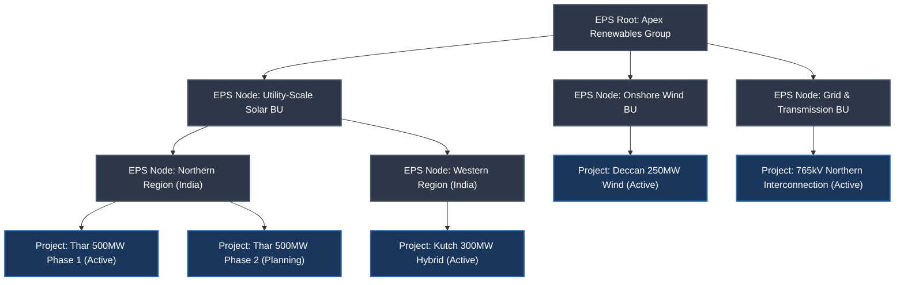
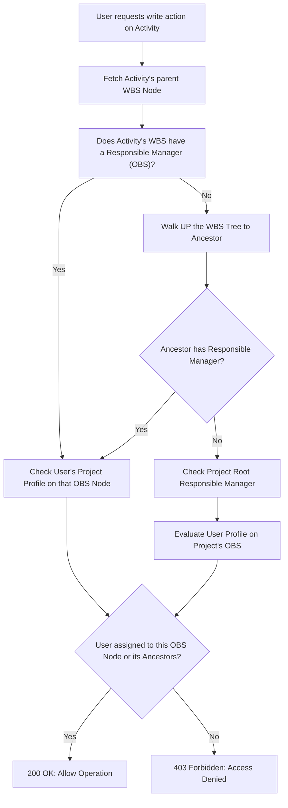

# Topic 1.4: EPS, OBS, and WBS Hierarchy — The Structural Backbone of Primavera P6

---

## 1. Executive Summary: The Three Pillars of Enterprise Control

In enterprise project portfolio management (PPM), managing a single schedule in isolation is trivial. The true engineering and organizational challenge arises when an enterprise simultaneously executes dozens or hundreds of capital projects—spanning billions of dollars, thousands of subcontractors, and hundreds of functional disciplines. 

In traditional lightweight tools (e.g., Jira, Asana, Monday.com), projects exist either as flat lists or in disconnected workspaces. Permissions are binary, portfolios cannot aggregate analytical data across projects, and organizational accountability is disconnected from project deliverables.

**Primavera P6 solves this problem through three orthogonal, hierarchical structural pillars:**

1. **EPS (Enterprise Project Structure):** *Where does the work live?* The corporate portfolio grouping. It defines how projects are organized, categorized, and rolled up across divisions, business units, geographies, and investment programs.
2. **OBS (Organizational Breakdown Structure):** *Who is responsible for the work?* The corporate management hierarchy. It models the human reporting structure, leadership roles, and security authorization chains.
3. **WBS (Work Breakdown Structure):** *What deliverables make up the work?* The project deliverable breakdown. Inside an individual project, it decomposes total scope into manageable, deliverable-oriented work packages following the 100% Rule.

```
┌─────────────────────────────────────────────────────────────────────────────┐
│                    THE THREE PILLARS OF ENTERPRISE CONTROL                  │
├─────────────────────────────────────────────────────────────────────────────┤
│                                                                             │
│      1. EPS (Portfolio Hierarchy)            2. OBS (Management Hierarchy)  │
│         "WHERE work lives"                      "WHO is accountable"        │
│                                                                             │
│         Apex Renewables Corp                    Board / CEO                 │
│         ├── Solar Division                      ├── VP Projects             │
│         │   ├── Thar 500MW (Project A)          │   ├── Project Director    │
│         │   └── Kutch 300MW (Project B)         │   │   ├── Civil Lead      │
│         └── Wind Division                       │   │   └── Electrical Lead │
│             └── Deccan 250MW (Project C)        │   └── Regional Director   │
│                                                 └── VP Procurement          │
│                                                                             │
│                                        ▲                                    │
│                                        │ The "Responsible Manager"          │
│                                        │ Matrix Nexus (RBAC Binding)        │
│                                        ▼                                    │
│                                                                             │
│                    3. WBS (Scope Deliverable Hierarchy)                     │
│                       "WHAT deliverables are produced"                      │
│                                                                             │
│                       Thar 500MW Solar Park (Project A)                     │
│                       ├── 1.0 Engineering & Permitting                      │
│                       ├── 2.0 Procurement & Supply                          │
│                       └── 3.0 Construction & Installation                   │
│                           ├── 3.1 Civil & Piling [Resp: Civil Lead]         │
│                           └── 3.2 Electrical Substation [Resp: Elec Lead]   │
│                               ├── 3.2.1 Inverter Stations                   │
│                               └── 3.2.2 220kV Pooling Substation            │
│                                   └── [Activities: Dig, Cable, Test, Sync]  │
│                                                                             │
└─────────────────────────────────────────────────────────────────────────────┘
```

### The Matrix Nexus: Binding Scope to People

The defining innovation of P6 is that **OBS does not exist in isolation**. OBS attaches to both the EPS (at the portfolio/project level) and to the WBS (at any deliverable node) via an attribute called the **"Responsible Manager"**.

When you assign an OBS node to an EPS node or a WBS branch:
* **Governance is Established:** Every dollar spent and every day slipped is traced directly to an organizational leader.
* **Security & Multi-Tenancy (RBAC) are Enforced:** The software queries the OBS assignment to determine which users can read, edit, or approve activities within that branch of the tree. A civil engineering subcontractor can be scoped strictly to WBS Node `3.1 (Civil & Piling)` while the Project Director maintains full write access across the entire project root.

---

## 2. Deep Dive: Enterprise Project Structure (EPS)

### 2.1 What is the EPS?
The **Enterprise Project Structure (EPS)** is a hierarchical representation of all projects within an organization. It forms the permanent skeletal backbone of the P6 database. 

* While individual projects have life cycles (they start, execute, and close), the EPS represents the **enduring business architecture** of the enterprise.
* The EPS consists of **EPS Root and Node elements** (often acting as corporate portfolio folders) and **Projects** placed inside those nodes.
* A database can have a single root EPS node (e.g., "Apex Global Infrastructure") or multiple root nodes representing autonomous subsidiaries.



### 2.2 Key Properties and Behaviors of EPS Nodes
1. **Container Semantics:** An EPS node cannot contain activities directly. It contains either child EPS nodes or Projects.
2. **Global Enterprise Settings:** Default project preferences, currency rollups, and default calendar sets can be established at higher EPS levels and inherited downward.
3. **Portfolio Rollup Calculations:**
   When an enterprise executive opens the EPS view, the system aggregates metrics dynamically from thousands of activities up through the WBS, into the Project, and across the EPS hierarchy:
   $$\text{EPS Budget} = \sum_{\text{Projects} \in \text{EPS Node}} \left( \sum_{\text{Leaf Activities}} \text{Planned Total Cost} \right)$$
   $$\text{EPS Actual Cost} = \sum_{\text{Projects} \in \text{EPS Node}} \left( \sum_{\text{Leaf Activities}} \text{Actual Cost} \right)$$
   $$\text{EPS Earned Value (EV)} = \sum_{\text{Projects} \in \text{EPS Node}} \left( \sum_{\text{Leaf Activities}} \text{Earned Value Cost} \right)$$

4. **Multi-Project Critical Path Analysis:**
   In advanced mega-programs, projects inside different EPS nodes can share cross-project dependencies (e.g., Project 5 "765kV Grid Tie-in" has a Finish-to-Start link to Project 1 "Thar 500MW Solar Park Commissioning"). The EPS structure enables enterprise schedulers to run simultaneous CPM calculations across multiple open projects.

---

## 3. Deep Dive: Organizational Breakdown Structure (OBS)

### 3.1 What is the OBS?
The **Organizational Breakdown Structure (OBS)** is a hierarchical model of the enterprise's management organization. It reflects the people, management positions, and reporting lines responsible for projects across the company.

```
Apex Renewables Corp (OBS Root)
├── Board of Directors / CEO
└── VP of Projects & Construction
    ├── Project Director (Solar Portfolio)
    │   ├── Lead Civil Engineer (Site Level)
    │   ├── Lead Electrical Engineer (Substation & Modules)
    │   └── Quality & Safety (HSE) Manager
    ├── Project Director (Wind Portfolio)
    │   ├── Wind Turbine Generator (WTG) Lead
    │   └── Civil & Foundations Lead
    └── VP Procurement & Supply Chain
        └── Contracts & Commercial Manager
```

### 3.2 Critical Distinction: OBS Nodes vs. Resources
A universal mistake made by junior developers and novice planners is confusing **OBS Nodes** with **Project Resources**:

| Dimension | OBS Node (Management Entity) | Resource (Labor / Non-Labor / Material) |
| :--- | :--- | :--- |
| **Primary Question** | *Who is accountable for this scope?* | *Who or what performs the work?* |
| **Examples** | "VP Projects", "Project Director", "Civil Package Manager" | "John Doe (Civil Engineer)", "Excavator CAT 320", "Ready-Mix Concrete" |
| **Where Assigned** | Assigned to **EPS Nodes**, **Projects**, and **WBS Nodes** | Assigned directly to **Activities** |
| **Function in Engine** | Controls **Access Control (RBAC)**, security inheritance, and executive reporting | Controls **Cost calculations**, man-hour utilization, leveling, and resource curves |
| **Hierarchy Nature** | Pure organizational management tree | Resource breakdown tree (e.g., Labor -> Engineering -> Civil) |

> [!IMPORTANT]
> An OBS node represents **authority and oversight**. A resource represents **production capacity and consumption**. You never assign an OBS node to an activity; you assign an OBS node as the `Responsible Manager` of the parent WBS node under which that activity lives.

### 3.3 The OBS Security Engine & RBAC Mechanics
In Primavera P6, access control is not achieved by assigning roles directly to individual tables or rows. Instead, P6 implements an **OBS-Driven Hierarchical RBAC System**:

```
┌─────────────────────────────────────────────────────────────────────────────┐
│                          P6 USER SECURITY TRINITY                           │
├─────────────────────────────────────────────────────────────────────────────┤
│                                                                             │
│   [ USER ACCOUNT ] ──────── Assigned To ───────► [ OBS NODE ]              │
│     (e.g., "vignesh_dev")                          (e.g., "Solar Civil Lead")│
│                                                          │                  │
│                                    Bound Via             │ Hierarchical     │
│                                [ PROJECT PROFILE ]       │ Downward         │
│                              (e.g., "Project Editor")     │ Inheritance      │
│                                                          │                  │
│                                                          ▼                  │
│                                                  [ WBS & EPS TREES ]        │
│                                                 Grants rights to any node   │
│                                                 where Resp. Mgr = OBS Node  │
│                                                 (or any child of OBS Node)  │
└─────────────────────────────────────────────────────────────────────────────┘
```

#### The Two Security Profiles:
1. **Global Security Profile:** Controls application-wide system capabilities independent of any specific project (e.g., Can the user create global calendars? Can the user modify the EPS tree? Can the user edit the global resource dictionary?).
2. **Project Security Profile:** Controls what the user can do *inside* a project or WBS node (e.g., Add activities, edit activity durations, delete logic links, update actual dates, approve baselines).

#### Inheritance Rules:
* When a user is assigned an OBS Node with a Project Profile, they automatically inherit those permissions for **that OBS Node and all of its subordinate child OBS nodes**.
* If User A is assigned to `Project Director (Solar Portfolio)`, and that OBS node is the Responsible Manager for Project 1, User A has access to Project 1 and all WBS elements under it.
* If Subcontractor B is assigned to OBS Node `Subcontractor - Civil Piling`, and that OBS node is set as Responsible Manager *only* on WBS Node `3.1 (Civil & Piling)`, Subcontractor B can see and edit activities under `3.1`, but receives an `HTTP 403 Forbidden` / access denied when attempting to view or touch WBS Node `3.2 (Electrical Substation)`.

---

## 4. Deep Dive: Work Breakdown Structure (WBS)

### 4.1 What is the WBS?
The **Work Breakdown Structure (WBS)** is a hierarchical decomposition of the total scope of work to be carried out by the project team to accomplish project objectives and create the required deliverables.

* In P6, the WBS exists **inside a Project**.
* The Project itself is Level 1 of the WBS.
* Every subordinate node represents a smaller, more specific deliverable.
* **The Leaves of the WBS are Work Packages.** Inside these work packages live the **Activities** (the tasks, milestones, and steps required to produce the deliverable).

```
WBS Level 1: [Thar 500MW Solar Park Project]
├── WBS Level 2: [1.0 Site Infrastructure & Civil Works]
│   ├── WBS Level 3: [1.1 Boundary, Roads & Grading]
│   └── WBS Level 3: [1.2 Piling & Tracker Foundations]
│       └── Work Package / Leaf: [1.2.1 Block A Piling]
│           ├── Activity: A1010 "Survey & Stake Piling Grid"
│           ├── Activity: A1020 "Hydraulic Ramming 2,500 Piles"
│           └── Activity: A1030 "Geotechnical Pull-out Quality Testing"
└── WBS Level 2: [2.0 Power Evacuation & Substation]
    ├── WBS Level 3: [2.1 33kV Pooling Switchgear]
    └── WBS Level 3: [2.2 220kV Main Step-Up Transformer Station]
```

### 4.2 The 100% Rule (MECE Principle)
The fundamental law governing WBS design is the **100% Rule**:
> The WBS must encompass **100% of the work defined by the project scope** and capture **all deliverables**—internal, external, and interim—including project management itself. The sum of the work at child levels must strictly equal 100% of the work represented by the parent node.

* **Mutually Exclusive, Collectively Exhaustive (MECE):** No two sibling WBS nodes may duplicate scope. If concrete for inverter pads is placed under `3.1 Civil Works`, it must never appear under `3.2 Electrical Inverters`.
* **Deliverables, Not Actions:** A WBS node must represent an **outcome or deliverable** (noun), not an activity action (verb).
  * ❌ *Bad WBS Node:* "Pouring Concrete and Pulling Wires" (These are activities).
  * ✅ *Good WBS Node:* "Inverter Foundation Civil Structures" (This is a deliverable).

### 4.3 Summary Nodes vs. Execution Nodes (Activities)
In Primavera P6, there is a strict architectural barrier between **WBS Nodes** and **Activities**:

```
┌─────────────────────────────────────────────────────────────────────────────┐
│                       WBS NODE vs. ACTIVITY ARCHITECTURE                    │
├─────────────────────────────────────────────────────────────────────────────┤
│                                                                             │
│   WBS NODE (Folder / Container)             ACTIVITY (Leaf Work Unit)       │
│   ─────────────────────────────             ─────────────────────────       │
│   • Has no calendar of its own.             • Bound to a specific Calendar. │
│   • Has no manual duration.                 • Has an explicit Duration.     │
│   • Start = MIN(Child Activities EarlyStart)• Start/Finish calculated by CPM│
│   • Finish = MAX(Child Activities EarlyEnd) • Logic relationships FS/SS/FF. │
│   • Rollup container for costs/hours.       • Assigns Labor/Equipment/Cost. │
│   • CANNOT be a predecessor or successor    • Participates in the CPM DAG.  │
│     in CPM network logic!                   │                               │
│                                                                             │
└─────────────────────────────────────────────────────────────────────────────┘
```

> [!CAUTION]
> **Database Architecture Rule for Developers:**
> In your schema, never allow a CPM relationship (Edge) to link directly to a WBS Node. Edges exist strictly between `Activity -> Activity`. If a user wants to link two entire phases, they must link milestone activities inside those WBS nodes. Linking WBS nodes directly introduces cyclic dependency hazards and corrupts early/late date forward/backward passes.

---

## 5. The Matrix Nexus & Security Mechanics: Binding EPS & WBS to OBS

### 5.1 The 2D Enterprise Control Matrix
The intersection of the EPS/WBS (Scope Axis) and the OBS (Human Authority Axis) forms the **Matrix Nexus**:

| Scope Entity (EPS / WBS) | Entity Type | Responsible Manager (OBS) | Assigned User | Effective Access Level |
| :--- | :--- | :--- | :--- | :--- |
| **Apex Renewables Group** | EPS Root | VP Projects | `suresh.nair` | Full Admin across entire enterprise |
| ├── **Solar Portfolio** | EPS Node | Project Director (Solar) | `priya.sharma` | Full Project Edit on all Solar Projects |
| │   └── **Thar 500MW Solar** | Project | Project Director (Solar) | `priya.sharma` | Inherited from Solar EPS node |
| │       ├── **1.0 Permitting** | WBS Level 2 | Regulatory Lead | `anil.joshi` | Read/Write on Permitting only |
| │       ├── **2.0 Civil Works** | WBS Level 2 | Lead Civil Engineer | `vikram.singh` | Read/Write on Civil branch |
| │       │   └── **2.1 Piling** | WBS Level 3 | Subcontractor Civil Lead | `subcon.raj` | Restricted: Can only status activities |
| │       └── **3.0 Electrical** | WBS Level 2 | Lead Electrical Engineer | `kavita.patel` | Read/Write on Electrical branch |
| └── **Wind Portfolio** | EPS Node | Project Director (Wind) | `marcus.vance` | `priya.sharma` has **No Access** |

### 5.2 Access Resolution Algorithm
When an incoming API request arrives at our Golang backend (e.g., `POST /api/v1/projects/{proj_id}/activities/{act_id}/update`), the access resolution engine evaluates permissions deterministically:



### 5.3 Step-by-Step Resolution Rules
1. **Node Scoping:** Every activity belongs to exactly one leaf WBS node.
2. **OBS Walk-Up Inheritance:** If the leaf WBS node has an explicit `responsible_manager_id` (OBS), that OBS node governs the security context. If `responsible_manager_id` is null on that WBS node, the engine walks up to parent WBS nodes until it finds an assigned OBS manager. If no WBS ancestor has an OBS assignment, it falls back to the Project's root `responsible_manager_id`.
3. **OBS Ancestry Match:** The user must be mapped to that target OBS node **or to an ancestor of that OBS node** in the organizational hierarchy.
4. **Profile Capability Check:** Once the OBS match is verified, the system queries the associated `ProjectSecurityProfile` to confirm the user possesses the specific atomic permission (e.g., `CAN_EDIT_ACTIVITY_DURATIONS`, `CAN_DELETE_RELATIONSHIPS`).

---

## 6. Real-World Case Study: "Apex Renewables Infrastructure Ltd."

To ground these concepts in realistic engineering data, we examine **Apex Renewables Infrastructure Ltd.**, a major clean energy EPC firm executing a **$1.2 Billion capital program** across India.

### 6.1 The 5 Capital Projects in the Portfolio
1. **Project PRJ-SOL-01 (Thar 500MW Solar Park):** Ultra-mega solar PV plant in Jaisalmer, Rajasthan ($380M).
2. **Project PRJ-HYB-02 (Kutch 300MW Wind-Solar Hybrid):** Combined wind-solar facility with shared substation in Gujarat ($260M).
3. **Project PRJ-WND-03 (Deccan 250MW Wind Farm):** 100 wind turbine generators across ridge lines in Karnataka ($210M).
4. **Project PRJ-TRN-04 (765kV Green Energy Transmission Corridor):** 140km double-circuit high-voltage line connecting Rajasthan to the National Grid ($230M).
5. **Project PRJ-BES-05 (100MW / 400MWh BESS Facility):** Utility-scale battery energy storage system in Tamil Nadu ($120M).

---

### 6.2 Enterprise Project Structure (EPS) Hierarchy

```
[EPS ROOT] Apex Renewables Infrastructure (APEX)
│
├── [EPS NODE] APEX-SOL: Solar Power Business Unit
│   ├── [EPS NODE] APEX-SOL-RAJ: Rajasthan Region
│   │   └── [PROJECT] PRJ-SOL-01: Thar 500MW Solar Park
│   └── [EPS NODE] APEX-SOL-GUJ: Gujarat Region
│       └── (Future Pipeline Projects)
│
├── [EPS NODE] APEX-WND: Wind Energy Business Unit
│   └── [EPS NODE] APEX-WND-KTK: Karnataka Region
│       └── [PROJECT] PRJ-WND-03: Deccan 250MW Wind Farm
│
├── [EPS NODE] APEX-HYB: Hybrid & Storage Business Unit
│   ├── [PROJECT] PRJ-HYB-02: Kutch 300MW Wind-Solar Hybrid
│   └── [PROJECT] PRJ-BES-05: 100MW/400MWh Tamil Nadu BESS
│
└── [EPS NODE] APEX-TRN: Transmission & Interconnection BU
    └── [PROJECT] PRJ-TRN-04: 765kV Green Energy Transmission Corridor
```

---

### 6.3 Organizational Breakdown Structure (OBS) Hierarchy

```
[OBS ROOT] Apex Executive Board (OBS-EXEC)
│
├── [OBS] VP of Projects & Engineering (OBS-VP-PROJ)
│   │
│   ├── [OBS] Project Director — Solar & Hybrids (OBS-DIR-SOL)
│   │   ├── [OBS] Package Manager — Solar Civil & Tracker (OBS-MGR-CIV)
│   │   │   └── [OBS] Site Engineer — Piling & Grading (OBS-ENG-PILE)
│   │   ├── [OBS] Package Manager — Solar Electrical & PV (OBS-MGR-ELEC)
│   │   │   └── [OBS] Inverter & SCADA Commissioning Lead (OBS-ENG-SCADA)
│   │   └── [OBS] Quality, Health & Safety Lead (OBS-HSE-SOL)
│   │
│   ├── [OBS] Project Director — Wind & Grid (OBS-DIR-WND)
│   │   ├── [OBS] WTG Erection Package Manager (OBS-MGR-WTG)
│   │   └── [OBS] High Voltage Substation & Line Manager (OBS-MGR-HV)
│   │
│   └── [OBS] Project Controls & Scheduling Director (OBS-DIR-PMO)
│       ├── [OBS] Senior Scheduling Engineer — Thar (OBS-SCHED-01)
│       └── [OBS] Cost & Earned Value Analyst (OBS-COST-ALL)
│
└── [OBS] VP of Procurement & Commercial (OBS-VP-PROC)
    ├── [OBS] Solar Module & Equipment Contracts Lead (OBS-CON-MOD)
    └── [OBS] EPC Subcontract Administrator (OBS-CON-SUBCON)
```

---

### 6.4 Detailed WBS Decomposition: Thar 500MW Solar Park (`PRJ-SOL-01`)

```
PRJ-SOL-01: Thar 500MW Solar Park Project Root [Resp: OBS-DIR-SOL]
│
├── 1.0 Project Management & Approvals [Resp: OBS-DIR-PMO]
│   ├── 1.1 Land Acquisition & Right of Way (RoW) Clearances
│   ├── 1.2 Statutory Interconnection & Evacuation Approvals
│   └── 1.3 Project Baseline & Integrated Schedule Setup
│
├── 2.0 Engineering & Design [Resp: OBS-MGR-ELEC]
│   ├── 2.1 Civil & Structural Engineering (Piles, MMS, Control Buildings)
│   ├── 2.2 DC Electrical Design (String Sizing, Inverter Stations)
│   └── 2.3 AC Electrical Design (33kV Pooling & 220kV Switchyard)
│
├── 3.0 Procurement & Long-Lead Supply [Resp: OBS-CON-MOD]
│   ├── 3.1 Tier-1 Bifacial PV Modules (500MWp Supply)
│   ├── 3.2 Single-Axis Trackers & Drive Units
│   ├── 3.3 3.125MVA Central Inverters & Step-Up Transformers
│   └── 3.4 220kV Main Step-Up Power Transformers (250MVA x 2)
│
├── 4.0 Civil Infrastructure & Piling Works [Resp: OBS-MGR-CIV]
│   ├── 4.1 Boundary Wall, Security Fencing & Access Roads
│   ├── 4.2 Array Grading & Drainage Systems
│   ├── 4.3 Tracker Piling Execution (Block 1 - Block 10) [Resp: OBS-ENG-PILE]
│   │   ├── 4.3.1 Block 1 to 5 Piling (50,000 Posts)
│   │   └── 4.3.2 Block 6 to 10 Piling (50,000 Posts)
│   └── 4.4 Inverter Pad Concrete Plinths
│
├── 5.0 Electrical Installation & Cabling [Resp: OBS-MGR-ELEC]
│   ├── 5.1 Single-Axis Tracker Assembly & Torque Tube Erection
│   ├── 5.2 PV Module Mounting & DC String Harness Cabling
│   ├── 5.3 33kV Underground AC Collection Network Trenching & Laying
│   └── 5.4 Inverter Station Installation & Internal Termination
│
├── 6.0 220kV Main Pooling Substation (PSS) [Resp: OBS-MGR-HV]
│   ├── 6.1 Control Room Building Construction
│   ├── 6.2 220kV Outdoor Switchyard Equipment Erection (Gantry, Isolators)
│   └── 6.3 250MVA Power Transformers Installation & Oil Filtration
│
└── 7.0 Testing, Commissioning & Grid Synchronization [Resp: OBS-DIR-SOL]
    ├── 7.1 SCADA, Telemetry & Grid Communication Testing [Resp: OBS-ENG-SCADA]
    ├── 7.2 Pre-Commissioning Cold Checks & Insulation Resistance Tests
    ├── 7.3 Back-Charging 220kV Substation from Grid
    └── 7.4 500MW Commercial Operation Date (COD) Synchronization
```

---

## 7. Database & Algorithmic Engineering: Building the Clone (Golang + PostgreSQL)

As a senior software architect designing the backend of a high-performance Primavera P6 web clone, your primary engineering bottlenecks are **hierarchical query performance** and **recursive rollup execution speed**.

### 7.1 Tree Storage Strategies in PostgreSQL

Storing and querying hierarchical data in relational databases requires selecting the correct data model. In an enterprise P6 clone, the WBS tree has up to 10 levels and 20,000 nodes per project, while the activity table holds 100,000 rows.

| Strategy | Read Entire Subtree | Insert New Leaf Node | Move Subtree (Re-parenting) | Delete Subtree | Referential Integrity (`ON DELETE`) | Storage & Index Overhead | Best Suited For |
| :--- | :--- | :--- | :--- | :--- | :--- | :--- | :--- |
| **1. Adjacency List** (`parent_id`) | Slow (Requires `WITH RECURSIVE`) | **Fastest ($O(1)$)** | **Fastest ($O(1)$ update parent)** | Easy with `CASCADE` | Native Foreign Key | Lowest (1 column + index) | Simple trees, frequent writes, native P6 desktop |
| **2. Nested Sets** (`lft`, `rgt`) | **Fastest ($O(1)$ range query)** | Extremely Slow ($O(N)$ renumbering) | Unusable ($O(N)$ tree lock & rewrites) | Slow ($O(N)$ renumbering) | Impossible to enforce natively | Low | Read-only taxonomies (NOT for live schedules!) |
| **3. Materialized Path (`ltree`)** | **Extremely Fast (Indexed GIST/BTREE)** | **Fast ($O(1)$ string concat)** | Moderate ($O(K)$ string prefix update on sub-tree) | **Fast ($O(K)$ prefix match)** | Good (Parent path check via triggers) | Moderate (String path storage + GiST index) | **RECOMMENDED FOR P6 CLONE (WBS & EPS)** |
| **4. Closure Table** (`ancestor_id`, `descendant_id`, `depth`) | Fast (Simple SQL `JOIN`) | Moderate ($O(\text{depth})$ inserts) | Complex ($O(K \times \text{depth})$ deletes & re-inserts) | Fast (Delete joins) | Perfect (Full Foreign Keys) | Highest ($O(N \times \text{depth})$ rows in join table) | High-audit security hierarchies (OBS) |

### Why `ltree` is the Premier Architectural Choice for WBS & EPS:
PostgreSQL's native `ltree` extension represents hierarchical paths as dot-separated labels (e.g., `APEX.SOLAR.THAR.CIVIL.PILING`). 
* Finding all descendants of WBS node `CIVIL` requires a single index-accelerated query: `WHERE path <@ 'APEX.SOLAR.THAR.CIVIL'`.
* Finding the exact root path to an ancestor takes $O(1)$: `WHERE path @> 'APEX.SOLAR.THAR.CIVIL.PILING'`.
* GiST (Generalized Search Tree) indexes make sub-tree searches instantaneous even across 500,000 WBS elements.

---

### 7.2 Complete PostgreSQL Production Schema

Here is the production-grade DDL defining the EPS, OBS, WBS, Activities, and Security Access Matrix:

```sql
-- Enable necessary PostgreSQL extensions
CREATE EXTENSION IF NOT EXISTS "uuid-ossp";
CREATE EXTENSION IF NOT EXISTS "ltree";

-- ============================================================================
-- 1. ORGANIZATIONAL BREAKDOWN STRUCTURE (OBS)
-- ============================================================================
CREATE TABLE obs_nodes (
    id UUID PRIMARY KEY DEFAULT uuid_generate_v4(),
    code VARCHAR(50) NOT NULL UNIQUE,
    name VARCHAR(255) NOT NULL,
    description TEXT,
    parent_id UUID REFERENCES obs_nodes(id) ON DELETE RESTRICT,
    path ltree NOT NULL,
    created_at TIMESTAMPTZ NOT NULL DEFAULT NOW(),
    updated_at TIMESTAMPTZ NOT NULL DEFAULT NOW()
);

CREATE INDEX idx_obs_path_gist ON obs_nodes USING GIST (path);
CREATE INDEX idx_obs_parent_id ON obs_nodes(parent_id);

-- ============================================================================
-- 2. ENTERPRISE PROJECT STRUCTURE (EPS)
-- ============================================================================
CREATE TABLE eps_nodes (
    id UUID PRIMARY KEY DEFAULT uuid_generate_v4(),
    code VARCHAR(50) NOT NULL UNIQUE,
    name VARCHAR(255) NOT NULL,
    parent_id UUID REFERENCES eps_nodes(id) ON DELETE RESTRICT,
    responsible_manager_id UUID NOT NULL REFERENCES obs_nodes(id) ON DELETE RESTRICT,
    path ltree NOT NULL,
    created_at TIMESTAMPTZ NOT NULL DEFAULT NOW(),
    updated_at TIMESTAMPTZ NOT NULL DEFAULT NOW()
);

CREATE INDEX idx_eps_path_gist ON eps_nodes USING GIST (path);
CREATE INDEX idx_eps_responsible_manager ON eps_nodes(responsible_manager_id);

-- ============================================================================
-- 3. PROJECTS (Level 1 of WBS)
-- ============================================================================
CREATE TABLE projects (
    id UUID PRIMARY KEY DEFAULT uuid_generate_v4(),
    code VARCHAR(50) NOT NULL UNIQUE,
    name VARCHAR(255) NOT NULL,
    eps_id UUID NOT NULL REFERENCES eps_nodes(id) ON DELETE RESTRICT,
    responsible_manager_id UUID NOT NULL REFERENCES obs_nodes(id) ON DELETE RESTRICT,
    data_date TIMESTAMPTZ NOT NULL,
    planned_start_date TIMESTAMPTZ NOT NULL,
    status VARCHAR(20) NOT NULL DEFAULT 'ACTIVE' CHECK (status IN ('PLANNED', 'ACTIVE', 'INACTIVE', 'CLOSED')),
    created_at TIMESTAMPTZ NOT NULL DEFAULT NOW(),
    updated_at TIMESTAMPTZ NOT NULL DEFAULT NOW()
);

CREATE INDEX idx_projects_eps_id ON projects(eps_id);
CREATE INDEX idx_projects_responsible_manager ON projects(responsible_manager_id);

-- ============================================================================
-- 4. WORK BREAKDOWN STRUCTURE (WBS)
-- ============================================================================
CREATE TABLE wbs_nodes (
    id UUID PRIMARY KEY DEFAULT uuid_generate_v4(),
    project_id UUID NOT NULL REFERENCES projects(id) ON DELETE CASCADE,
    code VARCHAR(50) NOT NULL,
    name VARCHAR(255) NOT NULL,
    parent_id UUID REFERENCES wbs_nodes(id) ON DELETE CASCADE,
    responsible_manager_id UUID REFERENCES obs_nodes(id) ON DELETE SET NULL,
    path ltree NOT NULL,
    sequence_number INT NOT NULL DEFAULT 10,
    created_at TIMESTAMPTZ NOT NULL DEFAULT NOW(),
    updated_at TIMESTAMPTZ NOT NULL DEFAULT NOW(),
    CONSTRAINT uq_project_wbs_code UNIQUE(project_id, code)
);

CREATE INDEX idx_wbs_path_gist ON wbs_nodes USING GIST (path);
CREATE INDEX idx_wbs_project_id ON wbs_nodes(project_id);
CREATE INDEX idx_wbs_parent_id ON wbs_nodes(parent_id);
CREATE INDEX idx_wbs_responsible_manager ON wbs_nodes(responsible_manager_id);

-- ============================================================================
-- 5. ACTIVITIES (The Execution Leaves under WBS)
-- ============================================================================
CREATE TABLE activities (
    id UUID PRIMARY KEY DEFAULT uuid_generate_v4(),
    project_id UUID NOT NULL REFERENCES projects(id) ON DELETE CASCADE,
    wbs_id UUID NOT NULL REFERENCES wbs_nodes(id) ON DELETE RESTRICT,
    activity_code VARCHAR(50) NOT NULL,
    name VARCHAR(255) NOT NULL,
    status VARCHAR(20) NOT NULL DEFAULT 'NOT_STARTED' CHECK (status IN ('NOT_STARTED', 'IN_PROGRESS', 'COMPLETED')),
    
    -- Durations (in hours)
    original_duration_hrs NUMERIC(10, 2) NOT NULL DEFAULT 0,
    remaining_duration_hrs NUMERIC(10, 2) NOT NULL DEFAULT 0,
    actual_duration_hrs NUMERIC(10, 2) NOT NULL DEFAULT 0,
    
    -- Calculated CPM Dates
    early_start_date TIMESTAMPTZ,
    early_finish_date TIMESTAMPTZ,
    late_start_date TIMESTAMPTZ,
    late_finish_date TIMESTAMPTZ,
    actual_start_date TIMESTAMPTZ,
    actual_finish_date TIMESTAMPTZ,
    
    -- Financials & Progress
    planned_cost NUMERIC(15, 2) NOT NULL DEFAULT 0.00,
    actual_cost NUMERIC(15, 2) NOT NULL DEFAULT 0.00,
    remaining_cost NUMERIC(15, 2) NOT NULL DEFAULT 0.00,
    percent_complete NUMERIC(5, 2) NOT NULL DEFAULT 0.00 CHECK (percent_complete BETWEEN 0.00 AND 100.00),
    
    created_at TIMESTAMPTZ NOT NULL DEFAULT NOW(),
    updated_at TIMESTAMPTZ NOT NULL DEFAULT NOW(),
    CONSTRAINT uq_project_activity_code UNIQUE(project_id, activity_code)
);

CREATE INDEX idx_activities_wbs_id ON activities(wbs_id);
CREATE INDEX idx_activities_project_id ON activities(project_id);

-- ============================================================================
-- 6. USER SECURITY & OBS ACCESS MATRIX
-- ============================================================================
CREATE TABLE project_security_profiles (
    id UUID PRIMARY KEY DEFAULT uuid_generate_v4(),
    profile_name VARCHAR(100) NOT NULL UNIQUE,
    can_view_project BOOLEAN NOT NULL DEFAULT TRUE,
    can_edit_activities BOOLEAN NOT NULL DEFAULT FALSE,
    can_delete_activities BOOLEAN NOT NULL DEFAULT FALSE,
    can_update_status BOOLEAN NOT NULL DEFAULT FALSE,
    can_modify_wbs BOOLEAN NOT NULL DEFAULT FALSE,
    can_edit_costs BOOLEAN NOT NULL DEFAULT FALSE
);

CREATE TABLE user_obs_assignments (
    id UUID PRIMARY KEY DEFAULT uuid_generate_v4(),
    user_id UUID NOT NULL, -- references users(id) in authentication service
    obs_node_id UUID NOT NULL REFERENCES obs_nodes(id) ON DELETE CASCADE,
    security_profile_id UUID NOT NULL REFERENCES project_security_profiles(id) ON DELETE RESTRICT,
    created_at TIMESTAMPTZ NOT NULL DEFAULT NOW(),
    CONSTRAINT uq_user_obs_assignment UNIQUE(user_id, obs_node_id)
);

CREATE INDEX idx_user_obs_user_id ON user_obs_assignments(user_id);
CREATE INDEX idx_user_obs_node_id ON user_obs_assignments(obs_node_id);
```

---

### 7.3 Golang Recursive Rollup Engine

When dates and costs update at the activity level, the application must compute hierarchical aggregations up the WBS tree.

#### The Aggregation Mathematical Rules:
1. **Dates:**
   $$\text{WBS Early Start} = \min_{a \in \text{Activities}} (a.\text{EarlyStart})$$
   $$\text{WBS Early Finish} = \max_{a \in \text{Activities}} (a.\text{EarlyFinish})$$
2. **Costs:**
   $$\text{WBS Planned Cost} = \sum a.\text{PlannedCost}$$
   $$\text{WBS Actual Cost} = \sum a.\text{ActualCost}$$
3. **Earned Value & Weighted Progress:**
   In Primavera P6, a summary node's percent complete is **never a simple average of activity percentages**. Doing so would treat a 1-hour surveying task identically to a $10M turbine installation. Instead, P6 uses **Cost-Weighted Performance Percent Complete**:
   $$\text{Earned Value (EV)} = \sum_{a \in \text{Activities}} \left( a.\text{PlannedCost} \times \frac{a.\text{PercentComplete}}{100} \right)$$
   $$\text{WBS Performance } \% = \frac{\sum \text{Earned Value}}{\sum \text{Planned Cost}} \times 100$$

Here is the complete, high-performance Golang implementation:

```go
package rollup

import (
	"errors"
	"time"
)

// Activity represents the leaf work package task
type Activity struct {
	ID              string
	WBSID           string
	Name            string
	EarlyStart      time.Time
	EarlyFinish     time.Time
	PlannedCost     float64
	ActualCost      float64
	RemainingCost   float64
	PercentComplete float64
}

// WBSNode represents an internal deliverable node or project root
type WBSNode struct {
	ID                     string
	ParentID               *string
	Code                   string
	Name                   string
	Children               []*WBSNode
	Activities             []Activity
	
	// Rolled Up Calculated Metrics
	EarlyStart             time.Time
	EarlyFinish            time.Time
	PlannedCost            float64
	ActualCost             float64
	RemainingCost          float64
	EarnedValueCost        float64
	PerformancePercentComp float64
}

// Engine encapsulates the rollup computation
type Engine struct{}

func NewEngine() *Engine {
	return &Engine{}
}

// RollupProject performs a post-order depth-first traversal of the WBS tree.
// It aggregates dates, costs, and cost-weighted earned value from activities up to root.
func (e *Engine) RollupProject(root *WBSNode) error {
	if root == nil {
		return errors.New("cannot rollup nil WBS root")
	}
	e.postOrderTraversal(root)
	return nil
}

func (e *Engine) postOrderTraversal(node *WBSNode) {
	// 1. Base initialization for current node
	var hasDates bool
	var minStart time.Time
	var maxFinish time.Time
	var sumPlannedCost float64
	var sumActualCost float64
	var sumRemainingCost float64
	var sumEarnedValue float64

	// 2. First, recursively process all child WBS nodes (Depth-First)
	for _, child := range node.Children {
		e.postOrderTraversal(child)

		// Aggregate metrics from child WBS node
		sumPlannedCost += child.PlannedCost
		sumActualCost += child.ActualCost
		sumRemainingCost += child.RemainingCost
		sumEarnedValue += child.EarnedValueCost

		if !child.EarlyStart.IsZero() {
			if !hasDates || child.EarlyStart.Before(minStart) {
				minStart = child.EarlyStart
			}
			if !hasDates || child.EarlyFinish.After(maxFinish) {
				maxFinish = child.EarlyFinish
			}
			hasDates = true
		}
	}

	// 3. Aggregate direct leaf activities belonging directly to this WBS node
	for _, act := range node.Activities {
		sumPlannedCost += act.PlannedCost
		sumActualCost += act.ActualCost
		sumRemainingCost += act.RemainingCost

		// Earned Value = Planned Budget * Progress %
		ev := act.PlannedCost * (act.PercentComplete / 100.0)
		sumEarnedValue += ev

		if !act.EarlyStart.IsZero() {
			if !hasDates || act.EarlyStart.Before(minStart) {
				minStart = act.EarlyStart
			}
			if !hasDates || act.EarlyFinish.After(maxFinish) {
				maxFinish = act.EarlyFinish
			}
			hasDates = true
		}
	}

	// 4. Assign rolled-up values to this node
	node.PlannedCost = sumPlannedCost
	node.ActualCost = sumActualCost
	node.RemainingCost = sumRemainingCost
	node.EarnedValueCost = sumEarnedValue

	if hasDates {
		node.EarlyStart = minStart
		node.EarlyFinish = maxFinish
	}

	// Calculate Cost-Weighted Progress Percentage
	if node.PlannedCost > 0 {
		node.PerformancePercentComp = (sumEarnedValue / sumPlannedCost) * 100.0
	} else if len(node.Activities) > 0 || len(node.Children) > 0 {
		// Fallback for zero-cost milestone nodes
		node.PerformancePercentComp = 0.0
	}
}
```

---

### 7.4 Next.js Frontend Tree-Table Architecture

In a web-based P6 clone, the user interface must render nested WBS tables alongside an interactive Gantt chart. If you render 10,000 nested DOM nodes using standard `<table>` elements, the browser will freeze due to reflow and layout thrashing.

The standard industry solution is **Tree-to-Flat Virtualization**:
1. Keep the data model as a hierarchical tree.
2. Maintain an expanded/collapsed state set (`Set<string>` of expanded WBS IDs).
3. Compute a flattened display list consisting *only of currently visible rows*.
4. Pipe this flat list into a virtualization library like `@tanstack/react-virtual`.

```tsx
// components/WBSTreeGrid.tsx
import React, { useState, useMemo, useRef } from 'react';
import { useVirtualizer } from '@tanstack/react-virtual';

export interface FlatWBSItem {
  id: string;
  code: string;
  name: string;
  depth: number;
  isLeaf: boolean;
  isExpanded: boolean;
  plannedCost: number;
  actualCost: number;
  progressPercent: number;
  earlyStart: string;
  earlyFinish: string;
}

interface WBSTreeNode {
  id: string;
  code: string;
  name: string;
  plannedCost: number;
  actualCost: number;
  progressPercent: number;
  earlyStart: string;
  earlyFinish: string;
  children?: WBSTreeNode[];
}

export const WBSTreeGrid: React.FC<{ data: WBSTreeNode }> = ({ data }) => {
  const [expandedNodes, setExpandedNodes] = useState<Set<string>>(new Set([data.id]));
  const parentRef = useRef<HTMLDivElement>(null);

  const toggleExpand = (id: string) => {
    setExpandedNodes((prev) => {
      const next = new Set(prev);
      if (next.has(id)) {
        next.delete(id);
      } else {
        next.add(id);
      }
      return next;
    });
  };

  // Flatten the tree based on expanded state
  const flatRows = useMemo(() => {
    const rows: FlatWBSItem[] = [];

    const recurse = (node: WBSTreeNode, depth: number) => {
      const isExpanded = expandedNodes.has(node.id);
      const isLeaf = !node.children || node.children.length === 0;

      rows.push({
        id: node.id,
        code: node.code,
        name: node.name,
        depth,
        isLeaf,
        isExpanded,
        plannedCost: node.plannedCost,
        actualCost: node.actualCost,
        progressPercent: node.progressPercent,
        earlyStart: node.earlyStart,
        earlyFinish: node.earlyFinish,
      });

      if (!isLeaf && isExpanded && node.children) {
        for (const child of node.children) {
          recurse(child, depth + 1);
        }
      }
    };

    recurse(data, 0);
    return rows;
  }, [data, expandedNodes]);

  // Virtualize the flattened rows (only render items visible in viewport)
  const rowVirtualizer = useVirtualizer({
    count: flatRows.length,
    getScrollElement: () => parentRef.current,
    estimateSize: () => 36, // 36px per row
    overscan: 10,
  });

  return (
    <div
      ref={parentRef}
      className="h-[600px] w-full overflow-auto border border-slate-700 bg-slate-900 text-slate-100 font-mono text-xs"
    >
      <div
        className="w-full relative"
        style={{ height: `${rowVirtualizer.getTotalSize()}px` }}
      >
        {rowVirtualizer.getVirtualItems().map((virtualRow) => {
          const item = flatRows[virtualRow.index];
          return (
            <div
              key={item.id}
              className="absolute top-0 left-0 w-full flex items-center border-b border-slate-800 hover:bg-slate-800/60 px-2 select-none"
              style={{
                height: `${virtualRow.size}px`,
                transform: `translateY(${virtualRow.start}px)`,
              }}
            >
              {/* Indented WBS Code & Expand/Collapse Chevron */}
              <div
                className="flex items-center w-80 truncate"
                style={{ paddingLeft: `${item.depth * 18}px` }}
              >
                {!item.isLeaf ? (
                  <button
                    onClick={() => toggleExpand(item.id)}
                    className="mr-1.5 w-4 h-4 flex items-center justify-center font-bold text-sky-400 hover:text-sky-200"
                  >
                    {item.isExpanded ? '▼' : '►'}
                  </button>
                ) : (
                  <span className="w-4 mr-1.5 text-slate-500">•</span>
                )}
                <span className="font-semibold text-sky-300 mr-2">{item.code}</span>
                <span className="truncate text-slate-200">{item.name}</span>
              </div>

              {/* Metrics Columns */}
              <div className="w-24 px-2 text-right text-emerald-400">
                ${item.plannedCost.toLocaleString()}
              </div>
              <div className="w-24 px-2 text-right text-amber-400">
                ${item.actualCost.toLocaleString()}
              </div>
              <div className="w-20 px-2 text-right">
                {item.progressPercent.toFixed(1)}%
              </div>
              <div className="w-28 px-2 text-slate-400">{item.earlyStart}</div>
              <div className="w-28 px-2 text-slate-400">{item.earlyFinish}</div>
            </div>
          );
        })}
      </div>
    </div>
  );
};
```

---

## 8. Industry Edge Cases, Anti-Patterns & Best Practices

### 8.1 The "Flat WBS" Anti-Pattern (Schedule Spaghetti)
* **The Symptom:** Schedulers create a project with 3,000 activities grouped under only 2 or 3 giant WBS nodes (e.g., "Engineering", "Procurement", "Construction").
* **The Failure:** Summary reporting is rendered useless. Earned Value cannot be isolated by discipline or subsystem. If the project slips by 3 months, executive dashboards cannot determine whether the fault lies in the High Voltage Substation or Civil Piling.
* **Best Practice:** Keep WBS depth between **3 and 6 levels**. Level 1 = Project, Level 2 = Subproject/Phase, Level 3 = Discipline/Area, Level 4 = Subsystem/Work Package.

### 8.2 The "Activity as WBS" Anti-Pattern (Micromanagement Trap)
* **The Symptom:** Creating WBS nodes for individual tasks (e.g., WBS Node: `Pouring Concrete on Foundation Pile #402`).
* **The Failure:** Bloats the tree structure. In P6, WBS nodes cannot have logic links, resource assignments, or status steps. Schedulers end up maintaining a cumbersome, brittle tree.
* **Best Practice:** **WBS represents deliverables (nouns); Activities represent the work required to build them (verbs).**

### 8.3 Security Leakage Through Unassigned Responsible Managers
* **The Security Trap:** In an enterprise database with 50 subcontractors, an administrator adds a new WBS branch (`Subcontractor Package B`) but leaves the `responsible_manager_id` field as `NULL`.
* **The Vulnerability:** The resolution algorithm walks up to the Project Root OBS node. If standard site engineers have read access to the project root, they now gain unauthorized visibility into confidential commercial deliverables of other subcontractors.
* **Best Practice:** Implement database-level constraints or application validation rules preventing a WBS node from being committed without inheriting or explicitly declaring a valid OBS manager.

---

## 9. Key Takeaways & Architecture Summary

1. **The Three Pillars are Orthogonal:**
   * **EPS:** Corporate portfolio structure (*Where* the project belongs).
   * **OBS:** Enterprise management hierarchy (*Who* oversees the scope and security).
   * **WBS:** Scope deliverable decomposition (*What* physical work must be accomplished).
2. **The Matrix Nexus is the Glue:** The `Responsible Manager` foreign key on EPS and WBS nodes binds corporate management (OBS) to project scope, driving both governance and hierarchical Role-Based Access Control (RBAC).
3. **WBS Nodes are Containers, Not Tasks:** CPM network logic, durations, calendars, and resource assignments live strictly on **Activities**, never on WBS nodes. WBS nodes dynamically aggregate dates and costs via bottom-up rollup algorithms.
4. **PostgreSQL Materialized Paths (`ltree`) Excel at Scale:** For web-based P6 clones, `ltree` provides sub-millisecond sub-tree retrieval and effortless parent-child path querying.
5. **Progress Must Be Cost-Weighted:** A WBS summary node's progress is governed by Earned Value ($\sum \text{Planned Cost} \times \% \text{Comp} / \sum \text{Planned Cost}$), never by arithmetic averaging of activity durations.
