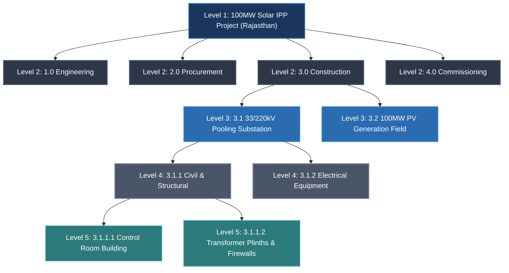
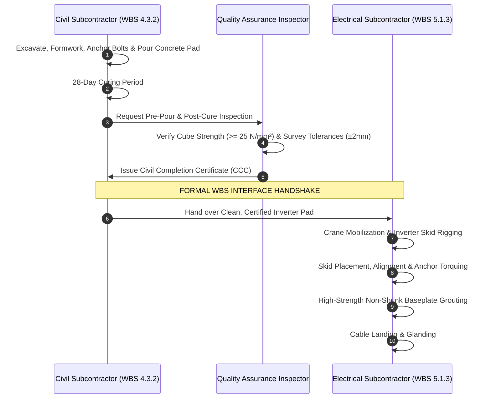

# Topic 2.1: Work Breakdown Structure (WBS) Fundamentals

---

## 1. Executive Summary & The Core Axiom of WBS

### 1.1 What is a Work Breakdown Structure?
In project portfolio management and industrial engineering, the **Work Breakdown Structure (WBS)** is the foundational, hierarchical decomposition of the total scope of work to be carried out by the project team to accomplish the project objectives and create the required deliverables.

According to the **PMI Practice Standard for WBS (3rd Edition)** and **ISO 21511 (Work breakdown structures for project, programme and portfolio management)**:
> *"A WBS is a deliverable-oriented hierarchical decomposition of the total scope of work to be executed by the project team to accomplish the project objectives and create the required deliverables. Each descending level represents an increasingly detailed definition of the project work."*

In enterprise scheduling engines such as **Oracle Primavera P6**, the WBS is not merely a reporting outline or a cosmetic tree. It is the **computational backbone** upon which:
1. **Critical Path Method (CPM)** schedules roll up early and late dates.
2. **Earned Value Management (EVM)** synthesizes Planned Value ($PV$), Earned Value ($EV$), and Actual Cost ($AC$).
3. **Organizational Breakdown Structure (OBS)** attaches management accountability and enforces multi-tenant Role-Based Access Control (RBAC).
4. **Baseline Change Control** establishes audit boundaries for scope additions, deletions, and variances.

```
┌────────────────────────────────────────────────────────────────────────────────────────┐
│                          THE WBS ENTERPRISE SPINE IN PRIMAVERA P6                      │
├────────────────────────────────────────────────────────────────────────────────────────┤
│                                                                                        │
│                          EPS (Enterprise Project Structure)                            │
│                                           │                                            │
│                                           ▼                                            │
│                                   Project Definition                                   │
│                                           │                                            │
│                    ┌──────────────────────┴──────────────────────┐                     │
│                    ▼                                             ▼                     │
│       OBS (Organizational Authority)               WBS (Scope Decomposition)           │
│       "Who is Accountable?"                        "What Deliverables are Produced?"   │
│             │                                                    │                     │
│             └─────────────────── Responsible ────────────────────┘                     │
│                                   Manager Nexus                                        │
│                                         │                                              │
│                                         ▼                                              │
│                               Work Packages (Terminal WBS)                             │
│                                         │                                              │
│                        ┌────────────────┴────────────────┐                             │
│                        ▼                                 ▼                             │
│               Activities (CPM Tasks)            Cost Accounts (CBS)                    │
│               "How is work performed?"          "Where is capital booked?"             │
│                                                                                        │
└────────────────────────────────────────────────────────────────────────────────────────┘
```

---

### 1.2 The "Folder vs. File" Paradigm: WBS Nodes vs. Activities
The single most prevalent conceptual mistake made by software developers transitioning from agile task boards (e.g., Jira, Trello, Linear) to capital project scheduling engines (e.g., Primavera P6, Asta Powerproject, Safran) is **conflating WBS nodes with Activities**.

In Primavera P6, there is an absolute architectural distinction:
* **WBS Nodes are "Folders" (Summary Containers):**
  * A WBS node represents a **deliverable or scope container**.
  * A WBS node **does not have its own assigned duration**, **does not have a calendar**, and **cannot have labor or equipment resources assigned directly to it**.
  * Its dates (Early Start, Early Finish, Late Start, Late Finish) and costs are **pure mathematical rollups** dynamically computed from the leaf activities that reside within its subtree.
  * You **cannot draw CPM logic relationships (Predecessors / Successors)** directly between two WBS parent nodes.
* **Activities are "Files" (Work Execution Entities):**
  * An Activity represents the **work executed** to produce the deliverable of its parent WBS element.
  * An Activity has a discrete duration, an assigned working calendar (e.g., 6-day workweek, 10 hours/day, monsoon holiday calendar), assigned resources (labor, machinery, materials), and expenses.
  * Activities are the nodes in the Critical Path Method (CPM) directed acyclic graph (DAG) linked by dependencies ($FS, SS, FF, SF$).

```
📁 WBS Level 1: 3.0 Construction & Installation (FOLDER: Dates = Min(Start) to Max(Finish))
│
└── 📁 WBS Level 2: 3.2 33/220kV Pooling Substation (FOLDER: Cost = Sum of child activities)
    │
    └── 📁 WBS Level 3 (Work Package): 3.2.1 Main Power Transformer (MPT-01) Foundations
        │
        ├── 📄 Activity ACT-101: Excavate MPT-01 Pit (FILE: Dur=4d, Cal=Std, Res=Excavator)
        │       │ (Finish-to-Start link)
        │       ▼
        ├── 📄 Activity ACT-102: Formwork & Rebar Binding (FILE: Dur=6d, Res=Steel Fixer)
        │       │ (Finish-to-Start link)
        │       ▼
        └── 📄 Activity ACT-103: Pour M40 Grade Concrete (FILE: Dur=2d, Res=RMC Batch Plant)
```

#### Why Mixing WBS Nodes and Activities Breaks the Scheduling Engine
If a software engineer allows a WBS node to have its own direct duration or dependencies, the scheduling calculation engine suffers severe mathematical contradictions:
1. **Circular Dependency Loops:** If WBS Node $A$ has a Finish-to-Start link to WBS Node $B$, but an Activity inside Node $B$ has a dependency pointing back to an Activity in Node $A$, the CPM forward/backward pass algorithm enters an unresolvable infinite cycle or deadlocks.
2. **Double-Counting in Rollups:** If a WBS node stores both its own independent planned cost and aggregates the costs of its child activities, any portfolio-level rollup will double-count capital expenditure.
3. **Calendar Conflicts:** If WBS Node $A$ is assigned a 5-day calendar while Activity $A_1$ uses a 7-day continuous concrete-curing calendar, which calendar governs the float calculation? In P6, calendars belong strictly to activities and resources, never to WBS nodes.

#### Definitive Comparison: WBS Node vs. Activity

| Dimension | WBS Node (Summary Element) | Activity (Work Item) |
| :--- | :--- | :--- |
| **Physical Identity** | A scope container / deliverable noun | A measurable work package task / verb-noun pair |
| **Duration Origin** | Derived: $\min(\text{EarlyStart}_{\text{children}})$ to $\max(\text{EarlyFinish}_{\text{children}})$ | Discrete input: Planned Duration in hours/days |
| **Resource Assignment** | Strictly forbidden (Allocated to activities) | Allowed: Labor, Non-Labor (Equipment), Material |
| **CPM Logic (Predecessors/Successors)**| Strictly forbidden in standard CPM | Mandatory: Network ties ($FS, SS, FF, SF$) |
| **Calendar Binding** | None (Derived envelope) | Bound to Project/Global Calendar |
| **Responsible Manager (OBS)** | Assigned at WBS level (inheritable) | Inherited from parent WBS node |
| **Percent Complete** | Rolled up via Earned Value or Activity Units | Input via physical, duration, or unit % complete |
| **Database Identity** | `PROJWBS` table (Hierarchical tree) | `TASK` table (Flat record referencing `proj_wbs_id`)|

---

## 2. Deliverables-Oriented vs. Phase-Oriented WBS (and the EPC Hybrid Model)

A perennial debate in project controls engineering is whether a WBS should be structured around **Deliverables (Products)** or **Phases (Processes)**.

### 2.1 Deliverable-Oriented WBS (Product Breakdown Structure)
A **Deliverable-Oriented WBS** decomposes the project based on the physical, tangible items or digital assets to be manufactured, erected, or handed over.
* **Linguistic Rule:** Deliverable nodes must always be **Nouns** (e.g., *"33kV Transmission Line"*, *"Central Inverter Skid 01"*, *"Civil Foundations"*).
* **Guiding Principle:** Focus on *what* is being built rather than *how* or *when* it is being executed.

```
📁 100MW Solar IPP Project
├── 📁 PV Generation Array (Blocks 1-20)
│   ├── 📁 Tracker Structures & Modules
│   └── 📁 DC Combiner System
├── 📁 Inverter Stations (10 x 10MW Units)
└── 📁 220kV Pooling Substation
    ├── 📁 Main Power Transformers
    └── 📁 High Voltage Switchyard
```

### 2.2 Phase-Oriented WBS (Life-Cycle / Process Breakdown)
A **Phase-Oriented WBS** decomposes the project chronologically according to the major project life-cycle stages.
* **Linguistic Rule:** Phase nodes are often **Process Nouns or Verbs** (e.g., *"Design & Engineering"*, *"Procurement"*, *"Construction"*, *"Testing & Commissioning"*).
* **Guiding Principle:** Group work by stage gates and contracts.

```
📁 100MW Solar IPP Project
├── 📁 1.0 Engineering & Design
├── 📁 2.0 Procurement & Supply Chain
├── 📁 3.0 Construction & Civil Works
└── 📁 4.0 Testing & Grid Synchronization
```

---

### 2.3 The Industry Standard: The Hybrid WBS in EPC Mega-Projects
In real-world Engineering, Procurement, and Construction (EPC) mega-projects—such as utility-scale power plants, petrochemical refineries, and infrastructure rail lines—neither a pure deliverable nor a pure phase approach suffices on its own.

Instead, the global construction industry (supported by the Construction Industry Institute, CII, and AACE International Recommended Practice 10S-90) utilizes a **Hybrid Multi-Tier WBS Structure**:
* **Level 1 (Project Level):** Entire Project Scope.
* **Level 2 (Life-Cycle Phase):** Major commercial and contractual stages (Engineering, Procurement, Construction, Commissioning). This aligns with EPC contract milestone billing and organizational departments.
* **Level 3 (Facility / Geographic Zone / System):** Physical deliverables and plant breakdown (e.g., Solar Array Zone A, Inverter Stations, 33/220kV Substation).
* **Level 4 (Discipline / Sub-System):** Engineering discipline (Civil, Structural, Electrical, Instrumentation, SCADA).
* **Level 5 (Work Package - Terminal WBS Node):** A discrete scope of work handed off to a single subcontractor or execution crew, under which 5 to 30 individual activities are scheduled.



---

### 2.4 Trade-Off Matrix: Deliverable vs. Phase vs. Hybrid

| Evaluation Criteria | Pure Deliverable WBS | Pure Phase WBS | EPC Hybrid WBS (Recommended) |
| :--- | :--- | :--- | :--- |
| **Earned Value Management (EVM)** | **Excellent:** Cost and progress map directly to assets. | **Poor:** Engineering progress is separated from construction progress of the same asset. | **Outstanding:** Supports EVM rollups by phase or by physical asset. |
| **Subcontractor Packaging** | **Moderate:** Subcontractors frequently cross deliverables (e.g., civil contractor works on all buildings). | **Good:** Separates procurement and construction contracts cleanly. | **Optimal:** Matches contract boundaries at Levels 2 & 4 while preserving asset identity at Level 3. |
| **Commissioning & Handover**| **High:** Systems can be checked off asset by asset. | **Low:** System boundary definitions become fragmented across phases. | **High:** Commissioning phase at L2 directly cross-references systems at L3. |
| **Engineering Schedule Integration**| **Challenging:** Engineering deliverables are scattered across 50 product branches. | **Easy:** All engineering drawings grouped under one engineering branch. | **Seamless:** Dedicated Engineering branch at L2 decomposed by discipline at L3/L4. |

---

## 3. The 100% Rule & The MECE Principle

The **100% Rule** is the universal governing law of Work Breakdown Structure construction.

### 3.1 Mathematical Formulation of the 100% Rule
The 100% Rule states that **the WBS includes 100% of the work defined by the project scope and captures all deliverables—internal, external, and interim—in terms of the work to be completed, including project management.**

Formally, let the scope of the parent node $P$ be denoted as $\mathcal{S}(P)$. Let the children of $P$ be denoted as the set $\{C_1, C_2, \dots, C_n\}$.

The decomposition is valid if and only if two conditions are met simultaneously:

#### Condition 1: Collective Exhaustiveness (Completeness)
$$\mathcal{S}(P) = \bigcup_{i=1}^{n} \mathcal{S}(C_i)$$
The union of the scopes of all child nodes must completely cover the entire scope of the parent node. There can be no "hidden work" or "unassigned scope" outside the children.

#### Condition 2: Mutual Exclusivity (No Overlap)
$$\forall j, k \in \{1, \dots, n\} \text{ where } j \neq k: \quad \mathcal{S}(C_j) \cap \mathcal{S}(C_k) = \emptyset$$
No two child nodes may share or duplicate any portion of the parent scope.

Together, these two conditions constitute the **MECE Principle** (**M**utually **E**xclusive, **C**ollectively **E**xhaustive).

$$\begin{aligned}
\text{Total Budget}(P) &= \sum_{i=1}^{n} \text{Total Budget}(C_i) \\
\text{Planned Labor Hours}(P) &= \sum_{i=1}^{n} \text{Planned Labor Hours}(C_i)
\end{aligned}$$

---

### 3.2 Failure Modes of Violating the 100% Rule

```
                      VIOLATING THE 100% RULE
  ┌───────────────────────────────┬───────────────────────────────┐
  │   UNDER 100% (< 100% Scope)   │   OVER 100% (> 100% Scope)    │
  │     SCOPE GAPS & BLIND SPOTS  │     SCOPE OVERLAP & DUPLICATION│
  ├───────────────────────────────┼───────────────────────────────┤
  │ ❌ Missing integration work   │ ❌ Double-counting budgets    │
  │ ❌ Unassigned tie-ins         │ ❌ Contractor boundary claims │
  │ ❌ Unfunded statutory tests   │ ❌ Distorted Earned Value     │
  │ ❌ Massive cost overruns      │ ❌ Double progress booking    │
  └───────────────────────────────┴───────────────────────────────┘
```

#### Failure Mode A: The < 100% Trap (Scope Gaps)
When a WBS accounts for only 85% of the real work, the missing 15% consists of "orphan" tasks that nobody budgeted or scheduled:
* **Real-World EPC Disaster:** In our 100MW Solar plant, the civil team planned the inverter foundations, and the electrical team planned the inverter skids. However, neither branch included the **foundation grouting, anchor bolt torque verification, and earth pit grid bonding**. When the electrical contractor arrived on site, they refused to land the skids until the civil contractor verified the anchor bolt alignment. The resulting 4-week standoff incurred ₹12,000,000 in site idle-time claims and delay liquidated damages.

#### Failure Mode B: The > 100% Trap (Scope Overlap)
When two WBS branches overlap (e.g., *WBS 3.2.1: Inverter Civil Foundation* and *WBS 3.4.1: Site-Wide Earthworks & Trenching* both contain excavation activities for the inverter pad):
* **Earned Value Distortion:** The project books progress twice for the same cubic meters of earth moved. The Schedule Performance Index ($SPI$) artificially indicates the project is ahead of schedule, masking critical path delays.
* **Commercial Fraud Risk:** Both the civil subcontractor and the general site contractor submit payment applications for the same physical quantity of work.

---

### 3.3 Decomposition Rules: When to Stop Decomposing?

A common failure mode for junior project controls engineers is decomposing the WBS too deep (down to daily worker chores) or stopping too high (leaving vast, unmeasurable blocks of work).

#### The 8/80 Rule (Heuristic for Software / Manufacturing)
In agile IT or manufacturing environments, the **8/80 Rule** states that no work package should contain less than 8 hours (1 person-day) or more than 80 hours (2 person-weeks) of labor effort.

#### Why the 8/80 Rule FAILS in Heavy EPC Projects
In a $100M capital expenditure project:
1. Decomposing a 3-year project into 80-hour work packages results in **over 35,000 WBS nodes**, crippling scheduling software, overwhelming database performance, and paralyzing project managers with administrative micro-management.
2. In EPC, the terminal WBS node is the **Work Package**, which encompasses multiple activities spanning **2 to 8 weeks** of continuous site operations.

#### The Work Package Boundary Rules in EPC Mega-Projects
In heavy civil and industrial projects, you stop decomposing the WBS when an element satisfies the **Four Boundary Criteria**:

1. **Single Point of Organizational Accountability:** The work package can be assigned to exactly **one OBS Responsible Manager** (one Package Lead or Subcontractor PM).
2. **Measurable Deliverable / Physical Quantity:** The work package yields a definitive physical output measurable by units of work (e.g., "1,200 metric tons of steel erected", "45,000 linear meters of DC cable pulled").
3. **Discrete Financial & Cost Account Boundary:** The scope maps directly to a single **Cost Breakdown Structure (CBS)** cost account or purchase order code for invoice verification.
4. **Independent Temporal Window:** The package can be scheduled as a self-contained group of CPM activities with clear network handoffs (predecessors and successors) to other packages.

---

## 4. Real-World Case Study: 100MW Solar IPP Project (Rajasthan, India)

To anchor our architectural analysis, we examine a real-world utility-scale infrastructure asset: a **100MW AC / 140MWp DC Grid-Connected Solar Photovoltaic Independent Power Producer (IPP) Project** located in the Thar Desert region of Bhadla, Rajasthan, India.

```
PROJECT SPECIFICATIONS:
- Capacity: 100 MW AC / 140 MWp DC (DC/AC Overload Ratio: 1.40)
- Land Area: 500 Acres (Arid desert terrain, shifting dunes, extreme heat > 48°C)
- PV Modules: 260,000 Monocrystalline Bifacial Modules (540 Wp each)
- Mounting Structure: Single-Axis Horizontal Trackers (Civil ramming piles)
- Inverter Stations: 30 x 3.33 MVA Central Inverter Stations (Transformer + Inverter skid)
- Evacuation Infrastructure: 33kV Underground DC/AC Network, 33/220kV Pooling Substation,
  15km 220kV Double-Circuit Transmission Line to STU Gantry.
```

---

### 4.1 Complete Level 1 to Level 4 WBS Hierarchy

```
100MW-RAJ : 100MW Solar IPP Project (Rajasthan, India)
│
├── 1.0 : Pre-Construction, Statutory Clearances & Permitting
│   ├── 1.1 : Land Acquisition & Right-of-Way (ROW)
│   │   ├── 1.1.1 : 500-Acre Land Title Verification & Demarcation
│   │   └── 1.1.2 : 15km Transmission Line Corridor ROW Clearances
│   ├── 1.2 : Environmental, Defense & Forest Approvals
│   │   ├── 1.2.1 : State Pollution Control Board Consent to Establish (CTE)
│   │   └── 1.2.2 : Great Indian Bustard (GIB) Wildlife Corridor Compliance Review
│   └── 1.3 : Grid Interconnection & Power Evacuation Approvals
│       ├── 1.3.1 : STU Grid Connectivity Formal Approval
│       └── 1.3.2 : CEIG (Chief Electrical Inspector to Govt) Drawing Approvals
│
├── 2.0 : Detailed Engineering & System Design
│   ├── 2.1 : Civil & Geotechnical Engineering
│   │   ├── 2.1.1 : Soil Investigation, Resistivity & Hydrology Studies
│   │   ├── 2.1.2 : Solar Tracker Pile Foundation Design & Load Calculations
│   │   └── 2.1.3 : Substation Building & Transformer Plinth Structural Design
│   ├── 2.2 : Electrical Balance of Plant (E-BOP) Design
│   │   ├── 2.2.1 : PV Syst Generation Modeling & DC String Optimization
│   │   ├── 2.2.2 : 33kV Underground Cable Sizing & Loss Calculations
│   │   └── 2.2.3 : Plant Protection, Grounding & Lightning Risk Modeling
│   └── 2.3 : Substation & Transmission Line Engineering
│       ├── 2.3.1 : 33/220kV Pooling Substation Single Line Diagram (SLD) & Layout
│       ├── 2.3.2 : Substation Automation System (SAS) & SCADA Architecture
│       └── 2.3.3 : 220kV Transmission Tower Structural & Sag-Tension Design
│
├── 3.0 : Procurement & Manufacturing Supply
│   ├── 3.1 : Major Equipment Supply (Free-Issue / Owner Scope)
│   │   ├── 3.1.1 : Tier-1 540Wp Bifacial PV Modules (260,000 Units)
│   │   ├── 3.1.2 : 3.33 MVA Outdoor Central Inverter Skids (30 Units)
│   │   └── 3.1.3 : 100 MVA 33/220kV Power Transformers (2 Units)
│   ├── 3.2 : Balance of System (BOS) Mechanical Supply
│   │   ├── 3.2.1 : Single-Axis Tracker Structural Steel Framing & Torque Tubes
│   │   └── 3.2.2 : Galvanized Steel Piles (Cold-Rolled C-Channels)
│   └── 3.3 : Balance of System (BOS) Electrical Supply
│       ├── 3.3.1 : 1.5kV DC Solar PV Cables & String Combiner Connectors
│       ├── 3.3.2 : 33kV XLPE Armored Power Cables
│       └── 3.3.3 : 220kV AIS Switchyard Equipment (CBs, CTs, VTs, Isolators)
│
├── 4.0 : Civil & Structural Construction
│   ├── 4.1 : Site Development, Boundary & Earthworks
│   │   ├── 4.1.1 : Perimeter Security Fencing, Main Gate & Watchtowers
│   │   ├── 4.1.2 : Site Clearing, Topographical Grading & Dune Stabilization
│   │   └── 4.1.3 : Internal Access Roads (Heavy Haulage) & Storm Water Drains
│   ├── 4.2 : Tracker Foundations & Mechanical Assembly
│   │   ├── 4.2.1 : Tracker Pile Ramming & Pull-Out / Lateral Load Testing
│   │   ├── 4.2.2 : Tracker Torque Tube, Bearing & Drive Assembly Installation
│   │   └── 4.2.3 : PV Module Mounting & Fastener Torque Auditing
│   └── 4.3 : Buildings & Heavy Equipment Civil Works
│   │   ├── 4.3.1 : Main Control Room (MCR) Civil Construction & Finishes
│   │   └── 4.3.2 : Inverter Station Civil Foundation Pads (30 Locations)
│
├── 5.0 : Electrical & Instrumentation Installation
│   ├── 5.1 : DC Electrical Installation
│   │   ├── 5.1.1 : DC String Cabling, Connector Crimping & Array Harnessing
│   │   ├── 5.1.2 : String Combiner Box (SCB) Installation & Field Termination
│   │   └── 5.1.3 : Inverter Skid Positioning, Leveling & DC Cable Landing
│   ├── 5.2 : AC Collection System (33kV)
│   │   ├── 5.2.1 : 33kV Cable Trenching, Sand Cushioning & Warning Tape Laying
│   │   ├── 5.2.2 : 33kV Cable Pulling, Jointing & Heat-Shrink Terminations
│   │   └── 5.2.3 : 33kV Ring Main Units (RMU) & Inverter Breaker Terminations
│   └── 5.3 : Earthing, Plant SCADA & Instrumentation
│       ├── 5.3.1 : Deep Chemical Earth Pits & Grounding Grid Mesh Bonding
│       ├── 5.3.2 : Plant SCADA Fiber Optic Backbone Trenching & Splicing
│       └── 5.3.3 : Weather Monitoring Stations (Pyranometers, Wind, Temp Sensors)
│
├── 6.0 : 33/220kV Substation & 15km Transmission Line
│   ├── 6.1 : Substation Construction & Switchyard Erection
│   │   ├── 6.1.1 : 100 MVA Transformer Plinths, Oil Soak Pit & Blast Walls
│   │   ├── 6.1.2 : 220kV Gantry Towers & Busbar Stringing
│   │   └── 6.1.3 : Control & Relay Panels (CRP) Erection & Multi-Core Wiring
│   └── 6.2 : 15km 220kV Transmission Line Erection
│       ├── 6.2.1 : Transmission Tower Foundations (Stub Setting & Concreting)
│       ├── 6.2.2 : Transmission Tower Structural Steel Erection
│       └── 6.2.3 : Conductor Stringing, Earthwire/OPGW Pulling & Sagging
│
└── 7.0 : Pre-Commissioning, Testing & Commercial Synchronization
    ├── 7.1 : Cold Commissioning & Subsystem Testing
    │   ├── 7.1.1 : DC Open Circuit Voltage ($V_{oc}$) & Short Circuit Current ($I_{sc}$) Testing
    │   ├── 7.1.2 : 33kV Cable High-Potential (Hi-Pot) & VLF Testing
    │   └── 7.1.3 : Transformer Oil Dielectric Breakdown & Ratio Testing
    ├── 7.2 : Statutory Inspections & Safety Clearances
    │   ├── 7.2.1 : CEIG Factory & Site Physical Inspection Clearance
    │   └── 7.2.2 : STU Protection Coordination & Islanding Scheme Clearance
    └── 7.3 : Hot Commissioning & Grid Synchronization
        ├── 7.3.1 : 220kV Transmission Line Charging & Substation Back-Energization
        ├── 7.3.2 : Inverter Station Phased Synchronization & Inverted Power Run
        └── 7.3.3 : 72-Hour Continuous Full-Load Performance Ratio (PR) Trial Run
```

---

### 4.2 Boundary Definitions: The Interface Handshake
In capital projects, the most critical risk areas are the **interfaces** between different functional disciplines and subcontractors. A world-class WBS defines unambiguous boundary rules between adjacent branches.

#### The Civil vs. Electrical Handshake: Inverter Station Example
Consider the physical creation of **Inverter Station 01**:
* **Civil Scope (`WBS 4.3.2`):**
  * Sub-grade compaction and Proctor density test $\ge 95\%$.
  * Concrete formwork, rebar tying, and embedded anchor bolt sleeve casting.
  * Pouring M25 grade concrete pad, 28-day water curing.
  * **Handoff Condition:** Rebar testing complete, cube compressive test report certified $\ge 25 \text{ N/mm}^2$, pad surface level verified within $\pm 2\text{mm}$, anchor bolts greased and capped.
* **Electrical Scope (`WBS 5.1.3`):**
  * Mobilize 50-ton mobile crane.
  * Rig and hoist 3.33 MVA Inverter Skid from transport trailer onto civil pad.
  * Align skid baseplate over cast-in anchor bolts, torque nuts to manufacturer spec ($180 \text{ N}\cdot\text{m}$).
  * Non-shrink cementitious grouting beneath baseplate.
  * Land DC and AC cables into bottom gland plates.



---

### 4.3 WBS Dictionary
A WBS is incomplete without a **WBS Dictionary**. The WBS Dictionary is the formal companion specification that defines the exact scope, deliverable criteria, milestones, cost account codes, and assumptions for every work package.

#### Representative WBS Dictionary Entry: `WBS 4.2.1`

```markdown
================================================================================
                        WBS DICTIONARY SPECIFICATION
================================================================================
WBS Code:           4.2.1
WBS Name:           Tracker Pile Ramming & Pull-Out Testing
Parent WBS:         4.2 Tracker Foundations & Mechanical Assembly
Project Code:       100MW-RAJ (Thar 100MW Solar IPP)
Responsible Mgr:    Civil Package Lead (OBS: Apex.Solar.SiteOps.Civil)
Cost Account (CBS): CA-CIVIL-PILE-0421
Contract Reference: Schedule B-3: Mechanical Installation Subcontract

1. WORK PACKAGE SCOPE DESCRIPTION:
   Execution of direct hydraulic pile ramming for hot-dip galvanized C-channel 
   steel posts across Array Blocks 01 through 20 (Total count: 48,000 piles).
   Includes pre-survey topographical stake-out, initial pilot hole pre-drilling 
   in hard caliche / rocky strata where penetration resistance exceeds refusal, 
   and plumb alignment monitoring.

2. DELIVERABLES PRODUCED:
   - 48,000 rammed structural tracker posts driven to minimum refusal depth (2.1m).
   - Survey as-built coordinates (X, Y, Z coordinates within ±10mm tolerance).
   - 100 formal geotechnical pull-out (uplift), lateral, and compression load test 
     certificates witnessed and stamped by Third-Party Quality Agency (TUV/DNV).

3. EXCLUSIONS & INTERFACES (OUT OF SCOPE):
   - Structural steel torque tube assembly and motor drive mounting (Belongs to WBS 4.2.2).
   - Supply and freight of steel piles to site warehouse (Belongs to WBS 3.2.2).
   - Grading and topsoil dune stabilization of array blocks (Belongs to WBS 4.1.2).

4. ACCEPTANCE CRITERIA:
   - Verticality deviation < 1.0 degree verified by digital inclinometer.
   - Top-of-pile elevation within ±5mm to ensure tracker drive shaft linearity.
   - Zero structural distortion or zinc galvanization flaking during ramming.

5. KEY MILESTONES:
   - MS-01: First 5,000 Piles Driven & Pilot Uplift Tests Accepted (Day 45)
   - MS-02: 50% Array Piling Complete (24,000 Piles) (Day 90)
   - MS-03: Final Array Block Piling Handover to Mechanical Framing (Day 135)
================================================================================
```

---

## 5. Common Industry Anti-Patterns & Pitfalls

### 5.1 Anti-Pattern 1: The "Org Chart" WBS (Confusing OBS with WBS)
* **The Mistake:** Structuring the top levels of the WBS according to contractors, vendors, or internal corporate departments:
  ```
  ❌ BAD WBS (OBS-Based):
  ├── L&T Construction Scope
  ├── Sterling & Wilson Scope
  ├── Siemens Subcontract
  └── Corporate Procurement Team
  ```
* **Why It Destroys the Project:**
  1. **Contractual Instability:** If L&T default or their scope is de-scoped and re-tendered to Tata Power, the entire WBS tree becomes invalid, destroying historical baseline comparisons.
  2. **Violates MECE:** Two contractors frequently perform work on the same physical facility (e.g., one pours the concrete, one lays the roof). Costs cannot be rolled up to an asset.
* **The Fix:** Model the physical deliverables in the WBS. Assign the organizational entities as the **Responsible Manager (OBS)** or **Vendor Resource** attached to the WBS node.

---

### 5.2 Anti-Pattern 2: The "Timeline / Gantt" WBS (Chronological WBS)
* **The Mistake:** Decomposing WBS nodes by time buckets, months, or quarters:
  ```
  ❌ BAD WBS (Timeline-Based):
  ├── Quarter 1 Deliverables (Jan - Mar)
  ├── Quarter 2 Deliverables (Apr - Jun)
  └── Quarter 3 Deliverables (Jul - Sep)
  ```
* **Why It Destroys the Project:**
  1. **Temporal Decay:** If an activity scheduled for Q1 slips by 45 days, it now executes in Q2. Does it remain under the "Quarter 1" WBS node? If it moves to Q2, historical baselines and earned value earned against Q1 are retroactively corrupted.
  2. **Total Meaninglessness:** "Quarter 1" is not a deliverable. You cannot test, inspect, or hand over "Quarter 1" to an owner.
* **The Fix:** The WBS captures *what* is built. The CPM schedule network logic ($FS$ relationships, leads, lags) captures *when* it is built.

---

### 5.3 Anti-Pattern 3: The "Infinite Hierarchy" Trap (Decomposition Paralysis)
* **The Mistake:** Decomposing down to 8 to 12 levels of WBS, creating nodes for microscopic chores:
  ```
  ❌ BAD WBS (Microscopic):
  100MW Solar > Civil > Array > Block 1 > Row 4 > Tracker 12 > Post 3 > Hole 2 > Dig Hole
  ```
* **Why It Destroys the Project:**
  1. **System Latency:** Database queries for tree rollup become orders of magnitude slower.
  2. **Planner Burnout:** Updating actual progress across 80,000 WBS nodes requires full-time administrative data entry rather than forward-looking delay mitigation and critical path optimization.
* **The Fix:** Stop decomposition at Level 4 or 5 (the Work Package). Let the CPM activities handle the individual work steps.

---

### 5.4 Anti-Pattern 4: The "Dangling Scope" Trap (WBS Nodes Without Work Packages or Activities)
* **The Mistake:** Leaving intermediate summary WBS nodes with no activities, or creating an uneven hierarchy where activities are attached directly to Level 2 while sibling branches decompose to Level 5.
* **Why It Destroys the Project:**
  1. P6 rollup engines report distorted summary percentages when parent nodes contain a mixture of direct activities and child summary containers.
* **The Fix:** In strict P6 engineering practice, **activities must only be attached to leaf (terminal) WBS nodes**. Intermediate summary nodes must contain only child WBS nodes.

---

## 6. Software Engineering & Data Modeling (Golang + Next.js)

When designing a production-grade, enterprise scheduling engine capable of handling 100,000+ activities and multi-tiered WBS trees, software engineers must make critical database, algorithmic, and API design choices.

---

### 6.1 PostgreSQL Database Modeling: Tree Storage Strategies

Representing trees in relational databases involves classic trade-offs between read latency, write latency, referential integrity, and query complexity.

```
┌────────────────────────────────────────────────────────────────────────────────────────┐
│                        COMPARATIVE TREE STORAGE MODELS IN POSTGRESQL                   │
├────────────────────────────────────────────────────────────────────────────────────────┤
│                                                                                        │
│  1. ADJACENCY LIST (parent_id)                                                         │
│     * Writes: O(1) [Blazing fast single-row insert/update]                             │
│     * Reads: O(D) [Requires Recursive CTEs, high cost on deep trees]                   │
│                                                                                        │
│  2. NESTED SETS (lft, rgt integers)                                                    │
│     * Writes: O(N) [Catastrophic: updating one node renumbers entire table]            │
│     * Reads: O(1) [Range query WHERE lft BETWEEN parent.lft AND parent.rgt]            │
│                                                                                        │
│  3. MATERIALIZED PATH (PostgreSQL ltree extension)                                     │
│     * Writes: O(K) [Update path string for node and its descendants]                   │
│     * Reads: O(log N) [GIST / BTREE indexed path operators, e.g. path <@ '1.3']        │
│     * Industry Standard for Enterprise Scheduling Systems                              │
│                                                                                        │
└────────────────────────────────────────────────────────────────────────────────────────┘
```

#### Production PostgreSQL Schema Using `ltree`

```sql
-- Enable PostgreSQL ltree extension for hierarchical indexing
CREATE EXTENSION IF NOT EXISTS ltree;

-- 1. Projects Table
CREATE TABLE projects (
    id UUID PRIMARY KEY DEFAULT gen_random_uuid(),
    code VARCHAR(50) UNIQUE NOT NULL,
    name VARCHAR(255) NOT NULL,
    planned_start_date TIMESTAMPTZ NOT NULL,
    planned_finish_date TIMESTAMPTZ NOT NULL,
    created_at TIMESTAMPTZ DEFAULT CURRENT_TIMESTAMP,
    updated_at TIMESTAMPTZ DEFAULT CURRENT_TIMESTAMP
);

-- 2. OBS Table (Organizational Breakdown Structure)
CREATE TABLE obs_nodes (
    id UUID PRIMARY KEY DEFAULT gen_random_uuid(),
    code VARCHAR(50) UNIQUE NOT NULL,
    name VARCHAR(255) NOT NULL,
    parent_id UUID REFERENCES obs_nodes(id) ON DELETE RESTRICT,
    path ltree NOT NULL
);
CREATE INDEX idx_obs_nodes_path ON obs_nodes USING GIST (path);

-- 3. WBS Nodes Table
CREATE TABLE wbs_nodes (
    id UUID PRIMARY KEY DEFAULT gen_random_uuid(),
    project_id UUID NOT NULL REFERENCES projects(id) ON DELETE CASCADE,
    parent_id UUID REFERENCES wbs_nodes(id) ON DELETE CASCADE,
    code VARCHAR(50) NOT NULL,             -- e.g., '1', '2', '2.1', '2.1.3'
    name VARCHAR(255) NOT NULL,
    path ltree NOT NULL,                   -- Materialized path: e.g. 'root.wbs_1.wbs_21'
    level INT NOT NULL CHECK (level >= 1), -- Root is 1, children are 2, 3...
    sequence_number INT NOT NULL DEFAULT 10,
    responsible_manager_id UUID NOT NULL REFERENCES obs_nodes(id) ON DELETE RESTRICT,
    created_at TIMESTAMPTZ DEFAULT CURRENT_TIMESTAMP,
    updated_at TIMESTAMPTZ DEFAULT CURRENT_TIMESTAMP,
    
    -- Ensure unique code within the same project
    CONSTRAINT uq_project_wbs_code UNIQUE (project_id, code)
);

-- Essential Performance Indexes
CREATE INDEX idx_wbs_project_id ON wbs_nodes(project_id);
CREATE INDEX idx_wbs_parent_id ON wbs_nodes(parent_id);
CREATE INDEX idx_wbs_path_gist ON wbs_nodes USING GIST (path);
CREATE INDEX idx_wbs_path_btree ON wbs_nodes USING BTREE (path);

-- 4. Activities Table (Work Items bound to terminal WBS nodes)
CREATE TABLE activities (
    id UUID PRIMARY KEY DEFAULT gen_random_uuid(),
    project_id UUID NOT NULL REFERENCES projects(id) ON DELETE CASCADE,
    wbs_id UUID NOT NULL REFERENCES wbs_nodes(id) ON DELETE RESTRICT,
    code VARCHAR(50) NOT NULL,
    name VARCHAR(255) NOT NULL,
    planned_duration_hours NUMERIC(10, 2) NOT NULL CHECK (planned_duration_hours >= 0),
    actual_duration_hours NUMERIC(10, 2) DEFAULT 0 CHECK (actual_duration_hours >= 0),
    early_start_date TIMESTAMPTZ,
    early_finish_date TIMESTAMPTZ,
    late_start_date TIMESTAMPTZ,
    late_finish_date TIMESTAMPTZ,
    planned_cost NUMERIC(15, 2) DEFAULT 0.00 CHECK (planned_cost >= 0),
    actual_cost NUMERIC(15, 2) DEFAULT 0.00 CHECK (actual_cost >= 0),
    earned_value_cost NUMERIC(15, 2) DEFAULT 0.00 CHECK (earned_value_cost >= 0),
    status VARCHAR(20) NOT NULL DEFAULT 'NOT_STARTED' 
        CHECK (status IN ('NOT_STARTED', 'IN_PROGRESS', 'COMPLETED')),
    created_at TIMESTAMPTZ DEFAULT CURRENT_TIMESTAMP,
    updated_at TIMESTAMPTZ DEFAULT CURRENT_TIMESTAMP,
    
    CONSTRAINT uq_project_activity_code UNIQUE (project_id, code)
);

CREATE INDEX idx_activities_wbs_id ON activities(wbs_id);
CREATE INDEX idx_activities_project_id ON activities(project_id);
```

#### Recursive Subtree Query Using `ltree`
Fetching an entire WBS branch with all its sub-elements in standard SQL without recursive loops:

```sql
-- Fetch all descendant WBS nodes under '3.0 Construction' (whose path is 'root.wbs_3')
SELECT id, code, name, level, path::text
FROM wbs_nodes
WHERE path <@ 'root.wbs_3'
ORDER BY path;
```

---

### 6.2 Golang Engine Implementation: 100% Rule Validation & Cycle Detection

In our backend scheduling service, we enforce two critical integrity guarantees:
1. **Tree Acyclicity Guarantee:** The WBS graph must never contain cycles (a node cannot be its own ancestor).
2. **100% Cost & Scope Consistency Engine:** The sum of child planned costs must roll up identically to the parent, with zero drift.

#### Golang Domain Models

```go
package wbs

import (
	"errors"
	"fmt"
	"time"
)

// WBSNode represents a domain Work Breakdown Structure summary node.
type WBSNode struct {
	ID                   string     `json:"id"`
	ProjectID            string     `json:"project_id"`
	ParentID             *string    `json:"parent_id"`
	Code                 string     `json:"code"`
	Name                 string     `json:"name"`
	Level                int        `json:"level"`
	Path                 string     `json:"path"`
	ResponsibleManagerID string     `json:"responsible_manager_id"`
	Children             []*WBSNode `json:"children,omitempty"`
	Activities           []Activity `json:"activities,omitempty"`
	
	// Rolled-up metrics (calculated dynamically)
	RolledUpPlannedCost float64    `json:"rolled_up_planned_cost"`
	EarlyStart          *time.Time `json:"early_start,omitempty"`
	EarlyFinish         *time.Time `json:"early_finish,omitempty"`
}

// Activity represents an execution work item.
type Activity struct {
	ID                  string     `json:"id"`
	WBSID               string     `json:"wbs_id"`
	Code                string     `json:"code"`
	Name                string     `json:"name"`
	PlannedDurationDays float64    `json:"planned_duration_days"`
	PlannedCost         float64    `json:"planned_cost"`
	ActualCost          float64    `json:"actual_cost"`
	EarlyStart          *time.Time `json:"early_start"`
	EarlyFinish         *time.Time `json:"early_finish"`
	Status              string     `json:"status"`
}
```

#### Cycle Detection and Acyclicity Verification
Before updating the `parent_id` of a WBS node (e.g., during drag-and-drop reparenting), the engine must verify that the target parent is not already a descendant of the moved node:

```go
// ValidateReparenting ensures that moving nodeID to newParentID will not introduce a cycle.
// nodeMap: fast in-memory lookup of all nodes in the project (nodeID -> *WBSNode).
func ValidateReparenting(nodeID string, newParentID *string, nodeMap map[string]*WBSNode) error {
	if newParentID == nil {
		// Moving to root level is always cycle-safe.
		return nil
	}

	if nodeID == *newParentID {
		return errors.New("cannot make a node its own parent (direct cycle)")
	}

	// Traverse upwards from newParentID to ensure we never hit nodeID
	curr := *newParentID
	visited := make(map[string]bool)

	for {
		if curr == nodeID {
			return fmt.Errorf("cycle detected: node %s is an ancestor of proposed parent %s", nodeID, *newParentID)
		}
		if visited[curr] {
			return fmt.Errorf("existing cycle detected in database at node %s", curr)
		}
		visited[curr] = true

		parentPtr, ok := nodeMap[curr]
		if !ok {
			return fmt.Errorf("parent node %s does not exist in project", curr)
		}

		if parentPtr.ParentID == nil {
			// Successfully reached tree root without encountering nodeID
			break
		}
		curr = *parentPtr.ParentID
	}

	return nil
}
```

#### High-Performance $O(N)$ Tree Builder
Rather than executing repeated recursive database queries, our Go service fetches all flat rows for a project in a single `SELECT` query and constructs the complete nested tree in memory in $O(N)$ time:

```go
// BuildWBSTree transforms a flat slice of WBSNodes into a hierarchical nested AST.
func BuildWBSTree(flatNodes []*WBSNode) ([]*WBSNode, error) {
	nodeMap := make(map[string]*WBSNode, len(flatNodes))
	var roots []*WBSNode

	// Step 1: Index all nodes by ID and initialize empty children slices
	for _, node := range flatNodes {
		node.Children = make([]*WBSNode, 0)
		nodeMap[node.ID] = node
	}

	// Step 2: Assemble parent-child pointers
	for _, node := range flatNodes {
		if node.ParentID == nil {
			roots = append(roots, node)
		} else {
			parent, exists := nodeMap[*node.ParentID]
			if !exists {
				return nil, fmt.Errorf("orphaned node %s: parent %s not found", node.ID, *node.ParentID)
			}
			parent.Children = append(parent.Children, node)
		}
	}

	return roots, nil
}
```

#### Bottom-Up Rollup Calculation Engine
To calculate rolled-up dates and costs according to the 100% Rule:

```go
// RollupMetrics recursively rolls up costs and schedules from leaf activities to tree roots.
func RollupMetrics(node *WBSNode) (float64, *time.Time, *time.Time) {
	var totalCost float64
	var minStart *time.Time
	var maxFinish *time.Time

	// 1. Roll up direct activities if this is a leaf/terminal WBS node
	for _, act := range node.Activities {
		totalCost += act.PlannedCost

		if act.EarlyStart != nil {
			if minStart == nil || act.EarlyStart.Before(*minStart) {
				t := *act.EarlyStart
				minStart = &t
			}
		}
		if act.EarlyFinish != nil {
			if maxFinish == nil || act.EarlyFinish.After(*maxFinish) {
				t := *act.EarlyFinish
				maxFinish = &t
			}
		}
	}

	// 2. Recursively roll up child WBS nodes
	for _, child := range node.Children {
		childCost, childStart, childFinish := RollupMetrics(child)
		totalCost += childCost

		if childStart != nil {
			if minStart == nil || childStart.Before(*minStart) {
				minStart = childStart
			}
		}
		if childFinish != nil {
			if maxFinish == nil || childFinish.After(*maxFinish) {
				maxFinish = childFinish
			}
		}
	}

	node.RolledUpPlannedCost = totalCost
	node.EarlyStart = minStart
	node.EarlyFinish = maxFinish

	return totalCost, minStart, maxFinish
}
```

---

### 6.3 RESTful API Design for Hierarchical WBS Endpoints

#### Endpoint Specifications

| Method | Route | Description |
| :--- | :--- | :--- |
| `GET` | `/api/v1/projects/:projectId/wbs/tree` | Returns the entire hierarchical nested WBS tree with rolled-up metrics. |
| `POST` | `/api/v1/projects/:projectId/wbs` | Creates a new WBS node, automatically updating paths and validating depth. |
| `PATCH`| `/api/v1/projects/:projectId/wbs/:id/move` | Reparents a WBS subtree, verifying acyclicity and updating all descendant `ltree` paths. |
| `DELETE`| `/api/v1/projects/:projectId/wbs/:id` | Deletes a WBS node (fails if node contains linked activities or child nodes). |

#### JSON Response Schema: `GET /api/v1/projects/:projectId/wbs/tree`

```json
{
  "project_id": "9b1deb4d-3b7d-4bad-9bdd-2b0d7b3dcb6d",
  "project_code": "100MW-RAJ",
  "total_budget": 4500000000.00,
  "currency": "INR",
  "tree": [
    {
      "id": "a1b2c3d4-0001-4000-8000-000000000001",
      "code": "4.0",
      "name": "Civil & Structural Construction",
      "level": 2,
      "path": "root.wbs_4",
      "responsible_manager_id": "obs-civil-lead-01",
      "rolled_up_planned_cost": 850000000.00,
      "early_start": "2027-01-15T08:00:00Z",
      "early_finish": "2027-08-30T17:00:00Z",
      "children": [
        {
          "id": "a1b2c3d4-0002-4000-8000-000000000002",
          "code": "4.2",
          "name": "Tracker Foundations & Mechanical Assembly",
          "level": 3,
          "path": "root.wbs_4.wbs_42",
          "responsible_manager_id": "obs-piling-mgr-01",
          "rolled_up_planned_cost": 420000000.00,
          "early_start": "2027-02-01T08:00:00Z",
          "early_finish": "2027-06-15T17:00:00Z",
          "children": [
            {
              "id": "a1b2c3d4-0003-4000-8000-000000000003",
              "code": "4.2.1",
              "name": "Tracker Pile Ramming & Testing",
              "level": 4,
              "path": "root.wbs_4.wbs_42.wbs_421",
              "responsible_manager_id": "obs-piling-mgr-01",
              "rolled_up_planned_cost": 210000000.00,
              "early_start": "2027-02-01T08:00:00Z",
              "early_finish": "2027-04-15T17:00:00Z",
              "children": [],
              "activities_count": 12
            }
          ]
        }
      ]
    }
  ]
}
```

---

### 6.4 Next.js / React Frontend Architecture: High-Performance Tree Grid

In an enterprise web client (Next.js App Router), rendering a hierarchical WBS table containing 2,000+ elements with real-time expand/collapse and drag-and-drop reparenting requires virtualized rendering to prevent DOM bloat and 60fps frame drops.

#### Virtualized WBS Tree Row Component (TypeScript / React)

```tsx
import React, { useState } from 'react';
import { ChevronRight, ChevronDown, Folder, FileText } from 'lucide-react';

export interface WBSNodeView {
  id: string;
  code: string;
  name: string;
  level: number;
  rolledUpPlannedCost: number;
  earlyStart?: string;
  earlyFinish?: string;
  childrenCount: number;
  isExpanded?: boolean;
}

interface WBSTreeRowProps {
  node: WBSNodeView;
  onToggleExpand: (nodeId: string) => void;
  onSelectNode: (nodeId: string) => void;
  currencyFormatter: Intl.NumberFormat;
}

export const WBSTreeRow: React.FC<WBSTreeRowProps> = ({
  node,
  onToggleExpand,
  onSelectNode,
  currencyFormatter,
}) => {
  const indentPadding = (node.level - 1) * 24; // 24px per hierarchy depth level
  const hasChildren = node.childrenCount > 0;

  return (
    <div
      onClick={() => onSelectNode(node.id)}
      className="flex items-center h-10 border-b border-slate-800 hover:bg-slate-800/50 cursor-pointer font-mono text-sm transition-colors"
      style={{ paddingLeft: `${indentPadding}px` }}
    >
      {/* Expand/Collapse Toggle Button */}
      <button
        onClick={(e) => {
          e.stopPropagation();
          if (hasChildren) onToggleExpand(node.id);
        }}
        className={`w-6 h-6 flex items-center justify-center mr-1 text-slate-400 hover:text-white ${
          !hasChildren ? 'opacity-0 cursor-default' : ''
        }`}
        aria-label={node.isExpanded ? 'Collapse node' : 'Expand node'}
      >
        {node.isExpanded ? <ChevronDown size={16} /> : <ChevronRight size={16} />}
      </button>

      {/* Node Folder Icon */}
      <span className="mr-2 text-amber-500">
        <Folder size={16} className="fill-amber-500/20" />
      </span>

      {/* WBS Code & Name */}
      <div className="flex-1 flex items-center gap-3 truncate">
        <span className="font-semibold text-blue-400 min-w-[70px]">{node.code}</span>
        <span className="text-slate-200 truncate">{node.name}</span>
      </div>

      {/* Rolled-up Start & Finish Dates */}
      <div className="w-32 text-right text-xs text-slate-400 pr-4">
        {node.earlyStart ? new Date(node.earlyStart).toLocaleDateString() : '—'}
      </div>
      <div className="w-32 text-right text-xs text-slate-400 pr-4">
        {node.earlyFinish ? new Date(node.earlyFinish).toLocaleDateString() : '—'}
      </div>

      {/* Rolled-up Budget Cost */}
      <div className="w-40 text-right font-medium text-emerald-400 pr-6">
        {currencyFormatter.format(node.rolledUpPlannedCost)}
      </div>
    </div>
  );
};
```

---

## 7. Summary & Key Takeaways

1. **The Core Axiom:** The WBS is a **deliverable-oriented hierarchical summary container**. WBS nodes are "Folders" (derived dates and costs); Activities are "Files" (work items with durations, logic, and resources). Never mix them.
2. **The Hybrid Structure:** Capital EPC mega-projects achieve optimal governance by combining **Phases at Level 2** (Engineering, Procurement, Construction, Commissioning) with **Deliverables/Facilities at Level 3** and **Work Packages at Level 4/5**.
3. **The 100% Rule is Sacred:** Every parent node must equal the exact sum of its children ($MECE$). Gaps ($<100\%$) lead to unbudgeted scope claims; overlaps ($>100\%$) cause double-counting and commercial disputes.
4. **Decomposition Boundaries:** Never decompose by organization chart (confusing OBS with WBS) or by calendar months. Stop decomposing when a work package has a single responsible manager, measurable physical quantities, and an independent cost account.
5. **Architectural Excellence:** In PostgreSQL, utilize the `ltree` extension for fast recursive subtree operations; enforce strict acyclicity checks before reparenting in Go; and build trees in $O(N)$ memory passes to ensure sub-millisecond API response times.
