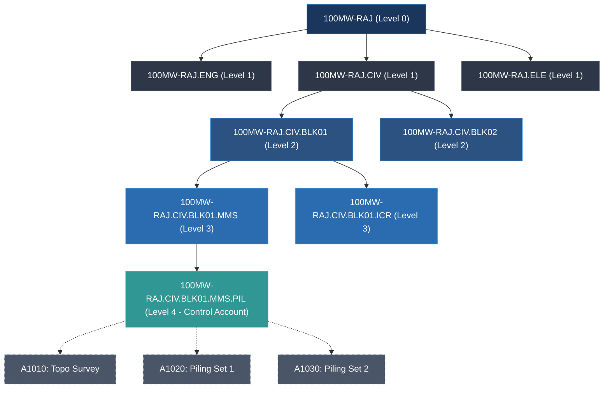

# Topic 2.2: WBS Levels & Coding — Hierarchy Engineering, Industry Standards, and Database Implementation

---

## 1. Executive Summary: The Structural Address of Every Deliverable

In enterprise project controls, a project schedule is not an unstructured "to-do" list. On a $100M+ engineering, procurement, and construction (EPC) contract, thousands of engineers, subcontractors, fabricators, and financial controllers operate concurrently. Without a rigid spatial and structural addressing system, project execution disintegrates into organizational anarchy.

Consider the physical reality of our running industrial benchmark:
**The 100MW AC Solar Photovoltaic (PV) Independent Power Producer (IPP) Project in Rajasthan, India.**
* **Total EPC Contract Value:** \$75,000,000 USD (INR 620 Crore)
* **Physical Footprint:** 500 contiguous acres of arid desert terrain in the Thar Desert (Bhadla Solar Park corridor)
* **Bill of Quantities (BOQ):**
  * 320,000 bifacial monocrystalline silicon PV modules (540Wp each)
  * 20 decentralized outdoor inverter stations (5MW each, stepping up 1500V DC to 33kV AC)
  * 1,200 km of DC string cabling and 45 km of 33kV medium-voltage underground armored cable
  * 64,000 driven steel piles supporting single-axis tracking Module Mounting Structures (MMS)
  * One 220kV / 33kV Main Pooling Substation (PSS) with two 60MVA power transformers and a 14 km 220kV double-circuit transmission line tie-in to the state grid (RVPNL).
* **Execution Footprint:** 14 months duration, 2,800 active schedule activities, 42 specialized subcontractors, and 6 corporate financial entities.

```
┌────────────────────────────────────────────────────────────────────────────────────────────────────────┐
│                              THE WBS AS THE ENTERPRISE STRUCTURAL ADDRESS                              │
├────────────────────────────────────────────────────────────────────────────────────────────────────────┤
│                                                                                                        │
│   PHYSICAL WORLD                        P6 LOGICAL WBS PATH                         ERP COST CODE      │
│  ┌───────────────────────┐             ┌─────────────────────────┐             ┌───────────────────┐   │
│  │ Steel Pile #42,108    │ ──────────► │ RAJ-100MW.CIV.BLK04.MMS │ ──────────► │ GL-5410-04-3120   │   │
│  │ (Array Block 04, Row 12)│           │ Level 4 Control Account │             │ SAP PS WBS Element│   │
│  └───────────────────────┘             └─────────────────────────┘             └───────────────────┘   │
│                                                     │                                                  │
│                                                     ▼                                                  │
│                                        ┌─────────────────────────┐                                     │
│                                        │ Activity A4120          │                                     │
│                                        │ "Hydraulic Ram Piling   │                                     │
│                                        │  Block 04 Row 10-15"    │                                     │
│                                        └─────────────────────────┘                                     │
│                                                                                                        │
└────────────────────────────────────────────────────────────────────────────────────────────────────────┘
```

The **Work Breakdown Structure (WBS)** provides the immutable "postal code" for every single deliverable. If a site quality inspector identifies that a tracker torque tube failed load deflection testing in Array Block 04, that failure does not get logged as a generic defect in a project chat. It is pinned to:
$$\text{Structural Address} = \text{RAJ-100MW} \rightarrow \text{CIV} \rightarrow \text{BLK04} \rightarrow \text{MMS} \rightarrow \text{A4120}$$

Through this address:
1. **The Scheduler** knows precisely which CPM path is impacted and whether the plant commercial operation date (COD) is compromised.
2. **The Control Account Manager (CAM)** evaluates whether earned value metrics (BCWP, ACWP) for civil works in Block 04 have breached cost thresholds.
3. **The ERP Gateway** routes subcontractor liquidated damages or back-charges directly to the correct general ledger commitment line in SAP or Oracle Financials.

For a software engineer building a modern, cloud-native P6 clone using **Golang** on the backend and **Next.js** on the frontend, the WBS is not merely a visual tree component. It is a strictly governed directed tree data structure requiring:
* High-performance atomic persistence in relational databases (PostgreSQL).
* Sub-millisecond recursive tree traversals and rollups.
* Deterministic natural sorting algorithms.
* Fail-safe concurrency control during drag-and-drop structural reparenting.

---

## 2. The 5 Standard WBS Levels in Enterprise EPC Projects

In industrial capital projects, standardizing WBS levels is mandatory to maintain organizational governance across disparate disciplines. A flat hierarchy or an arbitrarily nested tree creates reporting chaos. Enterprise engineering standards (aligned with ISO 21500, PMI PMBOK, and US DoD EIA-748 EVMS) universally structure mega-projects into **five core WBS levels**, beneath which execution activities reside.

```
┌───────────────────────────────────────────────────────────────────────────────────────────────────────┐
│                                STANDARD EPC 5-LEVEL WBS ARCHITECTURE                                  │
├───────┬────────────────────────────┬──────────────────────────────────┬───────────────────────────────┤
│ LEVEL │ FORMAL DESIGNATION         │ INDUSTRIAL SCOPE DEFINITION      │ RAJASTHAN 100MW SOLAR EXAMPLE │
├───────┼────────────────────────────┼──────────────────────────────────┼───────────────────────────────┤
│ L0    │ Total Project              │ Entire capital authorization,    │ RAJ-100MW                     │
│       │ (Root Node)                │ overall contract boundary.       │ 100MW AC Solar IPP Project    │
├───────┼────────────────────────────┼──────────────────────────────────┼───────────────────────────────┤
│ L1    │ Sub-Project / Major Phase  │ Lifecycle stages or top-level    │ RAJ-100MW.CIV                 │
│       │ / Facility Division        │ functional facility breakdown.   │ Civil & Structural Works      │
├───────┼────────────────────────────┼──────────────────────────────────┼───────────────────────────────┤
│ L2    │ Sub-Facility / Plant Area  │ Geographical zone, physical unit │ RAJ-100MW.CIV.BLK01           │
│       │ / Geographical Unit        │ or independent production block. │ Solar PV Array Block 01 (5MW) │
├───────┼────────────────────────────┼──────────────────────────────────┼───────────────────────────────┤
│ L3    │ Sub-Package / Discipline   │ Engineering domain or trade      │ RAJ-100MW.CIV.BLK01.MMS       │
│       │ / Subsystem                │ responsibility within that area. │ MMS Foundation & Piling       │
├───────┼────────────────────────────┼──────────────────────────────────┼───────────────────────────────┤
│ L4    │ Control Account (CA) /     │ The fundamental management cell. │ RAJ-100MW.CIV.BLK01.MMS.PIL   │
│       │ Work Package (WP) Boundary │ Lowest WBS node; scope & budget. │ Rammed Steel Piling Execution │
├───────┴────────────────────────────┴──────────────────────────────────┴───────────────────────────────┤
│   ═════════════════════════════════ WBS / ACTIVITY BOUNDARY ════════════════════════════════════════   │
├───────┬────────────────────────────┬──────────────────────────────────┬───────────────────────────────┤
│ L5+   │ Activities & Milestones    │ CPM execution tasks. Work steps, │ A1020: Ram Piles Array 1-200  │
│       │ (Schedule Layer)           │ resource assignments, logic links│ M1090: Block 01 Piling Signoff│
└───────┴────────────────────────────┴──────────────────────────────────┴───────────────────────────────┘
```

---

### 2.1 Detailed Decomposition of Levels 0 to 5+

#### Level 0: Total Project (The Enterprise Root)
* **Definition:** The highest level of aggregation. Represents 100% of the authorized capital expenditure (CAPEX) approved by the board or project finance lenders.
* **Database Representation:** Maps directly to a record in the `projects` table. All WBS nodes within the schedule reference this parent project.
* **Rajasthan 100MW Example:** 
  * WBS Code: `RAJ-100MW`
  * Name: `100MW Solar PV Power Project - Bhadla Phase II`
  * Metric Aggregation: Sum of all 2,800 activities (\$75,000,000 USD; 14-month total schedule).

#### Level 1: Sub-Project / Major Facility Phase
* **Definition:** Decomposes the mega-project by project lifecycle phase (EPC lifecycle) or macro facility divisions.
* **Industrial Practice:** In EPC contracts, Level 1 is divided into Engineering, Procurement, Construction, and Commissioning, or by major facility divisions (e.g., Solar Field vs. High Voltage Substation vs. Grid Transmission).
* **Rajasthan 100MW Example:**
  * `RAJ-100MW.MGT` — Project Management, Permitting, Statutory Approvals
  * `RAJ-100MW.ENG` — Detailed Engineering & Design Optimization
  * `RAJ-100MW.PROC` — Equipment Procurement & Inland Logistics
  * `RAJ-100MW.CIV` — Site Civil Infrastructure & Structural Foundations
  * `RAJ-100MW.ELE` — Electrical Systems, DC Cabling & Inverter Stations
  * `RAJ-100MW.SUB` — 220kV Main Pooling Substation & Switchyard
  * `RAJ-100MW.TLN` — 220kV Double-Circuit Transmission Line (14 km)
  * `RAJ-100MW.COM` — Testing, Grid Synchronization & Performance Ratio (PR) Run

#### Level 2: Work Package Sub-Facility / Geographical Area
* **Definition:** Breaks down the facility into manageable geographical units, physical plots, or operational systems. This enables independent construction management teams to operate in parallel without spatial conflict.
* **Industrial Practice:** In utility-scale solar, the land is partitioned into standard inverter-transformer power blocks (e.g., twenty 5MW blocks across 500 acres).
* **Rajasthan 100MW Example (under `RAJ-100MW.CIV`):**
  * `RAJ-100MW.CIV.GEN` — Plant-wide Civil (Boundary Fencing, Grading, Drainage, Main Roads)
  * `RAJ-100MW.CIV.BLK01` — Array Power Block 01 (5MW Civil Footprint)
  * `RAJ-100MW.CIV.BLK02` — Array Power Block 02 (5MW Civil Footprint)
  * ...
  * `RAJ-100MW.CIV.BLK20` — Array Power Block 20 (5MW Civil Footprint)

#### Level 3: Sub-Package / Discipline
* **Definition:** Segregates engineering trades, material classes, or specialized subcontractor scopes within a specific geographical block.
* **Industrial Practice:** A civil package manager divides Block 01 civil works between foundation piling, tracker assembly, control building civil construction, and stormwater drainage.
* **Rajasthan 100MW Example (under `RAJ-100MW.CIV.BLK01`):**
  * `RAJ-100MW.CIV.BLK01.GRD` — Block 01 Micro-Grading & Compaction
  * `RAJ-100MW.CIV.BLK01.MMS` — Module Mounting Structure (MMS) Foundations
  * `RAJ-100MW.CIV.BLK01.ICR` — Inverter Control Room (ICR) Foundation & Plinth
  * `RAJ-100MW.CIV.BLK01.TRN` — DC Cable Trenches & Road Crossings

#### Level 4: Control Account (CA) / Work Package (WP) Boundary
* **Definition:** **The lowest level of the Work Breakdown Structure.**
  * In formal project management (EIA-748 Earned Value Management Systems), a **Control Account** is a management control point where:
    $$\text{Scope} + \text{Budget (BAC)} + \text{Actual Cost (ACWP)} + \text{Schedule (BCWS)} = \text{Organizational Responsibility (CAM)}$$
  * A Control Account contains one or more **Work Packages (WP)** or **Planning Packages (PP)**.
  * Below Level 4, **WBS nodes cease to exist**. Activities are children of Level 4 nodes.
* **Rajasthan 100MW Example (under `RAJ-100MW.CIV.BLK01.MMS`):**
  * `RAJ-100MW.CIV.BLK01.MMS.PIL` — Rammed Steel Piling Execution (3,200 piles)
  * `RAJ-100MW.CIV.BLK01.MMS.STR` — Tracker Structure Mechanical Erection

#### Level 5+: Activities & Milestones (Execution Layer)
* **Definition:** The discrete work steps, tasks, and CPM milestone points executed by labor crews and equipment.
* **Key Invariant:** **Activities are NOT WBS nodes.** Activities have durations, calendars, direct resource assignments (labor, machinery, materials), constraints, and logic relationships (FS, SS, FF, SF). WBS nodes have *none* of these directly—they derive their dates and costs strictly via dynamic hierarchical rollups.
* **Rajasthan 100MW Example (under `RAJ-100MW.CIV.BLK01.MMS.PIL`):**
  * `A1010` — Topographical Benchmarking & Pile Location Staking (Duration: 3d)
  * `A1020` — Hydraulic Ram Piling Set 01: Strings 1-40 (Duration: 5d)
  * `A1030` — Hydraulic Ram Piling Set 02: Strings 41-80 (Duration: 5d)
  * `A1040` — Geotechnical Pull-Out & Lateral Deflection Testing (Duration: 2d)
  * `M1050` — Block 01 Piling Inspection & Client Sign-off (Milestone: 0d)

---

### 2.2 Stakeholder Mapping per WBS Level

A major reason why enterprise tools like P6 structure schedules into hierarchical levels is **information filtering and cognitive bandwidth management**. A Chief Executive Officer cannot digest 2,800 activities; conversely, a piling subcontractor cannot execute against a single L1 line item.

```
┌─────────────────────────────────────────────────────────────────────────────────────────────────────────┐
│                                STAKEHOLDER MAPPING & COGNITIVE BANDWIDTH                                │
├───────┬───────────────────────────┬─────────────────────────┬───────────────────────────────────────────┤
│ LEVEL │ PRIMARY STAKEHOLDERS      │ VIEWPORT / REPORTING    │ KEY METRICS MONITORED                     │
├───────┼───────────────────────────┼─────────────────────────┼───────────────────────────────────────────┤
│ L0    │ Sovereign Wealth Fund,    │ Executive Dashboard,    │ Project IRR, Commercial Operation Date    │
│       │ Lenders' Consortium, CEO  │ Board Milestone Summary │ (COD) variance, Total Capital Drawdown.   │
├───────┼───────────────────────────┼─────────────────────────┼───────────────────────────────────────────┤
│ L1    │ EPC Project Director, VP  │ Monthly Progress Report,│ Phase SPI/CPI, Master S-Curves, Critical  │
│       │ Construction, CFO         │ Stage-Gate Reviews      │ Path Near-term Flotation, Total Float.    │
├───────┼───────────────────────────┼─────────────────────────┼───────────────────────────────────────────┤
│ L2    │ Area Construction Manager,│ Bi-weekly Progress,     │ Block handover sequence, Substation vs.   │
│       │ Solar Field Area Lead     │ Multi-Trade Coordination│ Field readiness, Major Equipment Delivery.│
├───────┼───────────────────────────┼─────────────────────────┼───────────────────────────────────────────┤
│ L3    │ Lead Discipline Engineers │ Weekly Lookahead,       │ Daily piling rates (piles/day), Inverter  │
│       │ (Chief Civil, Electrical) │ QA/QC Defect Logs       │ pad concrete curing curves, Trench meters.│
├───────┼───────────────────────────┼─────────────────────────┼───────────────────────────────────────────┤
│ L4    │ Control Account Manager   │ Control Account Status  │ Work package EVM: Cost Variance ($),      │
│       │ (CAM), Package Contractor │ Reports, Subcontract SOW│ Schedule Variance (days), Earned Manhours.│
├───────┼───────────────────────────┼─────────────────────────┼───────────────────────────────────────────┤
│ L5+   │ Site Foremen, Subcontract │ 3-Week Rolling Lookahead│ Daily crew assignments, equipment shifts, │
│       │ Labor Crews, Safety Reps  │ Daily Shift Reports     │ physical quantities installed today.      │
└───────┴───────────────────────────┴─────────────────────────┴───────────────────────────────────────────┘
```

---

## 3. WBS Coding Structures & String Notation

Every node in the WBS tree requires a machine-readable, human-interpretable identifier. In software systems, this string is known as the **WBS Code** (or WBS Path).



### 3.1 Coding Syntaxes Compared

Three primary string coding notations dominate engineering project controls:

| Coding Format | Example String | Advantages | Disadvantages |
| :--- | :--- | :--- | :--- |
| **Dot Notation** | `1.3.2.1.4` | • Simple delimiter parsing (`strings.Split`)<br>• Infinite nesting depth<br>• Standard mathematical tree syntax | • Lacks semantic context without looking up titles<br>• Vulnerable to ASCII sorting anomalies (`1.10` vs `1.2`) |
| **Hyphenated / Segmented** | `RAJ-CIV-BLK01-MMS-PIL` | • High human cognitive readability<br>• Directly maps to engineering drawing stamps<br>• Embeds physical location and trade | • Verbose string lengths<br>• High refactoring cost if a node moves across branches |
| **Fixed-Width Uniform Mask** | `0103020104` (2 chars/lvl)<br>or `01.03.02.01.04` | • Deterministic substring extraction by string offset<br>• Clean lexicographical sorting without special algorithms | • Rigid depth limit; re-architecting mask width requires migrating legacy data<br>• Cannot exceed 99 siblings per branch if using 2-digit mask |

---

### 3.2 Smart Codes vs. Auto-Generated Surrogate Keys

An architectural tension exists in scheduling system design between **Semantic ("Smart") Codes** and **Synthetic Surrogate Keys**:

#### Smart Codes (Human-Centric)
* **Structure:** Codes embed domain attributes directly: `[PROJECT]-[FACILITY]-[DISCIPLINE]-[UNIT]`.
  * Example: `RAJ-100-SOL-CIV-MMS-01` tells anyone on site: *Rajasthan 100MW, Solar Field, Civil Discipline, Module Mounting Structure, Package 01*.
* **The Engineering Flaw:** **Mutability.** Scope in capital projects shifts. If during detailed engineering, the project director decides that Inverter Transformer Foundation pads (`...CIV-ITF-01`) will now be executed under the Electrical Subcontractor's package rather than the General Civil Subcontractor, the smart code is either:
  1. *Kept as-is:* Now the code is a semantic lie (a civil code living under electrical).
  2. *Mutated:* Changing the primary key or code string breaks external foreign keys, paper purchase orders, drawing title blocks, and historical ERP commitments.

#### Synthetic Surrogate Keys (System-Centric)
* **Structure:** Random UUIDs (`e7f1b2c4-...`) or auto-incrementing sequential integers (`WBS-100482`).
* **The Engineering Flaw:** Total cognitive illegibility. A site manager cannot memorize or discuss UUIDs during a morning field coordination meeting.

#### The Architectural Solution: Hybrid Two-Tier Keying
In a robust P6-like engine:
1. **Primary Key (Internal):** Immutable `UUIDv7` or `BIGSERIAL` integer. All database foreign keys (`activities.wbs_id`, `cost_commitments.wbs_id`) point to this immutable ID.
2. **WBS Short Code (`short_name`):** A concise, sibling-unique alphanumeric token (e.g., `MMS`, `BLK01`, `04`).
3. **WBS Full Path (`wbs_code` / `path`):** A materialized dot-separated string generated by concatenating parent short codes up to the root (e.g., `RAJ.CIV.BLK01.MMS`). If the node is moved, the internal UUID is untouched, while the path string is recalculated in a background transaction.

---

### 3.3 Core Invariants of WBS Code Hierarchies

When building a scheduling database, the backend must enforce the following strict invariants:

1. **Project Scope Isolation:** WBS codes are not required to be globally unique across all projects in an enterprise. WBS Code `CIV.BLK01` can exist in Project A (`RAJ-100MW`) and Project B (`GUJ-200MW`). The uniqueness constraint is composite:
   $$\text{UNIQUE}(\text{project\_id}, \text{wbs_code})$$
2. **Sibling Short Code Uniqueness:** Under any single parent node, no two child nodes may share the same short code:
   $$\text{UNIQUE}(\text{parent\_id}, \text{short\_code})$$
3. **Parent Derivation Rule:** For any non-root WBS node with path $P = s_1.s_2.\dots.s_k$, the parent path must strictly equal:
   $$\text{Parent}(P) = s_1.s_2.\dots.s_{k-1}$$
4. **Explicit Sequence Numbering:** Sibling order cannot rely on alphabetical sorting of titles or creation timestamps. An explicit integer column `seq_num` (or `display_order`) is required. This allows a user to position `RAJ.CIV.MMS` before `RAJ.CIV.ICR` regardless of alphabetical sorting.

---

## 4. Industry Classification Standards & Enterprise ERP Integration

International mega-projects rarely invent WBS structures from scratch. They adhere to standardized classification frameworks to facilitate cross-enterprise benchmarking, building information modeling (BIM), and automated cost accounting.

```
┌───────────────────────────────────────────────────────────────────────────────────────────────────────┐
│                                INDUSTRY CLASSIFICATION FRAMEWORKS                                     │
├────────────────────┬─────────────────────────────┬────────────────────────────────────────────────────┤
│ STANDARD           │ GOVERNING BODY / SCOPE      │ STRUCTURAL TAXONOMY FOCUS                          │
├────────────────────┼─────────────────────────────┼────────────────────────────────────────────────────┤
│ **CSI MasterFormat**│ Construction Specifications │ **Work Results & Material Trades**                 │
│                    │ Institute (CSI / CSC)       │ (e.g., Div 03: Concrete, Div 26: Electrical,       │
│                    │                             │ Div 31: Earthwork, Div 48: Power Generation)       │
├────────────────────┼─────────────────────────────┼────────────────────────────────────────────────────┤
│ **UniFormat**      │ ASTM International (E1557)  │ **Systems & Physical Assemblies**                  │
│                    │                             │ (e.g., Element A: Substructure, B: Shell,          │
│                    │                             │ D: Services, G: Sitework)                          │
├────────────────────┼─────────────────────────────┼────────────────────────────────────────────────────┤
│ **OmniClass**      │ OCCS Development Committee  │ **Multi-Table Faceted Classification**             │
│                    │ (ISO 12006-2)               │ (Table 21: Elements, Table 22: Work Results,       │
│                    │                             │ Table 33: Disciplines, Table 34: Organizational)   │
└────────────────────┴─────────────────────────────┴────────────────────────────────────────────────────┘
```

### 4.1 MasterFormat vs. UniFormat in Industrial EPC

* **UniFormat** is organized around **physical functional elements** (what the system is). It is predominantly used during preliminary engineering, conceptual budgeting, and Level 1/Level 2 WBS modeling.
  * In our 100MW project: UniFormat classifies the entire `G4010` (Electrical Site Infrastructure) regardless of whether concrete, steel, or cables are used.
* **MasterFormat** is organized around **construction trades and material specifications** (how work is procured and built). It dominates Level 3 and Level 4 Work Packages and subcontractor procurement.
  * MasterFormat 48 14 00: Solar Energy Electrical Power Generation
  * MasterFormat 31 62 00: Driven Piles
  * MasterFormat 26 12 19: Pad-Mounted Liquid-Filled Medium-Voltage Transformers

---

### 4.2 The ERP Integration Architecture: WBS vs. CBS

In an enterprise IT landscape, Primavera P6 schedules must interface seamlessly with enterprise resource planning (ERP) systems—most notably **SAP PS (Project System)** and **Oracle Fusion Cloud Projects**.

```
┌───────────────────────────────────────────────────────────────────────────────────────────────────────┐
│                           THE IMPEDANCE MISMATCH: P6 WBS VS. SAP ERP CBS                              │
├───────────────────────────────────────────────────────────────────────────────────────────────────────┤
│                                                                                                        │
│   PRIMAVERA P6 (SCHEDULING WORLD)                      SAP PS / S/4HANA (FINANCIAL WORLD)              │
│  ┌──────────────────────────────────────┐             ┌───────────────────────────────────────────┐   │
│  │ TIME & LOGIC DRIVEN                  │             │ FISCAL PERIOD & LEDGER DRIVEN             │   │
│  │                                      │             │                                           │   │
│  │ • 2,800 detailed activities          │             │ • 80-120 high-level WBS Elements (WBSE)   │   │
│  │ • CPM Early/Late dates, Float        │             │ • General Ledger (GL) Accounts            │   │
│  │ • Dynamic duration recalculations    │             │ • Purchase Orders, Invoices, Actuals      │   │
│  │ • Granular subcontractor steps       │             │ • Cost Centers & Internal Orders          │   │
│  └──────────────────────────────────────┘             └───────────────────────────────────────────┘   │
│                      │                                                     │                          │
│                      └──────────────────────┐       ┌──────────────────────┘                          │
│                                             ▼       ▼                                                 │
│                                  ┌─────────────────────────────┐                                      │
│                                  │   THE INTEGRATION NEXUS:    │                                      │
│                                  │   LEVEL 4 CONTROL ACCOUNT   │                                      │
│                                  │   (1-to-1 or N-to-1 Mapping)│                                      │
│                                  └─────────────────────────────┘                                      │
│                                                                                                        │
└────────────────────────────────────────────────────────────────────────────────────────────────────────┘
```

#### Why You Never Synchronize P6 Activities Directly to ERP
Junior architects often propose syncing every single P6 activity into SAP as a Work Breakdown Structure Element (WBSE). **This is an enterprise anti-pattern:**
1. **Transaction Saturation:** Booking timesheets, purchase requisitions, and invoice approvals against 2,800 micro-tasks floods the ERP database with excessive transactional lines.
2. **Frequency Discrepancy:** Schedules are rescheduled daily or weekly via forward/backward CPM passes; ERP cost commitments operate on strict monthly financial closing cycles.

#### The Reconciliation Gateway: Level 4 Control Account
The mapping between P6 and ERP is established at **WBS Level 4 (Control Account)**:
* Each P6 Level 4 WBS node stores an external financial attribute: `erp_cost_code` (or `sap_wbse_id`).
* In SAP, this corresponds to an actionable WBSE: e.g., `IN-RAJ100-CIV-MMS01`.
* When a purchase order for 3,200 steel piles is issued to the subcontractor in SAP, it is coded to `IN-RAJ100-CIV-MMS01`.
* During weekly progress reporting, P6 rolls up activity-level progress (e.g., 1,600 of 3,200 piles installed = 50% physical completion) to Level 4.
* The integration middleware extracts this 50% physical percent complete and pushes it to SAP to compute **Earned Value** ($\text{EV} = \text{Budget} \times 0.50$) and unlock progressive subcontractor payment milestones.

---

## 5. Algorithmic & Database Engineering (Golang + PostgreSQL)

To build a high-concurrency, responsive web application for enterprise project management, database modeling of the WBS hierarchy requires rigorous algorithmic tradeoffs.

### 5.1 Evaluating Tree Storage Patterns in PostgreSQL

We benchmark four standard relational tree modeling techniques for a scheduling engine handling 150,000 WBS nodes across 50 enterprise projects:

```
┌───────────────────────────────────────────────────────────────────────────────────────────────────────┐
│                              RELATIONAL TREE STORAGE BENCHMARK MATRIX                                 │
├────────────────────┬─────────────────┬──────────────────┬──────────────────┬──────────────────────────┤
│ MODEL              │ SUBTREE READ    │ LEAF INSERTION   │ REPARENT MOVE    │ REFERENTIAL INTEGRITY    │
├────────────────────┼─────────────────┼──────────────────┼──────────────────┼──────────────────────────┤
│ **Adjacency List** │ $O(D)$ Recursive│ $O(1)$           │ $O(1)$           │ Perfect                  │
│ (`parent_id`)      │ CTE required    │ Single row write │ Single row write │ Native foreign keys      │
├────────────────────┼─────────────────┼──────────────────┼──────────────────┼──────────────────────────┤
│ **Nested Sets**    │ $O(1)$ Range    │ $O(N)$           │ $O(N)$ Massive   │ Weak                     │
│ (`lft`, `rgt`)     │ `BETWEEN l, r`  │ Table lock & renum│ Table lock & renum│ Complex application logic│
├────────────────────┼─────────────────┼──────────────────┼──────────────────┼──────────────────────────┤
│ **Closure Table**  │ $O(1)$ Indexed  │ $O(D)$ Ancestor  │ $O(D \cdot M)$   │ Good                     │
│ (`anc, desc, d`)   │ Join table query│ row insertions   │ Delete & re-insert│ Foreign keys on pairs    │
├────────────────────┼─────────────────┼──────────────────┼──────────────────┼──────────────────────────┤
│ **PostgreSQL**     │ $O(1)$ GiST     │ $O(1)$ Derive    │ $O(M)$ Fast      │ Excellent via hybrid     │
│ **`ltree` Path**   │ Index Scan      │ parent path      │ Path prefix repl.│ `parent_id` + `ltree`    │
└────────────────────┴─────────────────┴──────────────────┴──────────────────┴──────────────────────────┘
*(Where $N$ = total rows in tree, $D$ = depth of node, $M$ = number of nodes in moved subtree)*
```

#### Why Nested Sets Fails for Interactive Project Controls
In web-based project management, users frequently reorder WBS nodes, insert new packages, and drag branches. In Nested Sets, inserting a single node into a 5,000-node project requires updating the `lft` and `rgt` boundaries of on average 2,500 other rows:
```sql
-- Disaster for concurrency: Locks half the project table
UPDATE wbs_nodes SET rgt = rgt + 2 WHERE rgt > new_node_pos;
UPDATE wbs_nodes SET lft = lft + 2 WHERE lft > new_node_pos;
```
Under concurrent multi-user editing, this creates row-level lock contention and serialization deadlocks.

#### The Production Standard: Hybrid Adjacency List + PostgreSQL `ltree`
We implement a **hybrid pattern**:
1. `parent_id UUID REFERENCES wbs_nodes(id)` provides immediate referential integrity, foreign-key cascades, and parent-child navigation.
2. `path ltree` provides materialized path hierarchy querying, allowing PostgreSQL's native GiST index to fetch entire subtrees or compute ancestor chains in microseconds.

---

### 5.2 Production PostgreSQL DDL Architecture

```sql
-- Enable the PostgreSQL ltree extension for hierarchical indexing
CREATE EXTENSION IF NOT EXISTS ltree;

-- Table: WBS Nodes (Hierarchical Container)
CREATE TABLE wbs_nodes (
    id UUID PRIMARY KEY DEFAULT gen_random_uuid(),
    project_id UUID NOT NULL, -- Isolated per project
    parent_id UUID REFERENCES wbs_nodes(id) ON DELETE CASCADE,
    
    -- Segment code (e.g., 'MMS') and full materialized dot string (e.g., 'RAJ_100MW.CIV.BLK01.MMS')
    short_code VARCHAR(50) NOT NULL,
    wbs_code VARCHAR(255) NOT NULL,
    name VARCHAR(255) NOT NULL,
    
    -- PostgreSQL native hierarchical path representation
    path ltree NOT NULL,
    
    -- Explicit sibling ordering
    seq_num INT NOT NULL DEFAULT 0,
    
    -- WBS Level (0 = Root Project, 1 = Sub-Project, ..., 4 = Control Account)
    level INT NOT NULL CHECK (level >= 0 AND level <= 10),
    
    -- Responsible Manager (OBS Binding)
    responsible_manager_id UUID,
    
    -- External ERP Integration
    erp_cost_code VARCHAR(100),
    
    -- Audit Timestamps
    created_at TIMESTAMPTZ NOT NULL DEFAULT NOW(),
    updated_at TIMESTAMPTZ NOT NULL DEFAULT NOW(),
    
    -- Constraints
    CONSTRAINT uq_wbs_project_code UNIQUE (project_id, wbs_code),
    CONSTRAINT uq_wbs_parent_sibling UNIQUE (project_id, parent_id, short_code)
);

-- Indices for High-Performance Queries
-- 1. GiST index on ltree path for rapid subtree fetching and ancestor searches
CREATE INDEX idx_wbs_nodes_path_gist ON wbs_nodes USING GIST (path);

-- 2. B-Tree index on project_id and seq_num for sibling rendering
CREATE INDEX idx_wbs_nodes_proj_seq ON wbs_nodes (project_id, parent_id, seq_num);

-- 3. B-Tree index on project_id and level for executive level rollups
CREATE INDEX idx_wbs_nodes_proj_level ON wbs_nodes (project_id, level);

-- Table: Activities (Execution layer under WBS Level 4)
CREATE TABLE activities (
    id UUID PRIMARY KEY DEFAULT gen_random_uuid(),
    project_id UUID NOT NULL,
    wbs_id UUID NOT NULL REFERENCES wbs_nodes(id) ON DELETE RESTRICT,
    
    activity_code VARCHAR(50) NOT NULL,
    name VARCHAR(255) NOT NULL,
    activity_type VARCHAR(30) NOT NULL CHECK (activity_type IN ('TASK', 'START_MILESTONE', 'FINISH_MILESTONE', 'LEVEL_OF_EFFORT')),
    
    planned_duration INT NOT NULL DEFAULT 1, -- In working days
    actual_duration INT DEFAULT 0,
    
    early_start TIMESTAMPTZ,
    early_finish TIMESTAMPTZ,
    late_start TIMESTAMPTZ,
    late_finish TIMESTAMPTZ,
    
    planned_cost NUMERIC(15, 2) NOT NULL DEFAULT 0.00,
    actual_cost NUMERIC(15, 2) NOT NULL DEFAULT 0.00,
    
    CONSTRAINT uq_activity_project_code UNIQUE (project_id, activity_code)
);

CREATE INDEX idx_activities_wbs_id ON activities (wbs_id);
```

---

### 5.3 Natural Sorting of WBS Codes

A classical user experience failure in scheduling software occurs when displaying WBS trees using default database string sorting (ASCII/Unicode collation).

#### The Problem: Lexicographical Ordering Anomaly
Under standard ASCII ordering:
$$\text{"1.1"} < \text{"1.10"} < \text{"1.2"} < \text{"1.20"} < \text{"1.3"}$$
A human project director expects:
$$\text{"1.1"} < \text{"1.2"} < \text{"1.3"} < \dots < \text{"1.9"} < \text{"1.10"}$$
Because `"1.10"` has ASCII character `'1'` at position 3, it sorts before `'2'`. In an enterprise schedule with 20 inverter blocks (`BLK01` through `BLK20` or `1.1` to `1.20`), ASCII sorting scrambles the construction sequence.

#### The Golang Natural Sort Implementation
Below is a high-performance, zero-allocation Natural Sort comparator in Golang designed for WBS dot-notation strings and alphanumeric codes:

```go
package wbs

import (
	"strconv"
	"strings"
	"unicode"
)

// NaturalLess compares two strings using human-intuitive numerical chunk comparison.
// It correctly evaluates "1.2" < "1.10" and "BLK-2" < "BLK-10".
func NaturalLess(s1, s2 string) bool {
	// Fast path equality check
	if s1 == s2 {
		return false
	}

	chunks1 := splitIntoChunks(s1)
	chunks2 := splitIntoChunks(s2)

	n1, n2 := len(chunks1), len(chunks2)
	minLen := n1
	if n2 < minLen {
		minLen = n2
	}

	for i := 0; i < minLen; i++ {
		c1, c2 := chunks1[i], chunks2[i]
		if c1 == c2 {
			continue
		}

		isNum1 := isAllDigits(c1)
		isNum2 := isAllDigits(c2)

		if isNum1 && isNum2 {
			v1, err1 := strconv.ParseUint(c1, 10, 64)
			v2, err2 := strconv.ParseUint(c2, 10, 64)
			if err1 == nil && err2 == nil {
				if v1 != v2 {
					return v1 < v2
				}
				// If numerical values are equal (e.g., "01" vs "1"), shorter string ranks first
				return len(c1) < len(c2)
			}
		}

		// Fallback to case-insensitive lexicographical comparison
		c1Lower := strings.ToLower(c1)
		c2Lower := strings.ToLower(c2)
		if c1Lower != c2Lower {
			return c1Lower < c2Lower
		}
		return c1 < c2
	}

	return n1 < n2
}

// splitIntoChunks tokenizes a string into contiguous sequences of digits and non-digits.
func splitIntoChunks(s string) []string {
	if len(s) == 0 {
		return nil
	}

	var chunks []string
	runes := []rune(s)
	start := 0
	isDigit := unicode.IsDigit(runes[0])

	for i := 1; i < len(runes); i++ {
		curDigit := unicode.IsDigit(runes[i])
		if curDigit != isDigit {
			chunks = append(chunks, string(runes[start:i]))
			start = i
			isDigit = curDigit
		}
	}
	chunks = append(chunks, string(runes[start:]))
	return chunks
}

func isAllDigits(s string) bool {
	if len(s) == 0 {
		return false
	}
	for _, r := range s {
		if !unicode.IsDigit(r) {
			return false
		}
	}
	return true
}
```

---

### 5.4 Golang Tree Construction & JSON Marshaling

When the Next.js frontend requests a project schedule, the Golang backend queries the flat `wbs_nodes` table from PostgreSQL and constructs a recursive tree structure in memory.

```go
package wbs

import (
	"encoding/json"
	"fmt"
	"sort"
	"time"

	"github.com/google/uuid"
)

// WBSNode represents a single WBS entity in memory.
type WBSNode struct {
	ID                  uuid.UUID   `json:"id"`
	ProjectID           uuid.UUID   `json:"project_id"`
	ParentID            *uuid.UUID  `json:"parent_id"`
	ShortCode           string      `json:"short_code"`
	WBSCode             string      `json:"wbs_code"`
	Name                string      `json:"name"`
	Path                string      `json:"path"`
	SeqNum              int         `json:"seq_num"`
	Level               int         `json:"level"`
	ResponsibleManagerID *uuid.UUID `json:"responsible_manager_id,omitempty"`
	ERPCostCode         string      `json:"erp_cost_code,omitempty"`
	
	// Dynamic rollup fields
	PlannedCost         float64     `json:"planned_cost"`
	ActualCost          float64     `json:"actual_cost"`
	EarlyStart          *time.Time  `json:"early_start,omitempty"`
	EarlyFinish         *time.Time  `json:"early_finish,omitempty"`

	// Hierarchy references
	Children            []*WBSNode  `json:"children"`
}

// BuildTree converts a flat slice of WBS nodes into a nested forest (or single root tree).
func BuildTree(flatNodes []*WBSNode) ([]*WBSNode, error) {
	nodeMap := make(map[uuid.UUID]*WBSNode, len(flatNodes))
	var roots []*WBSNode

	for _, node := range flatNodes {
		node.Children = make([]*WBSNode, 0)
		nodeMap[node.ID] = node
	}

	for _, node := range flatNodes {
		if node.ParentID == nil {
			roots = append(roots, node)
		} else {
			parent, exists := nodeMap[*node.ParentID]
			if !exists {
				return nil, fmt.Errorf("orphaned node detected: ID %s references non-existent parent %s", node.ID, *node.ParentID)
			}
			parent.Children = append(parent.Children, node)
		}
	}

	// Sort children recursively by SeqNum, fallback to Natural Sort on WBSCode
	var sortChildren func(nodes []*WBSNode)
	sortChildren = func(nodes []*WBSNode) {
		sort.Slice(nodes, func(i, j int) bool {
			if nodes[i].SeqNum != nodes[j].SeqNum {
				return nodes[i].SeqNum < nodes[j].SeqNum
			}
			return NaturalLess(nodes[i].WBSCode, nodes[j].WBSCode)
		})
		for _, child := range nodes {
			if len(child.Children) > 0 {
				sortChildren(child.Children)
			}
		}
	}

	sortChildren(roots)
	return roots, nil
}
```

---

### 5.5 Atomic Subtree Reparenting (Drag-and-Drop) in PostgreSQL

When an authorized project controller drags a WBS package (e.g., `RAJ.CIV.BLK01.ICR`) to an alternative parent (e.g., reassigning it to `RAJ.ELE.BLK01.ICR`), the system must update the target node and **all its descendant paths atomically**.

#### Concurrency Hazards:
1. **Cycle Creation (The Tree Becomes a Directed Cyclic Graph):** A user inadvertently drags a parent folder inside one of its own subfolders (e.g., dragging `RAJ.CIV` into `RAJ.CIV.BLK01.MMS`).
2. **Race Conditions:** Two users concurrently move sibling branches, creating an orphaned disconnected subgraph.

#### The Production PostgreSQL Stored Procedure
We execute the move inside a strict `SERIALIZABLE` or `READ COMMITTED` transaction using explicit row locking and `ltree` path rewriting:

```sql
CREATE OR REPLACE FUNCTION reparent_wbs_node(
    p_node_id UUID,
    p_new_parent_id UUID,
    p_new_seq_num INT
) RETURNS VOID AS $$
DECLARE
    v_project_id UUID;
    v_old_path ltree;
    v_old_wbs_code VARCHAR(255);
    v_new_parent_path ltree;
    v_new_parent_code VARCHAR(255);
    v_new_parent_level INT;
    v_new_path ltree;
    v_new_wbs_code VARCHAR(255);
    v_short_code VARCHAR(50);
    v_subpath_len INT;
BEGIN
    -- 1. Lock the node being moved and acquire current state
    SELECT project_id, path, wbs_code, short_code
    INTO v_project_id, v_old_path, v_old_wbs_code, v_short_code
    FROM wbs_nodes
    WHERE id = p_node_id
    FOR UPDATE;

    IF NOT FOUND THEN
        RAISE EXCEPTION 'Node with ID % does not exist', p_node_id;
    END IF;

    -- 2. Lock the target parent node
    SELECT path, wbs_code, level
    INTO v_new_parent_path, v_new_parent_code, v_new_parent_level
    FROM wbs_nodes
    WHERE id = p_new_parent_id AND project_id = v_project_id
    FOR UPDATE;

    IF NOT FOUND THEN
        RAISE EXCEPTION 'Target parent with ID % does not exist in project %', p_new_parent_id, v_project_id;
    END IF;

    -- 3. CYCLE DETECTION GUARD: Target parent cannot be a descendant of the moved node
    -- In ltree syntax, 'A <@ B' checks if A is a descendant of B
    IF v_new_parent_path <@ v_old_path THEN
        RAISE EXCEPTION 'Illegal Operation: Cannot move node % under its own descendant %', v_old_path, v_new_parent_path;
    END IF;

    -- 4. Calculate new path and code for the moved node
    v_new_path := v_new_parent_path || v_short_code::text::ltree;
    v_new_wbs_code := v_new_parent_code || '.' || v_short_code;
    v_subpath_len := nlevel(v_old_path);

    -- 5. Shift existing siblings at destination to make room for seq_num
    UPDATE wbs_nodes
    SET seq_num = seq_num + 1
    WHERE parent_id = p_new_parent_id
      AND seq_num >= p_new_seq_num;

    -- 6. Update the moved node itself
    UPDATE wbs_nodes
    SET parent_id = p_new_parent_id,
        path = v_new_path,
        wbs_code = v_new_wbs_code,
        level = v_new_parent_level + 1,
        seq_num = p_new_seq_num,
        updated_at = NOW()
    WHERE id = p_node_id;

    -- 7. ATOMIC REWRITE OF ALL DESCENDANTS:
    -- Update all descendants' ltree paths, full WBS codes, and levels
    UPDATE wbs_nodes
    SET 
        -- Rewrite ltree path using ltree subpath slicing
        path = v_new_path || subpath(path, v_subpath_len),
        -- Rewrite dot notation string code
        wbs_code = v_new_wbs_code || substring(wbs_code FROM length(v_old_wbs_code) + 1),
        -- Recalculate level
        level = v_new_parent_level + 1 + (nlevel(path) - v_subpath_len),
        updated_at = NOW()
    WHERE path <@ v_old_path AND id != p_node_id;

END;
$$ LANGUAGE plpgsql;
```

---

## 6. Next.js Frontend Integration & High-Density Tree Virtualization

In a production project controls application, displaying an enterprise schedule requires rendering up to 5,000 WBS rows and activities simultaneously on screen without browser frame drops.

```
┌────────────────────────────────────────────────────────────────────────────────────────────────────────┐
│                              NEXT.JS / REACT HIGH-DENSITY WBS TREE TABLE                               │
├────────────────────────────────────────────────────────────────────────────────────────────────────────┤
│                                                                                                        │
│   WBS / Activity Code     Description                   Duration  Start       Finish      Cost (USD)   │
│  ────────────────────────────────────────────────────────────────────────────────────────────────────  │
│  ▼ RAJ-100MW              100MW Solar IPP Project       365d      01-Jan-25   31-Dec-25   75,000,000   │
│    ▼ RAJ-100MW.CIV        Civil & Structural Works      180d      15-Jan-25   15-Jul-25   22,400,000   │
│      ▼ .BLK01             Array Block 01 (5MW)           45d      01-Feb-25   18-Mar-25    1,120,000   │
│        ▼ .MMS             MMS Foundation & Piling        20d      01-Feb-25   21-Feb-25      450,000   │
│          ▼ .PIL           Rammed Steel Piling (CA)       15d      01-Feb-25   16-Feb-25      310,000   │
│            • A1010        Topographical Survey            3d      01-Feb-25   03-Feb-25       15,000   │
│            • A1020        Ram Piles Array 1-200           5d      04-Feb-25   08-Feb-25      140,000   │
│            • A1030        Ram Piles Array 201-400         5d      09-Feb-25   13-Feb-25      140,000   │
│            ◆ M1040        Block 01 Piling Signoff         0d      16-Feb-25   16-Feb-25            0   │
│                                                                                                        │
└────────────────────────────────────────────────────────────────────────────────────────────────────────┘
```

### 6.1 Performance Architecture
1. **Flat Flattened State for Virtualization:**
   DOM elements cannot handle 5,000 nested `<div>` or `<tr>` tags without freezing. The frontend flattens the visible tree nodes into an indexed array based on each node's `isExpanded` boolean.
2. **Windowing (TanStack Virtual):**
   Only the 30-40 rows currently in the viewport are rendered in the DOM. Indentation is applied via inline CSS `paddingLeft = ${node.level * 24}px`.
3. **Optimistic Drag-and-Drop:**
   When a user drags a WBS package, the React state immediately updates the tree locally to prevent UI lag, while dispatching the `reparent_wbs_node` API mutation in the background. If the server detects a cycle or permission error, the mutation rolls back with a toast alert.

---

## 7. Summary Architectural Checklist for Topic 2.2

Before proceeding to exercises, ensure you have internalized these foundational engineering invariants:

1. **WBS Level Invariant:** WBS terminates at Level 4 (Control Account). Activities live beneath Level 4 as child tasks and are never WBS nodes themselves.
2. **Code Delimiter Invariant:** Smart dot/hyphen codes reflect hierarchy, but relational integrity must always rest on immutable surrogate keys (`UUIDv7`).
3. **Database Indexing Invariant:** Adjacency lists provide perfect foreign keys; PostgreSQL `ltree` with GiST indexes provides fast $O(1)$ subtree reads and rollups.
4. **Natural Sort Invariant:** String sorting must chunk numeric substrings to avoid `"1.10"` sorting before `"1.2"`.
5. **Atomic Reparenting Invariant:** Moving a WBS node requires acquiring row locks on the node and target parent, checking for ancestor cycle inversion (`<@`), and updating all descendants in a single transaction.
