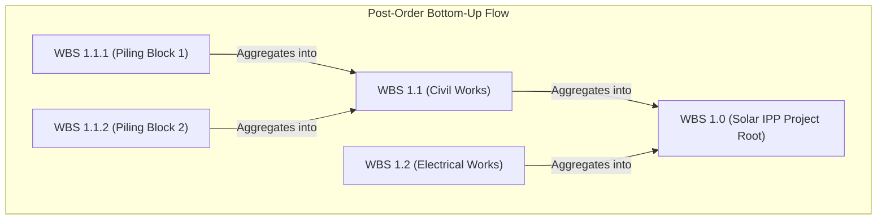

# Topic 2.4: WBS Rollup Formulas — The Mathematics and Algorithms of Hierarchical Aggregation in CPM Engines

---

## 1. Executive Summary: Bottom-Up Aggregation in Hierarchical Scheduling

In a production Critical Path Method (CPM) scheduling engine, a project exists simultaneously as two distinct mathematical structures:

1. **A Directed Acyclic Graph (DAG) of Activities:** Nodes represent discrete packages of physical work; directed edges represent logical dependencies ($\text{Finish-to-Start}$, $\text{Start-to-Start}$, $\text{Finish-to-Finish}$, $\text{Start-to-Finish}$) with calendar-based lead or lag times.
2. **A Hierarchical Containment Tree of WBS Nodes:** An $N$-ary tree rooted at the Project root, decomposing contractual scope into phases, sub-phases, systems, and work packages following the strict **100% Rule** (where the parent node represents exactly $100\%$ of the scope of its immediate children).

```
     CPM Activity Network (DAG)                   WBS Hierarchical Tree (Strict Tree)
     
        [Act A: Soil Survey]                               [1.0 Solar IPP Project]
                 │                                                     │
                 ▼ (FS)                                   ┌────────────┴────────────┐
        [Act B: Piling Work]                              ▼                         ▼
            │          │                         [1.1 Civil Works]       [1.2 Electrical Works]
       (FS) │          │ (SS+5d)                         │                         │
            ▼          ▼                         ┌───────┴───────┐                 ▼
      [Act C: Inverter] [Act D: DC Cabling]      ▼               ▼          [1.2.1 Inverters]
            │          │                  [1.1.1 Survey]  [1.1.2 Piling]           │
            └────┬─────┘                         │               │                 ▼
                 ▼ (FF)                          ▼               ▼            [Act C: Invert]
        [Act E: Grid Sync]                  [Act A: Soil]   [Act B: Piling]
```

### The Architectural Boundary: Activities Drive, WBS Summarizes

A fundamental tenet of enterprise project controls is the separation of **execution** from **summarization**:
* **Activities own execution parameters:** Calendars, durations, resource assignments, cost line-items, and dependency logic.
* **WBS nodes own aggregation parameters:** Analytical rollups, earned value summaries, security boundaries (OBS mappings), and executive reporting bars.

> [!IMPORTANT]
> **The Golden Law of WBS Nodes:**
> WBS summary nodes **never** own independent schedules, durations, or CPM logic links. A WBS node cannot have a direct Finish-to-Start relationship with another WBS node in the CPM network. 
> Every date, cost, unit, float value, and percentage complete on a WBS element is a **derived mathematical rollup** computed bottom-up from its descendant leaf activities.

### The Engineering Challenge

In enterprise mega-projects—such as our running reference project, the **100MW Solar IPP Project in Bhadla, Rajasthan, India** (spanning ₹450 Crore in capital expenditure and 2,400+ activities)—planners, subcontractors, and site engineers constantly update progress, remaining durations, and actual dates. 

If your backend engine (written in Golang) recalculates the entire CPM DAG and re-rolls the complete WBS tree on every single activity update, the system experiences $O(N)$ latency spikes, blocking real-time collaboration. 

Conversely, if rollups use naive arithmetic (such as averaging task completion percentages or subtracting summary finish dates to obtain float), executive dashboards report mathematically false progress and invalid critical paths.

This topic provides the formal mathematical definitions, failure modes, algorithmic implementations, and database synchronization patterns required to build a production-grade WBS rollup engine.

---

## 2. Date Rollup Formulas: The Temporal Mechanics

Unlike an activity—whose dates are computed via Forward Pass ($ES, EF$) and Backward Pass ($LS, LF$) traversing relationship edges—a WBS node's dates are determined strictly by **set aggregation** over its child elements.

```
                  WBS 1.1: Civil & Piling Works
         [=============================================] (WBS Summary Bar)
         ES: 01-Jan-2026                       EF: 25-Jan-2026
         
         Child Activity A: Topographical Survey
         [─────────]
         ES: 01-Jan-2026
         EF: 08-Jan-2026
                                Child Activity B: Tracker Piling
                                [─────────────────────────────]
                                ES: 10-Jan-2026
                                EF: 25-Jan-2026
         ├─────────┼───────────┼──────────────────────────────┤
         Jan 01    Jan 08      Jan 10                         Jan 25
                   ▲           ▲
                   └── Gap: ────┘ (Non-working or unscheduled interval)
```

### 2.1 Formal Mathematical Definitions

Let $W$ be a WBS node, and let $\mathcal{C}(W)$ denote the set of direct children of $W$. 
Let $\mathcal{L}(W)$ denote the set of all **leaf activities** that are descendants of $W$:
$$\mathcal{L}(W) = \{ a \in \text{Activities} \mid a \text{ is a descendant of } W \}$$

#### 1. Early Start ($ES$) and Early Finish ($EF$)
$$ES(W) = \min_{c \in \mathcal{C}(W)} ES(c) = \min_{a \in \mathcal{L}(W)} ES(a)$$
$$EF(W) = \max_{c \in \mathcal{C}(W)} EF(c) = \max_{a \in \mathcal{L}(W)} EF(a)$$

#### 2. Late Start ($LS$) and Late Finish ($LF$)
$$LS(W) = \min_{c \in \mathcal{C}(W)} LS(c) = \min_{a \in \mathcal{L}(W)} LS(a)$$
$$LF(W) = \max_{c \in \mathcal{C}(W)} LF(c) = \max_{a \in \mathcal{L}(W)} LF(a)$$

#### 3. Baseline / Planned Dates ($BL\_Start, BL\_Finish$)
$$BL\_Start(W) = \min_{a \in \mathcal{L}(W)} BL\_Start(a)$$
$$BL\_Finish(W) = \max_{a \in \mathcal{L}(W)} BL\_Finish(a)$$

#### 4. Actual Dates ($AS, AF$)
The Actual Start ($AS$) rolls up as soon as the earliest child commences:
$$AS(W) = \begin{cases} 
\min \{ AS(a) \mid a \in \mathcal{L}(W) \text{ and } a.\text{IsStarted} \} & \text{if } \exists a \in \mathcal{L}(W): a.\text{IsStarted} \\
\text{NULL} & \text{otherwise}
\end{cases}$$

The Actual Finish ($AF$) rolls up **if and only if all descendant activities have finished**:
$$AF(W) = \begin{cases} 
\max \{ AF(a) \mid a \in \mathcal{L}(W) \} & \text{if } \forall a \in \mathcal{L}(W): a.\text{IsCompleted} \\
\text{NULL} & \text{otherwise}
\end{cases}$$

> [!CAUTION]
> **The Premature Actual Finish Trap:**
> A junior engineer might write: `AF(W) = max(AF(a))` over all completed children. 
> If a WBS node contains 10 activities, and 9 are 100% completed with actual finish dates, but 1 activity is still in progress (or not started), the WBS node **must not** have an Actual Finish date! 
> If an Actual Finish is stamped while children are open, downstream reporting engines will treat the entire work package as closed, freezing earned value calculations and hiding open contractual liabilities.

#### 5. Current (Display) Start and Finish
In Primavera P6, the standard columns `Start` and `Finish` represent the unified operational view:
$$\text{Start}(W) = \begin{cases} AS(W) & \text{if } AS(W) \neq \text{NULL} \\ ES(W) & \text{otherwise} \end{cases}$$
$$\text{Finish}(W) = \begin{cases} AF(W) & \text{if } AF(W) \neq \text{NULL} \\ EF(W) & \text{otherwise} \end{cases}$$

---

### 2.2 The Non-Continuous Duration Paradox (Spanned vs Calendar Duration)

In CPM activities:
$$\text{Planned Duration} = EF - ES \quad (\text{adjusted for non-working calendar shifts})$$

In WBS Summary Nodes, **durations do not sum**:
$$\text{Duration}(W) \neq \sum_{a \in \mathcal{L}(W)} \text{Duration}(a)$$

Consider two activities under `WBS 1.2: Inverter Foundations`:
* **Activity A (Excavation):** Jan 1 to Jan 5 (Duration = 5 days).
* **Activity B (Concrete Pour):** Jan 20 to Jan 25 (Duration = 6 days).

Sum of child durations = $5 + 6 = 11\text{ days}$.

However, the WBS summary bar begins on **Jan 1** and finishes on **Jan 25**.
* The **Spanned Calendar Duration** is $25\text{ calendar days}$.
* The **Effective Working Duration** of the WBS node depends on the calendar assigned to the WBS node itself (e.g., 6-day Rajasthan site calendar vs 5-day corporate calendar).

If the WBS node uses a 6-day work-week calendar (Sundays off), the duration between Jan 1 and Jan 25 evaluates to 21 working days, even though only 11 days of physical labor are scheduled!

```
Calendar Days:  1   2   3 ... 8  9 10 ... 19 20 21 22 23 24 25
Activity A:    [===========]
Gap:                       [───────────────]
Activity B:                                 [================]
WBS Node:      [=============================================]
               Total Spanned Duration = 25 days (Work = 11 days, Idle = 14 days)
```

---

### 2.3 Handling Empty WBS Nodes (Leaf WBS with Zero Activities)

In enterprise EPC scheduling, project controllers frequently set up the WBS tree weeks before work package planners load individual activities.

```
Project Root
├── 1.0 Engineering (Loaded: 120 activities)
├── 2.0 Procurement (Loaded: 450 activities)
└── 3.0 Commissioning & Grid Interconnection (Empty: 0 activities)
```

If your Go backend executes:
```go
minDate := time.Date(9999, 12, 31, 0, 0, 0, 0, time.UTC)
for _, child := range node.Children {
    if child.EarlyStart.Before(minDate) {
        minDate = child.EarlyStart
    }
}
```
An empty WBS node would evaluate to `9999-12-31` or crash with an uninitialized zero time `0001-01-01T00:00:00Z`.

#### The P6 Engine Invariant for Empty Nodes:
1. An empty WBS node has:
   $$ES = \text{NULL}, \quad EF = \text{NULL}, \quad LS = \text{NULL}, \quad LF = \text{NULL}$$
2. **Upward Propagation Filter:** In all parent aggregation sets, empty nodes are excluded from $\min$ and $\max$ calculations:
   $$ES(Parent) = \min \{ ES(c) \mid c \in \mathcal{C}(Parent) \text{ and } ES(c) \neq \text{NULL} \}$$
3. **All-Empty Parent:** If *all* descendants of a parent node are empty, the parent itself evaluates to $\text{NULL}$.
4. **UI Gantt Contract:** If $ES(W) == \text{NULL}$, the frontend (Next.js) renders **no summary bar**, displaying an empty row with an icon indicating an unpopulated work package.

---

### 2.4 The "Data Date Split": Rendering Summary Bars Across the Status Line

In CPM scheduling, the **Data Date ($DD$)** (also termed "Status Date" or "Time Now") is the temporal dividing line:
* Everything to the left ($t \le DD$) represents **historical reality** (Actuals).
* Everything to the right ($t > DD$) represents **future CPM forecast** (Remaining Early/Late dates).

```
                             DATA DATE (STATUS LINE)
                                        │
                                        │◄────── FUTURE FORECAST ──────►
     ◄────── HISTORICAL REALITY ────────┼
                                        │
WBS Summary Bar:                        │
[▓▓▓▓▓▓▓▓▓▓▓▓▓▓▓▓▓▓▓▓▓▓▓▓▓▓▓▓▓▓▓▓▓▓▓▓▓▓▓│░░░░░░░░░░░░░░░░░░░░░░░░░░░░░░]
▲                                       ▲                              ▲
Actual Start                            Data Date                      Forecast Finish
(Solid / Dark Charcoal)                 (Split Line)                   (Hatched / Light Blue)
```

When rendering a WBS summary bar in Next.js Gantt:
1. **Actual Segment ($AS \to \min(DD, \text{Max Child Progress Date})$):** Drawn as a solid bar representing completed historical work.
2. **Remaining Segment ($\max(DD, \min(\text{Child Remaining Starts})) \to EF$):** Drawn as a patterned or lighter bar representing uncompleted future work.
3. If an activity suffered from an **out-of-sequence execution** (work performed prior to predecessors finishing), the WBS summary bar splits into disjointed graphical intervals to prevent misrepresenting unworked gap time as active production.

---

## 3. Progress & Percentage Complete Rollup Formulas

Progress rollup is the most legally contested aspect of project controls. Subcontractors submit monthly invoices claiming progress percentages; EPC contractors and project owners verify these claims against P6 WBS rollups.

There are **three distinct mathematical models** used in Primavera P6:

```
                            PROGRESS ROLLUP MODELS
                                      │
         ┌────────────────────────────┼────────────────────────────┐
         ▼                            ▼                            ▼
1. Duration-Weighted         2. Cost-Weighted (EVM)       3. Units-Weighted
   Time-based progress          Monetary-based (BAC)         Labor-hour based
   Vulnerable to duration       Contractual gold standard    Insulated from material
   inflation & idling           in EPC construction          cost front-loading
```

---

### 3.1 Model 1: Duration-Weighted Progress

#### Mathematical Formulation
$$\%_{\text{Duration}}(W) = \frac{\sum_{a \in \mathcal{L}(W)} \left( \text{Planned Duration}(a) \times \text{Progress \%}(a) \right)}{\sum_{a \in \mathcal{L}(W)} \text{Planned Duration}(a)}$$

Alternatively, if evaluated using Remaining Durations:
$$\%_{\text{Duration}}(W) = \frac{\sum \text{Planned Duration}(a) - \sum \text{Remaining Duration}(a)}{\sum \text{Planned Duration}(a)}$$

#### Why Duration Weighting Fails in Capital EPC Projects (The Skew Paradox)

Consider **WBS 1.2: 220kV Pooling Substation**:

| Activity | Scope | Planned Duration | Budget (INR) | Progress % | Weighted Duration Days |
| :--- | :--- | :--- | :--- | :--- | :--- |
| **Act A: Transformer Oil Curing** | Passive waiting / chemical stabilization | 60 days | ₹50,000 | 100% | $60 \times 1.0 = 60$ |
| **Act B: Power Transformer Installation** | Heavy crane rigging, specialized labor | 5 days | ₹12,00,00,000 | 0% | $5 \times 0.0 = 0$ |
| **TOTAL** | | **65 days** | **₹12,00,50,000** | | **60 / 65 = 92.3%** |

* **Duration-Weighted Rollup:**
  $$\%_{\text{Duration}} = \frac{(60 \times 100\%) + (5 \times 0\%)}{60 + 5} = \frac{60}{65} = \mathbf{92.3\%}$$
* **Executive Dashboard Interpretation:** "The 220kV Substation package is 92% complete!"
* **Physical Reality on Site:** The ₹12 Crore power transformers have not even been lifted onto their pads. The package has achieved less than $0.1\%$ of its true physical and financial milestones.

> [!WARNING]
> **When Duration Weighting is Permissible:**
> Duration weighting is mathematically valid **only** when all activities under the WBS node possess roughly homogeneous resource burning rates (e.g., standard road excavation where every kilometer takes 10 days and costs roughly ₹20 Lakhs). In mixed EPC packages, duration weighting creates catastrophic illusions of progress.

---

### 3.2 Model 2: Cost-Weighted Progress (Earned Value Rollup — The Contractual Standard)

Earned Value Management (EVM, ANSI/EIA-748 standard) solves the duration paradox by weighting every activity by its approved monetary baseline: **Budget at Completion (BAC)**.

#### Mathematical Formulation
$$\text{Earned Value}(a) = \text{BAC}(a) \times \text{Physical \% Complete}(a)$$

$$BAC(W) = \sum_{a \in \mathcal{L}(W)} BAC(a)$$

$$EV(W) = \sum_{a \in \mathcal{L}(W)} EV(a) = \sum_{a \in \mathcal{L}(W)} \left( BAC(a) \times \text{Physical \% Complete}(a) \right)$$

$$\%_{\text{Cost}}(W) = \frac{EV(W)}{BAC(W)} = \frac{\sum_{a \in \mathcal{L}(W)} \left( BAC(a) \times \text{Physical \% Complete}(a) \right)}{\sum_{a \in \mathcal{L}(W)} BAC(a)}$$

#### Re-evaluating the 220kV Substation Example via Cost Weighting:
* $EV(\text{Act A}) = ₹50,000 \times 1.00 = ₹50,000$
* $EV(\text{Act B}) = ₹12,00,00,000 \times 0.00 = ₹0$
* $BAC(\text{Total}) = ₹12,00,50,000$
$$\%_{\text{Cost}} = \frac{₹50,000}{₹12,00,50,000} = \mathbf{0.0416\%}$$

The cost-weighted rollup reports **0.04% progress**, accurately reflecting the true financial and contractual standing of the work package.

```
                              EV AND COST ROLLUP TREE
                                         
                                  [WBS 1.2 Substation]
                                  BAC: ₹12,00,50,000
                                  EV:  ₹50,000
                                  Rollup %: 0.04%
                                         │
                    ┌────────────────────┴────────────────────┐
                    ▼                                         ▼
            [Act A: Oil Curing]                     [Act B: Transformer Inst]
            BAC: ₹50,000                            BAC: ₹12,00,00,000
            Physical %: 100%                        Physical %: 0%
            EV:  ₹50,000                            EV:  ₹0
```

#### Schedule & Cost Variances at WBS Level
* **Planned Value ($PV$):**
  $$PV(W) = \sum_{a \in \mathcal{L}(W)} \left( BAC(a) \times \text{Schedule \% Complete}(a) \right)$$
* **Actual Cost ($AC$ / $ACWP$):**
  $$AC(W) = \sum_{a \in \mathcal{L}(W)} \text{Actual Cost}(a)$$
* **Cost Variance ($CV$) and Schedule Variance ($SV$):**
  $$CV(W) = EV(W) - AC(W)$$
  $$SV(W) = EV(W) - PV(W)$$
* **Indices ($CPI, SPI$):**
  $$CPI(W) = \frac{EV(W)}{AC(W)}, \quad SPI(W) = \frac{EV(W)}{PV(W)}$$

---

### 3.3 Model 3: Units / Labor-Hours Weighted Progress

While Cost Weighting is the gold standard for executive billing, it possesses an operational flaw known as **Procurement Front-Loading**.

#### The Procurement Inflation Distortion
In solar plants, photovoltaic (PV) modules account for roughly $55\%$ of the total ₹450 Crore budget. 
* When 250,000 solar panels arrive on flatbed trucks at the Bhadla site, ₹247.5 Crore of material invoices are booked.
* If cost weighting alone is used across the project, the overall project immediately jumps from $10\%$ to $65\%$ complete, despite the fact that **zero piling has been driven, zero mounting structures assembled, and zero inverters wired**.
* The field construction contractor's severe 6-month delay in piling is completely hidden behind the module supply invoice.

#### The Labor-Units Rollup Formula
To track construction productivity independently of equipment procurement, project controllers use **Labor-Units Weighting**:

$$\text{Earned Labor Units}(a) = \text{Budgeted Labor Units}(a) \times \text{Labor \% Complete}(a)$$

$$\%_{\text{Units}}(W) = \frac{\sum_{a \in \mathcal{L}(W)} \text{Earned Labor Units}(a)}{\sum_{a \in \mathcal{L}(W)} \text{Budgeted Labor Units}(a)}$$

By isolating labor hours (man-hours), the engine measures pure sweat equity:
* Material Supply: $0\text{ labor hours}$.
* Tracker Piling: $45,000\text{ labor hours}$.
* Module Mounting: $60,000\text{ labor hours}$.
If piling slips, the Labor-Units WBS progress instantly flags the delay to the site director.

---

### 3.4 Summary Comparison of Weighting Models

| Rollup Metric | Mathematical Basis | Primary Industry Use Case | Vulnerability / Bias |
| :--- | :--- | :--- | :--- |
| **Duration-Weighted** | $\sum (D_i \times \%_i) / \sum D_i$ | Conceptual phase; homogeneous civil earthworks | Biased toward long, low-effort passive tasks (curing, waiting) |
| **Cost-Weighted (EV)** | $\sum EV_i / \sum BAC_i$ | EPC contractual billing, FIDIC milestone claims | Masked by high-value capital equipment deliveries |
| **Labor-Units Weighted**| $\sum EarnedUnits_i / \sum BudgetUnits_i$ | Field engineering, subcontractor productivity | Ignores equipment/material bottlenecks entirely |

---

## 4. Total Float & Critical Path Rollup: The Analytical Dilemma

One of the most dangerous architectural mistakes in scheduling engine design is assuming that Total Float ($TF$) on a WBS node is simply the difference between its rolled-up Late Finish and Early Finish:

$$\mathbf{FATAL\ TRAP:} \quad TF(W) \stackrel{?}{=} LF(W) - EF(W)$$

Let us prove mathematically why this formula is **completely false**.

---

### 4.1 Mathematical Proof of the Float Fallacy

Consider a simple Work Breakdown node: `WBS 2.1: Solar Block 1 Inverter Skid`.
Assume `WBS 2.1` contains exactly two child activities:

```
Timeline:  Day 0    Day 10   Day 20   Day 30   Day 40   Day 50
Act 1:     [======] (Crit)
           ES=0, EF=10, LS=0, LF=10  ===> Total Float = 0

Act 2:                                [======] (Non-Crit)
                                      ES=30, EF=40, LS=40, LF=50 ===> Total Float = 10
```

* **Activity 1 (Inverter Transformer Delivery):**
  * $ES = 0, \quad EF = 10$
  * $LS = 0, \quad LF = 10$
  * $TF_1 = LF_1 - EF_1 = 10 - 10 = \mathbf{0\text{ days}}$ (Critical Path!)
* **Activity 2 (Inverter Nameplate Signage):**
  * $ES = 30, \quad EF = 40$
  * $LS = 40, \quad LF = 50$
  * $TF_2 = LF_2 - EF_2 = 50 - 40 = \mathbf{10\text{ days}}$ (Float buffer)

#### Now, evaluate WBS 2.1 using the Naive Formula:
1. Roll up Early Finish:
   $$EF(W) = \max(EF_1, EF_2) = \max(10, 40) = 40$$
2. Roll up Late Finish:
   $$LF(W) = \max(LF_1, LF_2) = \max(10, 50) = 50$$
3. Compute Naive Float:
   $$TF_{\text{naive}}(W) = LF(W) - EF(W) = 50 - 40 = \mathbf{10\text{ days}}$$

#### The Catastrophe:
The naive formula reports that `WBS 2.1` has **10 days of positive float**! 
An executive reviewing the summary Gantt chart concludes that the Inverter Skid is safely off the critical path with 10 days of schedule buffer. 

In reality, **Activity 1 is zero-float critical**; if Transformer Delivery slips by even 24 hours, the entire ₹450 Crore solar farm misses its commercial operation date (COD).

```
Activity 1 Float:  [0]  (CRITICAL!)
Activity 2 Float:       [10] (Non-critical)

Naive WBS Float:        [10]  <--- FALSE! Masks critical activity!
P6 Rollup Float:   [0]        <--- TRUE! Inherits minimum driving float!
```

---

### 4.2 The Driving Path Float Rollup Formula

Primavera P6 resolves this through the **Minimum Child Float Rule**:
$$TF(W) = \min_{c \in \mathcal{C}(W)} TF(c) = \min_{a \in \mathcal{L}(W)} TF(a)$$

#### Criticality Rule for WBS Nodes:
A WBS node is defined as **Critical** if and only if at least one of its descendant activities is critical:
$$\text{IsCritical}(W) \iff \exists a \in \mathcal{L}(W) \text{ such that } \text{IsCritical}(a) == \text{true}$$

Under standard CPM conventions with zero project constraints:
$$\text{IsCritical}(W) \iff TF(W) \le 0$$

(If the project specifies a custom critical float threshold $\tau$, e.g., $TF \le 5\text{ days}$, then $\text{IsCritical}(W) \iff TF(W) \le \tau$).

#### Visual Gantt Impact:
In Next.js Gantt charts:
* When $TF(W) \le 0$, the WBS summary bar renders in **Crimson Red**.
* When $TF(W) > 0$, the WBS summary bar renders in **Navy Blue** or **Dark Gray**.
* A single critical child deep in sub-tier `WBS 1.2.3.4.1` turns all parent summary bars red all the way up to the Project Root!

---

## 5. Algorithmic Implementation in Golang: Production Scheduling Engine

To achieve enterprise-grade performance in a P6-like engine, we must implement two complementary rollup algorithms:
1. **Full Project Rollup ($O(N)$ Post-Order Traversal):** Executed after a complete CPM forward/backward pass.
2. **Incremental Ancestor Walk ($O(h)$ Walk):** Executed when a user updates progress or actual dates on a single activity in real time.

---

### 5.1 Data Structures

```go
package rollup

import (
	"sync"
	"time"
)

// Activity represents an execution leaf node in the CPM network.
type Activity struct {
	ID                 string
	WBSID              string
	EarlyStart         time.Time
	EarlyFinish        time.Time
	LateStart          time.Time
	LateFinish         time.Time
	ActualStart        *time.Time
	ActualFinish       *time.Time
	PlannedDuration    float64 // In days/hours
	RemainingDuration  float64
	PhysicalPercent    float64 // 0.0 to 1.0
	BAC                float64 // Budget at Completion (Currency)
	BudgetedLaborHours float64
	LaborPercent       float64 // 0.0 to 1.0
	TotalFloat         float64
	IsCritical         bool
	IsStarted          bool
	IsCompleted        bool
}

// WBSNode represents a summary node in the hierarchical tree.
type WBSNode struct {
	ID       string
	ParentID *string
	Name     string

	// Direct child collections
	ChildNodes []*WBSNode
	Activities []*Activity

	// Rolled-up metrics (Summary cache)
	mu                 sync.RWMutex
	EarlyStart         *time.Time
	EarlyFinish        *time.Time
	LateStart          *time.Time
	LateFinish         *time.Time
	ActualStart        *time.Time
	ActualFinish       *time.Time
	BAC                float64
	EarnedValue        float64
	CostPercent        float64
	DurationPercent    float64
	LaborPercent       float64
	BudgetedLaborHours float64
	EarnedLaborHours   float64
	TotalFloat         float64
	IsCritical         bool
	HasActivities      bool
}
```

---

### 5.2 Algorithm 1: Iterative Post-Order Traversal ($O(N)$ Full Pass)

While recursive tree traversals are simple to write, a deep WBS tree (or an enterprise model with 100,000 activities) risks call-stack overflow in high-concurrency server environments.

An **iterative post-order traversal** using two stacks guarantees bottom-up evaluation in strictly $O(N)$ time and $O(N)$ space, ensuring children are fully aggregated before their parent is touched.



```go
package rollup

import (
	"math"
	"time"
)

// RollupProject performs a single-pass, bottom-up post-order aggregation across the entire WBS tree.
func RollupProject(root *WBSNode) {
	if root == nil {
		return
	}

	// Step 1: Generate Post-Order Evaluation Sequence using 2-stack traversal
	var stack1 []*WBSNode
	var postOrder []*WBSNode

	stack1 = append(stack1, root)
	for len(stack1) > 0 {
		curr := stack1[len(stack1)-1]
		stack1 = stack1[:len(stack1)-1]
		postOrder = append(postOrder, curr)

		for _, child := range curr.ChildNodes {
			stack1 = append(stack1, child)
		}
	}

	// Step 2: Traverse in reverse order (Leaves to Root)
	for i := len(postOrder) - 1; i >= 0; i-- {
		node := postOrder[i]
		aggregateNode(node)
	}
}

// aggregateNode aggregates metrics from direct activities and child WBS nodes.
func aggregateNode(node *WBSNode) {
	node.mu.Lock()
	defer node.mu.Unlock()

	var (
		minES, maxEF *time.Time
		minLS, maxLF *time.Time
		minAS        *time.Time
		maxAF        *time.Time

		allActivitiesCompleted = true
		hasAnyActivities       = false

		totalBAC          float64
		totalEV           float64
		totalPlannedDur   float64
		weightedDurProg   float64
		totalBudgetLabor  float64
		totalEarnedLabor  float64
		minTotalFloat     = math.MaxFloat64
		anyCritical       = false
	)

	// 1. Roll up from direct leaf Activities
	if len(node.Activities) > 0 {
		hasAnyActivities = true
		for _, a := range node.Activities {
			// Early Dates
			minES = minTime(minES, &a.EarlyStart)
			maxEF = maxTime(maxEF, &a.EarlyFinish)

			// Late Dates
			minLS = minTime(minLS, &a.LateStart)
			maxLF = maxTime(maxLF, &a.LateFinish)

			// Actual Dates
			if a.IsStarted && a.ActualStart != nil {
				minAS = minTime(minAS, a.ActualStart)
			}
			if a.IsCompleted && a.ActualFinish != nil {
				maxAF = maxTime(maxAF, a.ActualFinish)
			} else {
				allActivitiesCompleted = false
			}

			// Financials & EVM
			totalBAC += a.BAC
			ev := a.BAC * a.PhysicalPercent
			totalEV += ev

			// Duration Weighting
			totalPlannedDur += a.PlannedDuration
			weightedDurProg += (a.PlannedDuration * a.PhysicalPercent)

			// Labor Hours Weighting
			totalBudgetLabor += a.BudgetedLaborHours
			earnedLabor := a.BudgetedLaborHours * a.LaborPercent
			totalEarnedLabor += earnedLabor

			// Float & Criticality
			if a.TotalFloat < minTotalFloat {
				minTotalFloat = a.TotalFloat
			}
			if a.IsCritical {
				anyCritical = true
			}
		}
	}

	// 2. Roll up from child WBS nodes
	for _, child := range node.ChildNodes {
		child.mu.RLock()
		if child.HasActivities {
			hasAnyActivities = true

			minES = minTime(minES, child.EarlyStart)
			maxEF = maxTime(maxEF, child.EarlyFinish)
			minLS = minTime(minLS, child.LateStart)
			maxLF = maxTime(maxLF, child.LateFinish)

			if child.ActualStart != nil {
				minAS = minTime(minAS, child.ActualStart)
			}
			if child.ActualFinish != nil {
				maxAF = maxTime(maxAF, child.ActualFinish)
			} else {
				allActivitiesCompleted = false
			}

			totalBAC += child.BAC
			totalEV += child.EarnedValue
			totalBudgetLabor += child.BudgetedLaborHours
			totalEarnedLabor += child.EarnedLaborHours

			if child.TotalFloat < minTotalFloat {
				minTotalFloat = child.TotalFloat
			}
			if child.IsCritical {
				anyCritical = true
			}
		}
		child.mu.RUnlock()
	}

	// 3. Store aggregated values
	node.HasActivities = hasAnyActivities
	if !hasAnyActivities {
		node.EarlyStart = nil
		node.EarlyFinish = nil
		node.LateStart = nil
		node.LateFinish = nil
		node.ActualStart = nil
		node.ActualFinish = nil
		node.TotalFloat = 0
		node.IsCritical = false
		return
	}

	node.EarlyStart = minES
	node.EarlyFinish = maxEF
	node.LateStart = minLS
	node.LateFinish = maxLF
	node.ActualStart = minAS

	// Contract Rule: AF is set if and only if ALL descendants are completed
	if allActivitiesCompleted && maxAF != nil {
		node.ActualFinish = maxAF
	} else {
		node.ActualFinish = nil
	}

	node.BAC = totalBAC
	node.EarnedValue = totalEV
	if totalBAC > 0 {
		node.CostPercent = totalEV / totalBAC
	} else {
		node.CostPercent = 0
	}

	node.BudgetedLaborHours = totalBudgetLabor
	node.EarnedLaborHours = totalEarnedLabor
	if totalBudgetLabor > 0 {
		node.LaborPercent = totalEarnedLabor / totalBudgetLabor
	} else {
		node.LaborPercent = 0
	}

	if totalPlannedDur > 0 {
		node.DurationPercent = weightedDurProg / totalPlannedDur
	} else {
		node.DurationPercent = 0
	}

	if minTotalFloat != math.MaxFloat64 {
		node.TotalFloat = minTotalFloat
	} else {
		node.TotalFloat = 0
	}
	node.IsCritical = anyCritical
}

func minTime(a, b *time.Time) *time.Time {
	if a == nil {
		return b
	}
	if b == nil {
		return a
	}
	if a.Before(*b) {
		return a
	}
	return b
}

func maxTime(a, b *time.Time) *time.Time {
	if a == nil {
		return b
	}
	if b == nil {
		return a
	}
	if a.After(*b) {
		return a
	}
	return b
}
```

---

### 5.3 Algorithm 2: Real-Time Incremental Ancestor Walk ($O(h)$ Update)

In interactive web applications (e.g., Next.js frontend with WebSockets), a site engineer in Rajasthan marks `Activity B (Tracker Piling Block 4)` from $40\%$ to $60\%$. 
Triggering a full $O(N)$ project recalculation is unacceptably wasteful.

We implement an **Incremental Ancestor Walk**:
1. Identify the parent WBS of the updated activity: $W_0 = \text{Activity.WBS}$.
2. Re-aggregate $W_0$ across its direct activities and direct child WBS nodes.
3. Traverse upward: $W_1 = \text{Parent}(W_0), \dots, W_{\text{root}}$.
4. Terminate at the root or early-exit if metrics on $W_k$ remain identical to its prior values.

```
Activity Update: [Act B: 40% -> 60%]
       │
       ▼
 [WBS 1.1.2: Piling Block 4]    (Re-aggregated locally: O(k_children))
       │
       ▼
 [WBS 1.1: Civil Works]         (Re-aggregated locally: O(k_children))
       │
       ▼
 [WBS 1.0: Project Root]        (Re-aggregated locally: O(k_children))
```

#### Why Delta Updates Cannot Be Used for Dates and Float:
A common optimization attempt is "delta accumulation" (e.g., $EV_{\text{new}} = EV_{\text{old}} + \Delta EV$).
While delta accumulation works for additive linear sums ($BAC, EV, \text{Labor Hours}$), **it fails completely for non-linear extrema ($\min / \max$)**:
* If Child A had the minimum Early Start date ($Jan\ 01$), and Child A's start slips to $Jan\ 10$, you cannot know the new WBS Early Start without inspecting the start dates of all other sibling children!
* Therefore, the ancestor walk must re-evaluate extrema across **direct children** at each ascending tier. 
* Because an enterprise WBS rarely exceeds a depth of $h = 6$ levels, and branching factors are typically $5 \le k \le 20$, an ancestor walk computes in less than $0.1\text{ ms}$.

```go
// UpdateActivityAndRollupAncestors handles real-time single activity updates with an ancestor walk.
func UpdateActivityAndRollupAncestors(wbsLookup map[string]*WBSNode, updatedActivity *Activity) {
	currWBSID := updatedActivity.WBSID

	for currWBSID != "" {
		node, exists := wbsLookup[currWBSID]
		if !exists || node == nil {
			break
		}

		// Snapshot previous values to support early exit
		node.mu.RLock()
		prevEV := node.EarnedValue
		prevEF := node.EarlyFinish
		prevTF := node.TotalFloat
		node.mu.RUnlock()

		// Recompute node
		aggregateNode(node)

		// Check if key metrics changed. If unchanged, stop upward traversal.
		node.mu.RLock()
		unchanged := (node.EarnedValue == prevEV) &&
			equalTimePtr(node.EarlyFinish, prevEF) &&
			(node.TotalFloat == prevTF)
		node.mu.RUnlock()

		if unchanged {
			break // Early exit: ancestor state will not change
		}

		if node.ParentID == nil {
			break
		}
		currWBSID = *node.ParentID
	}
}

func equalTimePtr(t1, t2 *time.Time) bool {
	if t1 == nil && t2 == nil {
		return true
	}
	if t1 == nil || t2 == nil {
		return false
	}
	return t1.Equal(*t2)
}
```

---

### 5.4 Concurrency & Thread-Safety: Deadlock-Free Hierarchical Locking

When 50 site engineers submit progress updates concurrently from different mobile devices across the 100MW site, goroutines execute ancestor walks simultaneously.

If Goroutine 1 walks from `Node 1.1.1` up to `Root`, while Goroutine 2 updates sister node `Node 1.1.2` up to `Root`, they both compete for read and write locks on parent nodes.

#### Deadlock Rule: Strict Ascending Lock Acquisition
To prevent circular deadlocks:
1. Locks must **never** be held across hierarchical transitions. 
2. In `aggregateNode(node)`:
   * First, lock the parent: `node.mu.Lock()`.
   * For each child: acquire read lock `child.mu.RLock()`, copy scalars, and **immediately release** `child.mu.RUnlock()`.
   * Never hold a child lock while waiting for a parent lock!

---

## 6. PostgreSQL Database Storage & Aggregation Architecture

When designing the persistence layer in PostgreSQL, systems architects face a key tradeoff:
* **Option A: Pure On-the-Fly Aggregation (Recursive CTEs)**
* **Option B: Materialized Summary Columns on `wbs_nodes`**

---

### 6.1 Tradeoff Matrix

| Architecture Strategy | Read Performance (Gantt API) | Write Performance (Progress Update) | Data Consistency Risk | P6 Cloud / Enterprise Standard |
| :--- | :--- | :--- | :--- | :--- |
| **Recursive CTE ($O(N)$ Read)** | Poor ($100\text{ms} - 2\text{s}$ for 10K rows) | Instant ($O(1)$ row update) | Zero (Always 100% normalized) | Used only for ad-hoc auditing reports |
| **Materialized Summary Columns** | Extreme ($< 5\text{ms}$ indexed `SELECT`) | Controlled ($O(h)$ ancestor update) | Requires transactional integrity | **Industry Standard** (Primavera P6, MS Project Server) |

---

### 6.2 The Recursive CTE Query (Analytical Gold Standard)

The following production PostgreSQL query computes the complete bottom-up rollup on the fly using a recursive Common Table Expression (CTE). It traverses from leaf activities up through the WBS closure:

```sql
-- PostgreSQL Recursive CTE: Dynamic Bottom-Up WBS Rollup
WITH RECURSIVE wbs_tree AS (
    -- Anchor: Select all WBS nodes
    SELECT 
        id,
        project_id,
        parent_id,
        code,
        name,
        ARRAY[id] AS path
    FROM wbs_nodes
    WHERE project_id = 'proj-rajasthan-100mw'

    UNION ALL

    -- Recursive: Link parent to children
    SELECT 
        child.id,
        child.project_id,
        child.parent_id,
        child.code,
        child.name,
        parent.path || child.id
    FROM wbs_nodes child
    JOIN wbs_tree parent ON child.parent_id = parent.id
),
activity_rollup AS (
    -- Aggregate activities grouped by their direct WBS node
    SELECT 
        wbs_id,
        COUNT(id) AS activity_count,
        MIN(early_start) AS min_es,
        MAX(early_finish) AS max_ef,
        MIN(late_start) AS min_ls,
        MAX(late_finish) AS max_lf,
        MIN(actual_start) FILTER (WHERE is_started = true) AS min_as,
        MAX(actual_finish) FILTER (WHERE is_completed = true) AS max_af,
        BOOL_AND(is_completed) AS all_completed,
        SUM(planned_duration) AS total_planned_dur,
        SUM(planned_duration * physical_percent) AS weighted_dur_prog,
        SUM(bac) AS total_bac,
        SUM(bac * physical_percent) AS total_ev,
        SUM(budgeted_labor_hours) AS total_budget_labor,
        SUM(budgeted_labor_hours * labor_percent) AS total_earned_labor,
        MIN(total_float) AS min_float,
        BOOL_OR(is_critical) AS has_critical
    FROM activities
    WHERE project_id = 'proj-rajasthan-100mw'
    GROUP BY wbs_id
),
node_descendants AS (
    -- Associate every WBS node with all its descendant WBS nodes (including self)
    SELECT 
        ancestor.id AS ancestor_id,
        descendant.id AS descendant_id
    FROM wbs_nodes ancestor
    JOIN wbs_tree descendant ON ancestor.id = ANY(descendant.path)
)
SELECT 
    w.id AS wbs_id,
    w.code,
    w.name,
    MIN(ar.min_es) AS early_start,
    MAX(ar.max_ef) AS early_finish,
    MIN(ar.min_ls) AS late_start,
    MAX(ar.max_lf) AS late_finish,
    MIN(ar.min_as) AS actual_start,
    CASE 
        WHEN BOOL_AND(ar.all_completed) = true THEN MAX(ar.max_af) 
        ELSE NULL 
    END AS actual_finish,
    SUM(ar.total_bac) AS bac,
    SUM(ar.total_ev) AS earned_value,
    CASE 
        WHEN SUM(ar.total_bac) > 0 THEN ROUND((SUM(ar.total_ev) / SUM(ar.total_bac)) * 100.0, 2)
        ELSE 0.00 
    END AS cost_percent_complete,
    CASE 
        WHEN SUM(ar.total_planned_dur) > 0 THEN ROUND((SUM(ar.weighted_dur_prog) / SUM(ar.total_planned_dur)) * 100.0, 2)
        ELSE 0.00 
    END AS duration_percent_complete,
    CASE 
        WHEN SUM(ar.total_budget_labor) > 0 THEN ROUND((SUM(ar.total_earned_labor) / SUM(ar.total_budget_labor)) * 100.0, 2)
        ELSE 0.00 
    END AS labor_percent_complete,
    MIN(ar.min_float) AS total_float,
    COALESCE(BOOL_OR(ar.has_critical), false) AS is_critical
FROM wbs_nodes w
LEFT JOIN node_descendants nd ON w.id = nd.ancestor_id
LEFT JOIN activity_rollup ar ON nd.descendant_id = ar.wbs_id
WHERE w.project_id = 'proj-rajasthan-100mw'
GROUP BY w.id, w.code, w.name
ORDER BY w.code;
```

---

### 6.3 Why Production Engines Reject Database Triggers for CPM Rollups

Many relational database architects suggest placing `AFTER UPDATE` triggers on the `activities` table to update the `wbs_nodes` materialized summary columns.

In high-volume CPM scheduling, **database triggers are strongly discouraged**:
1. **The CPM Batch Scheduling Problem:** When a project scheduler hits "F9" (Run CPM Schedule), the backend engine recalculates dates for 10,000 activities in memory. If this updates 10,000 rows in Postgres, an `AFTER UPDATE` trigger fires 10,000 separate recursive tree updates, resulting in severe lock contention, write amplification, and database freezes.
2. **Calendar Inconsistencies:** WBS rollup durations depend on working calendars. Storing complex holiday calendars and shifts in PL/pgSQL functions is notoriously slow and difficult to unit test compared to compiled Golang engines.
3. **Application-Layer Control:** Modern scheduling platforms (including Oracle Primavera Cloud and modern SaaS platforms) perform the calculations in a dedicated Go/Rust scheduling microservice, writing batch summaries to the database within a single unified database transaction (`BEGIN ... COMMIT`).

---

## 7. Comprehensive Case Study: 100MW Solar IPP Project (Rajasthan, India)

To anchor these concepts in real-world engineering, let us walk through a complete numerical dataset from the **100MW Solar IPP Project** located in the Thar Desert, Rajasthan.

```
                               PROJECT STRUCTURE (₹450 CRORE)
                                              │
                    ┌─────────────────────────┴─────────────────────────┐
                    ▼                                                   ▼
         [WBS 1.0: Civil Works]                             [WBS 2.0: Electrical Works]
         Budget: ₹50 Crore                                  Budget: ₹400 Crore
                    │                                                   │
         ┌──────────┴──────────┐                             ┌──────────┴──────────┐
         ▼                     ▼                             ▼                     ▼
[1.1 Site Roads]      [1.2 Tracker Piling]         [2.1 PV Modules Supply]   [2.2 Inverters & Grid]
BAC: ₹10 Cr           BAC: ₹40 Cr                  BAC: ₹250 Cr              BAC: ₹150 Cr
```

### The Month 4 Status Snapshot

* **Data Date:** 30-Apr-2026.
* **Events Encountered on Site:**
  1. **PV Modules:** 100% delivered to the site warehouse (₹250 Crore fully invoiced).
  2. **Site Grading & Roads:** 80% completed on time.
  3. **Tracker Piling:** Severe delays due to underground hard rock strata in Rajasthan. Only 10% completed (Planned was 50%).
  4. **Inverters & Grid Interconnection:** Civil engineering completed (10%), electrical equipment awaiting foundations.

### Activity Data Table

| Activity ID | WBS Node | Activity Name | Planned Dur | BAC (INR) | Budget Labor Hrs | Phys % | Act % | Early Start | Early Finish | TF | Crit? |
| :--- | :--- | :--- | :--- | :--- | :--- | :--- | :--- | :--- | :--- | :--- | :--- |
| **ACT-101** | 1.1 | Site Grading & Access Roads | 90 days | ₹10,00,00,000 | 25,000 | 80% | 80% | 01-Jan-26 | 31-Mar-26 | +15d| No |
| **ACT-102** | 1.2 | Tracker Ramming & Piling | 180 days | ₹40,00,00,000 | 120,000 | 10% | 10% | 15-Feb-26 | 15-Aug-26 | -20d| **Yes**|
| **ACT-201** | 2.1 | 540Wp Bifacial Module Supply| 30 days | ₹250,00,00,000| 5,000 | 100%| 100%| 01-Jan-26 | 31-Jan-26 | +40d| No |
| **ACT-202** | 2.2 | 3.125MVA Inverter Skid Install| 120 days | ₹90,00,00,000 | 40,000 | 15% | 15% | 01-Mar-26 | 30-Jun-26 | -20d| **Yes**|
| **ACT-203** | 2.2 | 220kV Pooling Substation Trans.| 150 days | ₹60,00,00,000 | 30,000 | 5% | 5% | 15-Jan-26 | 15-Jun-26 | -10d| **Yes**|

---

### Step-by-Step Rollup Calculations

#### 1. WBS 1.1 (Site Roads)
* **Date Rollup:** $ES = \text{01-Jan-26}$, $EF = \text{31-Mar-26}$.
* **Float & Criticality:** $TF = +15\text{ days}$, $\text{IsCritical} = \text{false}$.
* **Financials:** $BAC = ₹10\text{ Cr}$, $EV = ₹10\text{ Cr} \times 0.80 = ₹8\text{ Cr}$.
* **Progress:** $\%_{\text{Cost}} = 80\%$, $\%_{\text{Labor}} = 80\%$.

#### 2. WBS 1.2 (Tracker Piling)
* **Date Rollup:** $ES = \text{15-Feb-26}$, $EF = \text{15-Aug-26}$.
* **Float & Criticality:** $TF = \mathbf{-20\text{ days}}$ (Behind schedule!), $\text{IsCritical} = \mathbf{true}$.
* **Financials:** $BAC = ₹40\text{ Cr}$, $EV = ₹40\text{ Cr} \times 0.10 = ₹4\text{ Cr}$.
* **Progress:** $\%_{\text{Cost}} = 10\%$, $\%_{\text{Labor}} = 10\%$.

#### 3. WBS 1.0 (Civil Works Parent Rollup)
* **Date Rollup:**
  $$ES(1.0) = \min(\text{01-Jan-26}, \text{15-Feb-26}) = \mathbf{\text{01-Jan-26}}$$
  $$EF(1.0) = \max(\text{31-Mar-26}, \text{15-Aug-26}) = \mathbf{\text{15-Aug-26}}$$
* **Float Rollup:**
  $$TF(1.0) = \min(+15, -20) = \mathbf{-20\text{ days}} \implies \mathbf{CRITICAL}$$
* **Financial Rollup:**
  $$BAC(1.0) = ₹10\text{ Cr} + ₹40\text{ Cr} = ₹50\text{ Crore}$$
  $$EV(1.0) = ₹8\text{ Cr} + ₹4\text{ Cr} = ₹12\text{ Crore}$$
  $$\%_{\text{Cost}}(1.0) = \frac{₹12\text{ Cr}}{₹50\text{ Cr}} = \mathbf{24.0\%}$$
* **Labor Hours Rollup:**
  $$\text{Budgeted Labor} = 25,000 + 120,000 = 145,000\text{ hrs}$$
  $$\text{Earned Labor} = (25,000 \times 0.80) + (120,000 \times 0.10) = 20,000 + 12,000 = 32,000\text{ hrs}$$
  $$\%_{\text{Labor}}(1.0) = \frac{32,000}{145,000} = \mathbf{22.07\%}$$

---

#### 4. WBS 2.1 (PV Modules Supply)
* $BAC = ₹250\text{ Cr}$, $EV = ₹250\text{ Cr} \times 1.00 = ₹250\text{ Cr}$.
* $\%_{\text{Cost}} = 100\%$, $\%_{\text{Labor}} = 100\%$.
* $TF = +40\text{ days}$, $\text{IsCritical} = \text{false}$.

#### 5. WBS 2.2 (Inverters & Grid Substation)
* $BAC = ₹90\text{ Cr} + ₹60\text{ Cr} = ₹150\text{ Crore}$.
* $EV = (₹90\text{ Cr} \times 0.15) + (₹60\text{ Cr} \times 0.05) = ₹13.5\text{ Cr} + ₹3.0\text{ Cr} = ₹16.5\text{ Crore}$.
* $\%_{\text{Cost}} = \frac{₹16.5\text{ Cr}}{₹150\text{ Cr}} = \mathbf{11.0\%}$.
* **Float Rollup:** $TF = \min(-20, -10) = \mathbf{-20\text{ days}} \implies \mathbf{CRITICAL}$.
* **Labor Hours:**
  $$\text{Budgeted Labor} = 40,000 + 30,000 = 70,000\text{ hrs}$$
  $$\text{Earned Labor} = (40,000 \times 0.15) + (30,000 \times 0.05) = 6,000 + 1,500 = 7,500\text{ hrs}$$
  $$\%_{\text{Labor}} = \frac{7,500}{70,000} = \mathbf{10.71\%}$$

---

#### 6. WBS 0.0: Project Root Rollup (The Executive Summary Level)

Let us compare the three progress metrics at the overall project level:

##### A. Total Cost Rollup (Earned Value)
$$BAC(\text{Project}) = ₹50\text{ Cr} + ₹400\text{ Cr} = \mathbf{₹450\text{ Crore}}$$
$$EV(\text{Project}) = EV(1.0) + EV(2.1) + EV(2.2) = ₹12\text{ Cr} + ₹250\text{ Cr} + ₹16.5\text{ Cr} = \mathbf{₹278.5\text{ Crore}}$$
$$\mathbf{\%_{\text{Cost}}(\text{Project}) = \frac{₹278.5\text{ Crore}}{₹450\text{ Crore}} = \mathbf{61.89\%}}$$

##### B. Total Labor-Units Rollup
$$\text{Budgeted Labor}(\text{Project}) = 145,000 + 5,000 + 70,000 = \mathbf{220,000\text{ hours}}$$
$$\text{Earned Labor}(\text{Project}) = 32,000 + 5,000 + 7,500 = \mathbf{44,500\text{ hours}}$$
$$\mathbf{\%_{\text{Labor}}(\text{Project}) = \frac{44,500\text{ hours}}{220,000\text{ hours}} = \mathbf{20.23\%}}$$

##### C. Total Duration-Weighted Rollup
$$\text{Total Planned Days} = 90 + 180 + 30 + 120 + 150 = 570\text{ days}$$
$$\text{Weighted Days} = (90 \times 0.8) + (180 \times 0.1) + (30 \times 1.0) + (120 \times 0.15) + (150 \times 0.05) = 72 + 18 + 30 + 18 + 7.5 = 145.5\text{ days}$$
$$\mathbf{\%_{\text{Duration}}(\text{Project}) = \frac{145.5}{570} = \mathbf{25.53\%}}$$

---

### The Executive Lesson: What Do These Numbers Tell Us?

Look at the dramatic divergence between the three numbers:
* **Cost-Weighted Progress:** **61.89%**
* **Duration-Weighted Progress:** **25.53%**
* **Labor-Units Progress:** **20.23%**
* **Project Total Float:** **-20 Days (CRITICAL)**

```
                               PROJECT PROGRESS DASHBOARD
┌─────────────────────────────────────────────────────────────────────────────┐
│ Cost-Weighted EV:        [██████████████████████████████░░░░░░░░░░] 61.89%  │
│ Duration-Weighted:       [████████████░░░░░░░░░░░░░░░░░░░░░░░░░░░░] 25.53%  │
│ Labor-Units (Sweat):     [██████████░░░░░░░░░░░░░░░░░░░░░░░░░░░░░░] 20.23%  │
│ Schedule Health:         NEGATIVE FLOAT: -20 DAYS (CRITICAL DELAY)          │
└─────────────────────────────────────────────────────────────────────────────┘
```

1. **The CFO sees 61.89%:** "We have spent and recognized more than half of our capital expenditure! We are in great shape."
2. **The Site Director sees 20.23% labor and -20 days float:** "We are in an emergency! The civil contractor cannot drive piles into the rock, the site is 20 days behind the critical path, and our labor productivity is only at 20%. When the monsoon arrives, we will be completely underwater."

A modern scheduling engine must support **all three rollup models simultaneously**, allowing executives to track financial milestones while empowering field project managers to spot critical physical bottlenecks before they cause liquidated damages.

---

## 8. Summary Checklist for Engine Architects

Before writing code for WBS rollups, verify that your engine satisfies these architectural invariants:

1. [ ] **Dates:** WBS $ES = \min(ES)$, $EF = \max(EF)$, $LS = \min(LS)$, $LF = \max(LF)$.
2. [ ] **Actual Finish Rule:** WBS Actual Finish is stamped **only** when $100\%$ of descendant activities are completed.
3. [ ] **Empty Nodes:** Nodes with zero activities return `NULL` dates and are skipped during parent aggregation.
4. [ ] **Float Calculation:** WBS Total Float is **never** $LF - EF$; it is always $\min(\text{Child Total Float})$.
5. [ ] **Criticality:** A WBS node is critical if **any** descendant activity is critical ($TF \le \text{Threshold}$).
6. [ ] **Tree Traversal:** Full project rollup runs bottom-up via **Post-Order Traversal** in $O(N)$ time.
7. [ ] **Incremental Updates:** Single-activity edits trigger an **Ancestor Chain Walk** in $O(h)$ time with early exit.
8. [ ] **Deadlock Safety:** Concurrency locks are acquired strictly bottom-up with fine-grained mutex unlocking.
9. [ ] **Database Architecture:** Read operations query indexed materialized summary columns; write operations update summaries via application-layer transactions.
