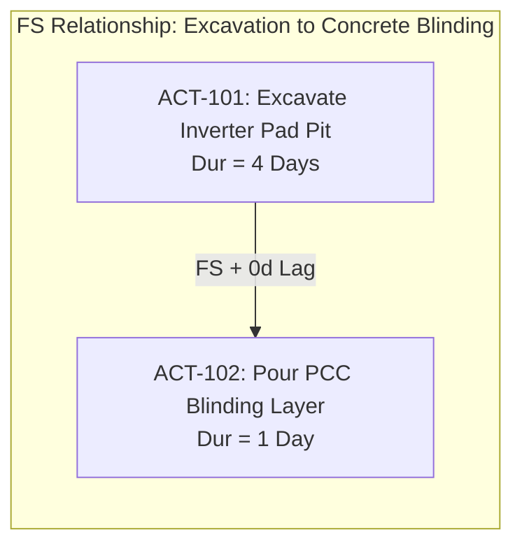
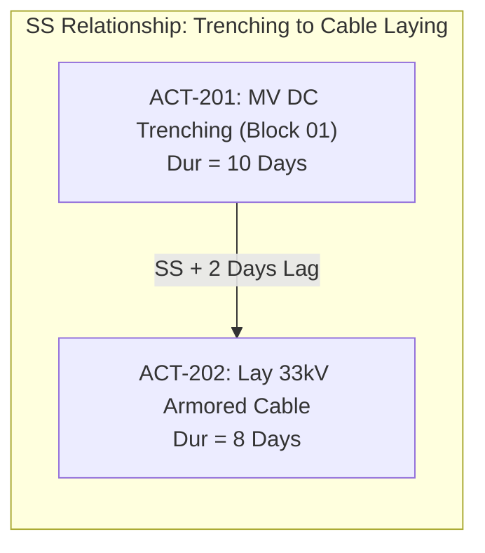
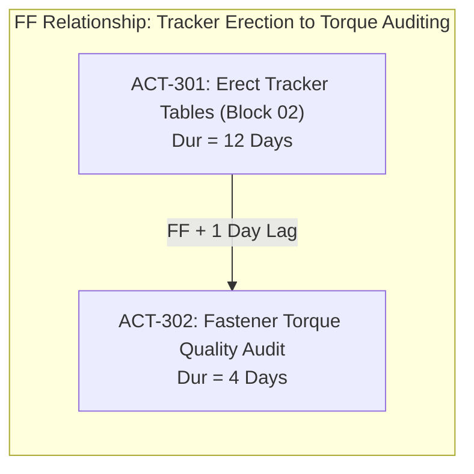
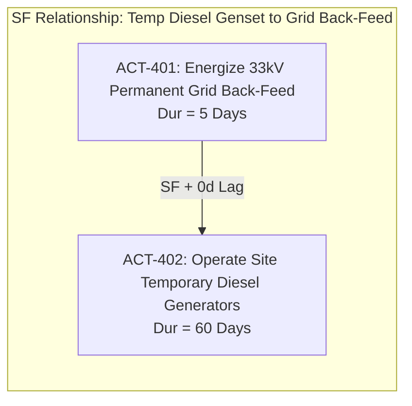
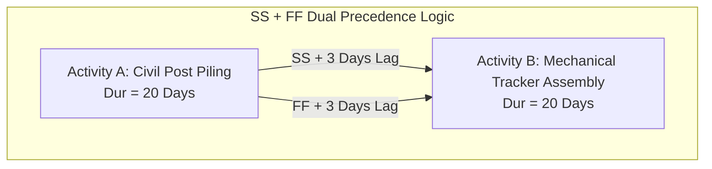

# Topic 3.2: CPM Dependencies & Precedence Relationships (FS, SS, FF, SF)

---

## 1. Executive Summary & The Core Mental Model

### 1.1 The Axiom: Logic Ties Represent the Physics and Contracts of Construction
In modern enterprise scheduling engines—such as **Oracle Primavera P6**, **Safran Project**, and **Asta Powerproject**—activities do not execute in an isolated void. A schedule is not a static spreadsheet of arbitrary calendar dates. 

A schedule is a **computational network model of physical reality**.

Every capital construction project is bound by two immutable constraints:
1. **The Laws of Physics & Material Transformation:** You cannot pour concrete into a foundation before excavating the earth. You cannot pull medium-voltage cables through a trench before digging the trench. You cannot energize a 220kV power transformer before filling it with dielectric oil and allowing dissolved gases to settle.
2. **Contractual, Commercial & Regulatory Sequences:** You cannot erect solar tracker tables on private agricultural land before the Rajasthan state revenue department formally hands over clear title and land encumbrance certificates. You cannot synchronize a solar inverter station to the state grid before the Chief Electrical Inspector to Government (CEIG) issues statutory safety approval.

In project controls, these physical and contractual dependencies are formalized as **Logic Ties** (or **Precedence Relationships**). They define directed edges between activities in a project network graph.

```
┌──────────────────────────────────────────────────────────────────────────────────────────────────┐
│                                 THE SCHEDULING ENGINE TAXONOMY                                   │
├──────────────────────────────────────────────────────────────────────────────────────────────────┤
│                                                                                                  │
│   AGILE / SPRINT TASK BOARDS (Jira, Linear)          ENTERPRISE CPM ENGINES (Primavera P6)       │
│   ─────────────────────────────────────────          ─────────────────────────────────────       │
│   • Flat or shallow backlog of cards.                • Rigorous Directed Acyclic Graph (DAG).    │
│   • Dates are manually picked estimates.             • Dates are mathematically derived via CPM. │
│   • No strict physical sequencing laws.              • Dependencies encode physics & contracts.  │
│   • If Task A slips 10 days, Task B does             • If Task A slips 10 days, every downstream │
│     not move unless dragged by a human.                activity shifts dynamically via CPM math. │
│                                                                                                  │
└──────────────────────────────────────────────────────────────────────────────────────────────────┘
```

When building a high-performance scheduling engine in **Golang** with a **Next.js** interactive Gantt visualization, understanding the mathematical formulation of these relationships is foundational. If your graph algorithms compute relationship early/late boundaries incorrectly by even a fraction of an hour, downstream float calculations collapse, false critical paths emerge, and EPC contractors risk millions of dollars in liquidated damages ($LD$).

---

### 1.2 Mathematical Notation & Continuous Time Conventions

To avoid ambiguity, we establish formal mathematical notation for activity timing and graph topology used throughout this guide:

* Let the project network be a **Directed Graph** $G = (V, E)$, where:
  * $V = \{A_1, A_2, \dots, A_n\}$ is the set of activities (nodes/vertices).
  * $E = \{e_1, e_2, \dots, e_m\}$ is the set of precedence relationships (directed edges).
* For each activity $i \in V$:
  * $D_i \ge 0$: Planned Duration (measured in integer hours or working days).
  * $ES_i$: Early Start date/time (earliest moment the activity can commence).
  * $EF_i$: Early Finish date/time (earliest moment the activity can complete).
  * $LS_i$: Late Start date/time (latest moment the activity can commence without delaying project completion).
  * $LF_i$: Late Finish date/time (latest moment the activity can complete without delaying project completion).
  * $TF_i = LS_i - ES_i = LF_i - EF_i$: Total Float.
  * $FF_i$: Free Float.
* For each relationship directed edge $e = (i, j) \in E$:
  * $i = \text{Pred}(e)$: The Predecessor activity.
  * $j = \text{Succ}(e)$: The Successor activity.
  * $\text{Type}(e) \in \{FS, SS, FF, SF\}$: Precedence relationship type.
  * $L_{ij} \in \mathbb{R}$: Lag duration (positive represents delay; negative represents lead/overlap).

#### Continuous vs. Discrete Time Conventions
In textbook discrete scheduling (1-day units):
$$EF_i = ES_i + D_i - 1$$
However, enterprise engines like **Primavera P6 calculate internally in continuous time (seconds or minutes)** based on work calendars:
$$EF_i = ES_i + D_i$$
*(e.g., If Activity $A$ starts at Day 1 08:00 and has a duration of 8 working hours, it finishes at Day 1 17:00 with a 1-hour lunch break. Activity $B$ with an FS relationship starts at Day 2 08:00 or Day 1 17:00 depending on calendar configuration).*

Throughout our formulas and Go engine architecture, we adopt the **continuous time standard** ($EF_i = ES_i + D_i$), which reflects production software architectures.

---

### 1.3 Running Example: The Surya 100MW Solar IPP Project (Rajasthan, India)

To anchor every formula, graph algorithm, and edge case in real industrial reality, our running case study throughout this topic is:

> **Project:** *Surya 100MW AC Solar Photovoltaic Independent Power Producer (IPP)*  
> **Location:** *Bhadla Solar Park, Thar Desert, Rajasthan, India*  
> **Scope:**  
> * 220,000 High-Efficiency Monocrystalline Bifacial PV Modules.
> * 6,800 Single-Axis Horizontal Tracker Tables.
> * 30 Central Inverter Skids (3.33 MVA each) with step-up transformers.
> * 45 km of underground 33kV Medium-Voltage (MV) AC trenching and cabling.
> * One 33/220kV Pooling Substation (PSS) featuring two 60MVA Main Power Transformers (MPT).
> * 18 km 220kV Double-Circuit Overhead Transmission Line to the RRVPNL Grid Substation.

```
┌────────────────────────────────────────────────────────────────────────────────────────┐
│               SURYA 100MW SOLAR IPP: SIMPLIFIED WORKFLOW TOPOLOGY                      │
└────────────────────────────────────────────────────────────────────────────────────────┘

 [Topographical Survey] ──(FS)──> [Civil Piling (6800 Posts)] ──(SS+Lag)──> [Tracker Assembly]
                                                                                   │
                                                                                 (FF)
                                                                                   ▼
 [33kV Trenching] ──(SS+2d)──> [MV Cable Laying] ──(FS)──> [Termination & Hipot Testing]
                                                                   │
                                                                  (FS)
                                                                   ▼
 [Substation Civil Pads] ──(FS)──> [Main Transformer Rigging] ──(FS)──> [220kV Grid Energization]
                                                                               │
                                                                              (SF)
                                                                               ▼
                                         [Decommission Site Diesel Gensets] ───┘
```

---

## 2. The 4 Precedence Relationship Types

Primavera P6 and the Critical Path Method define exactly **four** fundamental relationship types between any predecessor $i$ and successor $j$. Each defines a distinct boundary constraint on the successor's early and late timeline.

```
┌──────────────────────────────────────────────────────────────────────────────────────────────┐
│                            THE 4 PRECEDENCE RELATIONSHIP TYPES                               │
├──────────────────────┬──────────────────────┬──────────────────────┬─────────────────────────┤
│ Finish-to-Start (FS) │  Start-to-Start (SS) │ Finish-to-Finish (FF)│  Start-to-Finish (SF)   │
│      [~90-95%]       │       [~3-5%]        │       [~2-4%]        │         [<0.1%]         │
├──────────────────────┼──────────────────────┼──────────────────────┼─────────────────────────┤
│ Pred: [████████]     │ Pred: [████████]     │ Pred: [████████]     │ Pred:        [████████] │
│ Succ:          [███] │ Succ:    [████████]  │ Succ:      [██████]  │ Succ: [████████]        │
│                      │                      │                      │                         │
│ "Successor starts    │ "Successor starts    │ "Successor finishes  │ "Successor finishes     │
│ after Pred finishes" │ after Pred starts"   │ after Pred finishes" │ after Pred starts"      │
└──────────────────────┴──────────────────────┴──────────────────────┴─────────────────────────┘
```

---

### 2.1 Finish-to-Start (FS): The Universal Sequence

#### Mental Model & Physical Analogy
**Finish-to-Start (FS)** is the foundational backbone of construction scheduling, accounting for roughly **90% to 95%** of all network logic in professional schedules. 

* **The Rule:** The successor activity cannot start until the predecessor activity has completely finished.
* **Physical Analogy:** Cooking and eating. You cannot eat an omelette until the eggs have finished cooking. 
* **Construction Physics:** Material phase transformations and geometric dependencies. You cannot place rebar steel in a foundation until the trench excavation has finished. You cannot energize a transformer until testing has finished.

#### Mathematical Constraint Formula
For a relationship $e = (A, B)$ of type $FS$ with lag $L_{AB}$:
$$\text{Early Start}(B) \ge \text{Early Finish}(A) + L_{AB}$$

If $L_{AB} = 0$, then Activity $B$ can begin the exact moment Activity $A$ finishes:
$$ES_B \ge EF_A$$



#### Surya 100MW Solar Scenario
* **Predecessor:** `ACT-101: Excavate Inverter Pad Pit` (Duration: 4 Days).
* **Successor:** `ACT-102: Pour Plain Cement Concrete (PCC) Blinding Layer` (Duration: 1 Day).
* **EPC Reality:** You physically cannot cast the thin leveling layer of PCC at the bottom of the foundation hole while a 20-ton JCB excavator is still actively scooping out desert sand and boulders. The civil pit must be fully excavated and inspected before civil blinding begins.

#### Timeline Visualization
```
Day:    1    2    3    4    5    6    7
ACT-101 [════ Excavation ════]
ACT-102                      [ PCC ]
```

---

### 2.2 Start-to-Start (SS): Pipelined Workfronts & Staggered Production

#### Mental Model & Physical Analogy
**Start-to-Start (SS)** is used when two activities proceed concurrently, but the successor requires a preliminary start or initial production lead from the predecessor before it can commence.

* **The Rule:** The successor activity cannot start until the predecessor activity has started (plus any specified lag).
* **Physical Analogy:** Writing a book and copyediting. A copyeditor does not need to wait 12 months for the author to finish the entire 20-chapter manuscript. Once Chapter 1 is drafted (a 2-week lead), the editor can start editing Chapter 1 while the author writes Chapter 2.
* **Construction Physics:** Linear or repetitive infrastructure production lines (highways, pipelines, solar arrays, rail tracks).

#### Mathematical Constraint Formula
For a relationship $e = (A, B)$ of type $SS$ with lag $L_{AB}$:
$$\text{Early Start}(B) \ge \text{Early Start}(A) + L_{AB}$$



#### Surya 100MW Solar Scenario
* **Predecessor:** `ACT-201: Trenching for 33kV Internal Feeder Line 1` (Duration: 10 Days).
* **Successor:** `ACT-202: Lay 33kV Armored Aluminum Cables in Trench` (Duration: 8 Days).
* **Lag:** $+2$ Days.
* **EPC Reality:** The trenching machine digs 500 meters of trench per day across a 5,000-meter route. If the cable-laying crew waited for the entire 10-day trenching operation to complete before laying a single meter of cable (an FS link), the open trench in the Thar Desert would collapse due to blowing desert winds and shifting sand dunes. 
* Instead, the cable crew starts 2 days ($L_{AB} = 2$) behind the trenching machine. The trenching crew opens the first 1,000 meters; on Day 3, the cable spool truck follows directly behind, unreeling cable into the fresh trench.

#### Timeline Visualization
```
Day:    1    2    3    4    5    6    7    8    9   10   11
ACT-201 [═══════════════ Trenching 10d ═══════════════]
ACT-202           [════════ Cable Laying 8d ════════]
        |<--2d--->|
         Lag (SS)
```

> [!WARNING]
> **The Hazard of the "Open-Ended Finish" in SS Ties:**  
> Notice that the SS constraint only governs when `ACT-202` can **start**. Mathematically, it places **zero constraint** on when `ACT-202` can **finish**. If `ACT-201` is delayed from 10 days to 25 days due to hard underground granite strata, `ACT-202` could technically show an Early Finish date *before* the trench is even dug!  
> To prevent this physical impossibility, industry planners pair an SS relationship with a **Finish-to-Finish (FF)** relationship, forming the classic **Ladder Logic Pattern** (detailed in Section 2.5).

---

### 2.3 Finish-to-Finish (FF): Synchronized Completion & Wrap-Up

#### Mental Model & Physical Analogy
**Finish-to-Finish (FF)** is used when two activities are executing simultaneously, but the successor cannot conclude until the predecessor has reached its full conclusion.

* **The Rule:** The successor activity cannot finish until the predecessor activity has finished (plus any specified lag).
* **Physical Analogy:** Driving a nail and inspecting the joint. You cannot finish inspecting the bolted assembly until the technician finishes bolting the last structural bracket.
* **Construction Physics:** Quality control, testing, structural torquing, commissioning, and project management oversight.

#### Mathematical Constraint Formula
For a relationship $e = (A, B)$ of type $FF$ with lag $L_{AB}$:
$$\text{Early Finish}(B) \ge \text{Early Finish}(A) + L_{AB}$$

Since $\text{Early Start}(B) = \text{Early Finish}(B) - D_B$, this imposes an indirect start constraint:
$$\text{Early Start}(B) \ge \text{Early Finish}(A) + L_{AB} - D_B$$



#### Surya 100MW Solar Scenario
* **Predecessor:** `ACT-301: Mechanical Erection of Solar Tracker Tables` (Duration: 12 Days).
* **Successor:** `ACT-302: Independent QA Torque Audit & Calibration` (Duration: 4 Days).
* **Lag:** $+1$ Day.
* **EPC Reality:** Third-party quality inspectors from TÜV SÜD walk the solar field with calibrated digital torque wrenches to verify that all grade 8.8 bolts on the drive arms and purlins are torqued to 85 Nm. 
* The QA inspectors do not wait until Day 12 to begin; they inspect tables progressively. However, they **cannot complete their final audit sign-off report** until 1 day after the mechanical erection crew torques the very last tracker table in Block 02 ($L_{AB} = 1$).

#### Timeline Visualization
```
Day:    1   2   3   4   5   6   7   8   9  10  11  12  13
ACT-301 [════════════ Tracker Erection 12d ════════════]
ACT-302                                 [══ QA Audit 4d ══]
                                                       |<1d>|
                                                       Lag(FF)
```

> [!WARNING]
> **The Hazard of the "Open-Ended Start" in FF Ties:**  
> Notice that the FF constraint only governs when `ACT-302` can **finish**. If `ACT-302` has no predecessor governing its start, a forward-pass calculation engine might schedule `ACT-302` to start on Day 1 (if duration allows) or float arbitrarily. Never leave an activity's start unlinked in an enterprise CPM schedule.

---

### 2.4 Start-to-Finish (SF): The Just-In-Time Replacement (Rare & Confusing)

#### Mental Model & Physical Analogy
**Start-to-Finish (SF)** is the rarest, most misunderstood relationship in project management, representing **less than 0.1%** of all relationships in real-world schedules. Many defense and construction specifications (such as the US Department of Defense and US Army Corps of Engineers) require formal written justification whenever an SF relationship is used.

* **The Rule:** The successor activity cannot finish until the predecessor activity has started.
* **Plain-English Mental Model:** *"Task B must keep going right up until Task A finally kicks off."* It is a **Just-In-Time handover** or **continuous coverage** constraint.
* **Physical Analogy:** Security Guard Shifts. Guard Shift 1 ($B$) cannot finish and go home until Guard Shift 2 ($A$) arrives and starts their shift. If Guard Shift 2 is delayed in traffic by 3 hours, Guard Shift 1 must continue standing guard.

#### Mathematical Constraint Formula
For a relationship $e = (A, B)$ of type $SF$ with lag $L_{AB}$:
$$\text{Early Finish}(B) \ge \text{Early Start}(A) + L_{AB}$$

Expressed in terms of $B$'s Early Start:
$$\text{Early Start}(B) \ge \text{Early Start}(A) + L_{AB} - D_B$$



#### Surya 100MW Solar Scenario
* **Predecessor:** `ACT-401: Energize 33kV Permanent Grid Back-Feed from RRVPNL Substation`.
* **Successor:** `ACT-402: Operation of Temporary Site Diesel Generators (DG Sets)`.
* **EPC Reality:** During the 6-month construction phase, site offices, SCADA servers, tool-charging stations, and perimeter security lighting are powered by leased 500kVA diesel generator sets. 
* Diesel fuel costs ₹95/liter—it is expensive and polluting. The project director wants to decommission the rental diesel generators the exact moment permanent electrical power is energized from the state grid.
* Therefore: `ACT-402: Operate Diesel Generators` **cannot finish** until `ACT-401: Energize Grid Back-Feed` **starts**. 
* If grid energization is delayed by 30 days due to state regulatory approvals, `ACT-402` cannot finish; its finish date is driven directly forward, forcing the project to budget additional diesel fuel rental costs.

#### Timeline Visualization
```
Month:   M1      M2      M3      M4      M5      M6      M7
ACT-402  [═════════════ Diesel Genset Operation ═════════] (Must not finish...)
ACT-401                                                  [ Grid Energized ] (...until this starts)
                                                         ▲
                                                  SF Logic Point
```

#### Why Schedulers Avoid SF Relationships
1. **Inverted Arrow Intuition:** In a Gantt chart, CPM arrows typically flow from left-to-right (past-to-future). An SF relationship points from a downstream milestone's *start* back to an upstream activity's *finish*, confusing project executives and field engineers.
2. **Resource Leveling Chaos:** Most commercial resource leveling algorithms assume forward progression. An SF link creates backward-propagating date pressures that can cause leveling heuristics to cycle or produce counter-intuitive delays.
3. **Alternative Representation:** Schedulers usually replace SF links with an FS link pointing from the predecessor's milestone to a separate decommissioning task:  
   `[Grid Energized] --(FS)--> [Decommission Diesel Genset]`.

---

### 2.5 Advanced Relationship Engineering: The "Ladder Logic" Pattern (SS + FF)

When linear activities execute in parallel workfronts, neither SS nor FF alone is sufficient. Planners combine them into a **Ladder Relationship (SS + FF)**.

Consider two consecutive linear phases across the 6,800 solar tracker tables:
* `Activity A: Civil Piling (Drive 13,600 steel C-posts into the ground)` ($D_A = 20\text{ days}$)
* `Activity B: Mechanical Tracker Assembly (Mount torque tubes & bearings)` ($D_B = 20\text{ days}$)



#### The Two Controlling Boundary Conditions
Activity $B$ is simultaneously governed by two separate constraints:
1. **Start Boundary (SS):** $\text{Early Start}(B) \ge \text{Early Start}(A) + 3\text{ days}$.  
   *(Assembly crew cannot start until Piling crew has driven posts for at least 3 days to establish a safe buffer).*
2. **Finish Boundary (FF):** $\text{Early Finish}(B) \ge \text{Early Finish}(A) + 3\text{ days}$.  
   *(Assembly crew cannot finish until 3 days after the last pile is driven).*

#### The Duration Imbalance Problem: Compression vs. Stretch
What happens if the durations of $A$ and $B$ are **not equal**? This is where many junior scheduling software engineers introduce bugs into their engine!

```
Case 1: Successor is FASTER than Predecessor (D_B < D_A)
Example: D_A = 20 days, D_B = 10 days, Lag_SS = 3d, Lag_FF = 3d

If B started at Day 0 + 3 = Day 3:
  B would finish at Day 3 + 10 = Day 13.
BUT the FF constraint demands:
  Finish(B) >= Finish(A) + 3d = 20 + 3 = Day 23!
Therefore, to satisfy BOTH constraints without splitting the activity:
  Early Finish(B) = Day 23
  Early Start(B)  = Day 23 - 10 = Day 13!
  
RESULT: The FINISH constraint DRIVES Activity B! 
B's start is delayed to Day 13 so it finishes at Day 23.
```

```
Case 2: Successor is SLOWER than Predecessor (D_B > D_A)
Example: D_A = 10 days, D_B = 20 days, Lag_SS = 3d, Lag_FF = 3d

If B starts at Day 0 + 3 = Day 3:
  Early Finish(B) = Day 3 + 20 = Day 23.
Check FF constraint:
  Finish(B) >= Finish(A) + 3d = 10 + 3 = Day 13.
Since Day 23 >= Day 13, the FF constraint is automatically satisfied!

RESULT: The START constraint DRIVES Activity B!
B starts on Day 3 and finishes on Day 23.
```

#### Contiguous vs. Interruptible Activities in P6
Enterprise engines provide a project-level calculation setting:
* **Contiguous Duration (P6 Default):** An activity cannot pause once started. If the FF constraint pushes the finish date forward, the start date **must move forward** to maintain $EF - ES = D$.
* **Interruptible Duration:** An activity is permitted to split. It starts at $\text{Early Start}(A) + \text{Lag}_{SS}$, pauses when it catches up with the predecessor, and resumes to finish at $\text{Early Finish}(A) + \text{Lag}_{FF}$.

---

## 3. Mathematical Formulations: Forward & Backward Passes

The **Critical Path Method (CPM)** operates in two distinct passes over the network graph:
1. **The Forward Pass:** Traverses in topological order from project start to finish, calculating the earliest possible dates ($ES, EF$) and project duration.
2. **The Backward Pass:** Traverses in reverse topological order from project finish to start, calculating the latest allowable dates ($LF, LS$) without extending project duration.

---

### 3.1 The Forward Pass Equations

For each activity $j \in V$:
* If $j$ has no predecessors ($\text{Pred}(j) = \emptyset$), it starts at the project initiation date:
  $$ES_j = \text{ProjectStartDate}$$
* If $j$ has one or more predecessors, its Early Start must satisfy the maximum constraint imposed across **all** incoming predecessor edges $e = (i, j) \in E$:

$$ES_j = \max_{i \in \text{Pred}(j)} \left( \text{ReqES}(i, j) \right)$$
$$EF_j = ES_j + D_j$$

Where the required Early Start $\text{ReqES}(i, j)$ imposed by predecessor $i$ depends on the edge type:

$$\text{ReqES}_{FS}(i, j) = EF_i + L_{ij}$$
$$\text{ReqES}_{SS}(i, j) = ES_i + L_{ij}$$
$$\text{ReqES}_{FF}(i, j) = EF_i + L_{ij} - D_j$$
$$\text{ReqES}_{SF}(i, j) = ES_i + L_{ij} - D_j$$

#### Unified Mathematical Summary Table (Forward Pass)

| Relationship Type | Governing Constraint | Expression for Successor Early Date | Derived Date |
| :--- | :--- | :--- | :--- |
| **Finish-to-Start (FS)** | $ES_j \ge EF_i + L_{ij}$ | $ES_j = \max(ES_j, EF_i + L_{ij})$ | $EF_j = ES_j + D_j$ |
| **Start-to-Start (SS)** | $ES_j \ge ES_i + L_{ij}$ | $ES_j = \max(ES_j, ES_i + L_{ij})$ | $EF_j = ES_j + D_j$ |
| **Finish-to-Finish (FF)** | $EF_j \ge EF_i + L_{ij}$ | $EF_j = \max(EF_j, EF_i + L_{ij})$ | $ES_j = EF_j - D_j$ *(contiguous)* |
| **Start-to-Finish (SF)** | $EF_j \ge ES_i + L_{ij}$ | $EF_j = \max(EF_j, ES_i + L_{ij})$ | $ES_j = EF_j - D_j$ *(contiguous)* |

---

### 3.2 The Driving Relationship Concept

In a complex mega-project schedule, an activity may have 5 to 10 incoming predecessor logic ties. 

> **Definition:** A relationship edge $e = (i, j)$ is termed **Driving** if the constraint imposed by that edge is the specific constraint that determines the successor's Early Start date:
> $$\text{ReqES}(i, j) = ES_j$$

If a relationship is driving:
* Any delay to the predecessor's early date will immediately push the successor's early date.
* If a relationship is **Non-Driving**, the predecessor has buffer before it can impact the successor.

#### Visualizing Driving vs. Non-Driving Logic
Consider Activity `ACT-500: Pour Substation Control Room Slab` ($D = 2\text{ days}$). It has three predecessors:
1. `ACT-401: Excavate Foundation` ($EF = \text{Day } 4$) $\xrightarrow{FS + 0d}$ Imposes $\text{ReqES} = 4 + 0 = \text{Day } 4$.
2. `ACT-402: Fabricate Rebar Cages` ($EF = \text{Day } 8$) $\xrightarrow{FS + 0d}$ Imposes $\text{ReqES} = 8 + 0 = \text{Day } 8$.
3. `ACT-403: Procurement of Anchor Bolts` ($ES = \text{Day } 2$) $\xrightarrow{SS + 3d}$ Imposes $\text{ReqES} = 2 + 3 = \text{Day } 5$.

```
Computation:
  ES_500 = max(Day 4, Day 8, Day 5) = Day 8
  EF_500 = Day 8 + 2 = Day 10

Driving Analysis:
  Edge (ACT-401 -> ACT-500): ReqES = 4 < 8  ==> NON-DRIVING (Float on tie = 4 days)
  Edge (ACT-402 -> ACT-500): ReqES = 8 == 8 ==> DRIVING RELATIONSHIP!
  Edge (ACT-403 -> ACT-500): ReqES = 5 < 8  ==> NON-DRIVING (Float on tie = 3 days)
```

In Primavera P6, when you view the Activity Details pane under the **Predecessors** tab, there is a dedicated checkbox column titled **"Driving"**. Your scheduling engine must compute and persist this boolean flag for every edge in the graph.

---

### 3.3 The Backward Pass Equations

Once the forward pass calculates the project completion date:
$$\text{ProjectFinishDate} = \max_{k \in V} (EF_k)$$

The backward pass computes the latest permissible dates ($LF, LS$) without extending $\text{ProjectFinishDate}$.

For each activity $i \in V$:
* If $i$ has no successors ($\text{Succ}(i) = \emptyset$):
  $$LF_i = \text{ProjectFinishDate}$$
  *(Or activity's assigned late finish constraint)*
* If $i$ has one or more successors, its Late Finish must satisfy the minimum constraint imposed across **all** outgoing successor edges $e = (i, j) \in E$:

$$LF_i = \min_{j \in \text{Succ}(i)} \left( \text{ReqLF}(i, j) \right)$$
$$LS_i = LF_i - D_i$$

Where the required Late Finish $\text{ReqLF}(i, j)$ imposed by successor $j$ depends on the edge type:

$$\text{ReqLF}_{FS}(i, j) = LS_j - L_{ij}$$
$$\text{ReqLF}_{SS}(i, j) = LS_j - L_{ij} + D_i$$
$$\text{ReqLF}_{FF}(i, j) = LF_j - L_{ij}$$
$$\text{ReqLF}_{SF}(i, j) = LF_j - L_{ij} + D_i$$

#### Derivation of SS and SF in the Backward Pass
Why does $+ D_i$ appear in the SS and SF formulas?
Let us derive the SS backward pass step:
* An SS relationship states: $ES_j \ge ES_i + L_{ij}$.
* By symmetry of late dates, the constraint is: $LS_i \le LS_j - L_{ij}$.
* Since by definition $LF_i = LS_i + D_i$, substituting $LS_i$ yields:
  $$LF_i \le (LS_j - L_{ij}) + D_i$$
  $$\text{ReqLF}_{SS}(i, j) = LS_j - L_{ij} + D_i$$
This is mathematically rigorous and ensures that the Late Finish preserves the required Late Start threshold!

---

### 3.4 Float Calculations in Complex Networks

Once forward and backward passes are complete, the engine computes two types of float:

#### 1. Total Float ($TF$)
The amount of time an activity can be delayed from its Early Start without delaying the project finish date:
$$TF_i = LS_i - ES_i = LF_i - EF_i$$
* If $TF_i = 0$: Activity $i$ is on the **Critical Path**.
* If $TF_i < 0$: Activity $i$ is in **Negative Float** (a contractual deadline or hard constraint has been breached).
* If $TF_i > 0$: Activity $i$ has schedule cushion.

#### 2. Free Float ($FF$)
The amount of time an activity can be delayed without delaying the Early Start of **any** immediate successor activity:
$$FF_i = \min_{j \in \text{Succ}(i)} \left( \text{Slack}(i, j) \right)$$

Where the edge slack $\text{Slack}(i, j)$ depends on edge type:
* **FS:** $\text{Slack}_{FS}(i, j) = ES_j - (EF_i + L_{ij})$
* **SS:** $\text{Slack}_{SS}(i, j) = ES_j - (ES_i + L_{ij})$
* **FF:** $\text{Slack}_{FF}(i, j) = EF_j - (EF_i + L_{ij})$
* **SF:** $\text{Slack}_{SF}(i, j) = EF_j - (ES_i + L_{ij})$

Notice that while Total Float is an attribute of the activity relative to the project finish, Free Float is governed strictly by the most restrictive outgoing edge!

---

## 4. Network Graph Topology & Directed Acyclic Graphs (DAG)

### 4.1 The Project as a Graph $G = (V, E)$
In graph theory, a project schedule is modeled as a **Directed Graph**:
* **Vertices ($V$):** Activities with attributes $(ID, \text{Duration}, \text{CalendarID})$.
* **Edges ($E$):** Directed logic arcs with attributes $(\text{Source}, \text{Target}, \text{Type}, \text{Lag})$.

```
           [ACT-100] (Land Clearance)
             │
             ├──(FS)──────────────┐
             ▼                    ▼
        [ACT-101] (Piling)   [ACT-102] (Trenching)
             │                    │
             ├──(SS+2d)           │ (FS)
             ▼                    ▼
   [ACT-103] (Trackers)      [ACT-104] (Cables)
             │                    │
             └──(FF+1d)──┐   ┌────┘
                         ▼   ▼
                      [ACT-105] (Inverter Pad)
```

### 4.2 The Inviolable Axiom: The Graph Must Be Acyclic (DAG)
For the Critical Path Method forward and backward passes to be mathematically solvable, the graph $G$ **must contain zero directed cycles**.

#### Why Circular Logic Breaks the Scheduling Universe
Suppose a careless project planner introduces a circular loop in the 220kV Pooling Substation:
* Activity $A$: `Erect Substation Gantry Structure`
* Activity $B$: `String Overhead Busbars` (Predecessor: $A$ via $FS$)
* Activity $C$: `Install Isolators & Disconnectors` (Predecessor: $B$ via $FS$)
* The planner accidentally links $C \xrightarrow{FS} A$: *"We need isolators on site before finalizing gantry heights."*

```
       [Activity A: Gantry]
          ▲              │
          │ (FS)         │ (FS)
          │              ▼
   [Activity C] ◄────── [Activity B: Busbars]
                 (FS)
```

Let us evaluate the forward pass equations:
$$ES_B \ge EF_A = ES_A + D_A$$
$$ES_C \ge EF_B = ES_B + D_B \ge ES_A + D_A + D_B$$
$$ES_A \ge EF_C = ES_C + D_C \ge ES_A + D_A + D_B + D_C$$
Subtracting $ES_A$ from both sides:
$$0 \ge D_A + D_B + D_C$$
Since durations are strictly positive ($D_A, D_B, D_C > 0$):
$$0 \ge \sum D_k > 0 \implies \text{\textbf{CONTRADICTION!}}$$

A cycle creates an unsolvable mathematical equation. If a scheduling engine without cycle detection executes a naive topological sort or recursive forward pass on a cyclic graph, it triggers an **infinite call stack overflow or deadlock**.

---

### 4.3 Cycle Detection Algorithms: Kahn's vs. Tarjan's

To guarantee acyclicity, a scheduling engine must execute cycle detection. There are two primary algorithmic choices:

```
┌──────────────────────────────────────────────────────────────────────────────────────────────────┐
│                             CYCLE DETECTION ALGORITHM COMPARISON                                │
├───────────────────────────────┬──────────────────────────────────────────────────────────────────┤
│ Kahn's Algorithm              │ Tarjan's Strongly Connected Components (SCC)                     │
├───────────────────────────────┼──────────────────────────────────────────────────────────────────┤
│ • Based on vertex in-degrees. │ • Based on Depth-First Search (DFS) and call stack low-links.    │
│ • Runs in O(|V| + |E|) time.  │ • Runs in O(|V| + |E|) time.                                     │
│ • Produces the exact          │ • Pinpoints the EXACT activities participating in the loop       │
│   Topological Sort order      │   (e.g., "Cycle found: ACT-A -> ACT-B -> ACT-C -> ACT-A").       │
│   needed for Forward Pass!    │ • Essential for human-readable error messages in web UIs.        │
│ • If count of sorted nodes    │ • Identifies disconnected multiple cycles in a single traversal. │
│   < |V|, a cycle exists.      │                                                                  │
└───────────────────────────────┴──────────────────────────────────────────────────────────────────┘
```

#### Kahn's Algorithm Flowchart
```mermaid
flowchart TD
    Start([Calculate In-Degrees of all V]) --> InitQ[Enqueue all vertices with in-degree = 0]
    InitQ --> CheckQ{Is Queue Empty?}
    CheckQ -- No --> Dequeue[Pop vertex u from Queue<br>Append u to TopologicalOrder]
    Dequeue --> Decrement[For each successor v of u:<br>Decrement in-degree of v by 1]
    Decrement --> CheckZero{Is in-degree of v == 0?}
    CheckZero -- Yes --> Enqueue[Enqueue v]
    CheckZero -- No --> NextSucc[Next successor]
    Enqueue --> CheckQ
    NextSucc --> CheckQ
    CheckQ -- Yes --> Validate{Count of TopologicalOrder == |V|?}
    Validate -- Yes --> Success([Success: Valid DAG! Proceed to CPM])
    Validate -- No --> CycleError([Error: Cycle Detected in Network!])
```

---

### 4.4 Transitive Reduction: Eliminating Redundant Dependencies

In large construction schedules (10,000+ activities), planners frequently add redundant logic ties:
* `ACT-101: Piling` $\xrightarrow{FS}$ `ACT-102: Pier Caps`
* `ACT-102: Pier Caps` $\xrightarrow{FS}$ `ACT-103: Steel Girders`
* The planner also adds: `ACT-101: Piling` $\xrightarrow{FS}$ `ACT-103: Steel Girders`.

The edge `ACT-101` $\to$ `ACT-103` is a **transitive redundant edge**.
* **Impact:** It clutters Gantt chart visual interfaces, consumes database storage, increases edge traversal overhead during recalculations, and misleads planners into thinking an activity is doubly constrained.
* An enterprise scheduling engine should implement a **Transitive Reduction** analyzer to flag or prune redundant relationships.

---

## 5. Software Architecture: Golang Engine & PostgreSQL

Let us architect the production storage and in-memory execution engine in **PostgreSQL** and **Golang**.

### 5.1 PostgreSQL Relational Database Schema

We define a normalized schema with strict relational integrity, check constraints, and compound indexes optimized for adjacency list traversals.

```sql
-- PostgreSQL DDL for Primavera P6-style Precedence Relationships

CREATE TYPE relationship_type_enum AS ENUM ('FS', 'SS', 'FF', 'SF');

-- Activities Table (Nodes)
CREATE TABLE activities (
    id UUID PRIMARY KEY DEFAULT gen_random_uuid(),
    project_id UUID NOT NULL,
    activity_code VARCHAR(50) NOT NULL,
    name VARCHAR(255) NOT NULL,
    duration_hours NUMERIC(10, 2) NOT NULL CHECK (duration_hours >= 0),
    calendar_id UUID NOT NULL,
    
    -- CPM Calculated Dates
    early_start TIMESTAMPTZ,
    early_finish TIMESTAMPTZ,
    late_start TIMESTAMPTZ,
    late_finish TIMESTAMPTZ,
    total_float_hours NUMERIC(10, 2),
    free_float_hours NUMERIC(10, 2),
    is_critical BOOLEAN DEFAULT FALSE,
    
    created_at TIMESTAMPTZ DEFAULT CURRENT_TIMESTAMP,
    updated_at TIMESTAMPTZ DEFAULT CURRENT_TIMESTAMP,
    
    CONSTRAINT uq_project_activity_code UNIQUE (project_id, activity_code)
);

-- Relationships Table (Edges)
CREATE TABLE activity_relationships (
    id UUID PRIMARY KEY DEFAULT gen_random_uuid(),
    project_id UUID NOT NULL,
    pred_activity_id UUID NOT NULL REFERENCES activities(id) ON DELETE CASCADE,
    succ_activity_id UUID NOT NULL REFERENCES activities(id) ON DELETE CASCADE,
    type relationship_type_enum NOT NULL DEFAULT 'FS',
    lag_hours NUMERIC(10, 2) NOT NULL DEFAULT 0.00,
    is_driving BOOLEAN DEFAULT FALSE,
    
    created_at TIMESTAMPTZ DEFAULT CURRENT_TIMESTAMP,
    updated_at TIMESTAMPTZ DEFAULT CURRENT_TIMESTAMP,
    
    -- Constraint 1: An activity cannot be its own predecessor (No self-loops)
    CONSTRAINT chk_no_self_relationship CHECK (pred_activity_id <> succ_activity_id),
    
    -- Constraint 2: Only one relationship edge allowed between any pair (A, B)
    CONSTRAINT uq_pred_succ_relationship UNIQUE (pred_activity_id, succ_activity_id)
);

-- Performance Indexes for Graph Traversal
-- Fast lookup of all successors for Forward Pass:
CREATE INDEX idx_rel_pred ON activity_relationships (pred_activity_id);

-- Fast lookup of all predecessors for Backward Pass and In-Degree calculation:
CREATE INDEX idx_rel_succ ON activity_relationships (succ_activity_id);

-- Composite index for project-scoped schedule calculations:
CREATE INDEX idx_rel_project ON activity_relationships (project_id);
CREATE INDEX idx_act_project ON activities (project_id);
```

---

### 5.2 High-Performance In-Memory Graph Representation in Go

Relational databases are excellent for transactional persistence, but traversing recursive CPM networks row-by-row in SQL is prohibitively slow for real-time Gantt interactions.

In our Go backend, we load the project into a compact, cache-friendly **In-Memory Adjacency List**:

```go
package cpm

import (
	"errors"
	"fmt"
	"time"
)

// RelationshipType represents the 4 CPM dependency types
type RelationshipType string

const (
	TypeFS RelationshipType = "FS"
	TypeSS RelationshipType = "SS"
	TypeFF RelationshipType = "FF"
	TypeSF RelationshipType = "SF"
)

// RelationshipEdge represents a directed edge in the schedule DAG
type RelationshipEdge struct {
	ID        string
	PredID    string
	SuccID    string
	Type      RelationshipType
	LagHours  float64
	IsDriving bool
}

// ActivityNode represents a vertex in the schedule DAG
type ActivityNode struct {
	ID            string
	Code          string
	Name          string
	DurationHours float64

	// CPM Calculated metrics
	EarlyStart time.Time
	EarlyFinish time.Time
	LateStart   time.Time
	LateFinish  time.Time
	TotalFloat  float64
	FreeFloat   float64
	IsCritical  bool

	// Adjacency edges
	OutEdges []*RelationshipEdge // Successors (Forward Pass)
	InEdges  []*RelationshipEdge // Predecessors (Backward Pass)
}

// ScheduleGraph encapsulates the project DAG
type ScheduleGraph struct {
	ProjectID   string
	ProjectStart time.Time
	Activities  map[string]*ActivityNode
	Edges       []*RelationshipEdge
}

// NewScheduleGraph initializes an empty schedule graph
func NewScheduleGraph(projectID string, projectStart time.Time) *ScheduleGraph {
	return &ScheduleGraph{
		ProjectID:    projectID,
		ProjectStart: projectStart,
		Activities:   make(map[string]*ActivityNode),
		Edges:        make([]*RelationshipEdge, 0),
	}
}

// AddActivity registers an activity vertex
func (g *ScheduleGraph) AddActivity(id, code, name string, durHours float64) {
	g.Activities[id] = &ActivityNode{
		ID:            id,
		Code:          code,
		Name:          name,
		DurationHours: durHours,
		OutEdges:      make([]*RelationshipEdge, 0),
		InEdges:       make([]*RelationshipEdge, 0),
	}
}

// AddRelationship registers a directed precedence edge
func (g *ScheduleGraph) AddRelationship(id, predID, succID string, relType RelationshipType, lagHours float64) error {
	if predID == succID {
		return fmt.Errorf("self-referencing edge is forbidden on activity %s", predID)
	}

	pred, okPred := g.Activities[predID]
	succ, okSucc := g.Activities[succID]
	if !okPred || !okSucc {
		return errors.New("predecessor or successor activity does not exist in graph")
	}

	edge := &RelationshipEdge{
		ID:       id,
		PredID:   predID,
		SuccID:   succID,
		Type:     relType,
		LagHours: lagHours,
	}

	pred.OutEdges = append(pred.OutEdges, edge)
	succ.InEdges = append(succ.InEdges, edge)
	g.Edges = append(g.Edges, edge)

	return nil
}
```

---

### 5.3 Cycle Detection & Topological Sort (Kahn's Algorithm in Go)

Before running forward or backward passes, the engine executes Kahn's algorithm:

```go
// TopologicalSort executes Kahn's Algorithm.
// Returns an ordered slice of nodes for Forward Pass, or an error if a cycle exists.
func (g *ScheduleGraph) TopologicalSort() ([]*ActivityNode, error) {
	inDegree := make(map[string]int)
	for _, act := range g.Activities {
		inDegree[act.ID] = len(act.InEdges)
	}

	// Initialize queue with all 0-in-degree nodes
	queue := make([]*ActivityNode, 0)
	for _, act := range g.Activities {
		if inDegree[act.ID] == 0 {
			queue = append(queue, act)
		}
	}

	sorted := make([]*ActivityNode, 0, len(g.Activities))

	for len(queue) > 0 {
		curr := queue[0]
		queue = queue[1:]
		sorted = append(sorted, curr)

		for _, outEdge := range curr.OutEdges {
			succID := outEdge.SuccID
			inDegree[succID]--
			if inDegree[succID] == 0 {
				queue = append(queue, g.Activities[succID])
			}
		}
	}

	if len(sorted) != len(g.Activities) {
		return nil, errors.New("network cycle detected: project graph is not a valid DAG")
	}

	return sorted, nil
}
```

---

### 5.4 The Forward Pass Engine in Go

```go
// RunForwardPass calculates EarlyStart and EarlyFinish for all activities
func (g *ScheduleGraph) RunForwardPass(topologicalOrder []*ActivityNode) {
	for _, node := range topologicalOrder {
		if len(node.InEdges) == 0 {
			// Project root activity
			node.EarlyStart = g.ProjectStart
			node.EarlyFinish = node.EarlyStart.Add(time.Duration(node.DurationHours) * time.Hour)
			continue
		}

		maxReqES := g.ProjectStart

		for _, inEdge := range node.InEdges {
			pred := g.Activities[inEdge.PredID]
			lagDuration := time.Duration(inEdge.LagHours) * time.Hour
			durDuration := time.Duration(node.DurationHours) * time.Hour

			var reqES time.Time

			switch inEdge.Type {
			case TypeFS:
				reqES = pred.EarlyFinish.Add(lagDuration)
			case TypeSS:
				reqES = pred.EarlyStart.Add(lagDuration)
			case TypeFF:
				// EF_succ >= EF_pred + Lag ==> ES_succ >= EF_pred + Lag - Dur_succ
				reqES = pred.EarlyFinish.Add(lagDuration).Add(-durDuration)
			case TypeSF:
				// EF_succ >= ES_pred + Lag ==> ES_succ >= ES_pred + Lag - Dur_succ
				reqES = pred.EarlyStart.Add(lagDuration).Add(-durDuration)
			}

			if reqES.After(maxReqES) {
				maxReqES = reqES
			}
		}

		node.EarlyStart = maxReqES
		node.EarlyFinish = node.EarlyStart.Add(time.Duration(node.DurationHours) * time.Hour)

		// Determine driving flags on incoming edges
		for _, inEdge := range node.InEdges {
			pred := g.Activities[inEdge.PredID]
			lagDuration := time.Duration(inEdge.LagHours) * time.Hour
			durDuration := time.Duration(node.DurationHours) * time.Hour

			var edgeReqES time.Time
			switch inEdge.Type {
			case TypeFS:
				edgeReqES = pred.EarlyFinish.Add(lagDuration)
			case TypeSS:
				edgeReqES = pred.EarlyStart.Add(lagDuration)
			case TypeFF:
				edgeReqES = pred.EarlyFinish.Add(lagDuration).Add(-durDuration)
			case TypeSF:
				edgeReqES = pred.EarlyStart.Add(lagDuration).Add(-durDuration)
			}

			// If this edge matches the computed EarlyStart, it is DRIVING
			inEdge.IsDriving = edgeReqES.Equal(node.EarlyStart)
		}
	}
}
```

---

### 5.5 The Backward Pass Engine in Go

```go
// RunBackwardPass calculates LateFinish, LateStart, and TotalFloat
func (g *ScheduleGraph) RunBackwardPass(topologicalOrder []*ActivityNode) {
	// Find project finish time (max EarlyFinish among all activities)
	var projectFinish time.Time
	for _, node := range g.Activities {
		if node.EarlyFinish.After(projectFinish) {
			projectFinish = node.EarlyFinish
		}
	}

	// Traverse in reverse topological order
	for i := len(topologicalOrder) - 1; i >= 0; i-- {
		node := topologicalOrder[i]

		if len(node.OutEdges) == 0 {
			// Terminal leaf activity
			node.LateFinish = projectFinish
			node.LateStart = node.LateFinish.Add(-time.Duration(node.DurationHours) * time.Hour)
		} else {
			minReqLF := time.Time{}

			for _, outEdge := range node.OutEdges {
				succ := g.Activities[outEdge.SuccID]
				lagDuration := time.Duration(outEdge.LagHours) * time.Hour
				predDurDuration := time.Duration(node.DurationHours) * time.Hour

				var reqLF time.Time

				switch outEdge.Type {
				case TypeFS:
					reqLF = succ.LateStart.Add(-lagDuration)
				case TypeSS:
					// LS_pred <= LS_succ - Lag ==> LF_pred <= LS_succ - Lag + Dur_pred
					reqLF = succ.LateStart.Add(-lagDuration).Add(predDurDuration)
				case TypeFF:
					reqLF = succ.LateFinish.Add(-lagDuration)
				case TypeSF:
					// LS_pred <= LF_succ - Lag ==> LF_pred <= LF_succ - Lag + Dur_pred
					reqLF = succ.LateFinish.Add(-lagDuration).Add(predDurDuration)
				}

				if minReqLF.IsZero() || reqLF.Before(minReqLF) {
					minReqLF = reqLF
				}
			}

			node.LateFinish = minReqLF
			node.LateStart = node.LateFinish.Add(-time.Duration(node.DurationHours) * time.Hour)
		}

		// Float calculation
		node.TotalFloat = node.LateStart.Sub(node.EarlyStart).Hours()
		node.IsCritical = (node.TotalFloat == 0)
	}
}
```

---

## 6. Next.js & Frontend Gantt Visualization Integration

In a modern web-based project controls platform, the Next.js frontend renders the schedule using an SVG-based Gantt canvas. 

Connecting dependencies between activity bars requires computing **orthogonal SVG Bézier connector paths** based on relationship type:

```
┌─────────────────────────────────────────────────────────────────────────────────────────┐
│                    SVG CONNECTOR ANCHOR POINTS FOR GANTT RENDERING                      │
├──────────────────────┬──────────────────────┬──────────────────────┬────────────────────┤
│ Finish-to-Start (FS) │  Start-to-Start (SS) │ Finish-to-Finish (FF)│ Start-to-Finish(SF)│
├──────────────────────┼──────────────────────┼──────────────────────┼────────────────────┤
│ Pred Right ──>       │ Pred Left ──>        │ Pred Right ──>       │ Pred Left ──>      │
│ Succ Left            │ Succ Left            │ Succ Right           │ Succ Right         │
│                      │                      │                      │                    │
│   ┌──────┐           │   ┌──────┐           │   ┌──────┐           │        ┌──────┐    │
│   │ Pred ├───┐       │ ┌─┤ Pred │           │   │ Pred ├───┐       │      ┌─┤ Pred │    │
│   └──────┘   │       │ │ └──────┘           │   └──────┘   │       │      │ └──────┘    │
│              └──>┌───┤ │   ┌──────┐         │              │ ┌───┐ │      └───┐ ┌───┐   │
│                  │Suc│ └──>│ Succ │         │        ┌────>└─┤Suc│ │          └>│Suc│   │
│                  └───┘     └──────┘         │        │       └───┘ │            └───┘   │
└──────────────────────┴──────────────────────┴──────────────────────┴────────────────────┘
```

### TypeScript Connector Routing Helper (Next.js)

```typescript
export type RelationshipType = 'FS' | 'SS' | 'FF' | 'SF';

interface BarCoordinates {
  x: number;      // EarlyStart X in pixels
  y: number;      // Row Y in pixels
  width: number;  // Duration width in pixels
  height: number; // Bar height in pixels
}

export function generateDependencySvgPath(
  pred: BarCoordinates,
  succ: BarCoordinates,
  type: RelationshipType
): string {
  let startX: number;
  let startY = pred.y + pred.height / 2;
  let endX: number;
  let endY = succ.y + succ.height / 2;

  switch (type) {
    case 'FS':
      startX = pred.x + pred.width; // Right edge of Pred
      endX = succ.x;                 // Left edge of Succ
      break;
    case 'SS':
      startX = pred.x;              // Left edge of Pred
      endX = succ.x;                 // Left edge of Succ
      break;
    case 'FF':
      startX = pred.x + pred.width; // Right edge of Pred
      endX = succ.x + succ.width;   // Right edge of Succ
      break;
    case 'SF':
      startX = pred.x;              // Left edge of Pred
      endX = succ.x + succ.width;   // Right edge of Succ
      break;
  }

  // Generate orthogonal curve with intermediate control elbows
  const deltaX = endX - startX;
  const midX = startX + (deltaX > 20 ? deltaX / 2 : 15);

  return `M ${startX} ${startY} H ${midX} V ${endY} H ${endX}`;
}
```

---

## 7. Real-World Pitfalls, DCMA 14-Point Checks & Industry Standards

When auditing schedules on major EPC infrastructure programs, defense contracts, or sovereign power projects, owners enforce the **DCMA 14-Point Schedule Assessment** (Defense Contract Management Agency). 

The 14-Point check evaluates schedule health, with specific criteria governing relationship types and lags:

```
┌────────────────────────────────────────────────────────────────────────────────────────┐
│               DCMA 14-POINT AUDIT RULES FOR DEPENDENCIES & LAGS                        │
├────────────────────┬─────────────────────────────┬─────────────────────────────────────┤
│ Metric             │ DCMA Threshold Standard     │ Architectural Rationale             │
├────────────────────┼─────────────────────────────┼─────────────────────────────────────┤
│ 1. Logic Types     │ FS >= 90%                   │ Non-standard links (SS/FF) hide     │
│                    │ SS + FF <= 10%              │ sequencing logic; SF is strictly    │
│                    │ SF == 0%                    │ flagged for justification.          │
├────────────────────┼─────────────────────────────┼─────────────────────────────────────┤
│ 2. Leads (Negative │ STRICTLY 0% (Zero Tolerance)│ Leads mathematically predict the    │
│    Lags)           │                             │ future, distort float, and disrupt  │
│                    │                             │ physical execution sequences.       │
├────────────────────┼─────────────────────────────┼─────────────────────────────────────┤
│ 3. Positive Lags   │ <= 5% of total logic ties   │ Lags are "invisible tasks" hiding   │
│                    │                             │ unmanaged scope, resources & risks. │
├────────────────────┼─────────────────────────────┼─────────────────────────────────────┤
│ 4. Dangling Logic  │ 0 Dangling Starts           │ Open starts or open finishes        │
│    (Open Ends)     │ 0 Dangling Finishes         │ artificially inflate float.         │
└────────────────────┴─────────────────────────────┴─────────────────────────────────────┘
```

### 7.1 Why Negative Lags (Leads) Are Banned by Top Contractors
A negative lag ($FS - 3\text{ days}$) means: *"Task B starts 3 days before Task A finishes."*

In heavy EPC projects, negative lags are considered a **major scheduling anti-pattern**:
1. **Mathematical Fiction:** How can a subcontractor know *which* 3 days remain if Task A's progress slows down?
2. **Obscured Scope:** If the crew needs to start early, it means Task A has an identifiable sub-milestone (e.g., Section 1 complete). The correct engineering practice is to decompose Task A into two activities (`Section 1` and `Section 2`) linked with clean FS ties, rather than masking incomplete work with negative lags.

### 7.2 Dangling Logic: Open Starts and Open Finishes
An activity is considered **dangling** if:
* It has only an $FF$ predecessor $\implies$ Its **Start** is dangling (open-ended).
* It has only an $SS$ successor $\implies$ Its **Finish** is dangling (open-ended).

When an activity has a dangling finish, its finish date can slip indefinitely without delaying the successor's start. The schedule will show large positive float, creating a false impression of health while work quietly slips behind schedule!

---

## 8. Summary Checklist for the Scheduling Engine Architect

Before deploying relationship logic into your Go scheduling engine:
- [x] Enforce continuous time equations: $EF = ES + D$ and $LS = LF - D$.
- [x] Validate all 4 edge equations for forward and backward passes.
- [x] Prevent database self-loops ($chk\_no\_self\_relationship$) and duplicate edges.
- [x] Implement Kahn's algorithm to ensure $O(|V| + |E|)$ topological sort and cycle rejection.
- [x] Track and persist the `is_driving` boolean on every relationship edge.
- [x] Support the dual SS+FF Ladder Logic pattern for linear construction workfronts.
- [x] Add DCMA 14-Point validation warnings for negative lags and dangling open ends.
