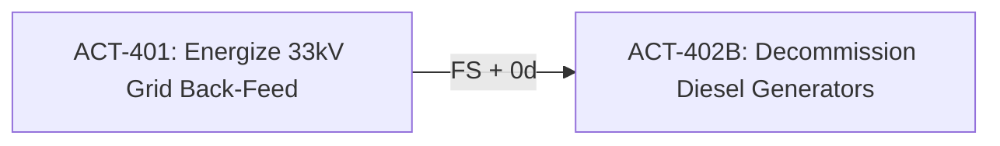
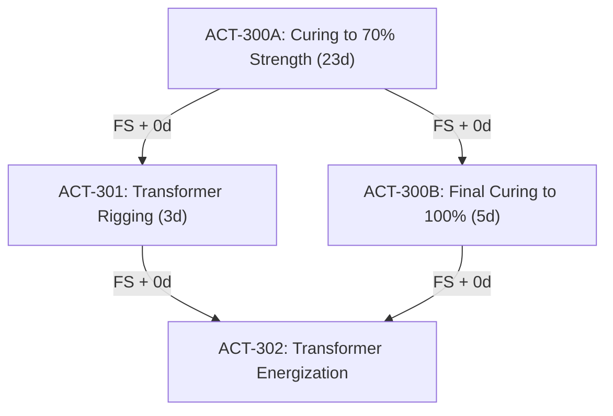

# Solutions: Topic 3.2 — Dependencies (FS, SS, FF, SF)

Comprehensive architectural solutions, mathematical derivations, network graph walk tables, PostgreSQL schemas, and production Golang algorithms for Topic 3.2.

---

## 🏛️ Section A: Conceptual & Theoretical Foundations

### Solution 1: Mathematical Semantics of the 4 Precedence Relationships & Physical Axioms in Solar EPC

#### 1.1 Mathematical Inequalities Under the Continuous-Time Model
In the continuous-time scheduling model ($EF = ES + D$ and $LS = LF - D$), the mathematical inequalities governing the early dates of successor $j$ given predecessor $i$ with lag $L_{ij}$ are:

1. **Finish-to-Start (FS):**
   $$ES_j \ge EF_i + L_{ij}$$
   *Derived Early Finish:* $EF_j = ES_j + D_j \ge EF_i + L_{ij} + D_j$.

2. **Start-to-Start (SS):**
   $$ES_j \ge ES_i + L_{ij}$$
   *Derived Early Finish:* $EF_j = ES_j + D_j \ge ES_i + L_{ij} + D_j$.

3. **Finish-to-Finish (FF):**
   $$EF_j \ge EF_i + L_{ij}$$
   *Derived Early Start (Contiguous Work):* $ES_j = EF_j - D_j \ge EF_i + L_{ij} - D_j$.

4. **Start-to-Finish (SF):**
   $$EF_j \ge ES_i + L_{ij}$$
   *Derived Early Start (Contiguous Work):* $ES_j = EF_j - D_j \ge ES_i + L_{ij} - D_j$.

---

#### 1.2 Physical Grounding in the Surya 100MW Solar IPP Project

| Type | Predecessor ($i$) & Successor ($j$) | Lag ($L_{ij}$) | Physical, Mechanical, or Electrical Justification |
| :--- | :--- | :--- | :--- |
| **FS** | **Pred:** `ACT-101: Excavate Inverter Pad Pit`<br>**Succ:** `ACT-102: Pour PCC Blinding Layer` | $0\text{ Days}$ | **Physical Geometric Prerequisite:** Plain Cement Concrete (PCC) must be poured flat on the compacted base of the pit. You cannot place concrete into mid-air while an excavator bucket is still digging out desert sand and boulders. |
| **SS** | **Pred:** `ACT-201: MV DC Trenching (5km)`<br>**Succ:** `ACT-202: Lay 33kV Armored Cable` | $+2\text{ Days}$ | **Pipelined Linear Production:** In the Thar Desert, open unlined trenches collapse if left exposed to sandstorms. The cable-laying spool truck must follow 2 days behind the trenching machine, using the newly opened trench continuously. |
| **FF** | **Pred:** `ACT-301: Erect Tracker Tables (Block 02)`<br>**Succ:** `ACT-302: Fastener Torque Quality Audit` | $+1\text{ Day}$ | **Synchronized Wrap-Up:** Quality auditors verify bolt torques across 6,800 tables progressively. However, their final inspection sign-off and compliance report cannot complete until 1 day after the very last tracker table has been torqued. |
| **SF** | **Pred:** `ACT-401: Energize 33kV Permanent Grid Back-Feed`<br>**Succ:** `ACT-402: Operate Site Temporary Diesel Generators` | $0\text{ Days}$ | **Just-In-Time Continuity:** Site SCADA and control rooms require continuous 24/7 electrical power. The rented diesel generators must not finish operating until the permanent grid power is energized and stable. |

---

#### 1.3 Why Industry Standards Mandate $\ge 90\%$ Finish-to-Start (FS) Ties
Global project controls bodies (AACE International, US Army Corps of Engineers, UK Association for Project Management) enforce a strict $\ge 90\%$ threshold for FS relationships because:

1. **Physical Traceability:** Construction is an additive physical process. Matter must be placed before it can be modified. FS ties represent unequivocal handoffs of completed physical deliverables.
2. **Obscuration of Risk via Overlapping Logic:** Excessive SS and FF relationships allow schedulers to artificially compress project schedules on paper (fast-tracking) without verifying whether site space, access roads, or crane radii can physically support concurrent crews.
3. **Loss of Float Visibility:** As demonstrated in Section 2, standalone SS ties leave finishes unconstrained, and standalone FF ties leave starts unconstrained. This introduces artificial positive float, giving project owners a false sense of schedule security while milestones quietly slip.

---

### Solution 2: The "Ladder Logic" (SS + FF) Paradox: Workfront Compression vs. Stretch

Given:
* Activity $A$: `Piling Posts`
* Activity $B$: `Tracker Assembly`
* Constraints: $A \xrightarrow{SS + 3\text{d}} B$ and $A \xrightarrow{FF + 3\text{d}} B$.
* $ES_A = \text{Day } 0$.

#### 1. Scenario 1: Equal Durations ($D_A = 20\text{d}, D_B = 20\text{d}$)
* Forward Pass from $A$:
  * $EF_A = ES_A + D_A = 0 + 20 = \text{Day } 20$.
* Constraints on $B$:
  * Start Constraint (SS): $ES_B \ge ES_A + L_{SS} = 0 + 3 = \text{Day } 3$.
  * Finish Constraint (FF): $EF_B \ge EF_A + L_{FF} = 20 + 3 = \text{Day } 23$.
* Under continuous duration ($EF_B = ES_B + D_B$):
  * From SS: If $ES_B = 3 \implies EF_B = 3 + 20 = \text{Day } 23$.
  * From FF: If $EF_B = 23 \implies ES_B = 23 - 20 = \text{Day } 3$.
* **Conclusion:** Both constraints are satisfied simultaneously.
  * $ES_B = \text{Day } 3$, $EF_B = \text{Day } 23$.
  * **Both the SS and FF relationships are DRIVING** (they share equal control).

```
Day:   0  1  2  3  4  5 ... 20 21 22 23
Act A: [═══════════════ 20 Days ═══════════════]
Act B:       [═══════════════ 20 Days ═══════════════]
```

---

#### 2. Scenario 2: Faster Successor / Workfront Compression ($D_A = 20\text{d}, D_B = 10\text{d}$)
* $ES_A = 0$, $EF_A = 20$.
* Constraints on $B$:
  * Start Constraint (SS): $ES_B \ge 0 + 3 = \text{Day } 3$.
  * Finish Constraint (FF): $EF_B \ge 20 + 3 = \text{Day } 23$.
* Evaluate under Contiguous Execution ($EF_B = ES_B + 10$):
  * If $B$ starts on Day 3: $EF_B = 3 + 10 = \text{Day } 13$.  
    *Check FF:* Is $13 \ge 23$? **NO! Violates the FF constraint by 10 days.**
  * To satisfy $EF_B \ge 23$: $EF_B = \text{Day } 23$.
  * Since $B$ is contiguous: $ES_B = EF_B - D_B = 23 - 10 = \text{Day } 13$.
  * *Check SS:* Is $13 \ge 3$? **YES ($13 \ge 3$).**
* **Conclusion:**
  * $ES_B = \text{Day } 13$, $EF_B = \text{Day } 23$.
  * **The Finish-to-Finish (FF) relationship is DRIVING.**
  * The SS relationship is Non-Driving with $13 - 3 = 10\text{ days}$ of slack.

```
Day:   0  1  2  3 ... 10 11 12 13 ... 20 21 22 23
Act A: [════════════════════════ 20 Days ════════════════════════]
Act B:                         [═════ 10 Days ═════]
                                                   |<-- 3d Lag ->|
```

* **Physical EPC Explanation:** If the tracker assembly crew started on Day 3, their installation rate (10 days total) is twice as fast as the piling crew (20 days total). By Day 8, the assembly crew would physically catch up to the piling rig, run out of driven posts, and sit idle in the desert waiting for piles to be driven. To maintain continuous work without demobilizing labor, the assembly crew must delay their start until Day 13.

---

#### 3. Scenario 3: Slower Successor / Workfront Stretch ($D_A = 10\text{d}, D_B = 25\text{d}$)
* $ES_A = 0$, $EF_A = 10$.
* Constraints on $B$:
  * Start Constraint (SS): $ES_B \ge 0 + 3 = \text{Day } 3$.
  * Finish Constraint (FF): $EF_B \ge 10 + 3 = \text{Day } 13$.
* Evaluate under Contiguous Execution ($EF_B = ES_B + 25$):
  * If $B$ starts on Day 3: $EF_B = 3 + 25 = \text{Day } 28$.
  * *Check FF:* Is $28 \ge 13$? **YES ($28 \ge 13$).** The FF constraint is satisfied with 15 days of cushion.
* **Conclusion:**
  * $ES_B = \text{Day } 3$, $EF_B = \text{Day } 28$.
  * **The Start-to-Start (SS) relationship is DRIVING.**
  * The FF relationship is Non-Driving with $28 - 13 = 15\text{ days}$ of slack.

---

#### 4. Contiguous vs. Interruptible Duration in Primavera P6
* **Contiguous Duration (P6 Standard):** The scheduling engine assumes that once a subcontractor mobilizes, their work cannot be paused. When the finish constraint dictates a late finish, the engine pushes the early start date forward into the future to preserve $EF - ES = D$.
* **Interruptible Duration:** The engine allows the activity to split into multiple working segments. In Scenario 2, Activity $B$ would start on Day 3, work until it catches up with Activity $A$, pause (split) for 10 days, and resume to finish on Day 23.

---

### Solution 3: The Enigma of Start-to-Finish (SF): Real-World Utility & Pitfalls

#### 1. Formal Mathematical Equations
* **Forward Pass (Successor $j$ from Predecessor $i$):**
  $$EF_j \ge ES_i + L_{ij}$$
  $$ES_j = EF_j - D_j \ge ES_i + L_{ij} - D_j \quad \text{(for contiguous work)}$$
* **Backward Pass (Predecessor $i$ from Successor $j$):**
  $$LS_i \le LF_j - L_{ij}$$
  $$LF_i = LS_i + D_i \le LF_j - L_{ij} + D_i$$

---

#### 2. Surya 100MW Diesel Handover Timeline
* Predecessor $A$: `Grid Back-Feed Energization` ($ES_A = \text{Day } 45$).
* Successor $B$: `Operate Diesel Gensets` ($D_B = 30\text{ days}$).
* Relationship: $A \xrightarrow{SF + 0\text{d}} B$.

```
Baseline Schedule:
Day:    15              30              45              60
Act B:  [══════════ Operate Genset 30d ═════════] (Finishes Day 45)
Act A:                                          [ Grid Energized ] (Starts Day 45)

Delay Scenario: Grid Energization delayed by 15 days (Starts Day 60):
Day:    15              30              45              60              75
Act B:                  [══════════ Operate Genset 30d ═════════] (Finishes Day 60)
Act A:                                                          [ Grid Energized ] (Starts Day 60)
                                                                ▲
                                                         SF Logic Driving
```
Because $EF_B \ge ES_A$, whenever $ES_A$ slips from Day 45 to Day 60, $EF_B$ is forced from Day 45 to Day 60, directly extending the genset lease.

---

#### 3. Three Reasons Why Schedulers Avoid SF Ties
1. **Cognitive Inversion:** In standard CPM Gantt charts, causation flows forward: early events cause late events. SF reverses this visual intuition: an event happening *in the future* (Grid Energization Start) controls when an event *originating in the past* (Genset Operation) can finish.
2. **Resource Leveling Failure:** Forward-scheduling resource levelers shift activities to the right to resolve resource peaks. With an SF link, shifting $B$'s start to the right pushes its finish past $A$'s start, but shifting $A$'s start to the right pushes $B$'s finish *further right*, frequently causing leveling algorithms to oscillate or deadlock.
3. **Audit Compliance (DCMA Check 2):** Under the DCMA 14-Point Assessment, any SF link triggers an automatic schedule audit defect unless accompanied by a written memo.

---

#### 4. Re-Modeling Without SF Logic (Pure FS Approach)
Instead of linking an ongoing operation to a future start, decompose the genset lifecycle into two distinct tasks:
1. `ACT-402A: Operate Diesel Generators (Phase 1 - Civil Construction)` ($D = 45\text{ days}$)
2. `ACT-402B: Decommission & Demobilize Diesel Generators` ($D = 3\text{ days}$)

Link using standard Finish-to-Start:

Now, if `ACT-401` slips, `ACT-402B` slips via standard FS logic. The ambiguous SF tie is completely eliminated.

---

### Solution 4: Negative Lag (Lead) Pathology & DCMA Compliance

#### 1. Interpretation of Negative Lag (Lead)
An $FS$ relationship with a negative lag of $-5$ days ($FS - 5\text{d}$) states:
$$ES_{\text{Rigging}} \ge EF_{\text{Curing}} - 5\text{ days}$$
This means the contractor intends to position the 60-ton main power transformer on the concrete foundation pad **5 days before the concrete has finished curing**. A negative lag is called a **Lead** because it accelerates the successor ahead of the predecessor's completion.

---

#### 2. Why DCMA Check 3 Imposes a 0% Tolerance Against Leads
1. **Physical Impossibility & Structural Catastrophe:** Concrete curing is an exothermic chemical hydration reaction requiring 28 days to attain design compressive strength (e.g., 35 N/mm²). Placing a 60-ton transformer 5 days early can cause shear failure and crack the foundation slab.
2. **Artificial Float & Date Manipulation:** Schedulers use negative lags to artificially hide project delays. If the concrete pour slips by 10 days, the negative lag conceals 5 days of the delay from executive reporting.

---

#### 3. Critical Path & Subcontractor Liability Distortion
Suppose the civil contractor pours concrete 4 days late:
* With $FS - 5\text{d}$: The scheduling engine reports that the heavy rigging crew should mobilize *while the concrete is still green*.
* If the rigging crane mobilizes to site and is turned away by safety inspectors, the rigging contractor files a **delay and standing claim** for idle equipment. The EPC manager cannot legally defend against the claim because the approved baseline schedule explicitly commanded the subcontractor to mobilize on that date!

---

#### 4. Re-Engineering the Logic (Zero Negative Lags)
Decompose the 28-day curing process into two physically measurable stages:
1. `ACT-300A: Concrete Hydration to 70% Design Strength (Stripping & Early Loading)` ($D = 23\text{ days}$)
2. `ACT-300B: Final Hydration to 100% Strength (Full Operational Loading)` ($D = 5\text{ days}$)

Link with standard positive logic:
* `ACT-300A` $\xrightarrow{FS + 0\text{d}}$ `ACT-301: Transformer Rigging & Leveling`
* `ACT-300B` and `ACT-301` $\xrightarrow{FS + 0\text{d}}$ `ACT-302: Transformer Oil Filling & Energization`


This preserves full critical path integrity with **zero negative lags**.

---

## ⚡ Section B: Mathematical Calculations & Network Graph Walks

### Solution 5: Multi-Predecessor Convergence & Driving Relationship Identification

Given Activity `ACT-500` ($D = 3\text{ days}$):
* Predecessor 1 (`ACT-401`): $ES = 0\text{d}, EF = 4\text{d}$. Rel: $FS$, Lag = $+1\text{d}$.
* Predecessor 2 (`ACT-402`): $ES = 2\text{d}, EF = 6\text{d}$. Rel: $FS$, Lag = $0\text{d}$.
* Predecessor 3 (`ACT-403`): $ES = 3\text{d}, EF = 7\text{d}$. Rel: $SS$, Lag = $+4\text{d}$.
* Predecessor 4 (`ACT-404`): $ES = 1\text{d}, EF = 8\text{d}$. Rel: $FF$, Lag = $+1\text{d}$.

---

#### 1. Calculation of Required Early Start ($\text{ReqES}$) for Each Edge

1. **Edge 1 (`ACT-401` $\xrightarrow{FS + 1\text{d}}$ `ACT-500`):**
   $$\text{ReqES}_1 = EF_{401} + L = 4 + 1 = \text{Day } 5$$

2. **Edge 2 (`ACT-402` $\xrightarrow{FS + 0\text{d}}$ `ACT-500`):**
   $$\text{ReqES}_2 = EF_{402} + L = 6 + 0 = \text{Day } 6$$

3. **Edge 3 (`ACT-403` $\xrightarrow{SS + 4\text{d}}$ `ACT-500`):**
   $$\text{ReqES}_3 = ES_{403} + L = 3 + 4 = \text{Day } 7$$

4. **Edge 4 (`ACT-404` $\xrightarrow{FF + 1\text{d}}$ `ACT-500`):**
   $$\text{ReqEF}_4 = EF_{404} + L = 8 + 1 = \text{Day } 9$$
   $$\text{ReqES}_4 = \text{ReqEF}_4 - D_{500} = 9 - 3 = \text{Day } 6$$

---

#### 2. Determining $ES_{500}$ and $EF_{500}$
$$ES_{500} = \max(\text{ReqES}_1, \text{ReqES}_2, \text{ReqES}_3, \text{ReqES}_4) = \max(5, 6, 7, 6) = \text{Day } 7$$
$$EF_{500} = ES_{500} + D_{500} = 7 + 3 = \text{Day } 10$$

---

#### 3. Identifying the Driving Relationship
* Predecessor 1: $\text{ReqES}_1 = 5 \ne 7 \implies$ Non-Driving
* Predecessor 2: $\text{ReqES}_2 = 6 \ne 7 \implies$ Non-Driving
* **Predecessor 3 (`ACT-403`): $\text{ReqES}_3 = 7 == 7 \implies$ DRIVING RELATIONSHIP!**
* Predecessor 4: $\text{ReqES}_4 = 6 \ne 7 \implies$ Non-Driving

---

#### 4. Relationship Free Float (Slack) on Each Incoming Edge
* Slack on Edge 1: $ES_{500} - \text{ReqES}_1 = 7 - 5 = 2\text{ Days}$.
* Slack on Edge 2: $ES_{500} - \text{ReqES}_2 = 7 - 6 = 1\text{ Day}$.
* **Slack on Edge 3: $ES_{500} - \text{ReqES}_3 = 7 - 7 = 0\text{ Days}$ (Driving edge has 0 slack).**
* Slack on Edge 4: $EF_{500} - \text{ReqEF}_4 = 10 - 9 = 1\text{ Day}$ (or $7 - 6 = 1\text{ Day}$).

---

#### 5. Impact of `ACT-404` Delay (EF slips to Day 11)
If $EF_{404} = \text{Day } 11$:
* New $\text{ReqEF}_4 = 11 + 1 = \text{Day } 12$.
* New $\text{ReqES}_4 = 12 - 3 = \text{Day } 9$.
* Recalculate $ES_{500}$:
  $$ES_{500} = \max(5, 6, 7, 9) = \text{Day } 9$$
  $$EF_{500} = 9 + 3 = \text{Day } 12$$
* **Edge 4 (`ACT-404` $\xrightarrow{FF + 1\text{d}}$ `ACT-500`) now becomes the DRIVING RELATIONSHIP.**

---

### Solution 6: Complete Forward & Backward CPM Pass with Mixed Relationship Types

Given Network:
* `ACT-A`: $D = 4\text{d}$. Start = Day 0.
* `ACT-B`: $D = 6\text{d}$. Pred: `ACT-A` ($FS, 0\text{d}$).
* `ACT-C`: $D = 8\text{d}$. Pred: `ACT-B` ($SS, +2\text{d}$).
* `ACT-D`: $D = 3\text{d}$. Pred: `ACT-C` ($FF, +1\text{d}$).
* `ACT-E`: $D = 4\text{d}$. Pred: `ACT-B` ($FS, 0\text{d}$), `ACT-D` ($FS, 0\text{d}$).
* `ACT-F`: $D = 2\text{d}$. Pred: `ACT-E` ($FS, 0\text{d}$).

---

#### 1. Forward Pass Walkthrough

1. **`ACT-A`:**
   * $ES_A = 0$
   * $EF_A = 0 + 4 = \text{Day } 4$.
2. **`ACT-B`:**
   * Pred: $A \xrightarrow{FS + 0\text{d}} B \implies ES_B = EF_A + 0 = \text{Day } 4$.
   * $EF_B = 4 + 6 = \text{Day } 10$. (Driving: `ACT-A`).
3. **`ACT-C`:**
   * Pred: $B \xrightarrow{SS + 2\text{d}} C \implies ES_C = ES_B + 2 = 4 + 2 = \text{Day } 6$.
   * $EF_C = 6 + 8 = \text{Day } 14$. (Driving: `ACT-B`).
4. **`ACT-D`:**
   * Pred: $C \xrightarrow{FF + 1\text{d}} D \implies EF_D \ge EF_C + 1 = 14 + 1 = \text{Day } 15$.
   * Since $D_D = 3\text{d}$: $ES_D = EF_D - D_D = 15 - 3 = \text{Day } 12$. (Driving: `ACT-C`).
5. **`ACT-E`:**
   * Pred 1: $B \xrightarrow{FS + 0\text{d}} E \implies \text{ReqES} = EF_B + 0 = 10$.
   * Pred 2: $D \xrightarrow{FS + 0\text{d}} E \implies \text{ReqES} = EF_D + 0 = 15$.
   * $ES_E = \max(10, 15) = \text{Day } 15$. (Driving: `ACT-D`).
   * $EF_E = 15 + 4 = \text{Day } 19$.
6. **`ACT-F`:**
   * Pred: $E \xrightarrow{FS + 0\text{d}} F \implies ES_F = EF_E + 0 = \text{Day } 19$.
   * $EF_F = 19 + 2 = \text{Day } 21$. (Driving: `ACT-E`).

**Forward Pass Results Summary Table:**

| Activity | Duration | Early Start ($ES$) | Early Finish ($EF$) | Driving Predecessor |
| :--- | :--- | :--- | :--- | :--- |
| **ACT-A** | 4 | **Day 0** | **Day 4** | None (Root) |
| **ACT-B** | 6 | **Day 4** | **Day 10** | ACT-A ($FS$) |
| **ACT-C** | 8 | **Day 6** | **Day 14** | ACT-B ($SS$) |
| **ACT-D** | 3 | **Day 12** | **Day 15** | ACT-C ($FF$) |
| **ACT-E** | 4 | **Day 15** | **Day 19** | ACT-D ($FS$) |
| **ACT-F** | 2 | **Day 19** | **Day 21** | ACT-E ($FS$) |

---

#### 2. Total Early Project Duration
The total project duration is **21 Days** ($EF_F = 21$).

---

#### 3. Backward Pass Walkthrough
Set Project Finish: $LF_F = EF_F = \text{Day } 21$.

1. **`ACT-F`:**
   * $LF_F = 21$.
   * $LS_F = LF_F - D_F = 21 - 2 = \text{Day } 19$.
2. **`ACT-E`:**
   * Succ: $F$ via $FS + 0\text{d} \implies LF_E = LS_F - 0 = \text{Day } 19$.
   * $LS_E = LF_E - D_E = 19 - 4 = \text{Day } 15$.
3. **`ACT-D`:**
   * Succ: $E$ via $FS + 0\text{d} \implies LF_D = LS_E - 0 = \text{Day } 15$.
   * $LS_D = LF_D - D_D = 15 - 3 = \text{Day } 12$.
4. **`ACT-C`:**
   * Succ: $D$ via $FF + 1\text{d}$.
   * Formula: $LF_C \le LF_D - L_{FF} = 15 - 1 = \text{Day } 14$.
   * $LS_C = LF_C - D_C = 14 - 8 = \text{Day } 6$.
5. **`ACT-B`:**
   * Succ 1: $E$ via $FS + 0\text{d} \implies \text{ReqLF} = LS_E - 0 = 15 - 0 = \text{Day } 15$.
   * Succ 2: $C$ via $SS + 2\text{d} \implies \text{ReqLF} = LS_C - L_{SS} + D_B = 6 - 2 + 6 = \text{Day } 10$.
   * $LF_B = \min(15, 10) = \text{Day } 10$.
   * $LS_B = LF_B - D_B = 10 - 6 = \text{Day } 4$.
6. **`ACT-A`:**
   * Succ: $B$ via $FS + 0\text{d} \implies LF_A = LS_B - 0 = 4 - 0 = \text{Day } 4$.
   * $LS_A = LF_A - D_A = 4 - 4 = \text{Day } 0$.

**Complete Network Schedule Table:**

| Activity | Dur | $ES$ | $EF$ | $LS$ | $LF$ | Total Float ($TF$) | Free Float ($FF$) | Critical? |
| :--- | :--- | :--- | :--- | :--- | :--- | :--- | :--- | :--- |
| **ACT-A** | 4 | 0 | 4 | 0 | 4 | **0** | **0** | **YES** |
| **ACT-B** | 6 | 4 | 10 | 4 | 10 | **0** | **0** | **YES** |
| **ACT-C** | 8 | 6 | 14 | 6 | 14 | **0** | **0** | **YES** |
| **ACT-D** | 3 | 12 | 15 | 12 | 15 | **0** | **0** | **YES** |
| **ACT-E** | 4 | 15 | 19 | 15 | 19 | **0** | **0** | **YES** |
| **ACT-F** | 2 | 19 | 21 | 19 | 21 | **0** | **0** | **YES** |

---

#### 4. The Critical Path
Every activity in this chain has $TF = 0$.  
**The Critical Path is:**  
$$\text{ACT-A} \xrightarrow{FS} \text{ACT-B} \xrightarrow{SS+2\text{d}} \text{ACT-C} \xrightarrow{FF+1\text{d}} \text{ACT-D} \xrightarrow{FS} \text{ACT-E} \xrightarrow{FS} \text{ACT-F}$$

---

#### 5. Float Trace for Activity `ACT-C`
* `ACT-C`'s early start is constrained by `ACT-B` via $SS+2\text{d}$ ($ES_C = 4 + 2 = 6$).
* `ACT-C`'s early finish is $6 + 8 = 14$.
* In the backward pass, `ACT-D` demands $LF_C \le LF_D - 1 = 15 - 1 = 14$.
* Because $LF_C (14) == EF_C (14)$, Total Float = $14 - 14 = 0$. Any slip in `ACT-C`'s execution will directly slip `ACT-D`, `ACT-E`, and `ACT-F`.

---

### Solution 7: Start-to-Finish (SF) Date Propagation in Substation Diesel Handover

Given:
* `ACT-701` ($A$): $D_A = 5\text{d}, ES_A = 45\text{d}, EF_A = 50\text{d}$.
* `ACT-702` ($B$): $D_B = 30\text{d}$.
* Relationship: $A \xrightarrow{SF + 0\text{d}} B$.
* Upstream constraint: $ES_B \ge 10\text{d}$.
* Project milestone `ACT-703`: $LF_{\text{Project}} = 50\text{d}$.

---

#### 1. Forward Pass for Activity $B$
* The $SF$ constraint governs Early Finish:
  $$EF_B \ge ES_A + L_{SF} = 45 + 0 = \text{Day } 45$$
* Upstream milestone dictates:
  $$ES_B \ge \text{Day } 10$$
* Under the continuous duration model ($EF_B = ES_B + D_B$):
  * If $ES_B = 10 \implies EF_B = 10 + 30 = \text{Day } 40$.
  * But $EF_B$ must be $\ge 45$.
  * Therefore:
    $$EF_B = \text{Day } 45$$
    $$ES_B = EF_B - D_B = 45 - 30 = \text{Day } 15$$
  * Notice $15 \ge 10$ (satisfies upstream milestone with 5 days slack).

---

#### 2. Backward Pass for Activity $B$
* Project Finish is Day 50.
* Does Activity $B$ have any outgoing successors? The only relationship is $A \xrightarrow{SF} B$, where $A$ is the *Predecessor* and $B$ is the *Successor*.
* Since $B$ has no downstream successors, its Late Finish defaults to project finish:
  $$LF_B = \text{Day } 50$$
  $$LS_B = LF_B - D_B = 50 - 30 = \text{Day } 20$$

---

#### 3. Total Float of Activity $B$
$$TF_B = LS_B - ES_B = 20 - 15 = \mathbf{5\text{ Days}}$$
*(Or $LF_B - EF_B = 50 - 45 = 5\text{ Days}$).*

---

#### 4. Delay Scenario & Commercial Delay Cost
If CEIG regulatory inspection delays $ES_A$ from Day 45 to Day 60:
1. **New Early Finish of $B$:**
   $$EF_B^{\text{new}} = ES_A^{\text{new}} + 0 = \text{Day } 60$$
   $$ES_B^{\text{new}} = 60 - 30 = \text{Day } 30$$
2. **Additional Working Days of Diesel Rental:**
   $$\Delta \text{Days} = 60 - 45 = 15\text{ Days}$$
3. **Direct Commercial Cost Incurred:**
   $$\text{Total Cost} = 15\text{ days} \times ₹45,000/\text{day} = \mathbf{₹675,000}$$
The SF dependency directly captured and quantified the ₹675,000 contractor delay claim!

---

### Solution 8: Dangling Logic Identification & Schedule Sanitization

Given Network:
* `ACT-801: Pull Fiber Optic Ring` ($D = 10\text{d}$)
* `ACT-802: Fusion Splicing FO Cores` ($D = 6\text{d}$), Pred: `ACT-801` ($SS + 2\text{d}$)
* `ACT-803: Install Inverter RTU` ($D = 5\text{d}$), Pred: `ACT-801` ($FS + 0\text{d}$)
* `ACT-804: SCADA Ring Ping Test` ($D = 2\text{d}$), Pred: `ACT-802` ($FS + 0\text{d}$), `ACT-803` ($FS + 0\text{d}$)

---

#### 1. Dangling Open-Ends Analysis
* **`ACT-801` (Dangling Finish):** `ACT-801` has an outgoing $SS$ edge to `ACT-802` and an outgoing $FS$ edge to `ACT-803`. Its finish directly controls `ACT-803`, so `ACT-801`'s finish is technically tied to `ACT-803`. 
* **`ACT-802` (Dangling Start):** `ACT-802` has only an incoming $SS$ tie from `801`. It has **zero incoming Finish constraints**.
* **Crucial Vulnerability:** The completion of `ACT-801` (Fiber Pulling) has **no logic connection whatsoever** to the completion of `ACT-802` (Fiber Splicing)! Splicing can finish on Day 8 while fiber pulling continues until Day 10. You cannot finish fusion splicing fiber cables that have not yet been pulled!

---

#### 2. Forward Pass Calculation
* Project Start = Day 0.
* `ACT-801`: $ES = 0$, $EF = 10$.
* `ACT-802`: $ES = ES_{801} + 2 = 0 + 2 = 2$. $EF = 2 + 6 = \text{Day } 8$.
* `ACT-803`: $ES = EF_{801} + 0 = 10$. $EF = 10 + 5 = \text{Day } 15$.
* `ACT-804`: $ES = \max(EF_{802}, EF_{803}) = \max(8, 15) = \text{Day } 15$. $EF = 15 + 2 = \text{Day } 17$.

---

#### 3. Backward Pass Calculation ($LF_{\text{Project}} = 17$)
* `ACT-804`: $LF = 17$, $LS = 15$, $TF = 0$.
* `ACT-803`: $LF = LS_{804} = 15$, $LS = 15 - 5 = 10$, $TF = 10 - 10 = 0$ (Critical).
* `ACT-802`: $LF = LS_{804} = 15$, $LS = 15 - 6 = 9$, $TF = 9 - 2 = \mathbf{7\text{ Days}}$.
* `ACT-801`:
  * Succ 1 (`ACT-803` via $FS$): $\text{ReqLF} = LS_{803} - 0 = 10 - 0 = 10$.
  * Succ 2 (`ACT-802` via $SS$): $\text{ReqLF} = LS_{802} - 2 + D_{801} = 9 - 2 + 10 = 17$.
  * $LF_{801} = \min(10, 17) = 10$.
  * $LS_{801} = 10 - 10 = 0$, $TF = 0$ (Critical).

---

#### 4. The Open-Ended Logic Distortion
Notice what happened to `ACT-802`:
* `ACT-802` shows $TF = 7\text{ Days}$ of float.
* Its Early Finish is Day 8, while `ACT-801` finishes on Day 10.
* **The Physical Contradiction:** The schedule claims fiber splicing completes on **Day 8**, even though the fiber optic cables are still being pulled through trenches until **Day 10**!
* If fiber pulling (`ACT-801`) hits severe rock obstructions and takes 14 days, `ACT-802`'s early dates do not reflect this reality at all unless manually re-linked.

---

#### 5. Sanitizing the Network
To enforce physical reality, add an **FF relationship** between `ACT-801` and `ACT-802`:
$$\text{ACT-801} \xrightarrow{FF + 1\text{d}} \text{ACT-802}$$
*(Splicing cannot finish until 1 day after fiber pulling finishes).*

**Sanitized Recalculation:**
* $EF_{802} = \max(ES_{802} + D, EF_{801} + 1) = \max(8, 10 + 1) = \text{Day } 11$.
* $ES_{802} = 11 - 6 = \text{Day } 5$.
* Both the start and finish are now physically anchored.

---

## 💻 Section C: Software Architecture & Go DAG Algorithms

### Solution 9: PostgreSQL Relational Schema Design & Adjacency Indexing

#### 1. Complete PostgreSQL DDL Script

```sql
-- Enable UUID extension
CREATE EXTENSION IF NOT EXISTS "pgcrypto";

-- Relationship Type Enum
DO $$ BEGIN
    CREATE TYPE relationship_type_enum AS ENUM ('FS', 'SS', 'FF', 'SF');
EXCEPTION
    WHEN duplicate_object THEN null;
END $$;

-- 1. Activities Table (Graph Vertices)
CREATE TABLE IF NOT EXISTS activities (
    id UUID PRIMARY KEY DEFAULT gen_random_uuid(),
    project_id UUID NOT NULL,
    activity_code VARCHAR(50) NOT NULL,
    name VARCHAR(255) NOT NULL,
    duration_hours NUMERIC(10, 2) NOT NULL DEFAULT 0.00 CHECK (duration_hours >= 0),
    calendar_id UUID NOT NULL,
    
    -- Forward Pass Outputs
    early_start TIMESTAMPTZ,
    early_finish TIMESTAMPTZ,
    
    -- Backward Pass Outputs
    late_start TIMESTAMPTZ,
    late_finish TIMESTAMPTZ,
    
    -- Float Metrics
    total_float_hours NUMERIC(10, 2),
    free_float_hours NUMERIC(10, 2),
    is_critical BOOLEAN NOT NULL DEFAULT FALSE,
    
    created_at TIMESTAMPTZ NOT NULL DEFAULT CURRENT_TIMESTAMP,
    updated_at TIMESTAMPTZ NOT NULL DEFAULT CURRENT_TIMESTAMP,
    
    CONSTRAINT uq_project_activity_code UNIQUE (project_id, activity_code)
);

-- 2. Activity Relationships Table (Graph Directed Edges)
CREATE TABLE IF NOT EXISTS activity_relationships (
    id UUID PRIMARY KEY DEFAULT gen_random_uuid(),
    project_id UUID NOT NULL,
    pred_activity_id UUID NOT NULL REFERENCES activities(id) ON DELETE CASCADE,
    succ_activity_id UUID NOT NULL REFERENCES activities(id) ON DELETE CASCADE,
    type relationship_type_enum NOT NULL DEFAULT 'FS',
    lag_hours NUMERIC(10, 2) NOT NULL DEFAULT 0.00,
    is_driving BOOLEAN NOT NULL DEFAULT FALSE,
    
    created_at TIMESTAMPTZ NOT NULL DEFAULT CURRENT_TIMESTAMP,
    updated_at TIMESTAMPTZ NOT NULL DEFAULT CURRENT_TIMESTAMP,
    
    -- Constraint: No Self-Loops (A -> A)
    CONSTRAINT chk_no_self_relationship CHECK (pred_activity_id <> succ_activity_id),
    
    -- Constraint: No Duplicate Edges between same pair
    CONSTRAINT uq_pred_succ_relationship UNIQUE (pred_activity_id, succ_activity_id)
);

-- Indexes for CPM Performance
-- Index for Forward Pass (lookup successors from predecessor):
CREATE INDEX IF NOT EXISTS idx_rel_pred_succ 
    ON activity_relationships (pred_activity_id, succ_activity_id);

-- Index for Backward Pass & In-Degree Calculation (lookup predecessors from successor):
CREATE INDEX IF NOT EXISTS idx_rel_succ_pred 
    ON activity_relationships (succ_activity_id, pred_activity_id);

-- Index for Project Boundary Queries:
CREATE INDEX IF NOT EXISTS idx_activities_project 
    ON activities (project_id);

CREATE INDEX IF NOT EXISTS idx_relationships_project 
    ON activity_relationships (project_id);
```

---

#### 2. Indexing Rationale for 50k Activities / 120k Relationships
* During the **Forward Pass**, the engine iterates over activities in topological order. For each activity $u$, it queries all outgoing edges to find successors $v$. The composite index `(pred_activity_id, succ_activity_id)` covers this query entirely in the B-Tree index page cache without table heap lookups.
* During the **Backward Pass**, the engine traverses reverse topological order. For each activity $v$, it queries all incoming edges from predecessors $u$. The index `(succ_activity_id, pred_activity_id)` guarantees instant reverse traversals.

---

#### 3. SQL Query to Detect All Dangling Activities

```sql
-- Audit Query: Detect Dangling Starts, Dangling Finishes, and Open Ends
WITH activity_edge_stats AS (
    SELECT 
        a.id AS activity_id,
        a.activity_code,
        a.name,
        a.project_id,
        -- Count incoming edges
        COUNT(r_in.id) AS total_predecessors,
        COUNT(CASE WHEN r_in.type IN ('FS', 'SS') THEN 1 END) AS start_controlling_preds,
        -- Count outgoing edges
        COUNT(r_out.id) AS total_successors,
        COUNT(CASE WHEN r_out.type IN ('FS', 'FF') THEN 1 END) AS finish_controlling_succs
    FROM activities a
    LEFT JOIN activity_relationships r_in ON a.id = r_in.succ_activity_id
    LEFT JOIN activity_relationships r_out ON a.id = r_out.pred_activity_id
    WHERE a.project_id = 'c0a80123-7b89-4e12-89ab-cdef01234567' -- Replace with Target Project ID
    GROUP BY a.id, a.activity_code, a.name, a.project_id
)
SELECT 
    activity_code,
    name,
    CASE 
        WHEN total_predecessors = 0 AND total_successors = 0 THEN 'ISOLATED_ACTIVITY'
        WHEN total_predecessors = 0 THEN 'PROJECT_START_OPEN_END'
        WHEN total_successors = 0 THEN 'PROJECT_FINISH_OPEN_END'
        WHEN start_controlling_preds = 0 THEN 'DANGLING_START (Only FF Preds)'
        WHEN finish_controlling_succs = 0 THEN 'DANGLING_FINISH (Only SS Succs)'
        ELSE 'VALID'
    END AS defect_type
FROM activity_edge_stats
WHERE 
    total_predecessors = 0 
    OR total_successors = 0 
    OR start_controlling_preds = 0 
    OR finish_controlling_succs = 0;
```

---

### Solution 10: Cycle Detection: Kahn's Algorithm vs. Tarjan's SCC

#### 1. Kahn's Algorithm Mechanics & Complexity
* **Mechanics:** Computes the in-degree of all vertices. Adds all vertices with in-degree = 0 to a queue. Pops nodes from the queue, appends them to a sorted output list, and decrements the in-degree of their successors. If a successor reaches in-degree = 0, it enters the queue.
* **Cycle Detection:** If the number of processed vertices $< |V|$, the remaining vertices have mutual dependencies (cycles).
* **Complexity:** Time $O(|V| + |E|)$, Space $O(|V|)$.

---

#### 2. Tarjan's Strongly Connected Components (SCC) Mechanics
* **Mechanics:** Performs a single Depth-First Search (DFS). Assigns each node a strictly increasing integer discovery index (`dfn[u]`) and maintains a `low[u]` value (the lowest index reachable from $u$ via back-edges). Nodes are placed on a stack during recursion.
* **Cycle Detection:** A cycle exists if an SCC contains $\ge 2$ vertices, or a single vertex with a self-loop.
* **Complexity:** Time $O(|V| + |E|)$, Space $O(|V|)$.

---

#### 3. Algorithmic Trade-Off for Interactive Scheduling Web Apps

| Requirement | Best Algorithm | Architectural Rationale |
| :--- | :--- | :--- |
| **Topological Sort for CPM Execution** | **Kahn's Algorithm** | Produces the exact topological evaluation sequence directly. Kahn's output array is passed immediately to the Forward Pass loop without additional sorting. |
| **User-Facing Cycle Error Pinpointing** | **Tarjan's Algorithm** | Kahn's algorithm only reports *"A cycle exists somewhere among these 50 unvisited nodes"*. Tarjan's algorithm isolates the exact minimal cycle sub-graph, allowing the backend to return: `"Cycle detected: ACT-101 -> ACT-104 -> ACT-108 -> ACT-101"`. |

---

#### 4. Tarjan's SCC Pseudo-Code for CPM Networks

```
Algorithm TarjanSCC(Graph G):
    index := 0
    stack := []
    onStack := set()
    dfn := map()
    low := map()
    cycles := []

    Function StrongConnect(u):
        dfn[u] := index
        low[u] := index
        index := index + 1
        stack.push(u)
        onStack.add(u)

        For each edge (u, v) in G.outEdges(u):
            If v not in dfn:
                StrongConnect(v)
                low[u] := min(low[u], low[v])
            Else if v in onStack:
                low[u] := min(low[u], dfn[v])

        // Root of an SCC found
        If low[u] == dfn[u]:
            component := []
            Repeat:
                w := stack.pop()
                onStack.remove(w)
                component.append(w)
            Until w == u

            If length(component) > 1:
                cycles.append(component) // Detected directed cycle!

    For each vertex v in G.Vertices:
        If v not in dfn:
            StrongConnect(v)

    Return cycles
```

---

### Solution 11: Real-Time Incremental Cycle Detection in Go

#### 1. Mathematical Proof of Reachability Check
* **Theorem:** In an existing Directed Acyclic Graph $G = (V, E)$, adding a new directed edge $e = (U, V)$ creates a directed cycle if and only if there already exists a directed path from $V$ to $U$ ($V \rightsquigarrow U$).
* **Proof:**
  * ($\Rightarrow$) If adding $(U, V)$ creates a cycle $C$, the cycle must contain the newly added edge $(U, V)$. Therefore, $C = U \to V \to w_1 \to w_2 \to \dots \to U$. The subpath $V \to w_1 \to \dots \to U$ is a directed path from $V$ to $U$ in the graph *prior* to adding $(U, V)$.
  * ($\Leftarrow$) If there already exists a path $V \rightsquigarrow U$, adding $(U, V)$ completes the closed loop $U \to V \rightsquigarrow U$, which is by definition a directed cycle. $\blacksquare$

---

#### 2. Production Go Implementation with `sync.RWMutex`

```go
package cpm

import (
	"fmt"
	"sync"
)

// ScheduleGraph represents the thread-safe in-memory project DAG
type ThreadSafeScheduleGraph struct {
	mu         sync.RWMutex
	Activities map[string]*ActivityNode
	Edges      []*RelationshipEdge
}

// WouldCreateCycle tests whether adding an edge predID -> succID would create a cycle.
// Runs an in-memory BFS from succID to predID.
// If predID is reachable from succID, adding the edge creates a cycle.
func (g *ThreadSafeScheduleGraph) WouldCreateCycle(predID, succID string) bool {
	// Rule 1: Self-loop is immediate cycle
	if predID == succID {
		return true
	}

	g.mu.RLock()
	defer g.mu.RUnlock()

	// Verify both nodes exist
	if _, exists := g.Activities[predID]; !exists {
		return false
	}
	if _, exists := g.Activities[succID]; !exists {
		return false
	}

	// BFS traversal from succID searching for predID
	visited := make(map[string]bool)
	queue := []string{succID}
	visited[succID] = true

	for len(queue) > 0 {
		currID := queue[0]
		queue = queue[1:]

		// If we reached predID, a path succID ~> predID exists!
		if currID == predID {
			return true
		}

		currNode, exists := g.Activities[currID]
		if !exists {
			continue
		}

		for _, outEdge := range currNode.OutEdges {
			targetID := outEdge.SuccID
			if !visited[targetID] {
				visited[targetID] = true
				queue = append(queue, targetID)
			}
		}
	}

	return false
}

// AddRelationshipWithValidation atomically validates and adds a new precedence edge
func (g *ThreadSafeScheduleGraph) AddRelationshipWithValidation(
	edgeID, predID, succID string, 
	relType RelationshipType, 
	lagHours float64,
) error {
	// Fast path check under read lock
	if g.WouldCreateCycle(predID, succID) {
		return fmt.Errorf("cycle rejection: adding edge %s -> %s introduces a circular loop", predID, succID)
	}

	// Acquire write lock to modify graph topology
	g.mu.Lock()
	defer g.mu.Unlock()

	// Double-check under write lock to eliminate race conditions
	pred, okPred := g.Activities[predID]
	succ, okSucc := g.Activities[succID]
	if !okPred || !okSucc {
		return fmt.Errorf("activity node not found")
	}

	// Prevent duplicate edges
	for _, edge := range pred.OutEdges {
		if edge.SuccID == succID {
			return fmt.Errorf("relationship already exists between %s and %s", predID, succID)
		}
	}

	edge := &RelationshipEdge{
		ID:        edgeID,
		PredID:    predID,
		SuccID:    succID,
		Type:      relType,
		LagHours:  lagHours,
		IsDriving: false,
	}

	pred.OutEdges = append(pred.OutEdges, edge)
	succ.InEdges = append(succ.InEdges, edge)
	g.Edges = append(g.Edges, edge)

	return nil
}
```

---

#### 3. Complexity Analysis
* **Full Topological Sort (Kahn's):** Must visit every single vertex and edge in the entire project: $\Theta(|V| + |E|)$. For a 20,000-activity schedule, this touches 20,000 nodes and 50,000 edges on every mouse drag!
* **Incremental Reachability Check:** Visits only the downstream reachable subgraph of `succID`. In real construction schedules, the downstream subgraph for a single task typically contains only 5 to 50 activities. Typical time is **under 10 microseconds** ($O(k)$, where $k \ll |V|$).

---

### Solution 12: Transitive Reduction and Redundant Edge Pruning in Go

#### 1. Formal Definition of Transitive Reduction
For a Directed Acyclic Graph $G = (V, E)$, its **Transitive Reduction** is the unique graph $G^t = (V, E^t)$ having the fewest possible edges such that the transitive closure of $G^t$ is identical to the transitive closure of $G$. In simple terms: it preserves all reachability while removing all shortcut edges.

---

#### 2. CPM Mathematical Redundancy Conditions with Lags and Durations
In a weighted CPM network, an edge $e = (A, C)$ of type $FS$ with lag $L_{AC}$ cannot be removed merely because an alternate path $A \to B \to C$ exists.

The edge $(A, C)$ is redundant **if and only if**:
1. An alternate directed path exists from $A$ to $C$: $A \to v_1 \to v_2 \to \dots \to C$.
2. The earliest start constraint imposed along the alternate path is **greater than or equal to** the constraint imposed by the direct edge:
   $$\text{ReqES}_{\text{AlternatePath}}(A \rightsquigarrow C) \ge EF_A + L_{AC}$$

For a simple 3-node sequence with $FS$ relationships:
$$\text{AlternateReqES} = EF_A + L_{AB} + D_B + L_{BC}$$
If:
$$EF_A + L_{AB} + D_B + L_{BC} \ge EF_A + L_{AC} \iff L_{AB} + D_B + L_{BC} \ge L_{AC}$$
Then the direct tie $A \to C$ has **zero mathematical influence** on $C$'s early start under all possible durations, and is strictly redundant.

---

#### 3. Production Go Implementation of Transitive Redundancy Analyzer

```go
package cpm

// RedundantEdgeReport encapsulates details about a pruned redundant edge
type RedundantEdgeReport struct {
	RedundantEdge *RelationshipEdge
	AlternatePath []string
	Reason        string
}

// FindRedundantEdges identifies all transitive redundant edges in the graph
func (g *ScheduleGraph) FindRedundantEdges() []*RedundantEdgeReport {
	redundant := make([]*RedundantEdgeReport, 0)

	// For each node u
	for _, u := range g.Activities {
		// Iterate over each outgoing edge u -> v
		for _, directEdge := range u.OutEdges {
			// We test if there is an ALTERNATE path from u to v (excluding directEdge)
			targetID := directEdge.SuccID

			// Run path search starting from all other successors of u
			for _, otherEdge := range u.OutEdges {
				if otherEdge.ID == directEdge.ID {
					continue
				}

				// Check if targetID is reachable from otherEdge.SuccID
				path := g.findPath(otherEdge.SuccID, targetID)
				if path != nil {
					// An alternate path exists: u -> otherEdge.SuccID -> ... -> targetID
					fullPath := append([]string{u.Code, g.Activities[otherEdge.SuccID].Code}, path...)

					// Evaluate CPM mathematical dominance for FS links
					if directEdge.Type == TypeFS && otherEdge.Type == TypeFS {
						intermediateNode := g.Activities[otherEdge.SuccID]
						// Minimum delay along alternate first hop
						alternateLag := otherEdge.LagHours + intermediateNode.DurationHours

						if alternateLag >= directEdge.LagHours {
							redundant = append(redundant, &RedundantEdgeReport{
								RedundantEdge: directEdge,
								AlternatePath: fullPath,
								Reason:        "Edge is mathematically dominated by alternate sequence",
							})
							break
						}
					}
				}
			}
		}
	}

	return redundant
}

// findPath returns the sequence of activity codes from startID to targetID using BFS
func (g *ScheduleGraph) findPath(startID, targetID string) []string {
	if startID == targetID {
		return []string{g.Activities[targetID].Code}
	}

	visited := make(map[string]bool)
	parent := make(map[string]string)
	queue := []string{startID}
	visited[startID] = true

	found := false
	for len(queue) > 0 {
		curr := queue[0]
		queue = queue[1:]

		if curr == targetID {
			found = true
			break
		}

		node := g.Activities[curr]
		for _, edge := range node.OutEdges {
			succID := edge.SuccID
			if !visited[succID] {
				visited[succID] = true
				parent[succID] = curr
				queue = append(queue, succID)
			}
		}
	}

	if !found {
		return nil
	}

	// Reconstruct path
	pathCodes := make([]string, 0)
	curr := targetID
	for curr != startID {
		pathCodes = append([]string{g.Activities[curr].Code}, pathCodes...)
		curr = parent[curr]
	}

	return pathCodes
}
```
