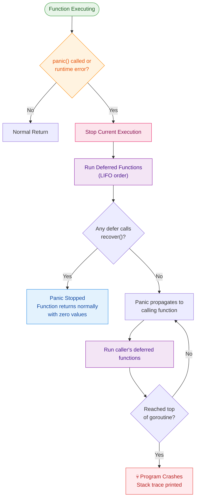

# Topic 2.1: Defer, Panic, and Recover

Go does not have try/catch/finally blocks like Java or Python. Instead, it provides three distinct mechanisms — `defer`, `panic`, and `recover` — that work together to handle cleanup, abnormal termination, and crash recovery. Understanding their precise execution rules is critical for writing leak-free, production-ready Go code.

---

## 1. Concepts & Theory

### 1.1 `defer` — Guaranteed Cleanup

A `defer` statement schedules a function call to be executed **after the surrounding function returns**, regardless of whether the function returns normally, encounters an error, or panics.

```go
func readFile(path string) error {
    f, err := os.Open(path)
    if err != nil {
        return err
    }
    defer f.Close() // Guaranteed to run when readFile() exits

    // ... process file
    return nil
}
```

#### Why `defer` Exists:
In C or C++, developers manually manage resource cleanup (closing files, releasing locks, closing DB connections). Forgetting to close a resource causes leaks. Go's `defer` pairs the cleanup code next to the acquisition code, making it virtually impossible to forget.

---

### 1.2 The Three Critical Rules of `defer`

#### Rule 1: Arguments Are Evaluated Immediately

When a `defer` statement is encountered, **its function arguments are evaluated and captured at that moment**, not when the deferred function actually runs.

```go
func demo() {
    x := 10
    defer fmt.Println("Deferred value:", x) // x is captured as 10 NOW
    x = 20
    fmt.Println("Current value:", x)
}
// Output:
// Current value: 20
// Deferred value: 10   ← captured at the defer statement, not at function exit
```

This is a frequent source of bugs. If you want the deferred function to see the latest value, use one of these patterns:

**Pattern A: Closure (captures variable by reference):**
```go
defer func() {
    fmt.Println("Deferred value:", x) // reads x at execution time
}()
```

**Pattern B: Pointer argument:**
```go
defer printValue(&x) // passes address; function reads latest value through pointer
```

#### Rule 2: Deferred Calls Execute in LIFO Order (Stack)

Multiple `defer` calls within the same function are pushed onto a stack and executed in **Last-In, First-Out (LIFO)** order when the function exits.

```go
func stackDemo() {
    defer fmt.Println("First deferred")  // Runs 3rd
    defer fmt.Println("Second deferred") // Runs 2nd
    defer fmt.Println("Third deferred")  // Runs 1st
}
// Output:
// Third deferred
// Second deferred
// First deferred
```

**Mental Model:** Think of deferred calls as plates stacked on top of each other. The last plate placed is the first one removed.

#### Rule 3: Deferred Functions Can Read and Modify Named Return Values

If a function uses **named return values**, a deferred function can read and modify them before the value is actually returned to the caller.

```go
func doublePositive(n int) (result int, err error) {
    defer func() {
        if result < 0 {
            result = 0
            err = fmt.Errorf("negative result adjusted to zero")
        }
    }()

    result = n * 2
    return // result and err are accessible to the deferred closure
}
```

This pattern is used extensively in production for:
* **Transaction rollback on error:** Check `err` in a deferred function and rollback if non-nil.
* **Metrics/logging:** Record function duration by computing elapsed time in defer.
* **Error enrichment:** Wrap or annotate the error before it reaches the caller.

---

### 1.3 `defer` in Loops — The Resource Leak Trap

Placing `defer` inside a loop **does not execute the deferred call at the end of each iteration**. All deferred calls accumulate and execute only when the **enclosing function** returns.

```go
func processFiles(paths []string) error {
    for _, path := range paths {
        f, err := os.Open(path)
        if err != nil {
            return err
        }
        defer f.Close() // ⚠️ All files stay open until processFiles returns!
    }
    return nil
}
```

If `paths` has 10,000 entries, all 10,000 file descriptors are held open simultaneously, exhausting the OS file descriptor limit.

#### The Fix — Extract Into a Helper Function:
```go
func processFiles(paths []string) error {
    for _, path := range paths {
        if err := processOneFile(path); err != nil {
            return err
        }
    }
    return nil
}

func processOneFile(path string) error {
    f, err := os.Open(path)
    if err != nil {
        return err
    }
    defer f.Close() // ✅ Closes when processOneFile returns (each iteration)
    // ... process file
    return nil
}
```

---

### 1.4 `panic` — Abnormal Termination

A `panic` is Go's mechanism for signaling an **unrecoverable error** — a situation so severe that the program cannot continue. When `panic()` is called:

1. Normal execution of the current function **stops immediately**.
2. Any **deferred functions** in the current function are executed (this is critical for `recover`).
3. The panic **propagates up the call stack**, unwinding each function frame and executing their deferred functions along the way.
4. When the panic reaches the top of the goroutine's stack, the **program crashes** with a stack trace.

```go
func divide(a, b int) int {
    if b == 0 {
        panic("division by zero") // Stops execution, begins stack unwinding
    }
    return a / b
}
```

#### What Triggers a Panic?
* **Explicit calls:** `panic("message")` or `panic(someError)`
* **Runtime errors:**
  * Index out of bounds on a slice or array
  * Dereferencing a `nil` pointer
  * Sending on a closed channel
  * Assertion failure on a type assertion without `ok` (`val := i.(int)`)
  * Writing to a nil map
  * Stack overflow (infinite recursion)

#### The `panic` Argument:
`panic()` accepts any value (`interface{}`). In practice, you should pass either:
* A `string` message for simple cases.
* An `error` value for structured error recovery.

---

### 1.5 `recover` — Catching Panics

`recover()` is a built-in function that **stops the unwinding of a panic** and returns the value that was passed to `panic()`. It only works when called inside a **deferred function**. Calling `recover()` outside of a defer returns `nil` and has no effect.

```go
func safeOperation() {
    defer func() {
        if r := recover(); r != nil {
            fmt.Println("Recovered from panic:", r)
        }
    }()

    panic("something went wrong")
}
// Output: Recovered from panic: something went wrong
// Program continues normally after safeOperation returns
```

#### The Complete Panic → Defer → Recover Flow:



---

### 1.6 When to Use `panic` vs. Returning Errors

| Scenario | Use `panic`? | Use `error` return? |
|:---------|:------------|:-------------------|
| Invalid user input (empty email) | ❌ | ✅ Return error |
| Database query failed | ❌ | ✅ Return error |
| Configuration file missing at startup | ✅ (or `log.Fatal`) | ❌ |
| Programmer error / broken invariant (unreachable `default` case in a type switch) | ✅ | ❌ |
| Out-of-range index you control | ✅ (auto-panic by runtime) | ❌ |
| HTTP handler crash isolation | ✅ (with `recover` middleware) | — |

**Golden Rule:** If the caller can reasonably handle the problem, return an `error`. Reserve `panic` for situations that indicate **bugs in the code itself** or **impossible states**.

---

### 1.7 The `recover` Middleware Pattern (HTTP Servers)

In production HTTP servers, a single handler panic should NOT crash the entire server. The standard pattern is a **recovery middleware** that wraps each request handler:

```go
func RecoveryMiddleware(next http.Handler) http.Handler {
    return http.HandlerFunc(func(w http.ResponseWriter, r *http.Request) {
        defer func() {
            if err := recover(); err != nil {
                // Log the panic with stack trace
                log.Printf("PANIC: %v\n%s", err, debug.Stack())

                // Return 500 to the client
                http.Error(w, "Internal Server Error", http.StatusInternalServerError)
            }
        }()
        next.ServeHTTP(w, r)
    })
}
```

This ensures that:
* The panicked handler's goroutine is caught and does not crash the server.
* The client receives a proper HTTP 500 response.
* The stack trace is logged for debugging.

---

## 2. Edge Cases & Limitations

### 2.1 `recover` Only Works in the Direct Deferred Function

`recover()` must be called **directly** inside the deferred function. If `recover` is nested inside another function called by the deferred function, it returns `nil` and does **not** catch the panic.

```go
func nestedRecoverFails() {
    defer func() {
        catchPanic() // ❌ recover() inside catchPanic does NOT work
    }()
    panic("boom")
}

func catchPanic() {
    if r := recover(); r != nil {
        fmt.Println("Caught:", r) // Never reached
    }
}
```

### 2.2 `recover` Cannot Catch Goroutine Panics Across Boundaries

Each goroutine has its own stack. A `recover` in the main goroutine **cannot** catch a panic in a child goroutine. The child goroutine must have its own recovery mechanism.

```go
func main() {
    defer func() {
        recover() // ❌ This will NOT catch the goroutine panic
    }()

    go func() {
        panic("goroutine crash") // Crashes the entire program
    }()

    time.Sleep(time.Second)
}
```

### 2.3 Fatal Runtime Errors Cannot Be Recovered

Certain runtime errors are **non-recoverable** even with `recover()`:
* `concurrent map read and map write` — fatal, not a panic
* Stack overflow — the runtime cannot allocate defer frames
* Out of memory — the runtime cannot allocate recovery structures

---

## 3. Real-World Usage & Best Practices

### 3.1 Database Transaction Rollback with `defer`

The most common production pattern — ensure transactions are always cleaned up:

```go
func TransferFunds(db *sql.DB, from, to int, amount float64) (err error) {
    tx, err := db.Begin()
    if err != nil {
        return err
    }

    // Deferred rollback/commit based on named return error
    defer func() {
        if err != nil {
            tx.Rollback()
        } else {
            err = tx.Commit()
        }
    }()

    _, err = tx.Exec("UPDATE accounts SET balance = balance - $1 WHERE id = $2", amount, from)
    if err != nil {
        return err
    }

    _, err = tx.Exec("UPDATE accounts SET balance = balance + $1 WHERE id = $2", amount, to)
    if err != nil {
        return err
    }

    return nil
}
```

### 3.2 Measuring Function Execution Time

```go
func expensiveOperation() {
    defer func(start time.Time) {
        fmt.Printf("expensiveOperation took %v\n", time.Since(start))
    }(time.Now()) // time.Now() is evaluated immediately (Rule 1)

    // ... do work
    time.Sleep(2 * time.Second)
}
```

### 3.3 Mutex Unlock with `defer`

```go
func (c *Cache) Get(key string) (string, bool) {
    c.mu.RLock()
    defer c.mu.RUnlock() // Guaranteed unlock even if map access panics
    val, ok := c.data[key]
    return val, ok
}
```

---

## 4. Code Examples: Good vs. Bad

### ❌ Bad: `defer` Inside a Loop (File Descriptor Leak)
```go
package main

import "os"

func processAll(files []string) {
	for _, name := range files {
		f, err := os.Open(name)
		if err != nil {
			continue
		}
		defer f.Close() // Deferred calls pile up until processAll returns
		// process f...
	}
	// At this point, ALL files are still open!
}
```

### ✅ Good: Extract Loop Body Into a Separate Function
```go
package main

import "os"

func processAll(files []string) error {
	for _, name := range files {
		if err := processOne(name); err != nil {
			return err
		}
	}
	return nil
}

func processOne(name string) error {
	f, err := os.Open(name)
	if err != nil {
		return err
	}
	defer f.Close() // Closes when processOne returns (each iteration)
	// process f...
	return nil
}
```

---

### ❌ Bad: Using `panic` for Normal Control Flow
```go
package main

import "fmt"

func findUser(id int) string {
	users := map[int]string{1: "Alice", 2: "Bob"}
	user, ok := users[id]
	if !ok {
		panic("user not found") // ❌ User not found is NOT exceptional
	}
	return user
}

func main() {
	defer func() {
		if r := recover(); r != nil {
			fmt.Println("Error:", r)
		}
	}()
	fmt.Println(findUser(99))
}
```

### ✅ Good: Return an Error for Expected Failure Cases
```go
package main

import (
	"errors"
	"fmt"
)

var ErrUserNotFound = errors.New("user not found")

func findUser(id int) (string, error) {
	users := map[int]string{1: "Alice", 2: "Bob"}
	user, ok := users[id]
	if !ok {
		return "", ErrUserNotFound // ✅ Caller decides how to handle
	}
	return user, nil
}

func main() {
	user, err := findUser(99)
	if err != nil {
		fmt.Println("Lookup failed:", err)
		return
	}
	fmt.Println("Found:", user)
}
```
